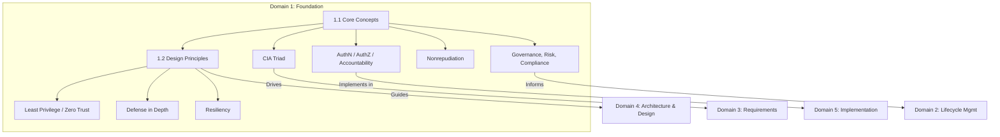

# Domain 1: Secure Software Concepts (12%)

## Domain Overview

Domain 1 establishes the **foundational security principles** that every CSSLP candidate must master. It covers the core security objectives (CIA triad and beyond) and the design principles that guide architectural decisions across all platforms and programming languages.

This domain carries **12% of the exam weight** and contains **2 major sections**:

| Section | Title | Focus |
|---------|-------|-------|
| 1.1 | Understand Core Concepts | CIA, AuthN, AuthZ, Accountability, Nonrepudiation, GRC |
| 1.2 | Understand Security Design Principles | 10 foundational principles from least privilege to component reuse |

## Learning Objectives

After completing this domain, you should be able to:

- Define core security objectives for software development
- Describe the CIA triad and explain confidentiality, integrity, and availability mechanisms
- Characterize the relationship between information security and data privacy
- Identify regulatory considerations that impact software security
- Explain how security methods mitigate vulnerabilities through access controls
- Describe the purpose and function of multiple layers of protection
- Describe how security culture and practices impact data privacy and security

## The Three Rs of Software

A simple framework for secure software objectives — software must satisfy three Rs:

| Property | Description |
|----------|-------------|
| **Reliable** | Software functions as expected |
| **Resilient** | Software withstands misuse and attack |
| **Recoverable** | Normal business operations can be restored with minimal disruption |

## Key Relationships

## Study Tips

> **Exam Focus**: Domain 1 concepts are **cross-referenced throughout the entire exam**. Understanding CIA, design principles, and GRC is essential for every other domain. Expect scenario-based questions asking you to identify which principle applies.

- The exam often tests the **opposite** of CIA: Disclosure–Alteration–Destruction (DAD)
- Know the difference between **security** (protecting data) and **privacy** (controlling who can access personal data and how it is used)
- Design principles are **technology-agnostic** — they apply regardless of platform or language
- Expect questions that test your ability to **differentiate between similar principles** (e.g., least privilege vs. least common mechanism)

## Files in This Section

| File | Content |
|------|---------|
| [1.1_core_concepts.md](1.1_core_concepts.md) | CIA triad, Authentication, Authorization, Accountability, Nonrepudiation, GRC |
| [1.2_security_design_principles.md](1.2_security_design_principles.md) | All 10 design principles with examples and exam focus points |
