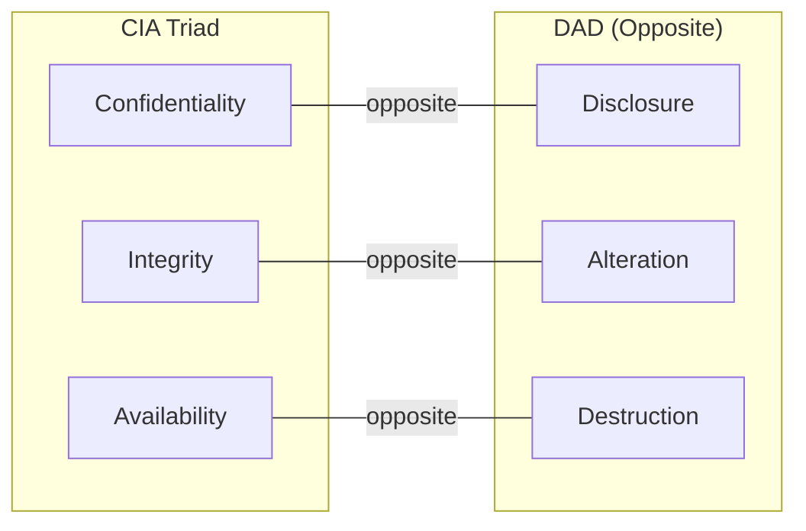

# 1.1 Understand Core Concepts

## Learning Objectives

- Define the CIA triad and its opposing model (DAD)
- Explain confidentiality mechanisms: encryption, access controls, steganography
- Describe integrity controls: hashing, digital signatures, code signing
- Identify availability strategies: redundancy, replication, clustering, failover
- Differentiate authentication factors and methods (MFA, SSO, federated identity, biometrics)
- Explain authorization models and access control types
- Define accountability through auditing and logging
- Describe nonrepudiation via digital signatures and blockchain
- Understand GRC standards and regulatory compliance

---

## The CIA Triad

The **Confidentiality, Integrity, and Availability (CIA)** triad is the foundational framework for all software security activities throughout the SDLC.

The **opposite** of CIA is **DAD** (Disclosure–Alteration–Destruction):

| CIA Objective | Opposite (DAD) | Focus |
|--------------|-----------------|-------|
| **Confidentiality** | Disclosure | Preventing unauthorized access to information |
| **Integrity** | Alteration | Preventing unauthorized modification of data |
| **Availability** | Destruction | Ensuring timely, reliable access to resources |

> **Exam Tip**: When a question describes a threat or attack, map it to which element of CIA it targets. Disclosure → Confidentiality issue. Alteration → Integrity issue. Destruction → Availability issue.

---

## Confidentiality

**Definition (NIST FIPS 199)**: *"Preserving authorized restrictions on information access and disclosure, including means for protecting personal privacy and proprietary information."*

### Goals of Confidentiality

Sensitive data must be protected **at all times** — whether:
- **In transit** across a network (e.g., TLS 1.3)
- **At rest** on storage media (e.g., AES-256 via Transparent Data Encryption)
- **In use** by an application (e.g., access controls, memory protection)

### Confidentiality Mechanisms

| Mechanism | Type | Description |
|-----------|------|-------------|
| **Encryption** | Overt | Transforms data into ciphertext; primary method for data in transit and at rest |
| **Access Controls** | Overt | Limits access based on identity, role, or need-to-know |
| **Steganography** | Covert | Conceals the existence of information (e.g., hiding data in image pixels) |
| **Digital Watermarking** | Covert | Embeds identifying information into media content |
| **Anonymization** | Overt | Removes identifying information from datasets |
| **Tokenization** | Overt | Substitutes sensitive data with non-sensitive tokens |
| **Masking** | Overt | Replaces data with altered values (e.g., `****1234`) |

> **Key Distinction**: Overt mechanisms (like encryption) are directly observable security measures. Covert mechanisms (like steganography) rely on obscuring the existence of data itself — **security through obscurity alone is never adequate**.

### Compromising Confidentiality

| Attack Vector | Description |
|--------------|-------------|
| Network sniffing | Capturing/decoding network packets to steal credentials or data (passive attack) |
| Shoulder surfing | Watching keystrokes or screen data over someone's shoulder |
| Social engineering | Tricking authorized users into revealing confidential information |
| Hacking | Bypassing access controls by exploiting security weaknesses |
| Masquerading | Impersonating an authorized user using stolen credentials |
| Unprotected downloads | Moving files from secure environments to unprotected systems |
| Trojans | Malicious software disguised as legitimate files |
| Unencrypted (cleartext) data | Storing or transmitting PII/PHI without encryption |

### Safeguarding Confidentiality

Confidentiality protection involves **multiple layers of defense** — not just technical controls:
- Security awareness training for personnel with access to sensitive information
- Minimizing retention of sensitive information (reduce attack surface)
- Limiting physical access to infrastructure (datacenter controls)
- Establishing secure disposal policies for servers and media

---

## Integrity

**Definition (NIST)**: *"A property whereby data has not been altered in an unauthorized manner since it was created, transmitted, or stored."*

### Three Principles of Data Integrity

1. Modifications are **not made** to data by **unauthorized** subjects
2. **Unauthorized modifications** are not made to data by **authorized** subjects
3. Data is internally and externally **consistent**

### Technical Controls for Integrity

#### Hashing

Cryptographic hash functions create a **fixed-size digest** from variable-length input.

**Properties of good hash functions:**
- **Deterministic**: Same input always produces the same digest
- **Avalanche effect**: Any change to input (even 1 bit) produces a significantly different digest
- **One-way**: Cannot reverse the digest back to the original input
- **Collision-resistant**: Infeasible to find two different inputs with the same digest

| Message | SHA-256 Digest |
|---------|---------------|
| `Hello World` | `a591a6d40bf420...9ad9f146e` |
| `Hello World` | `a591a6d40bf420...9ad9f146e` *(same)* |
| `Hello World!` | `7f83b1657ff1fc...00126d9069` *(completely different)* |

> **Exam Tip**: When two different inputs produce the same hash, it is called a **hash collision**. A good hash function minimizes the probability of collisions.

#### Digital Signatures

Bind a **signature to an identity** to provide both integrity and authenticity assurance.

**Process of creating a digital signature:**
1. Create a **digest** from the input using a cryptographic hash function
2. **Encrypt** the digest using the signer's **private key** (asymmetric algorithm)

**Verification:**
1. Decrypt the digest using the signer's **public key**
2. Independently hash the received message
3. Compare the two digests — if they match, integrity and authenticity are confirmed

#### Code Signing

Application of a digital signature to code, commonly used during **distribution and maintenance** phases:
- **Integrity assurance**: Code has not been tampered with
- **Authenticity assurance**: Identifies the entity that controlled the code at signing time
- Critical consideration in the **software supply chain**

### Integrity in the Life Cycle

Integrity must be maintained throughout the entire data lifecycle through:
- **Version control** (CVS, Subversion, Git) — tracks changes, timestamps, and responsible subjects
- **Need-to-know** access — subjects granted access only to data required for their job
- **Separation of duties** — no single subject controls a transaction from beginning to end
- **Rotation of duties** — periodic job rotation to detect fraudulent activities

### Integrity and the Trusted Computing Base (TCB)

The **Trusted Computing Base (TCB)** represents the collective hardware, software, firmware, processes, and resources critical to security. If TCB integrity is compromised (e.g., by malware), security policy can **no longer be enforced**.

- **Trusted Platform Module (TPM)**: A dedicated microcontroller that uses cryptographic keys to attest to boot process integrity
- **Example**: Microsoft BitLocker leverages the TPM chip

---

## Availability

**Definition**: Ensuring **reliable and timely access** to data and computing resources.

### Goals of Availability

Resources must be available within the correct amount of time for the correct subjects, based on organizationally defined business needs.

### Security Controls for Availability

| Control | Description |
|---------|-------------|
| **Redundancy** | Continuing operations even with the failure of one component |
| **Failover** | Automatic switching to standby systems upon failure |
| **Fault Tolerance** | System continues functioning even when components fail |
| **RAID** | Redundant Array of Independent Disks — data redundancy and/or performance |
| **High-Availability Clusters** | Groups of computers providing continued service with minimal downtime |
| **Replication** | Storing data in more than one site or node |
| **Clustering** | Grouping multiple servers to act as a single system |
| **Scalability** | Ability to increase capacity to meet demand |

### Key Availability Metrics

| Metric | Full Name | Description |
|--------|-----------|-------------|
| **MTD** | Maximum Tolerable Downtime | Maximum time that software can be unavailable before unacceptable business impact |
| **RTO** | Recovery Time Objective | Target time to restore system to expected state (**RTO < MTD**) |
| **RPO** | Recovery Point Objective | Maximum acceptable data loss measured in time |

> **Critical Rule: RTO < MTD** — Recovery must happen before the maximum tolerable downtime is reached.

### Compromising Availability

| Threat | Description |
|--------|-------------|
| **DoS / DDoS** | Denial of Service / Distributed DoS — prevents authorized access |
| **Natural disasters** | Hurricanes, tornados, flooding, earthquakes |
| **Hardware failure** | Disk crashes, power supply failures |
| **Software bugs** | Memory leaks, infinite loops, resource exhaustion |

### Disaster Recovery

Organizations should define:
- **RTO and RPO** — drive the DR strategy
- **Hot/warm/cold sites** for alternative-site processing
- **Cloud DR** — CSPs offer availability zones and regions for geographic redundancy
- **Contingency planning** — business resumption, alternative site processing

---

## Authentication

**Definition**: The process of establishing with adequate certainty the **identity of an entity**.

### Authentication Factors

| Factor | Category | Examples |
|--------|----------|----------|
| **Something you know** | Knowledge | Password, PIN, security questions |
| **Something you have** | Ownership | Token, smart card, phone, hardware key |
| **Something you are** | Characteristic | Fingerprint, facial recognition, iris scan |
| **Something you do** | Behavioral | Typing pattern, gait, gesture |
| **Where you are** | Location | GPS, IP-based geolocation |

### Multifactor Authentication (MFA)

Combining **two or more** different factor types. The **FFIEC** (Federal Financial Institutions Examination Council) guidance highlights that single-factor authentication is **not adequate** for Internet banking — compensating controls including MFA are warranted.

> **Exam Tip**: MFA requires factors from **different categories**. Using two passwords (both "something you know") is **NOT** MFA.

### Identity and Access Management (IAM)

IAM includes people, processes, and systems used to manage access to enterprise resources by:
1. **Identification** → Claiming an identity (e.g., username, email)
2. **Authentication** → Verifying the claimed identity
3. **Authorization** → Granting access based on verified identity
4. **Accountability** → Tracking actions via audit trails

### Single Sign-On (SSO)

Allows a user to **authenticate once** and access multiple systems/applications without re-authenticating. Reduces password fatigue but creates a **single point of compromise**.

### Federated Identity

Extends trust across organizational boundaries:
- **Identity Provider (IdP)** — holds identities and generates tokens
- **Relying Party (RP)** — service provider that consumes tokens
- Analogous to Kerberos within Active Directory, but works **across domains**

**Key Federation Standards:**

| Standard | Purpose |
|----------|---------|
| **SAML 2.0** | XML-based framework for exchanging security assertions between organizations |
| **OAuth 2.0** | Authorization framework enabling third-party limited access to HTTP services |
| **OpenID Connect** | Authentication protocol built on OAuth 2.0, uses JSON/REST |

> **Key Distinction**: SAML = authentication + authorization. OAuth = authorization only. OpenID Connect = authentication layer on top of OAuth.

### Biometrics

Uses unique physical or behavioral characteristics for identification/authentication:
- Touch ID, Face ID, iris scan, voice recognition
- Baseline measurements are captured, cryptographically hashed, and stored on a smart card or security token
- Increasingly accepted in mobile environments

### Digest Authentication

Avoids sending credentials in plaintext — instead sends a **message digest (hash)** with a **salt value**.

---

## Authorization

**Definition**: Confirming that an authenticated entity has the needed rights and privileges to access and perform actions on requested resources.

### Core Concepts
- **Subject** — the entity requesting access (user, process, service)
- **Object** — the resource being accessed (file, database, API)
- **Action** — what the subject wants to do (read, write, execute, delete)

### Access Control Models

| Model | Description | Key Characteristic |
|-------|-------------|-------------------|
| **DAC** (Discretionary) | Owner controls access via ACLs or capability tables | Flexible but security is optional |
| **MAC** (Mandatory) | System enforces access based on sensitivity labels | Strict, originated in military |
| **RBAC** (Role-Based) | Access based on assigned roles | Can implement DAC, MAC, or NDAC |
| **ABAC** (Attribute-Based) | Access based on attributes of subject, object, environment | Fine-grained, uses XACML |
| **Rule-Based** | Access controlled by predefined rules (e.g., time-of-day) | Less common, uses ACLs with rules |
| **Resource-Based** | Access granted based on resources, useful in SOA | Supports impersonation/delegation |

### ACLs vs. Capability Tables

| Perspective | Model | Description |
|-------------|-------|-------------|
| **Object perspective** | ACL | "Which subjects can access this object?" |
| **Subject perspective** | Capability Table | "What objects can this subject access?" |

### Delegation Models

| Model | Description |
|-------|-------------|
| **Impersonation / Delegation** | Secondary entity acts on behalf of primary (e.g., Kerberos tickets) |
| **Trusted Subsystem** | Access decisions based on identity of a trusted resource instead of user identities |

---

## Accountability

**Definition**: The ability to determine the actions and behaviors of a subject within a system and identify that particular subject.

### Auditing

Answers: **"Who (subject) did What (action) When (timestamp) Where (object)?"**

- Can be one-time, periodic, or ongoing/continuous
- Audit trails provide documentary evidence of processing
- Functions as both a **detective** and **deterrent** control
- All **privileged and critical business transactions** must be logged and tracked

### Logging

- Provides documentary evidence regarding the **sequence of events**
- Supports administrators, developers, support staff, security/privacy/compliance personnel
- **Critical distinction**: Application trace logs (for debugging) vs. security/compliance logs
- Logs **may contain sensitive information** — intentionally or accidentally

> **Exam Tip**: Logging requirements should be identified **early in the SDLC** by all stakeholders. This is frequently overlooked.

### SIEM (Security Information and Event Management)

Centralizes log collection, normalization, and correlation from diverse sources:
- Security monitoring
- Incident investigation and response
- Advanced threat detection
- Regulation and compliance monitoring

---

## Nonrepudiation

**Definition (NIST)**: *"Protects against an individual falsely denying having performed a particular action."*

Nonrepudiation is a **result** of properly implementing:
- **Identification** (carried out by authentication)
- **Audit trails** (carried out by accountability/logging)

When authentication, authorization, and auditing are properly configured, nonrepudiation is ensured.

### Digital Signatures (for Nonrepudiation)

**Creating a digital signature:**
1. Use a one-way cryptographic hash function to create a **digest**
2. Encrypt the digest using the signer's **private key** (asymmetric encryption)

**Verifying a digital signature:**
1. Decrypt using the signer's **public key**
2. Compare with independently computed hash of the message

### Blockchain

A time-stamped sequence of **immutable records** (blocks) stored in public databases connected as peers (chains).

**Security properties:**
- **Tamper-resistance**: New blocks can only be added to the end; once added, they cannot be removed
- **Redundancy**: Independent, autonomous nodes store redundant copies
- **Transparency**: Publicly available for viewing and secure audit trails
- **No single point of failure**: Distributed across many nodes

---

## Governance, Risk, and Compliance (GRC)

**GRC** is a disciplined approach to align business objectives and IT infrastructure while controlling risks and addressing regulations.

| Component | Purpose |
|-----------|---------|
| **Governance** | Establishes policies and procedures for achieving business goals |
| **Risk Management** | Identifies and reduces risk to an acceptable level |
| **Compliance** | Ensures applicable laws and regulations are satisfied |

### Key Regulatory Considerations

#### U.S. Regulations

| Regulation | Focus |
|-----------|-------|
| **HIPAA** (1996) | Personal Health Information (PHI) protection |
| **HITECH** (2009) | Enhanced privacy provisions for electronic PHI records |
| **SOX** (2002) | Financial reporting integrity for publicly-held companies; Section 302 (corporate responsibility) and Section 404 (internal controls assessment) |
| **GLBA** | Protection of consumers' Personal Financial Information (PFI) |
| **PCI DSS** | Payment card data security; contractual with severe financial penalties |
| **FISMA** (2002) | Agency-wide information security programs for federal agencies |
| **COPPA** (1998) | Children's online privacy protection |
| **CCPA** (2018) | California consumer privacy |
| **CALEA** (1994) | Communications assistance for law enforcement |
| **IoT Cybersecurity Improvement Act** (2020) | IoT device security standards |

#### Non-U.S. Regulations

| Regulation | Focus |
|-----------|-------|
| **GDPR** (2018) | EU data protection and privacy |
| **EU Cybersecurity Act** (2019) | EU cybersecurity framework |
| **EU Cyber Resilience Act** (proposed 2022) | EU product cyber resilience |
| **India IT Act** (2000) | India information technology regulation |

### Standards Frameworks

| Standard | Description |
|----------|-------------|
| **ISO 27001** | Information security management systems |
| **ISO/IEC 15408 (Common Criteria)** | Security evaluation of IT products (TOE, ST, PP, EAL1–EAL7) |
| **ISO/IEC 9126** | Software product quality (Functionality, Reliability, Usability, Efficiency, Maintainability, Portability) |
| **ISO/IEC 12207** | Software lifecycle processes |
| **NIST SP 800 Series** | Security guidelines for information systems |
| **FIPS** | Mandatory requirements for federal agencies |
| **FedRAMP** | Standardized security assessment for cloud products/services |
| **NIST RMF** | Risk Management Framework (Categorize → Select → Implement → Assess → Authorize → Monitor) |
| **OWASP Top 10** | Top web application security risks |
| **SAFECode** | Industry-backed software assurance |

> **Exam Tip for Common Criteria**: Know the evaluation terminology:
> - **TOE** = Target of Evaluation (the product being evaluated)
> - **ST** = Security Target (security properties of a TOE)
> - **PP** = Protection Profile (security requirements for a class of products)
> - **EAL1–EAL7** = Evaluation Assurance Levels (1 = lowest, 7 = highest)

### Jurisdiction Considerations

Internet-enabled applications must consider:
- Laws for **users** (national, regional, state)
- Laws for **transactional data**
- Laws for **hosting environments**
- Potential **conflicts between jurisdictions**

### Software-Facilitated Compliance

Organizations leverage software tools to automate and centralize GRC processes. Commercially viable GRC products can automate documentation and streamline compliance workflows.

---

## Exam Focus Points

1. **CIA Triad**: Know each element, its opposite (DAD), and multiple real-world examples
2. **Covert vs. Overt**: Steganography = covert; Encryption = overt
3. **Hashing Properties**: Deterministic, avalanche effect, one-way, collision-resistant
4. **Digital Signatures**: Hash → encrypt with private key → verify with public key
5. **MFA Factors**: Must be from **different categories** to qualify as MFA
6. **SAML vs OAuth vs OpenID Connect**: SAML (AuthN+AuthZ), OAuth (AuthZ only), OIDC (AuthN on OAuth)
7. **DAC vs MAC vs RBAC**: DAC (owner decides), MAC (system enforces labels), RBAC (role-based)
8. **ACL vs Capability Table**: ACL = object perspective, Capability = subject perspective
9. **Nonrepudiation**: Result of authentication + accountability; achieved via digital signatures + blockchain
10. **RTO < MTD**: Recovery time must be less than maximum tolerable downtime
11. **TCB/TPM**: TCB = all security-critical components; TPM = hardware attestation of boot integrity
12. **Regulatory mapping**: SOX = financial, HIPAA = health, PCI DSS = payment cards, GLBA = financial privacy, GDPR = EU data protection

---

## Key Terms Glossary

| Term | Definition |
|------|-----------|
| **CIA Triad** | Confidentiality, Integrity, Availability — the core security objectives |
| **DAD** | Disclosure, Alteration, Destruction — the opposite of CIA |
| **Encryption** | Transforming data into ciphertext to prevent unauthorized access |
| **Hashing** | One-way cryptographic function producing a fixed-size digest |
| **Digital Signature** | Encrypted hash digest proving integrity and authenticity |
| **Code Signing** | Applying digital signatures to software code |
| **MFA** | Multi-Factor Authentication using two or more factor types |
| **IAM** | Identity and Access Management |
| **SSO** | Single Sign-On — authenticate once, access multiple systems |
| **SAML** | Security Assertion Markup Language |
| **OAuth** | Open Authorization framework |
| **OIDC** | OpenID Connect — authentication on OAuth 2.0 |
| **DAC** | Discretionary Access Control |
| **MAC** | Mandatory Access Control |
| **RBAC** | Role-Based Access Control |
| **ABAC** | Attribute-Based Access Control |
| **ACL** | Access Control List |
| **XACML** | Extensible Access Control Markup Language |
| **TCB** | Trusted Computing Base |
| **TPM** | Trusted Platform Module |
| **SIEM** | Security Information and Event Management |
| **GRC** | Governance, Risk, and Compliance |
| **MTD** | Maximum Tolerable Downtime |
| **RTO** | Recovery Time Objective |
| **RPO** | Recovery Point Objective |
| **RAID** | Redundant Array of Independent Disks |
| **Steganography** | Concealing information within other media |
| **Nonrepudiation** | Assurance that actions cannot be denied |
| **Blockchain** | Distributed immutable ledger for transaction records |
| **CAPTCHA** | Automated test to distinguish humans from computers |
