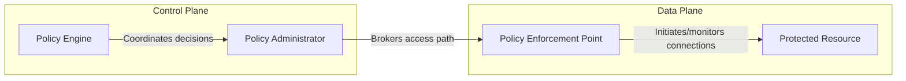
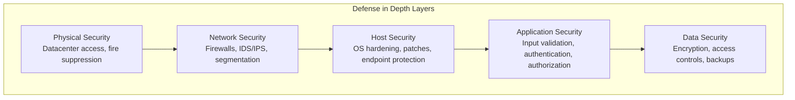

# 1.2 Understand Security Design Principles

## Learning Objectives

- Explain each of the 10+ security design principles and their software applications
- Apply design principles to real-world software architecture scenarios
- Identify which principle is being violated or applied in exam scenarios
- Understand the relationship between design principles and secure software outcomes

---

## Overview

Security design principles are **technology-agnostic abstractions** that guide decisions at the architecture level, regardless of platform or programming language. They lay the foundation for building and maintaining secure software.

According to NIST, secure systems typically exhibit:
1. **Delivery of system capability** despite all manner of adversity
2. **Constraining functions** to desired behaviors based on system-required capabilities
3. **Enforcement of constraints** via predefined rulesets for authorized interactions only

> **Critical Exam Point**: Security exists to **support business missions**. Businesses do **not** exist to support security. Security design should achieve "adequate security" — intentional trade-offs to reach a state that supports the business function.

---

## Principle 1: Good Enough Security

**Concept**: Don't spend $10,000 to protect a $20 bill.

- Trade-offs always exist between security and other aspects (usability, cost, performance)
- The goal is **adequate security** — the right level of protection for the value of the asset
- Over-engineering security can be as problematic as under-engineering it

| Consideration | Question |
|--------------|----------|
| Asset value | What is the value of what we're protecting? |
| Threat likelihood | How likely is the threat to materialize? |
| Impact | What is the business impact if the threat is realized? |
| Cost of control | Does the control cost more than the potential loss? |

---

## Principle 2: Least Privilege

**Concept**: A subject should have **only the necessary rights and privileges** to perform its current task — nothing more.

- If elevated privileges are needed, they should be limited to the **shortest time required**
- Minimizes the security impact of failures, corruption, or misuse
- Simplifies security analysis of components
- A **pervasive principle** reflected in all aspects of secure system design

### Real-World Examples

| Scenario | Application |
|----------|-------------|
| Middleware server | Should only have network access, read access to a DB table, and write access to a log — **never** admin privileges |
| Mobile apps | Flashlight apps requiring location data and contacts = violation of least privilege |
| SQL injection | When input validation fails and the database account has elevated privileges, the damage is magnified |
| Container runtime | Containers should run as non-root users with minimal capabilities |

### Zero Trust

**Definition (NIST SP 800-207)**: A collection of concepts designed to **minimize uncertainty** in enforcing accurate, least-privilege per-request access decisions in systems viewed as potentially compromised.

**Key tenets:**
1. All data sources and computing services are **resources**
2. All communication is **secured** regardless of network location
3. Access to resources is granted **per-session**
4. Access is determined by **dynamic policy** (including behavioral attributes)
5. **Continuously monitor** integrity and security posture of assets
6. Authentication and authorization are **dynamic and strictly enforced**
7. Collect adequate data to **improve security posture**

**Three ZT components:**



> **Exam Tip**: Zero Trust enforces the **same level of rigor** for ALL subjects regardless of location (inside or outside the network). There is no implicit trust.

---

## Principle 3: Separation of Duties (SoD)

**Concept**: No single subject should be given enough privileges to misuse the system on their own. Critical functions must be **divided among subjects**.

### Levels of Segregation

| Level | Description | Example |
|-------|-------------|---------|
| Basic | Two different actors with similar functions | Two developers from the same team |
| Enhanced | Different actors with dissimilar functions | Developer and operations from different departments |

### Applications

- **Code deployment**: A developer should NOT be able to check in code AND deploy it to production without independent review
- **Cryptography**: Separation of the encryption process from the key management process
- **Financial**: Separate the person who creates purchase orders from the person who approves payments

### Related Concepts

#### Split Knowledge
A cryptographic key is split into **n components**, each individually providing **no knowledge** of the original key, which can be recombined to recreate the original.

#### Secret Sharing
Algorithms that segment a secret (e.g., encryption key) and store it in a **distributed way** among many participants, making it infeasible for an attacker to recover the secret by compromising a single node.

#### Multi-Party Control
Requires two or more subjects to perform a single critical function together.

> **Exam Distinction**: Separation of duties = dividing tasks. Split knowledge = dividing secrets. Multi-party control = requiring multiple people for one action.

---

## Principle 4: Defense in Depth

**Concept**: Apply **multiple layers** of protection where a subsequent layer compensates if a different layer is breached.

- Originated in **military strategy** — barriers to impede intruder progress while monitoring and responding
- In cybersecurity: detective and protective measures to impede cyber-intruders while enabling detection and response
- No single control is considered sufficient — multiple controls approaching risks in different fashions

### Layered Controls



### Key Sub-Concepts

#### Security Zones
- Systems may have **any number** of security zones
- Each zone may have **any number** of controls
- Number of zones and controls depends on asset type and required protection level

#### Diversity of Defense
- Controls at various layers should be **diverse in capabilities**
- Each plays a specific role in overall defenses
- Diversity reduces the likelihood of a common flaw across all controls

#### Geographical Diversity
- Contingency systems in geographically separate locations
- Insulates against natural disasters disrupting operations

#### Technical Diversity
- Using multiple vendors or technologies for critical systems
- Reduces risk from a single vendor's vulnerability

#### Input Validation
- **One of the most important** strategies to protect against web application vulnerabilities
- Prevents externally influenced malicious input from entering the system
- A critical part of overall defense-in-depth

---

## Principle 5: Resiliency

**Concept**: Software must **fail in a safe/secure manner** and recover quickly.

### Fail Safe / Fail Secure

When a system fails, it should **default to a secure state** where:
- The security of the system and its data is **not compromised**
- Rapid recovery is possible

**Key pattern**: **Explicit deny** — anything not specifically authorized is denied by default.

| Failure Mode | Behavior | Security Impact |
|-------------|----------|-----------------|
| **Fail-safe/Fail-secure** | Defaults to denied/locked state | ✅ Secure — no unauthorized access on failure |
| **Fail-open** | Defaults to allowed/unlocked state | ❌ Insecure — unauthorized access possible |

### No Single Point of Failure (SPOF)

- Single points of failure are **undesirable** in any system with availability goals
- Eliminated through **redundancy** and **compensating controls**
- Many SPOFs are introduced by architectural and design decisions
- Elimination may require significant effort

### Resiliency in Software Context

- Software does **NOT violate any security policy** and is **able to withstand** the actions of threat agents
- Applies to both intentional attacks/exploits and accidental user errors

> **Exam Tip**: When a question says software "withstands misuse and attack," the answer is **resilient**. When it says "functions as expected," the answer is **reliable**. When it says "restored to normal operations," the answer is **recoverable**.

---

## Principle 6: Economy of Mechanism

**Concept**: Keep security **simple**. The more complex the design, the higher the likelihood that vulnerabilities go unnoticed.

### Key Points

- Complex approaches do **not** necessarily enhance security over simple approaches
- Complexity increases the difficulty of root cause analysis
- **Rule of thumb**: Eliminate all nonessential services and protocols
- Simple systems are easier to troubleshoot, use, and administer

### OWASP Example
> "Although it might be fashionable to have a slew of singleton entity beans running on a separate middleware server, it is more secure and faster to simply use global variables with an appropriate mutex mechanism to protect against race conditions."

### Password Vaults

Encrypted vaults offer secure storage for secrets (keys, passwords):
- Generate unique, long, complex, easily changed passwords
- Secure encrypted storage (local or cloud-based)
- Simplify access management (one mechanism instead of many)

### Resource Efficiency

Software must efficiently manage underlying hardware resources:
- **Allocate** resources appropriately (storage, CPU, RAM)
- **Deallocate** resources when execution completes
- Poor resource management can deprive other software of necessary resources
- Examples of weakness: CWE-787 (Out-of-bounds Write), CWE-125 (Out-of-bounds Read), CWE-190 (Integer Overflow), CWE-476 (NULL Pointer Dereference)

---

## Principle 7: Complete Mediation

**Concept**: Every request by a subject to access an object must be **vetted through a valid authorization procedure** — every single time, not just the first time.

### Key Points

- **Never** rely on checked-once-and-cached permissions
- Caching permissions improves performance but **risks allowing unauthorized access**
- Authorization should be verified **every time** access is requested

### Classic Example (UNIX File Descriptors)
1. Process requests file read → OS checks permissions → grants file descriptor
2. File owner later **revokes** permission
3. Process **still has** the file descriptor and can read the file
4. **Violation**: The second access was not checked; cached value was used

### Software Applications

| Area | Complete Mediation Practice |
|------|---------------------------|
| **Cookie management** | Re-validate session cookies on each request |
| **Session management** | Verify session state and permissions continuously |
| **Credential caching** | Avoid long-lived cached credentials |
| **API calls** | Authenticate and authorize every API request |

---

## Principle 8: Open Design

**Concept**: The security of a system should **not depend on secrecy** of its design, implementation, or components.

### Kerckhoffs's Principle

> *The security of a cryptographic system should be maintained even if everything about the system is public knowledge — as long as the secrecy of the key is maintained.*

### Open Design vs. Security by Obscurity

| Approach | Description | Security |
|----------|-------------|----------|
| **Open Design** | Published algorithms, peer review, crowd-sourced testing | ✅ Strong — proven through scrutiny |
| **Security by Obscurity** | Security depends on hiding the design itself | ❌ Weak — discovery = compromise |

**Examples of security by obscurity (bad practice):**
- Hard-coding sensitive information in source code
- Using hidden form fields in web applications
- Custom/proprietary cryptographic algorithms

**Example of open design (good practice):**
- **AES** — open source since 2001, widely scrutinized, still one of the most secure encryption methods

### MOSA (Modular Open Systems Approach)

A business and technical strategy for designing adaptable systems:
- Major interface points must be **modular**
- Embrace **widely supported standards**
- Support **interoperability, scalability, and portability**

### Open-Source Software (OSS)

- OSS is **not inherently** more or less secure due to source availability
- Security depends on community rigor, bandwidth for updates, and testing processes
- Key questions: How many contributors? What is the commit process? Level of testing?

### Collaborative Design / Peer Review

- Peer reviews are **critical** in collaborative development environments
- Tapping diverse global contributors provides varied skills, experiences, and perspectives
- Crowdsourced security review can be invaluable

---

## Principle 9: Least Common Mechanism

**Concept**: Minimize the number of protection mechanisms **shared** between multiple subjects to reduce unauthorized information exchange paths.

### Key Points

- Shared access paths can be sources of unauthorized information exchange
- A different mechanism (or instantiation) for each subject/class provides flexibility and prevents security violations

### Compartmentalization / Isolation

- Restrict user roles so that **different functions are executed based on user roles**
- In contrast to a single function used by all roles
- Reduces coupling and prevents information leakage

### Allow/Accept Lists

- **Explicitly allow** access to specific resources while **denying everything else** by default
- Attempts to access in nonstandard ways are denied
- More secure than deny lists (block lists), which only block known bad entries

### SOA Autonomy

In Service-Oriented Architecture, a single service should **not share common mechanisms** with other services to remain independent and reduce coupling.

> **Exam Distinction**: 
> - **Least Privilege** = limit what a subject **can do**
> - **Least Common Mechanism** = limit what subjects **share** (mechanisms/paths)

---

## Principle 10: Psychological Acceptability

**Concept**: Security functionality should be **easy to use** and **transparent** to users. If security is an obstacle, users will circumvent it.

### Key Points

- Security is a critical functional element that should impose **no burden** on the user
- If mechanisms inhibit accessibility or reduce usability, subjects will turn them off or bypass them
- **CWE-655**: Insufficient Psychological Acceptability — when a protection mechanism is too difficult or inconvenient

### Applications

| Area | Good Practice | Bad Practice |
|------|--------------|-------------|
| **Password complexity** | Reasonable requirements with password manager support | Policy so complex users write passwords down |
| **Passwordless auth** | Biometrics, hardware keys, one-time codes | N/A |
| **CAPTCHA** | Appropriately difficult for bots, easy for humans | Distorted images impossible for humans to read |
| **Screen layouts** | Intuitive security controls integrated into workflow | Security prompts that interrupt user flow |

### Password Entropy

A mathematical measure of password complexity:

```
Number of Possible Combinations = S^L
Entropy = log₂(Number of Possible Combinations)
Expected Guesses = 2^(Entropy - 1)

L = Password Length
S = Pool of unique possible characters
```

| Character Pool | Pool Size (S) |
|---------------|--------------|
| Numbers only (0–9) | 10 |
| Lowercase letters (a–z) | 26 |
| Upper + lowercase (a–z, A–Z) | 52 |
| ASCII printable (letters, numbers, symbols) | 95 |

> **Exam Example**: A banking PIN that is exactly 8 digits, numbers only = 10^8 = 100,000,000 possible PINs.

### Passwordless Authentication

Modern methods that authenticate without passwords:
- Email-based access
- Device-based (phone push notifications)
- One-time passcodes
- Biometrics (Touch ID, Face ID)
- Passwordless MFA: "something you have" + "something you are"

### CAPTCHA Vulnerabilities

Published vulnerabilities that can defeat CAPTCHA:
- Insufficient distortion of source images
- Math questions with recognizable formats
- Questions with a limited number of possible answers
- Trivia questions answerable via database lookup
- Metadata in CAPTCHA images that hint at the answer

---

## Principle 11: Component Reuse

**Concept**: Promote the **reuse of existing, tested components** to avoid introducing new vulnerabilities and increasing the attack surface.

### Benefits

- Fewer new components = fewer new vulnerabilities
- Reduced attack surface area
- Tested and proven libraries provide known security properties
- More efficient development

### Caution

- Centralizing functionality = "putting all eggs in one basket"
- Mitigate with defense-in-depth and layered security
- **Monoculture risk**: If a reused component has a vulnerability, the impact is broad

### Common Anti-Pattern

> Development teams writing their own cryptographic algorithms instead of using validated standards like AES. Custom crypto implementations are almost always found to be the **weakest link**, leading to sensitive information disclosure.

### Libraries and Common Controls

- **Always** reuse trusted, validated libraries and controls
- Better to reuse proven tools than implement new ones for every system
- Centralize common security functions (authentication, logging, input validation)

---

## Principle Summary

| # | Principle | Core Idea | Key Exam Term |
|---|-----------|-----------|--------------|
| 1 | Good Enough Security | Balance cost of protection against value of asset | Trade-offs |
| 2 | Least Privilege | Minimum necessary rights, for shortest time needed | Zero Trust, need-to-know |
| 3 | Separation of Duties | No single subject controls end-to-end | Split knowledge, multi-party |
| 4 | Defense in Depth | Multiple layered, diverse controls | Security zones, input validation |
| 5 | Resiliency | Fail to a secure state, no SPOF | Fail-safe, explicit deny |
| 6 | Economy of Mechanism | Keep it simple | Eliminate nonessentials |
| 7 | Complete Mediation | Check authorization every time | Never cache permissions |
| 8 | Open Design | Don't rely on secrecy of design | Kerckhoffs's principle |
| 9 | Least Common Mechanism | Minimize shared mechanisms | Compartmentalization |
| 10 | Psychological Acceptability | Security must be usable | CWE-655, passwordless |
| 11 | Component Reuse | Reuse tested components | Common controls, libraries |

---

## Exam Focus Points

1. **Good Enough Security** ≠ minimal security; it means **appropriate** security for the asset value
2. **Least Privilege vs. Least Common Mechanism**: Least privilege limits **permissions**; least common mechanism limits **shared paths**
3. **Fail-safe = fail-secure**: System defaults to a denied/locked state on failure
4. **Complete Mediation**: Authorization must be verified on **every access**, not just the first
5. **Open Design**: Kerckhoffs's principle — security of crypto depends on key secrecy, not algorithm secrecy
6. **Psychological Acceptability**: CWE-655 specifically addresses when protection is too inconvenient
7. **Component Reuse**: Custom crypto = anti-pattern; use AES and other validated standards
8. **Zero Trust**: No implicit trust regardless of network location; continuous validation
9. **Split Knowledge vs. Secret Sharing**: Split knowledge = dividing one key into parts; secret sharing = distributed storage via algorithms
10. **Separation of Duties + Code Deployment**: Developer writing code should NOT also deploy to production

---

## Key Terms Glossary

| Term | Definition |
|------|-----------|
| **Least Privilege** | Providing only the minimum rights needed for a specific task |
| **Zero Trust** | Security model assuming all networks are compromised; continuous verification required |
| **SoD** | Separation of Duties — dividing critical functions among multiple subjects |
| **Split Knowledge** | Dividing a cryptographic key into parts that individually reveal nothing |
| **Secret Sharing** | Algorithmically distributing secrets across multiple participants |
| **Defense in Depth** | Multiple layered, diverse security controls |
| **Security Zones** | Logical groupings with specific security controls |
| **Fail-Safe / Fail-Secure** | Defaulting to a secure state upon failure |
| **Explicit Deny** | Denying access by default unless specifically authorized |
| **SPOF** | Single Point of Failure |
| **Economy of Mechanism** | Keeping security designs simple and minimal |
| **Complete Mediation** | Verifying authorization on every access request |
| **Kerckhoffs's Principle** | Crypto security depends on key secrecy, not algorithm secrecy |
| **MOSA** | Modular Open Systems Approach |
| **OSS** | Open-Source Software |
| **Compartmentalization** | Isolating functions based on user roles |
| **Allow/Accept List** | Explicitly permitting specific access while denying all else |
| **Psychological Acceptability** | Security must be easy to use and transparent |
| **CWE-655** | Insufficient Psychological Acceptability weakness |
| **Password Entropy** | Mathematical measure of password complexity |
| **CAPTCHA** | Automated test to distinguish humans from computers |
| **Component Reuse** | Leveraging existing tested components instead of building new ones |
| **Monoculture** | Risk from widespread use of a single technology |
