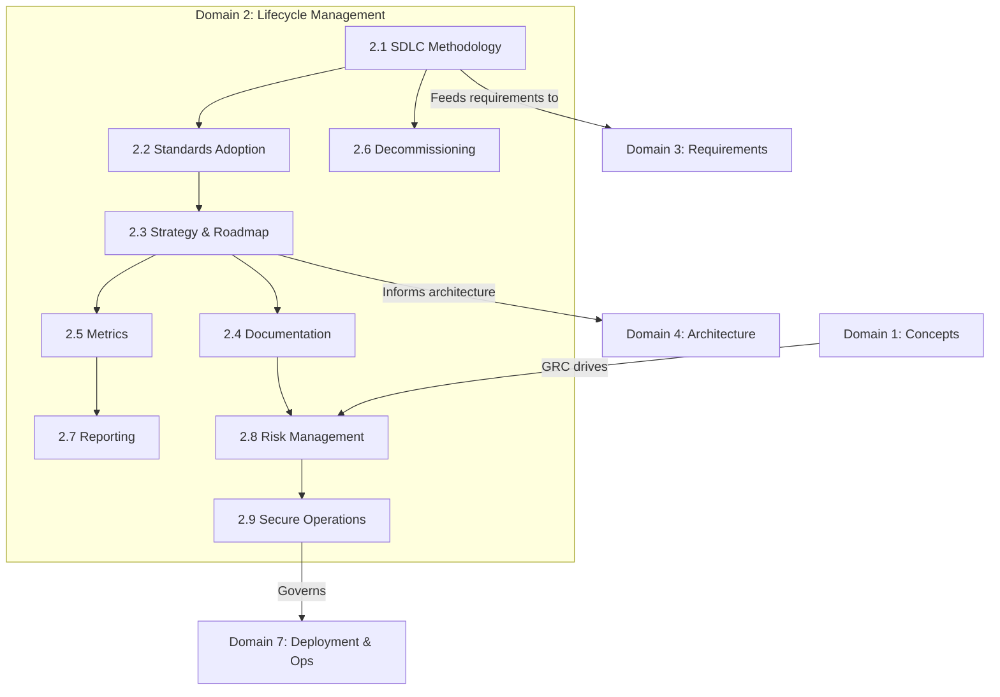

# Domain 2: Secure Software Lifecycle Management (11%)

## Domain Overview

Domain 2 addresses **how security is integrated into every phase of the software development lifecycle** — from methodology selection and standards adoption through metrics, reporting, decommissioning, and secure operations. It is fundamentally about governance: ensuring that security is not bolted on as an afterthought but woven into the processes, checkpoints, and culture of the entire SDLC.

This domain carries **11% of the exam weight** and contains **9 major sections**:

| Section | Title | Focus |
|---------|-------|-------|
| 2.1 | Manage Security within a Software Development Methodology | Security gates in Agile, Waterfall, DevOps |
| 2.2 | Identify and Adopt Security Standards | Frameworks (ISO, NIST, OWASP, BSIMM, SAMM, SAFECode), awareness |
| 2.3 | Outline Strategy and Roadmap | Security milestones, checkpoints, control gates, break/build criteria |
| 2.4 | Define and Develop Security Documentation | Security policies, standards, guidelines, procedures |
| 2.5 | Define Security Metrics | KPIs, OKRs, criticality, remediation time, complexity |
| 2.6 | Decommission Applications | EOL policies, data disposition, retention, destruction |
| 2.7 | Create Security Reporting Mechanisms | Reports, dashboards, feedback loops |
| 2.8 | Incorporate Integrated Risk Management | Regulations, standards, legal, risk assessment, technical vs. business risk |
| 2.9 | Implement Secure Operation Practices | Change management, incident response, V&V, A&A |

## Learning Objectives

After completing this domain, you should be able to:

- Integrate security activities into any SDLC methodology (Agile, Waterfall, DevOps, Spiral)
- Select and apply appropriate security standards and frameworks
- Define security milestones, control gates, and break/build criteria
- Develop and maintain security documentation throughout the lifecycle
- Design meaningful security metrics and KPIs
- Plan secure application decommissioning and data disposition
- Build reporting mechanisms that create actionable feedback loops
- Apply integrated risk management including technical and business risk
- Implement secure operational practices including change management and incident response

## Key Relationships

## Study Tips

> **Exam Focus**: Domain 2 is heavily **process-oriented**. Expect scenario questions asking you to identify the correct lifecycle activity, metric, or control gate for a given situation. This domain overlaps significantly with Domains 7 (Operations) and 3 (Requirements).

- Understand the **differences between methodologies** — Agile handles security differently than Waterfall
- Know the major **security maturity models** (BSIMM, SAMM) and how they differ from prescriptive frameworks
- **Break/build criteria** are a favorite exam topic — know what constitutes a reason to halt a release
- Memorize the **EOL/decommissioning** checklist — credential removal, config cleanup, data disposition
- Understand **technical risk vs. business risk** — the exam tests your ability to distinguish and relate both

## Files in This Section

| File | Content |
|------|---------|
| [2.1_security_in_sdlc_methodology.md](2.1_security_in_sdlc_methodology.md) | Security integration in Agile, Waterfall, DevOps; security gates |
| [2.2_security_standards_adoption.md](2.2_security_standards_adoption.md) | ISO, NIST, OWASP, BSIMM, SAMM, SAFECode; security awareness |
| [2.3_strategy_and_roadmap.md](2.3_strategy_and_roadmap.md) | Security milestones, checkpoints, control gates, break/build criteria |
| [2.4_security_documentation.md](2.4_security_documentation.md) | Security documentation definition and development |
| [2.5_security_metrics.md](2.5_security_metrics.md) | Criticality, remediation time, complexity, KPIs, OKRs |
| [2.6_decommission_applications.md](2.6_decommission_applications.md) | EOL policies, data disposition, retention, destruction |
| [2.7_security_reporting.md](2.7_security_reporting.md) | Reports, dashboards, feedback loops |
| [2.8_integrated_risk_management.md](2.8_integrated_risk_management.md) | Regulations, standards, legal, risk assessment, technical vs. business risk |
| [2.9_secure_operation_practices.md](2.9_secure_operation_practices.md) | Change management, incident response, V&V, A&A |
