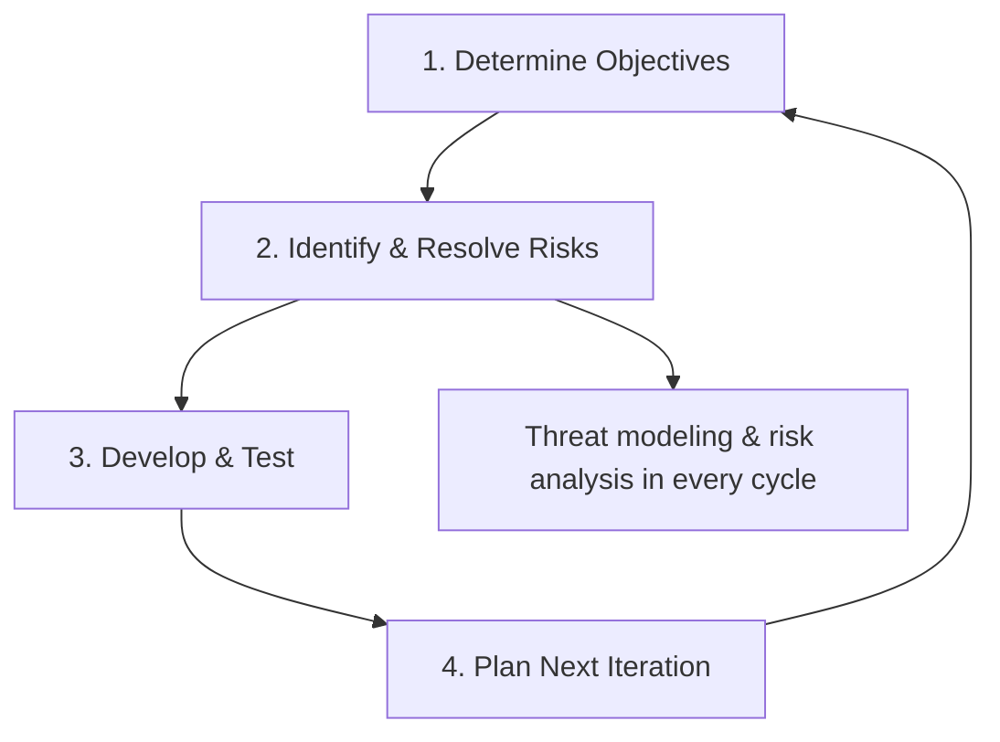
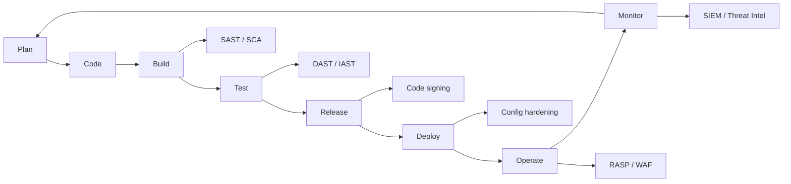
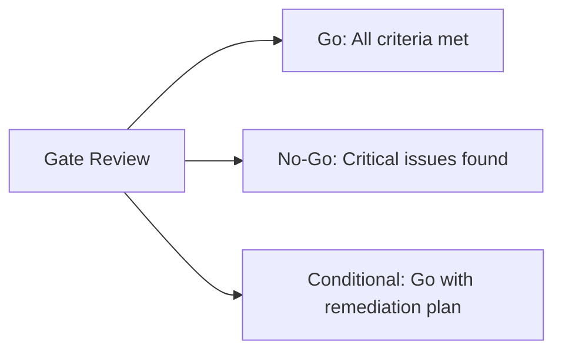

# 2.1 Manage Security within a Software Development Methodology

## Learning Objectives

- Compare how security integrates differently into Agile, Waterfall, Spiral, and DevOps/DevSecOps
- Identify appropriate security activities for each SDLC phase
- Explain the concept of security gates and their purpose
- Describe how to balance security rigor with development velocity

---

## Software Development Methodologies and Security

Every SDLC methodology can accommodate security — but the timing, formality, and mechanisms vary significantly. A CSSLP must understand how to adapt security activities to whichever methodology the organization uses.

### Waterfall Model

The Waterfall model is a **sequential, phase-driven** approach where each phase must be completed before the next begins. Security is integrated at **defined checkpoints between phases**.

| Phase | Security Activities |
|-------|-------------------|
| **Requirements** | Define security requirements, identify compliance needs, develop misuse/abuse cases |
| **Design** | Threat modeling, security architecture review, design pattern selection |
| **Implementation** | Secure coding practices, static analysis (SAST), code reviews |
| **Testing** | Security testing (DAST, penetration testing, fuzz testing), V&V |
| **Deployment** | Secure configuration, environment hardening, security approval to operate |
| **Maintenance** | Patch management, vulnerability management, incident response |

**Strengths for security**: Clear phase gates, thorough documentation, formal review points.

**Weaknesses for security**: Security issues found late are expensive to fix; limited ability to iterate.

> **Exam Tip**: Waterfall's key security advantage is **structured review points**. Its key weakness is the **cost of late-stage security defect discovery**.

### Agile Model

Agile emphasizes **iterative development**, short sprints, and continuous delivery. Security must be embedded into the sprint cadence rather than deferred to a separate phase.

| Agile Practice | Security Integration |
|---------------|---------------------|
| **Sprint Planning** | Include security stories and acceptance criteria |
| **User Stories** | Write security-focused stories (e.g., "As a user, I want my session to time out after inactivity") |
| **Definition of Done** | Include security criteria: code review completed, SAST passed, no critical vulnerabilities |
| **Daily Stand-ups** | Raise security blockers, track security debt |
| **Sprint Review** | Demonstrate security features, review security test results |
| **Retrospective** | Discuss security lessons learned, process improvements |

**Security-specific Agile practices:**

- **Evil User Stories / Abuser Stories**: Describe attack scenarios from a threat actor's perspective — "As an attacker, I want to perform SQL injection to extract database credentials"
- **Security Sprint / Hardening Sprint**: Dedicated sprint focused exclusively on addressing security debt
- **Security Champions**: Team members with additional security training who act as security advocates within the development team

> **Exam Tip**: Agile does not eliminate the need for security activities — it distributes them across iterations. Security is **everyone's responsibility** in Agile teams.

### Spiral Model

The Spiral model combines elements of Waterfall and iterative development, with each cycle consisting of four quadrants. **Risk analysis is central** to every iteration.

- Risk analysis occurs at **every iteration**, making it inherently well-suited for security
- Each cycle produces increasingly refined prototypes with progressively stronger security
- Particularly appropriate for **large, complex, high-risk projects**

### DevOps / DevSecOps

DevOps integrates development and operations through **automation, continuous integration (CI), and continuous delivery (CD)**. DevSecOps extends this by embedding security into the automated pipeline.

**Key DevSecOps Principles:**

| Principle | Description |
|-----------|-------------|
| **Shift Left** | Move security activities earlier in the pipeline (from right/production to left/development) |
| **Automation** | Automate security testing (SAST, DAST, SCA) in CI/CD pipelines |
| **Continuous Monitoring** | Real-time security monitoring in production |
| **Infrastructure as Code (IaC)** | Codify infrastructure configurations for consistency and auditability |
| **Security as Code** | Define security policies, compliance checks, and controls as code |

> **Key Distinction**: DevOps = Development + Operations. DevSecOps = Development + **Security** + Operations. The "Sec" is not an add-on phase — it is integrated throughout.

---

## Security Gates and Review Points

Security gates are **formal decision points** in the SDLC where security criteria must be satisfied before proceeding to the next phase. They serve as quality control checkpoints.

### Components of a Security Gate

| Component | Purpose |
|-----------|---------|
| **Entry criteria** | What must be true before the gate review begins |
| **Gate activities** | What is reviewed or evaluated at the gate |
| **Exit criteria** | What must be satisfied to proceed through the gate |
| **Decision** | Go, No-Go, or Conditional Go (proceed with conditions) |

### Typical Security Gate Decisions

### Security Activities by SDLC Phase

| Phase | Security Gate Activities |
|-------|------------------------|
| **Requirements** | Security requirements defined, compliance requirements identified, misuse cases developed |
| **Architecture/Design** | Threat model completed, security architecture reviewed, risk assessment performed |
| **Implementation** | Secure coding standards followed, SAST completed, peer code review done |
| **Testing** | Security test cases executed, DAST/penetration testing completed, all critical findings resolved |
| **Release** | Build artifacts verified (signed/hashed), security approval obtained |
| **Operations** | Monitoring enabled, incident response plan in place, access controls configured |

---

## Microsoft Security Development Lifecycle (SDL)

The Microsoft SDL is one of the most widely referenced secure SDLC frameworks. It defines specific security practices across seven phases:

| Phase | Key SDL Activities |
|-------|-------------------|
| **Training** | Core security training for all team members |
| **Requirements** | Set security and privacy requirements, create quality gates/bug bars, perform security risk assessments |
| **Design** | Establish design requirements, perform attack surface analysis/reduction, use threat modeling |
| **Implementation** | Use approved tools, deprecate unsafe functions, perform static analysis |
| **Verification** | Perform dynamic analysis, fuzz testing, attack surface review |
| **Release** | Create incident response plan, conduct final security review, certify release/archive |
| **Response** | Execute incident response plan |

---

## NIST Secure Software Development Framework (SSDF)

The NIST SSDF (SP 800-218) organizes secure development practices into four groups:

| Practice Group | Abbreviation | Focus |
|---------------|-------------|-------|
| **Prepare the Organization** | PO | People, processes, and technology for secure development |
| **Protect the Software** | PS | Protect software components from tampering and unauthorized access |
| **Produce Well-Secured Software** | PW | Minimize vulnerabilities in released software |
| **Respond to Vulnerabilities** | RV | Identify residual vulnerabilities and respond appropriately |

---

## Exam Focus Points

1. **Methodology comparison**: Know how security activities differ across Waterfall (phase gates), Agile (sprint integration), Spiral (risk-driven), and DevSecOps (automated pipeline)
2. **Shift Left**: Moving security earlier in the SDLC reduces cost and increases effectiveness
3. **Security gates**: Understand entry criteria, gate activities, exit criteria, and go/no-go decisions
4. **DevSecOps automation**: SAST in build, DAST in test, SCA for dependencies, code signing in release
5. **Evil user stories**: Agile technique for capturing security requirements as attack scenarios
6. **Microsoft SDL**: Seven-phase model with specific security activities per phase
7. **NIST SSDF**: Four practice groups (PO, PS, PW, RV)

---

## Key Terms Glossary

| Term | Definition |
|------|-----------|
| **SDLC** | Software Development Life Cycle |
| **Waterfall** | Sequential phase-based development model |
| **Agile** | Iterative development with short sprints and continuous delivery |
| **Spiral** | Risk-driven iterative model combining Waterfall and prototyping |
| **DevOps** | Culture and practices unifying development and operations |
| **DevSecOps** | DevOps with security integrated throughout the pipeline |
| **Shift Left** | Moving security activities earlier in the development process |
| **Security Gate** | Formal decision point where security criteria must be met |
| **SAST** | Static Application Security Testing |
| **DAST** | Dynamic Application Security Testing |
| **SCA** | Software Composition Analysis |
| **SSDF** | Secure Software Development Framework (NIST SP 800-218) |
| **SDL** | Security Development Lifecycle (Microsoft) |
| **Evil User Story** | Agile user story written from an attacker's perspective |
| **Security Champion** | Team member advocating for security within the development team |
| **CI/CD** | Continuous Integration / Continuous Delivery |
| **IaC** | Infrastructure as Code |
