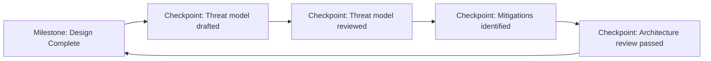
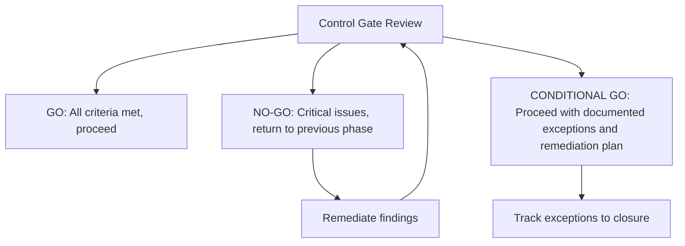

# 2.3 Outline Strategy and Roadmap

## Learning Objectives

- Define security milestones and checkpoints within a software project
- Explain the purpose of control gates and how they enforce security decisions
- Describe break/build criteria and conditions that halt a release
- Develop a security strategy and roadmap aligned with business objectives

---

## Security Strategy

A security strategy defines **how an organization will integrate security across the SDLC**. It bridges the gap between high-level security policies and day-to-day development activities.

### Strategy Components

| Component | Description |
|-----------|-------------|
| **Vision** | Long-term security goals aligned with business objectives |
| **Current state assessment** | Baseline evaluation of existing security maturity (e.g., via BSIMM or SAMM) |
| **Target state** | Desired security posture with measurable goals |
| **Gap analysis** | Differences between current and target states |
| **Roadmap** | Phased plan with milestones, timelines, and resource requirements |
| **Governance** | Roles, responsibilities, decision-making authority |

### Strategic vs. Tactical Security

| Aspect | Strategic | Tactical |
|--------|-----------|----------|
| **Time horizon** | Long-term (1–3+ years) | Short-term (sprint/release) |
| **Focus** | Organization-wide security posture | Specific project or feature security |
| **Examples** | Adopting SAMM maturity model, establishing security team | Running SAST on current sprint, fixing specific vulnerability |
| **Ownership** | CISO, security leadership | Development team, security champion |

---

## Security Milestones and Checkpoints

Security milestones are **measurable progress markers** that demonstrate security activities have been completed at defined points in the SDLC.

### Milestone Examples by Phase

| Phase | Milestone | Evidence |
|-------|-----------|----------|
| **Requirements** | Security requirements signed off | Approved security requirements document |
| **Design** | Threat model completed | Threat model document with mitigations |
| **Implementation** | SAST scan completed with no critical findings | SAST report showing clean results |
| **Testing** | Penetration test completed | Pentest report with all critical/high findings resolved |
| **Release** | Security sign-off obtained | Signed approval-to-operate document |

### Checkpoints

Checkpoints are **intermediate verification points** within a milestone that track progress:

---

## Control Gates

A control gate is a **formal decision point** where stakeholders evaluate whether the project meets defined security criteria before proceeding to the next phase.

### Control Gate Structure

| Element | Description |
|---------|-------------|
| **Gate owner** | Person or committee responsible for the go/no-go decision |
| **Entry criteria** | Prerequisites that must be met before the gate review |
| **Review activities** | Evaluations performed at the gate (document review, scan results, risk assessment) |
| **Exit criteria** | Conditions that must be satisfied to pass through the gate |
| **Decision** | Go, No-Go, or Conditional Go |
| **Escalation path** | Process for resolving disagreements or exceptions |

### Control Gate Decisions

### Common Gate Criteria

| Gate | Typical Criteria |
|------|-----------------|
| **Design Gate** | Threat model completed, architecture review passed, no unmitigated high-risk threats |
| **Code Gate** | SAST completed, no critical vulnerabilities, peer review done, coding standards followed |
| **Test Gate** | Security testing completed, all critical/high findings resolved, regression tests passed |
| **Release Gate** | All prior gate criteria met, security sign-off obtained, incident response plan in place |

---

## Break/Build Criteria

Break/build criteria define the **conditions under which a build is considered broken** (and must not be released) or conditions that must be met for a build to be considered acceptable.

### Break Criteria (Stop Conditions)

A build is **broken** and must not proceed if:

| Category | Examples |
|----------|---------|
| **Critical vulnerabilities** | Unresolved critical/high CVSS findings, known exploitable vulnerabilities |
| **Failed security tests** | SAST/DAST tools report critical findings, penetration test reveals exploitable flaws |
| **Compliance violations** | Build includes components that violate regulatory requirements (e.g., unapproved cryptographic algorithms) |
| **Policy violations** | Code does not meet organizational security standards (e.g., hardcoded credentials) |
| **Missing artifacts** | Required security documentation not completed (e.g., no threat model, no security test report) |

### Build Criteria (Go Conditions)

A build is **acceptable** for release when:

| Category | Examples |
|----------|---------|
| **Vulnerability thresholds met** | No critical/high findings; medium/low within acceptable risk threshold |
| **Security testing complete** | All required security tests executed (SAST, DAST, pentest, fuzz) |
| **Documentation complete** | Threat model, security test reports, and risk assessment finalized |
| **Sign-off obtained** | Designated security authority has approved the release |
| **Dependencies verified** | Third-party components scanned (SCA), no known critical CVEs |

### Bug Bars

A **bug bar** is a quality gate that defines the **minimum acceptable threshold** for security defects. It specifies which types of vulnerabilities must be fixed before release versus which may be accepted as known risks.

| Severity | Bug Bar Policy Example |
|----------|----------------------|
| **Critical** | Must fix before release — no exceptions |
| **High** | Must fix before release; exceptions require CISO approval |
| **Medium** | Should fix before release; may defer with documented risk acceptance |
| **Low** | Fix when practical; document and track |

> **Exam Tip**: Break/build criteria are **pre-defined** before development starts — not decided ad hoc at release time. They are part of the project's security plan.

---

## Exam Focus Points

1. **Control gates**: Formal decision points with go/no-go/conditional outcomes
2. **Break/build criteria**: Pre-defined conditions that block or approve a release
3. **Bug bars**: Minimum acceptable quality thresholds for security defects
4. **Milestones vs. checkpoints**: Milestones are phase gates; checkpoints are intermediate progress markers
5. **Strategic vs. tactical**: Strategy = long-term organizational posture; tactical = specific project security
6. **Gap analysis**: Difference between current security state and target state
7. **Conditional go**: Proceed with documented risk acceptance and remediation plan

---

## Key Terms Glossary

| Term | Definition |
|------|-----------|
| **Security Roadmap** | Phased plan for improving security posture with milestones and timelines |
| **Control Gate** | Formal decision point evaluating security criteria before proceeding |
| **Break Criteria** | Conditions that make a build unacceptable for release |
| **Build Criteria** | Minimum conditions that must be met for a release to proceed |
| **Bug Bar** | Quality threshold defining which vulnerability severities must be resolved before release |
| **Milestone** | Measurable progress marker demonstrating security activity completion |
| **Checkpoint** | Intermediate verification point within a milestone |
| **Gap Analysis** | Assessment of the difference between current and desired security states |
| **Risk Acceptance** | Formal acknowledgment and documentation of accepted residual risk |
| **CVSS** | Common Vulnerability Scoring System — standardized vulnerability severity rating |
