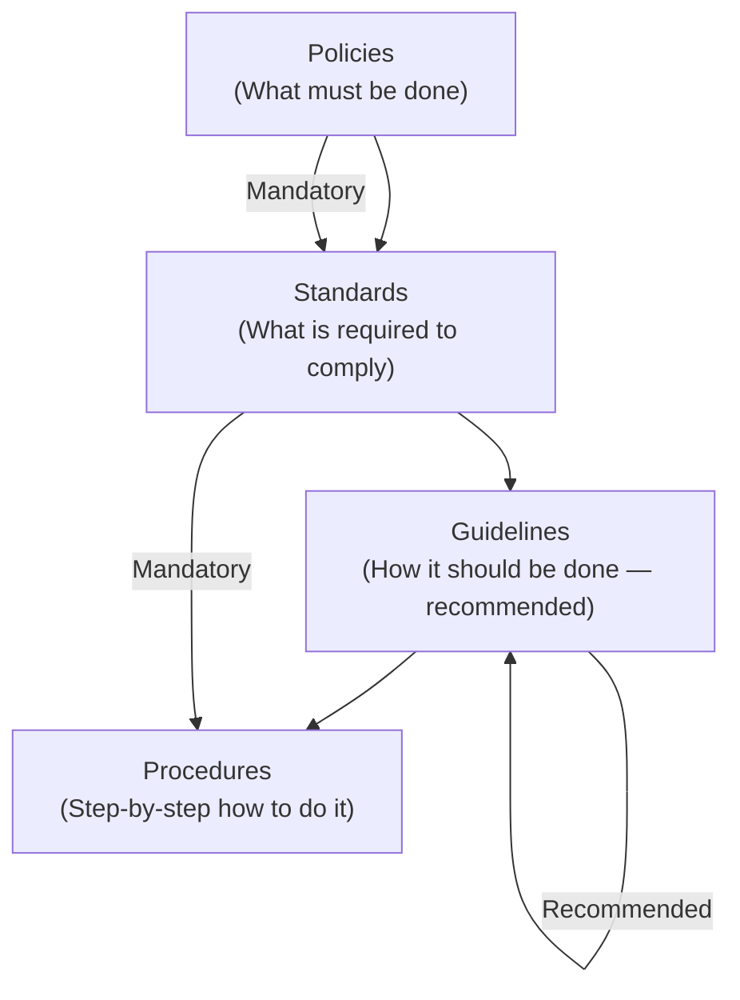
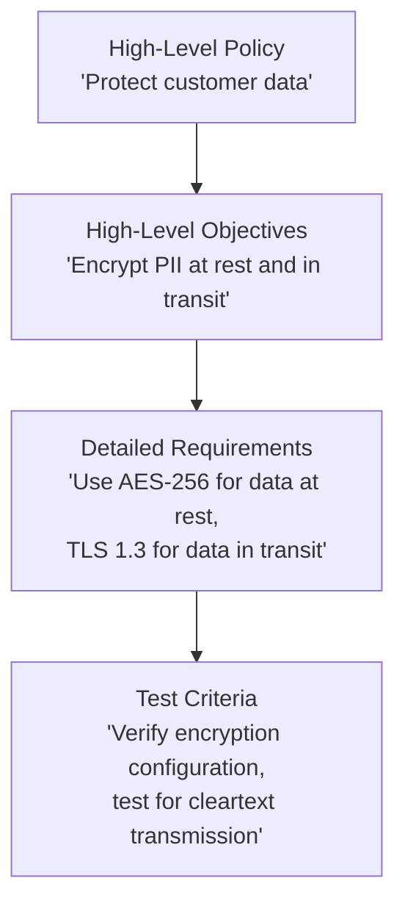

# 2.4 Define and Develop Security Documentation

## Learning Objectives

- Identify the types of security documentation required throughout the SDLC
- Explain the purpose and content of key security documents
- Describe the documentation hierarchy: policies → standards → guidelines → procedures
- Understand the role of documentation in demonstrating due diligence and compliance

---

## Documentation Hierarchy

Security documentation follows a hierarchical structure, with each level providing increasing specificity:

| Level | Nature | Description | Example |
|-------|--------|-------------|---------|
| **Policy** | Mandatory | High-level statement of management intent and direction | "All software must undergo security testing before deployment" |
| **Standard** | Mandatory | Specific, measurable requirements derived from policies | "All web applications must pass OWASP ASVS Level 2 verification" |
| **Guideline** | Recommended | Suggested approaches to satisfy standards (not mandatory) | "Consider using parameterized queries for all database interactions" |
| **Procedure** | Mandatory | Step-by-step instructions for implementing standards | "Run SAST tool X with configuration Y before each code commit" |

> **Exam Tip**: Policies and standards are **mandatory**. Guidelines are **recommended** but not enforced. Procedures provide the **specific steps** to implement standards.

---

## Security Documentation Throughout the SDLC

### Requirements Phase

| Document | Purpose |
|----------|---------|
| **Security Requirements Specification** | Defines functional and non-functional security requirements |
| **Compliance Requirements Document** | Lists applicable regulations, laws, and industry standards |
| **Data Classification Guide** | Defines data sensitivity levels and handling requirements |
| **Privacy Impact Assessment (PIA)** | Evaluates privacy risks of data collection and processing |
| **Security Requirements Traceability Matrix (SRTM)** | Maps security requirements to implementation and testing |

### Design Phase

| Document | Purpose |
|----------|---------|
| **Threat Model** | Documents identified threats, attack vectors, and mitigations |
| **Security Architecture Document** | Describes security controls in the system architecture |
| **Security Design Review Report** | Records findings from the architecture/design security review |
| **Risk Assessment Report** | Documents identified risks, their severity, and treatment decisions |

### Implementation Phase

| Document | Purpose |
|----------|---------|
| **Secure Coding Standards** | Defines coding rules and practices for the development team |
| **Code Review Checklists** | Standardized criteria for peer security code reviews |
| **SAST/SCA Reports** | Results of static analysis and software composition analysis |

### Testing Phase

| Document | Purpose |
|----------|---------|
| **Security Test Plan** | Strategy, scope, and approach for security testing |
| **Security Test Cases** | Specific test scenarios including expected results |
| **Penetration Test Report** | Findings from penetration testing with severity ratings |
| **Software Validation and Verification Plan (SVVP)** | Defines V&V activities, criteria, and responsibilities |

### Deployment and Operations Phase

| Document | Purpose |
|----------|---------|
| **Deployment Security Checklist** | Verification steps for secure deployment |
| **Security Configuration Guide** | Baseline security settings for the production environment |
| **Incident Response Plan** | Procedures for detecting, responding to, and recovering from security incidents |
| **Security Operations Procedures** | Day-to-day security activities (monitoring, patching, access reviews) |

### Decommissioning Phase

| Document | Purpose |
|----------|---------|
| **Decommissioning Plan** | Steps for securely removing an application from service |
| **Data Disposition Record** | Evidence of proper data retention or destruction |

---

## Policy Decomposition

Organizational security policies are high-level mandates that must be **decomposed** into detailed, actionable security requirements for software projects.

Policy decomposition is a **crucial step** in requirements gathering. Each high-level policy statement must be broken down into:
1. **High-level security objectives** — what must be achieved
2. **Specific security requirements** — measurable criteria
3. **Implementation guidance** — how to satisfy the requirements
4. **Verification criteria** — how compliance will be tested

---

## Documentation Best Practices

| Practice | Description |
|----------|-------------|
| **Version control** | Maintain revision history for all security documents |
| **Regular review** | Schedule periodic reviews and updates (at least annually) |
| **Stakeholder alignment** | Ensure documents are reviewed and approved by appropriate authorities |
| **Accessibility** | Store documents where all relevant stakeholders can access them |
| **Living documents** | Update continuously as the project evolves — not just at phase gates |
| **Template standardization** | Use consistent templates across projects for predictability |

---

## Exam Focus Points

1. **Hierarchy**: Policy → Standard → Guideline → Procedure (mandatory vs. recommended)
2. **Policy decomposition**: Breaking high-level policies into actionable security requirements
3. **SRTM**: Traceability matrix linking business requirements to security requirements to tests
4. **SVVP**: Defines validation and verification activities across the SDLC
5. **Threat model**: Must be produced during the design phase and maintained as a living document
6. **Documentation demonstrates due diligence**: Critical for regulatory compliance and legal protection

---

## Key Terms Glossary

| Term | Definition |
|------|-----------|
| **Security Policy** | High-level, mandatory management statement of direction and intent |
| **Security Standard** | Specific, mandatory requirements that implement policies |
| **Security Guideline** | Recommended but non-mandatory approaches to meeting standards |
| **Security Procedure** | Step-by-step, mandatory instructions for implementing standards |
| **Policy Decomposition** | Breaking high-level policies into detailed, actionable security requirements |
| **SRTM** | Security Requirements Traceability Matrix |
| **PIA** | Privacy Impact Assessment |
| **SVVP** | Software Validation and Verification Plan |
| **Threat Model** | Document identifying threats, attack vectors, and mitigations for a system |
| **Due Diligence** | Reasonable efforts to comply with laws and best practices |
| **Due Care** | Ongoing commitment to maintaining security posture |
