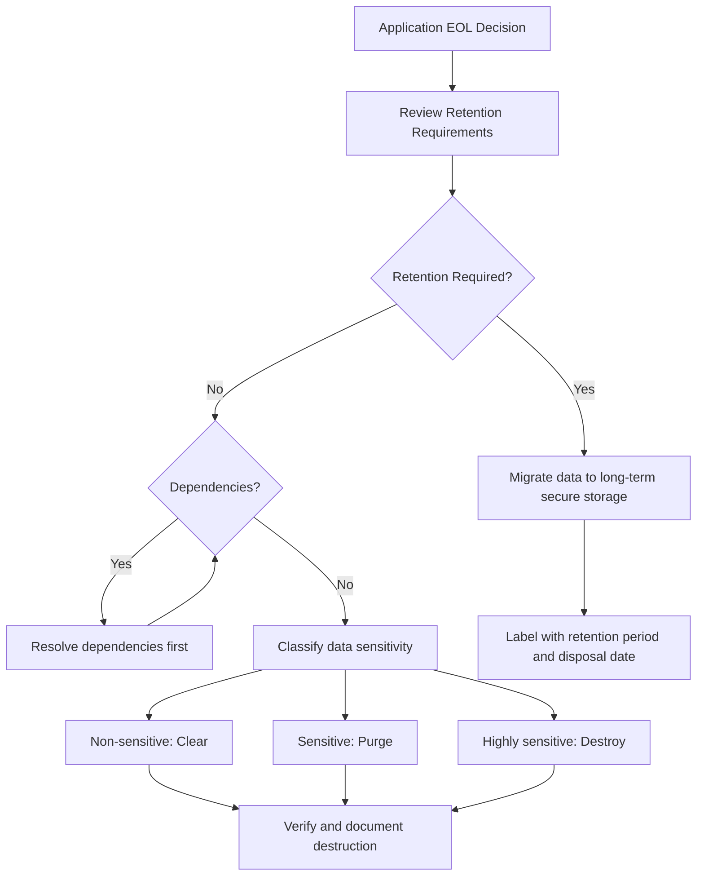

# 2.6 Decommission Applications

## Learning Objectives

- Explain the need for secure application decommissioning
- Describe End-of-Life (EOL) policies and their components
- Identify data disposition requirements including retention and destruction
- Understand dependency management during decommissioning

---

## Why Decommissioning Matters

Application decommissioning is a **security-critical activity** that is often overlooked. Applications that are no longer actively maintained but remain operational represent a significant attack surface — they receive no patches, their configurations may drift, and the institutional knowledge to manage them fades. Proper decommissioning ensures that:

- **Sensitive data** is properly retained or destroyed according to policy
- **Credentials and secrets** associated with the application are revoked
- **Compliance requirements** for data retention are satisfied
- **Attack surface** is reduced by removing unnecessary services
- **Resources** (licenses, infrastructure, personnel) are reclaimed

---

## End-of-Life (EOL) Policies

EOL policies define the **structured process** for retiring an application from active use. A comprehensive EOL policy addresses:

### Credential and Secret Removal

| Item | Action |
|------|--------|
| **Service accounts** | Disable and delete all service accounts used by the application |
| **API keys and tokens** | Revoke all API keys, OAuth tokens, and access tokens |
| **Certificates** | Revoke and delete TLS/SSL certificates and code signing certificates |
| **Passwords** | Remove or rotate all shared passwords; delete password vault entries |
| **SSH keys** | Remove SSH key pairs used for deployment or maintenance |
| **Encryption keys** | Archive or destroy encryption keys based on data retention requirements |

> **Exam Tip**: If encrypted data must be retained, the **encryption keys must also be retained** and securely stored for the same duration. Destroying keys while retaining encrypted data renders the data unrecoverable.

### Configuration Removal

| Item | Action |
|------|--------|
| **Firewall rules** | Remove firewall rules that permitted traffic to/from the decommissioned application |
| **DNS entries** | Remove or redirect DNS records |
| **Load balancer configurations** | Remove backend pools and health checks |
| **Network ACLs** | Remove network access control entries |
| **Integration points** | Disconnect or reconfigure upstream/downstream system integrations |
| **Scheduled tasks** | Remove cron jobs, scheduled tasks, and batch jobs |

### License Cancellation

| Item | Action |
|------|--------|
| **Commercial software licenses** | Cancel or reassign licenses (database, middleware, monitoring tools) |
| **Cloud resources** | Terminate and deregister cloud instances, storage, and services |
| **SaaS subscriptions** | Cancel SaaS service subscriptions |
| **Support contracts** | Terminate vendor support agreements |

### Archiving

| Item | Consideration |
|------|--------------|
| **Source code** | Archive in version control with appropriate access restrictions |
| **Documentation** | Archive design documents, operational procedures, architecture diagrams |
| **Build artifacts** | Retain signed build artifacts if required for audit purposes |
| **Audit logs** | Retain according to compliance and retention policies |
| **Configuration records** | Archive for reference in case of future forensic needs |

### Service-Level Agreement (SLA) Considerations

- Notify all consumers and stakeholders of the planned decommissioning
- Provide adequate **notice periods** as defined in existing SLAs
- Offer **migration paths** or alternatives where applicable
- Update SLAs to reflect the decommissioned status
- Document the decommissioning timeline and communicate to affected parties

---

## Data Disposition

Data disposition addresses what happens to the data associated with a decommissioned application. There are two primary paths:

### Data Retention

Data may need to be retained beyond the application's lifecycle due to:

| Requirement | Examples |
|-------------|---------|
| **Regulatory compliance** | Financial records (SOX: 7 years), health records (HIPAA: 6 years), tax records |
| **Legal hold** | Data relevant to pending or anticipated litigation |
| **Business need** | Historical analytics, reference data, audit trails |
| **Contractual obligation** | Customer agreements requiring data availability |

**Retained data must be:**
- Migrated to a secure, accessible storage system
- Protected with appropriate access controls and encryption
- Labeled with retention period and disposal date
- Assigned a data custodian responsible for ongoing security

### Data Destruction

When data is no longer needed and no retention requirement exists, it must be securely destroyed:

| Method | Description | Use Case |
|--------|-------------|----------|
| **Clearing** | Overwriting logical storage space with non-sensitive data | Non-confidential data on reusable media |
| **Purging** | Rendering data unrecoverable (degaussing, Secure Erase on ATA drives) | Confidential data; media may be reused |
| **Destroying** | Physical destruction of media | Highly sensitive data; media cannot be reused |

**Physical destruction methods:**

| Technique | Description |
|-----------|-------------|
| **Disintegration** | Separating media into component parts |
| **Pulverization** | Grinding media into powder or dust |
| **Shredding** | Cutting or tearing media into small particles |
| **Incineration** | Burning media to ash |
| **Degaussing** | Applying a reverse magnetic field to reduce flux to zero (magnetic media only) |

> **Exam Tip**: **Disposal** (simply discarding media) is technically **not** a form of sanitization. Know the difference between disposal, clearing, purging, and destroying.

### Dependencies

Before destroying data, evaluate dependencies:

| Dependency | Risk |
|-----------|------|
| **Downstream systems** | Other applications may depend on data from the decommissioned application |
| **Reporting systems** | Business intelligence and analytics may reference historical data |
| **Audit requirements** | Regulatory auditors may need access to historical records |
| **Legal obligations** | Data may be subject to legal holds or discovery requests |
| **Shared data stores** | Data may be co-located with active data from other applications |

---

## Exam Focus Points

1. **EOL checklist**: Credential removal, config removal, license cancellation, archiving, SLA notification
2. **Data disposition**: Two paths — retention (migrate, protect, label) or destruction (clear, purge, destroy)
3. **Destruction hierarchy**: Disposal < Clearing < Purging < Destroying (increasing assurance)
4. **Key retention**: If encrypted data is retained, encryption keys must also be retained
5. **Dependencies**: Always check for downstream systems, reporting, audit, and legal before destroying data
6. **Degaussing**: Magnetic field reversal — works on magnetic media only (not SSDs)

---

## Key Terms Glossary

| Term | Definition |
|------|-----------|
| **EOL** | End of Life — planned retirement of an application from active service |
| **Data Disposition** | The process of deciding what happens to data (retain or destroy) |
| **Clearing** | Overwriting media with non-sensitive data; media can be reused |
| **Purging** | Rendering data unrecoverable; media may be reused |
| **Destroying** | Physical destruction of media; media cannot be reused |
| **Degaussing** | Applying a reverse magnetic field to erase magnetic media |
| **Sanitization** | Process of removing information so recovery is not possible |
| **Data Retention** | Keeping data for a specified period per regulatory or business requirements |
| **Legal Hold** | Requirement to preserve data relevant to pending or anticipated litigation |
| **Data Custodian** | Person responsible for safeguarding and managing data on behalf of the data owner |
| **Software Escrow** | Arrangement where source code is held by a third party for contingency access |
