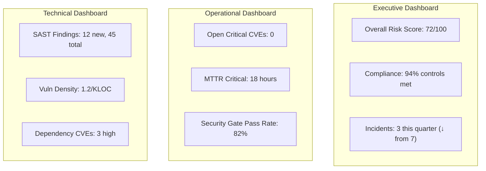
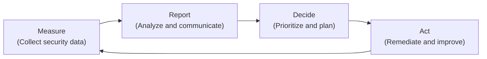

# 2.7 Create Security Reporting Mechanisms

## Learning Objectives

- Describe the purpose of security reporting in the SDLC
- Differentiate between types of security reports and their audiences
- Explain how dashboards provide real-time security visibility
- Design feedback loops that drive continuous security improvement

---

## Purpose of Security Reporting

Security reporting transforms **raw security data into actionable intelligence** for decision-makers. Reports bridge the gap between technical security findings and business decisions. Without effective reporting, security teams operate in isolation, and leadership cannot make informed risk decisions.

### Reporting Objectives

| Objective | Description |
|-----------|-------------|
| **Visibility** | Make security posture visible to all stakeholders |
| **Accountability** | Demonstrate that security activities are being performed |
| **Decision support** | Provide data for risk-based business decisions |
| **Trend analysis** | Show improvement or degradation over time |
| **Compliance evidence** | Demonstrate regulatory and standards compliance |
| **Resource justification** | Support investment in security tools, people, and processes |

---

## Types of Security Reports

### Executive (Strategic) Reports

Target audience: CISO, CTO, CEO, Board of Directors.

| Content | Purpose |
|---------|---------|
| Risk posture summary | High-level view of organizational security risk |
| Compliance status | Regulatory and standards compliance dashboard |
| Security investment ROI | Demonstrating the value of security spending |
| Incident trends | Number and severity of incidents over time |
| Program maturity | Progress against BSIMM/SAMM maturity goals |

**Characteristics**: High-level, business-focused language, trend-oriented, minimal technical detail.

### Operational (Tactical) Reports

Target audience: Security team leads, development managers, project managers.

| Content | Purpose |
|---------|---------|
| Open vulnerability status | Current backlog by severity and age |
| Remediation progress | MTTR trends, SLA compliance for remediation |
| Security testing coverage | Percentage of projects with SAST/DAST/pentest |
| Security gate results | Pass/fail rates and common failure reasons |
| Third-party risk summary | Status of vendor assessments and component risks |

**Characteristics**: Actionable, time-bound, team-focused, includes specific improvement actions.

### Technical (Detailed) Reports

Target audience: Developers, security engineers, quality assurance.

| Content | Purpose |
|---------|---------|
| Vulnerability scan results | Detailed findings with reproduction steps |
| SAST/DAST reports | Specific code-level findings with remediation guidance |
| Penetration test reports | Detailed findings, exploitation proof, remediation steps |
| Code review findings | Issues identified during peer and security code review |
| Configuration audit results | Deviations from security baselines |

**Characteristics**: Highly technical, detailed reproduction steps, prioritized remediation guidance.

---

## Dashboards

Dashboards provide **real-time or near-real-time visibility** into security status. They are visual, interactive, and designed for at-a-glance comprehension.

### Dashboard Design Principles

| Principle | Description |
|-----------|-------------|
| **Audience-appropriate** | Different dashboards for executives, managers, and engineers |
| **Actionable indicators** | Use red/amber/green status indicators tied to defined thresholds |
| **Trend visualization** | Show data over time to reveal improvement or degradation |
| **Drill-down capability** | Allow users to explore details behind summary metrics |
| **Automated data feeds** | Pull from security tools (SAST, DAST, SIEM, ticketing systems) automatically |

### Example Dashboard Metrics

---

## Feedback Loops

Feedback loops ensure that **reporting drives action**, and that the results of those actions are captured in subsequent reports. Without feedback loops, reports become informational artifacts with no impact on behavior.

### The Security Feedback Loop

### Types of Feedback Loops

| Loop | Description | Example |
|------|-------------|---------|
| **Immediate** | Real-time alerts that trigger immediate response | SAST finding blocks CI/CD pipeline build |
| **Sprint-level** | Findings feed into the next sprint's backlog | Security debt items prioritized in sprint planning |
| **Release-level** | Aggregate findings inform release go/no-go decisions | Security gate review at release |
| **Strategic** | Quarterly/annual trends drive program changes | BSIMM assessment drives annual security roadmap |

### Effective Feedback Characteristics

| Characteristic | Description |
|---------------|-------------|
| **Timely** | Information reaches decision-makers while it is still actionable |
| **Specific** | Clearly identifies what needs to change and who is responsible |
| **Measurable** | Includes data that can be tracked to confirm the feedback was acted upon |
| **Constructive** | Focused on improvement, not blame |

---

## Exam Focus Points

1. **Report types by audience**: Executive (business risk), Operational (team progress), Technical (detailed findings)
2. **Dashboards**: Real-time, visual, audience-appropriate, automated data feeds
3. **Feedback loops**: Measure → Report → Decide → Act → Measure (continuous cycle)
4. **Reporting drives decisions**: Reports without action plans are ineffective
5. **Compliance evidence**: Reports serve as proof of due diligence for auditors and regulators

---

## Key Terms Glossary

| Term | Definition |
|------|-----------|
| **Security Dashboard** | Real-time visual display of security metrics and status |
| **Feedback Loop** | Cyclical process where measurement drives action and results feed back into measurement |
| **MTTR** | Mean Time to Remediate |
| **SLA Compliance** | Adherence to agreed-upon service levels for security activities |
| **Risk Posture** | Overall security status of an organization at a point in time |
| **Trend Analysis** | Examination of data over time to identify patterns of improvement or degradation |
| **Defect Removal Efficiency** | Percentage of defects found before production release |
