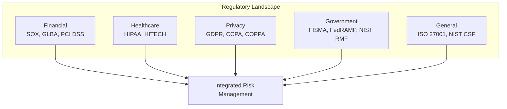
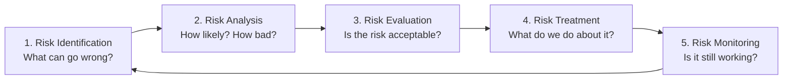
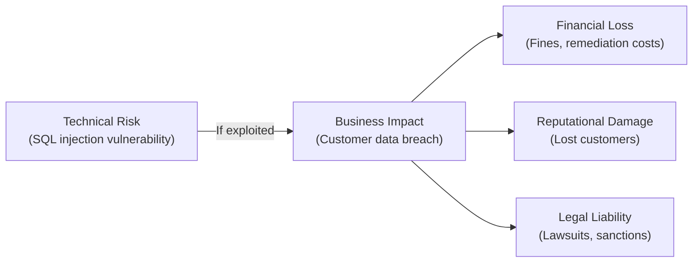

# 2.8 Incorporate Integrated Risk Management

## Learning Objectives

- Identify key regulations, standards, and guidelines relevant to secure software
- Explain legal considerations including intellectual property and breach notification
- Describe risk management processes: risk assessment and risk analysis
- Differentiate between technical risk and business risk
- Integrate risk management into the software development lifecycle

---

## Regulations, Standards, and Guidelines

Integrated risk management requires awareness of the regulatory, legal, and standards landscape that applies to the software being developed. The major frameworks are:

### Security Frameworks and Standards

| Framework | Focus | Key Application |
|-----------|-------|----------------|
| **ISO 27001/27002** | Information security management and controls | Enterprise-wide ISMS |
| **ISO/IEC 15408 (Common Criteria)** | IT product security evaluation | Product security certification |
| **PCI DSS** | Payment card industry data security | Payment processing systems |
| **NIST SP 800 Series** | Federal information system security | Government and defense contracts |
| **NIST CSF** | Cybersecurity risk management framework | Industry-agnostic risk management |
| **OWASP** | Web application security | Application security testing and best practices |
| **SAFECode** | Software assurance industry practices | Secure development processes |
| **SAMM** | Software assurance maturity measurement | Security program improvement |
| **BSIMM** | Software security initiative benchmarking | Peer comparison and benchmarking |

### Regulatory Compliance Mapping

---

## Legal Considerations

### Intellectual Property (IP)

Software development involves multiple forms of intellectual property that must be managed:

| IP Type | Protection | Duration | Applicability to Software |
|---------|-----------|----------|--------------------------|
| **Patent** | Exclusive right to an invention; must be novel, useful, and nonobvious | 20 years (typically) | Algorithms, processes, business methods |
| **Copyright** | Protection of expression of ideas (not the idea itself) | Life + 70 years (or 95 years for corporate) | Source code, documentation, UI design |
| **Trade Secret** | Proprietary information kept confidential | Indefinite (as long as secret is maintained) | Algorithms, formulas, business processes |
| **Trademark** | Recognition of brand identity | Indefinite (with renewal) | Product names, logos |

> **Exam Tip**: **Copyright** protects the specific expression of code but does NOT prevent others from independently writing their own implementation of the same functionality. **Patents** protect the underlying process or algorithm itself.

### Breach Notification

Many regulations require organizations to notify affected individuals and regulators when a data breach occurs:

| Regulation | Notification Requirement |
|-----------|------------------------|
| **GDPR** | 72 hours to supervisory authority; without undue delay to data subjects (if high risk) |
| **HIPAA** | 60 days to affected individuals; immediately to HHS if > 500 individuals |
| **PCI DSS** | Immediately to payment brands and acquiring banks |
| **State laws (US)** | Vary by state; most require notification within 30–90 days |

### Contractual and Warranty Considerations

| Element | Description |
|---------|-------------|
| **End-User License Agreement (EULA)** | Defines terms of use and liability limitations |
| **Warranty** | Guarantees about software functionality and security |
| **Indemnification** | Protection against claims arising from product use |
| **Code escrow** | Source code held by a third party for contingency access (vendor bankruptcy) |
| **SLA** | Service Level Agreement defining performance and availability commitments |

---

## Risk Management

### Risk Assessment vs. Risk Analysis

| Concept | Description |
|---------|-------------|
| **Risk Assessment** | The overall process of **identifying, analyzing, and evaluating** risks |
| **Risk Analysis** | A specific step within risk assessment that **determines the level of risk** by evaluating likelihood and impact |

### Risk Assessment Process

### Risk Treatment Options

| Option | Description | Example |
|--------|-------------|---------|
| **Mitigate (Reduce)** | Implement controls to reduce likelihood or impact | Add input validation to prevent SQL injection |
| **Transfer** | Shift risk to a third party | Purchase cyber insurance; contractual liability transfer |
| **Accept** | Acknowledge the risk and proceed without additional controls | Risk falls within organizational risk appetite |
| **Avoid** | Eliminate the risk by not performing the risky activity | Discontinue a feature that introduces unacceptable risk |

> **Exam Tip**: Risk can never be completely eliminated — only managed. **Residual risk** is the risk remaining after controls are applied.

### Quantitative vs. Qualitative Risk Analysis

| Approach | Description | Metrics |
|----------|-------------|---------|
| **Quantitative** | Assigns numerical/monetary values to risk | ALE = ARO × SLE |
| **Qualitative** | Uses descriptive categories (high/medium/low) | Risk matrices, expert judgment |

**Quantitative Risk Terms:**

| Term | Definition |
|------|-----------|
| **Asset Value (AV)** | Monetary value of the asset |
| **Exposure Factor (EF)** | Percentage of asset value lost in an incident |
| **Single Loss Expectancy (SLE)** | AV × EF — expected loss per incident |
| **Annual Rate of Occurrence (ARO)** | Expected frequency of the threat per year |
| **Annual Loss Expectancy (ALE)** | SLE × ARO — expected annual monetary loss |

---

## Technical Risk vs. Business Risk

Understanding the distinction between technical and business risk is critical for prioritizing security investments.

### Technical Risk

Technical risk relates to **technology-specific threats and vulnerabilities**:

| Category | Examples |
|----------|---------|
| **Code vulnerabilities** | SQL injection, XSS, buffer overflow |
| **Architecture weaknesses** | Single point of failure, insecure protocols |
| **Configuration errors** | Default credentials, unnecessary services enabled |
| **Dependency risks** | Third-party libraries with known CVEs |
| **Infrastructure risks** | Outdated operating systems, unpatched servers |

### Business Risk

Business risk relates to the **impact on organizational objectives**:

| Category | Examples |
|----------|---------|
| **Financial loss** | Revenue loss from downtime, regulatory fines, breach costs |
| **Reputational damage** | Loss of customer trust, negative media coverage |
| **Legal liability** | Lawsuits, regulatory sanctions, contractual penalties |
| **Competitive disadvantage** | Loss of market share due to security incidents |
| **Operational disruption** | Inability to deliver products or services |

### Relating Technical to Business Risk

**A critical skill for the CSSLP**: Translating technical findings into business language. A SQL injection vulnerability is a *technical risk*; the potential for customer data breach leading to regulatory fines and reputational damage is the *business risk*.

> **Exam Tip**: The exam tests your ability to **connect technical risks to business impacts**. When evaluating security investments, business risk should drive prioritization — not technical severity alone.

---

## Exam Focus Points

1. **Risk treatment options**: Mitigate, Transfer, Accept, Avoid — know examples of each
2. **ALE formula**: ALE = ARO × SLE; SLE = AV × EF
3. **Technical vs. business risk**: Technical = vulnerability-level; Business = organizational impact
4. **Residual risk**: Risk remaining after controls are applied
5. **IP types**: Patent (process/algorithm), Copyright (expression/code), Trade Secret (kept confidential), Trademark (brand)
6. **Breach notification timelines**: GDPR (72h), HIPAA (60 days), PCI (immediately)
7. **Risk assessment process**: Identify → Analyze → Evaluate → Treat → Monitor
8. **Copyright vs. Patent**: Copyright does not prevent independent reimplementation; patents do

---

## Key Terms Glossary

| Term | Definition |
|------|-----------|
| **Risk Assessment** | Overall process of identifying, analyzing, and evaluating risks |
| **Risk Analysis** | Determining level of risk by evaluating likelihood and impact |
| **Residual Risk** | Risk remaining after controls are applied |
| **Risk Appetite** | Amount of risk an organization is willing to accept |
| **ALE** | Annual Loss Expectancy — expected annual monetary loss from a risk |
| **SLE** | Single Loss Expectancy — expected loss per incident |
| **ARO** | Annual Rate of Occurrence — expected frequency of a threat per year |
| **Patent** | Exclusive right to an invention granted by a government |
| **Copyright** | Legal protection of the expression of an idea |
| **Trade Secret** | Proprietary information maintained through confidentiality |
| **Breach Notification** | Legal requirement to notify affected parties after a data breach |
| **EULA** | End-User License Agreement |
| **Code Escrow** | Source code held by a third party for contingency access |
| **Indemnification** | Contractual protection against claims arising from product use |
