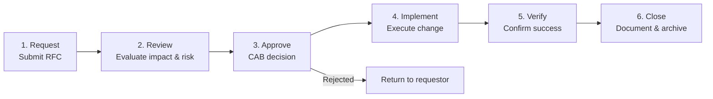
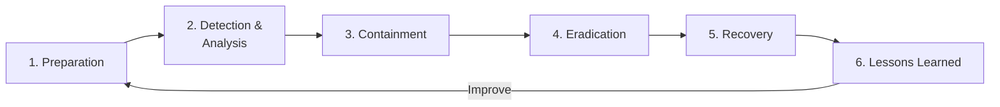
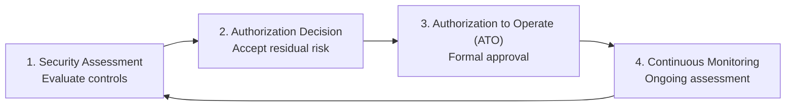

# 2.9 Implement Secure Operation Practices

## Learning Objectives

- Describe the change management process and its security implications
- Explain the components of an incident response plan
- Differentiate between verification and validation (V&V) in software security
- Understand the Assessment and Authorization (A&A) process
- Apply secure operational practices throughout the software lifecycle

---

## Change Management

Change management is a **formal process** for controlling modifications to software, infrastructure, and configurations. Uncontrolled changes are a leading cause of security incidents — they can introduce vulnerabilities, break existing controls, or create configuration drift.

### Change Management Process

### Change Types

| Type | Description | Process |
|------|-------------|---------|
| **Standard** | Pre-approved, low-risk, routine changes | Follow documented procedure; no CAB approval needed |
| **Normal** | Changes requiring evaluation and approval | Full change management process with CAB review |
| **Emergency** | Urgent changes to resolve critical incidents | Expedited approval; retrospective review required |

### Security Considerations in Change Management

| Consideration | Description |
|--------------|-------------|
| **Impact assessment** | Evaluate how the change affects the security posture of the application |
| **Regression risk** | Determine whether the change could break existing security controls |
| **Rollback plan** | Define how to revert the change if it introduces security issues |
| **Testing requirements** | Specify security tests that must pass before the change is approved |
| **Separation of duties** | The person requesting the change should not be the person approving it |
| **Audit trail** | All changes must be logged with who, what, when, and why |

> **Exam Tip**: Change management enforces **separation of duties** — requestors, reviewers, and implementers should be different individuals where practical.

### Change Advisory Board (CAB)

The CAB is a **cross-functional group** responsible for evaluating and authorizing changes:

| Role | Responsibility |
|------|---------------|
| **Change Manager** | Chairs the CAB, manages the change process |
| **Technical Lead** | Assesses technical feasibility and risk |
| **Security Representative** | Evaluates security impact |
| **Operations Representative** | Assesses operational impact and readiness |
| **Business Stakeholder** | Evaluates business impact and priority |

---

## Incident Response Plan

An incident response plan (IRP) defines the **structured approach** for detecting, responding to, and recovering from security incidents. For the CSSLP, the focus is on how incident response integrates with the SDLC.

### Incident Response Phases

| Phase | Activities |
|-------|-----------|
| **Preparation** | Establish IR team, define policies, deploy monitoring, conduct training and drills |
| **Detection & Analysis** | Monitor for indicators of compromise, triage alerts, determine scope and severity |
| **Containment** | Isolate affected systems, prevent further damage, preserve evidence |
| **Eradication** | Remove the root cause (malware, vulnerability, unauthorized access) |
| **Recovery** | Restore systems to normal operation, verify security controls |
| **Lessons Learned** | Post-incident review, document findings, update processes and controls |

### Incident Triage

Triage is the process of **rapidly assessing and prioritizing** incidents to determine the appropriate response:

| Triage Factor | Assessment |
|--------------|------------|
| **Severity** | How critical is the affected system? What data is exposed? |
| **Scope** | How many systems, users, or data records are affected? |
| **Urgency** | Is the attack ongoing? Is there active data exfiltration? |
| **Business impact** | What is the effect on revenue, operations, reputation? |

### Forensics

Digital forensics in the context of software security involves:

| Activity | Description |
|----------|-------------|
| **Evidence preservation** | Maintain chain of custody; use forensic imaging (bit-for-bit copies) |
| **Log analysis** | Examine application logs, system logs, network logs for IOCs |
| **Memory analysis** | Capture and analyze volatile memory for artifacts |
| **Root cause analysis** | Determine how the incident occurred and what vulnerability was exploited |
| **Timeline reconstruction** | Build a chronological view of the incident from first compromise to detection |

### Remediation

Remediation addresses the **underlying vulnerability** that enabled the incident:

| Action | Example |
|--------|---------|
| **Patching** | Apply security patches to fix the exploited vulnerability |
| **Code fix** | Modify application code to eliminate the vulnerability |
| **Configuration change** | Correct misconfiguration that enabled the attack |
| **Architecture change** | Modify system design to prevent similar attacks |
| **Control enhancement** | Add or strengthen security controls (WAF rules, access restrictions) |

### Root Cause Analysis (RCA)

RCA goes beyond fixing the immediate issue to identify **systemic causes**:

- **5 Whys**: Ask "why" repeatedly until the root cause is identified
- **Fishbone (Ishikawa) diagram**: Categorize potential causes (People, Process, Technology, Environment)
- **Fault tree analysis**: A top-down, deductive model tracing from the failure to contributing causes

---

## Verification and Validation (V&V)

V&V are complementary activities that ensure software meets both its specification and its intended purpose.

| Concept | Question | Focus |
|---------|----------|-------|
| **Verification** | *Are we building the product correctly?* | Conformance to specification; proper software construction |
| **Validation** | *Are we building the correct product?* | Meets user requirements and intended use |

### Software Validation and Verification Plan (SVVP)

The SVVP specifies administrative requirements for V&V activities:

| Element | Description |
|---------|-------------|
| **Anomaly resolution and reporting** | How defects and anomalies are documented and resolved |
| **Exception/deviation policy** | How exceptions to V&V requirements are handled |
| **Baseline and configuration control** | Change management for V&V artifacts |
| **Standards, practices, and conventions** | V&V standards adopted for guidance |
| **Document formats** | Templates for plans, procedures, cases, and results |

### Types of V&V

#### Management V&V

- Examines **plans, schedules, requirements, and methods** for suitability
- Supports **management personnel** responsible for the system
- Discovers variations from plans and procedures
- Key roles: decision maker, review leader, review recorder, management staff, technical staff, customer representatives

#### Technical V&V

- Evaluates **products, documentation, code, and procedures** for conformance
- Determines whether the product conforms to specifications, adheres to regulations, and is correctly implemented
- Key roles: decision maker, review leader, review recorder, technical staff/managers, customer technical staff
- Should be **scheduled as part of initial project planning**; ad hoc reviews may supplement

### Independent V&V (IV&V)

- Performed by a **disinterested third party** to ensure objectivity
- Ensures neither customer nor supplier influences findings
- Often referred to as an **audit**
- Led by a **single lead auditor**
- Not typically initiated by the producer

**IV&V Audit Report includes:**
- Purpose and scope
- Name of the audited organization
- Software audited
- Applicable regulations/standards
- Audit evaluation criteria
- Observation list classifying anomalies as major/minor
- Timing of audit follow-up activities

---

## Assessment and Authorization (A&A)

Assessment and Authorization (formerly Certification and Accreditation — C&A) is the process of **evaluating the security posture** of a system and **formally authorizing** it to operate.

### A&A Process

| Phase | Description |
|-------|-------------|
| **Assessment** | Independent evaluation of security controls against requirements |
| **Authorization Decision** | Authorizing official reviews assessment results and accepts residual risk |
| **Authorization to Operate (ATO)** | Formal document granting permission to operate the system |
| **Continuous Monitoring** | Ongoing assessment to ensure the system maintains its authorized security posture |

### Key A&A Roles

| Role | Responsibility |
|------|---------------|
| **Authorizing Official (AO)** | Senior executive who accepts risk and grants ATO |
| **System Owner** | Responsible for the overall operation and security of the system |
| **Security Control Assessor** | Independent evaluator of security controls |
| **ISSM/ISSO** | Information System Security Manager/Officer — day-to-day security operations |

---

## Exam Focus Points

1. **Change management**: RFC → Review → Approve → Implement → Verify → Close
2. **Separation of duties in changes**: Requestor ≠ Approver ≠ Implementer
3. **IR phases**: Preparation → Detection → Containment → Eradication → Recovery → Lessons Learned
4. **Verification vs. Validation**: Verification = built correctly; Validation = correct product
5. **IV&V**: Independent third-party V&V — ensures objectivity (also called an audit)
6. **A&A**: Assessment + Authorization to Operate (ATO) by an authorizing official
7. **Root cause analysis**: 5 Whys, Fishbone diagrams, Fault tree analysis
8. **SVVP**: Defines V&V activities, anomaly resolution, and configuration control

---

## Key Terms Glossary

| Term | Definition |
|------|-----------|
| **Change Management** | Formal process for controlling modifications to software and infrastructure |
| **CAB** | Change Advisory Board — cross-functional group that evaluates and authorizes changes |
| **RFC** | Request for Change — formal proposal for a change |
| **Incident Response Plan** | Structured approach for handling security incidents |
| **Triage** | Rapid assessment and prioritization of incidents |
| **Forensics** | Scientific collection and analysis of evidence from security incidents |
| **Root Cause Analysis** | Process of identifying the fundamental cause of an incident |
| **Remediation** | Actions taken to fix the vulnerability that enabled an incident |
| **Verification** | Confirming software is built correctly (meets specifications) |
| **Validation** | Confirming the correct software is built (meets user requirements) |
| **SVVP** | Software Validation and Verification Plan |
| **IV&V** | Independent Verification and Validation |
| **A&A** | Assessment and Authorization (formerly Certification and Accreditation) |
| **ATO** | Authorization to Operate — formal approval to run a system in production |
| **Authorizing Official** | Senior executive who accepts residual risk and grants ATO |
