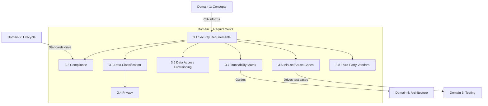

# Domain 3: Secure Software Requirements (13%)

## Domain Overview

Domain 3 is about **defining and capturing security requirements** — functional and non-functional — before a single line of code is written. This domain addresses compliance, data classification, privacy, access provisioning, misuse/abuse case development, requirements traceability, and third-party vendor security. Getting requirements right is the single most cost-effective security activity: defects found during requirements cost orders of magnitude less to fix than those found in production.

This domain carries **13% of the exam weight** and contains **8 major sections**:

| Section | Title | Focus |
|---------|-------|-------|
| 3.1 | Define Software Security Requirements | Functional & non-functional requirements |
| 3.2 | Identify Compliance Requirements | Regulatory, legal, industry, company-wide |
| 3.3 | Identify Data Classification Requirements | Ownership, labeling, types, lifecycle, handling |
| 3.4 | Identify Privacy Requirements | Collection scope, anonymization, user rights, retention, cross-border |
| 3.5 | Define Data Access Provisioning | User provisioning, service accounts, reapproval |
| 3.6 | Develop Misuse and Abuse Cases | Attack-oriented requirements, mitigating controls |
| 3.7 | Develop Security Requirement Traceability Matrix | Tracking requirements through design, implementation, and test |
| 3.8 | Define Third-Party Vendor Security Requirements | Supply chain security requirements |

## Learning Objectives

After completing this domain, you should be able to:

- Define both functional and non-functional security requirements
- Identify applicable compliance and regulatory requirements
- Develop data classification schemes and privacy requirements
- Design access provisioning models including user and service accounts
- Create misuse and abuse cases to identify negative scenarios
- Build a Security Requirements Traceability Matrix (SRTM)
- Define security requirements for third-party vendors and suppliers

## Key Relationships

## Study Tips

> **Exam Focus**: Domain 3 is the **highest-weighted domain** at 13%. Expect heavy coverage of data classification, privacy requirements, and the SRTM. Questions often present scenarios asking which type of requirement applies.

- Know the difference between **functional** (what the system does) and **non-functional** (how well it does it)
- **Data classification** is a business-driven activity, not a technical one
- Understand the **data lifecycle**: generation → retention → disposal
- Know sanitization methods in order: disposal < clearing < purging < destroying
- **SRTM** traces requirements from business needs through design, implementation, and test
- **Misuse cases** examine the system from an **attacker's perspective**

## Files in This Section

| File | Content |
|------|---------|
| [3.1_software_security_requirements.md](3.1_software_security_requirements.md) | Functional & non-functional requirements, use cases, subject-object matrix |
| [3.2_compliance_requirements.md](3.2_compliance_requirements.md) | Regulatory, legal, industry, company-wide compliance |
| [3.3_data_classification.md](3.3_data_classification.md) | Data ownership, labeling, types, lifecycle, handling |
| [3.4_privacy_requirements.md](3.4_privacy_requirements.md) | Collection scope, anonymization, user rights, retention, cross-border |
| [3.5_data_access_provisioning.md](3.5_data_access_provisioning.md) | User provisioning, service accounts, reapproval |
| [3.6_misuse_and_abuse_cases.md](3.6_misuse_and_abuse_cases.md) | Misuse/abuse case development, mitigating controls |
| [3.7_security_requirement_traceability.md](3.7_security_requirement_traceability.md) | SRTM development and management |
| [3.8_third_party_vendor_requirements.md](3.8_third_party_vendor_requirements.md) | Vendor security requirements, SBOM, contracts |
