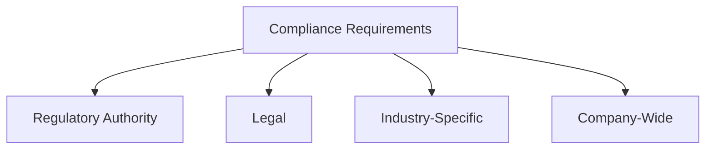
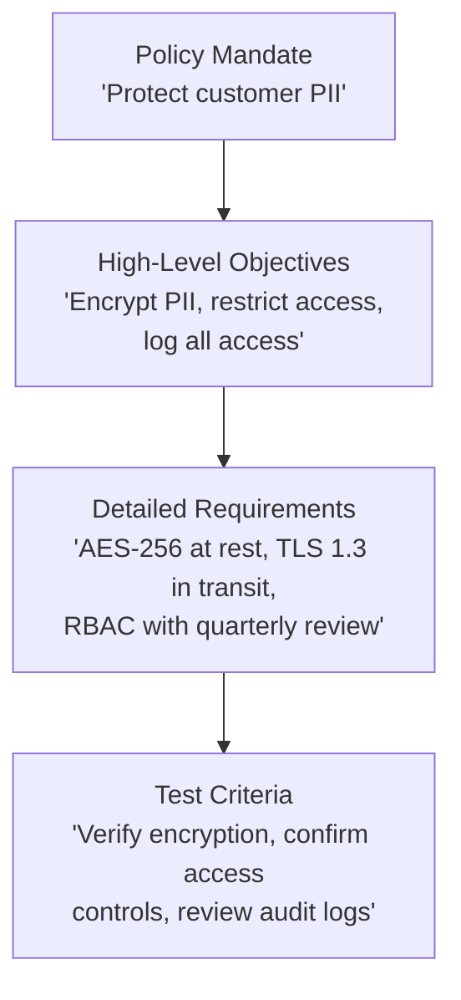

# 3.2 Identify Compliance Requirements

## Learning Objectives

- Identify compliance requirements from regulatory, legal, industry, and company-wide sources
- Understand key regulatory frameworks and their applicability
- Explain intellectual property protections relevant to software
- Describe policy decomposition as a method for deriving detailed security requirements

---

## Compliance Requirement Sources

Compliance requirements originate from four major categories:

### Regulatory Authority

Government-mandated requirements that carry **legal penalties for non-compliance**:

| Regulation | Scope | Key Requirements |
|-----------|-------|-----------------|
| **FISMA** (2002) | U.S. federal agencies | Agency-wide information security programs |
| **GDPR** (2018) | EU data protection | Data subject rights, consent, breach notification (72h) |
| **CCPA** (2018) | California consumer privacy | Consumer rights to know, delete, opt-out |
| **COPPA** (1998) | Children's online privacy | Parental consent for data collection from children under 13 |
| **FedRAMP** | U.S. federal cloud | Standardized cloud security assessment and authorization |

### Legal

| Area | Description |
|------|-------------|
| **Breach notification** | Laws requiring notification after data is compromised |
| **Privacy laws** | Regulations governing personal data protection |
| **Contractual obligations** | Security commitments in vendor/customer agreements |
| **Liability** | Legal responsibility for security failures |

### Industry-Specific

| Industry | Standard/Regulation | Focus |
|----------|-------------------|-------|
| **Defense** | NIST SP 800-171, CMMC | Controlled Unclassified Information (CUI) protection |
| **Healthcare** | HIPAA / HITECH | Protected Health Information (PHI) |
| **Financial** | SOX, GLBA | Financial integrity, consumer financial data privacy |
| **Payment Card** | PCI DSS | Payment card data security; contractual with severe financial penalties |

### Company-Wide

| Category | Examples |
|----------|---------|
| **Development tools** | Approved IDEs, libraries, frameworks |
| **Standards** | Internal coding standards, security baselines |
| **Frameworks** | Adopted security frameworks (ISO 27001, NIST CSF) |
| **Protocols** | Approved communication and encryption protocols |

---

## Intellectual Property

Software involves multiple forms of IP that create compliance obligations:

| IP Type | What It Protects | Key Characteristic |
|---------|-----------------|-------------------|
| **Patent** | Inventions (novel, useful, nonobvious) | Grants exclusive right; requires application and significant resources |
| **Copyright** | Expression of ideas (code, docs, UI) | Prohibits direct copying but does NOT prevent independent reimplementation |
| **Trademark** | Brand identity (product names, logos) | Recognizable quality associated with a product or firm |
| **Trade Secret** | Confidential proprietary information | Protected only as long as secrecy is maintained (e.g., Cola formula, KFC recipe) |
| **Warranty** | Fitness-for-purpose guarantees | Defines vendor obligations for product quality and security |

> **Exam Tip**: Trade secrets are **difficult to use in software** because code can be decompiled or reverse-engineered, making it hard to maintain secrecy.

---

## Security Standards Reference

Standards provide defined, measurable levels of activity:

| Standard | Description |
|----------|-------------|
| **ISO 27001** | ISMS — Requirements for establishing and maintaining security management |
| **ISO/IEC 15408** (Common Criteria) | Product security evaluation (TOE, ST, PP, EAL 1–7) |
| **ISO/IEC 9126** | Software quality: Functionality, Reliability, Usability, Efficiency, Maintainability, Portability |
| **ISO/IEC 12207** | Software lifecycle processes with defined activities and outcomes |
| **ISO/IEC 33001** | Process capability assessment (Levels 0–5) |
| **NIST SP 800 Series** | Federal security guidelines |
| **SAFECode** | Industry-backed software assurance for firms of all sizes |
| **OWASP Top 10** | Most critical web application security risks |
| **NIST FIPS** | Mandatory requirements for federal agencies and contractors |
| **NIST RMF** | Risk Management Framework (Categorize → Select → Implement → Assess → Authorize → Monitor) |

### FISMA and SCAP

- **FISMA** requires each federal agency to implement an agency-wide information security program
- **SCAP** (Security Content Automation Protocol) provides a standardized approach for security measurement and automation

### FedRAMP

The **Federal Risk and Authorization Management Program** provides a standardized approach to security assessment, authorization, and continuous monitoring for **cloud products and services** used by federal agencies. Prior to FedRAMP, individual agencies each managed their own assessment methodologies.

---

## Policy Decomposition

High-level organizational policies must be **decomposed** into detailed, actionable security requirements:

This decomposition is a **crucial step** in requirements gathering — policies without decomposition remain unimplementable aspirations.

---

## Exam Focus Points

1. **Four compliance sources**: Regulatory, Legal, Industry-specific, Company-wide
2. **HIPAA = PHI, SOX = financial integrity, PCI DSS = payment cards, GLBA = financial privacy**
3. **Copyright vs. Patent**: Copyright protects expression; patent protects the process/algorithm
4. **Trade secrets**: Difficult in software due to decompilation risk
5. **FISMA + SCAP**: Federal security program + standardized measurement
6. **FedRAMP**: Cloud-specific security assessment for federal use
7. **Policy decomposition**: Policy → Objectives → Requirements → Test Criteria

---

## Key Terms Glossary

| Term | Definition |
|------|-----------|
| **Compliance** | Adherence to applicable laws, regulations, standards, and policies |
| **FISMA** | Federal Information Security Management Act |
| **FedRAMP** | Federal Risk and Authorization Management Program |
| **SCAP** | Security Content Automation Protocol |
| **PCI DSS** | Payment Card Industry Data Security Standard |
| **SOX** | Sarbanes-Oxley Act — financial reporting integrity |
| **GLBA** | Gramm-Leach-Bliley Act — consumer financial privacy |
| **HIPAA** | Health Insurance Portability and Accountability Act |
| **HITECH** | Health Information Technology for Economic and Clinical Health Act |
| **GDPR** | General Data Protection Regulation (EU) |
| **CCPA** | California Consumer Privacy Act |
| **COPPA** | Children's Online Privacy Protection Act |
| **Patent** | Exclusive right to a novel, useful, nonobvious invention |
| **Copyright** | Protection of the expression of ideas |
| **Trade Secret** | Proprietary information protected through confidentiality |
| **Policy Decomposition** | Breaking policies into actionable security requirements |
