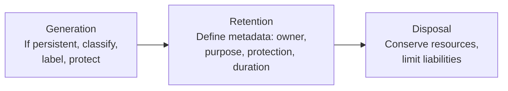

# 3.3 Identify Data Classification Requirements

## Learning Objectives

- Explain data ownership roles and responsibilities
- Describe data labeling by sensitivity and impact
- Differentiate between structured and unstructured data
- Outline the data lifecycle: generation, retention, disposal
- Identify data handling requirements for PII and public information

---

## Data Ownership

Data classification is a **business-driven activity**, not a technical one. Ownership roles define who has authority and responsibility over data.

### Ownership Roles

| Role | Responsibilities |
|------|-----------------|
| **Data/Business Owner** | Classifies data; determines access levels; validates security controls; ensures backup/recovery; may delegate classification |
| **Data Custodian** | Supports business use of data; ensures safe transport, manipulation, and storage; maintains security controls, authorized users, access controls; performs backups, retention, and disposal |
| **Data Steward** | Oversight/governance role; ensures data **quality** and fitness for purpose |
| **System Owner** | Ensures data processed on the system remains secure |

### Data Dictionary

A **data dictionary** documents metadata about data elements — names, types, formats, allowed values, ownership, and classification. It serves as the authoritative reference for understanding what data exists and how it should be handled.

> **Exam Tip**: The **data owner** (a business role, not IT) makes the **classification decision**. The **data custodian** (typically IT operations) **implements** the protections.

---

## Data Labeling

Data labeling assigns **sensitivity levels and impact ratings** to data assets.

### Sensitivity Labeling

Sensitivity defines **who needs access** (need-to-know basis):

| Government Classification | Commercial Equivalent | Description |
|--------------------------|----------------------|-------------|
| Top Secret | Highly Confidential | Unauthorized disclosure would cause exceptionally grave damage |
| Secret | Confidential | Unauthorized disclosure would cause serious damage |
| Confidential | Internal / Sensitive | Unauthorized disclosure would cause damage |
| Unclassified | Public | No damage from disclosure |

### Impact Labeling

Impact assesses the **specific risk associated with data loss**:

| Impact Level | Description | Example |
|-------------|-------------|---------|
| **High** | Severe or catastrophic adverse effect on operations, assets, or individuals | Customer financial records, health records |
| **Medium** | Serious adverse effect | Internal business plans, employee records |
| **Low** | Limited adverse effect | Public marketing materials, public-facing content |

---

## Data Types

| Type | Description | Examples |
|------|-------------|---------|
| **Structured** | Organized with identifiable relationships between data elements; managed via those structures | XML, JSON, database records, log files with defined formats |
| **Unstructured** | No identifiable structure; not easily parsed or searched | Emails, PDFs, Word documents, images, videos |

> **Exam Tip**: The **majority of enterprise data is unstructured**. Even data that appears to have a uniform format (like emails) does not necessarily contain consistent internal structure.

---

## Data Lifecycle

The Information Lifecycle Model (ILM) covers three phases:

### Generation

- If data is persistent, it must be **labeled, classified, and protected** at creation time
- Data classification decisions should be made as close to creation as possible

### Retention

Retained data must have defined metadata:
- **Data owner** — who is responsible
- **Purpose of storage** — why it is being kept
- **Level of protection** — what controls apply
- **Length of storage** — how long it will be retained
- **System logs** are considered important from a **legal/compliance perspective**

### Disposal

- **Conserve resources** by removing data no longer needed
- **Limit liabilities** by not retaining data beyond its required retention period
- Disposal decisions driven by **business purpose** and **compliance requirements**

### Data Lifecycle Management (DLM) vs. Information Lifecycle Management (ILM)

| Aspect | DLM | ILM |
|--------|-----|-----|
| **Focus** | File attributes (type, age) | Content within stored data |
| **Complexity** | Simpler | Handles complex situations |
| **Technology** | HSM (Hierarchical Storage Management) — optimizes retrieval time vs. cost | Content-aware storage management |

**Hierarchical Storage Management (HSM)**: Uses different media simultaneously — frequently accessed data on fast storage (RAID), archived data on optical/tape storage.

---

## Data Handling

### PII (Personally Identifiable Information)

Any information that can be used to **identify, contact, or locate** an individual:
- Full name, address, phone number, email
- Social Security number, passport number
- Biometric data, IP address (in some jurisdictions)
- Financial account information

### Publicly Available Information

Information that is freely accessible and carries **no sensitivity classification**:
- Published annual reports
- Public website content
- Press releases

### Handling Requirements

| Data Type | Handling Requirements |
|-----------|---------------------|
| **PII/PHI** | Encrypt in transit and at rest; strict access controls; audit logging; retention limits |
| **Financial data** | SOX/PCI compliance; integrity controls; separation of duties |
| **Public data** | Integrity controls (prevent defacement); no confidentiality requirement |
| **Internal data** | Access controls based on need-to-know; standard protection measures |

---

## Information Disposal and Media Sanitization

| Method | Description | Assurance Level |
|--------|-------------|----------------|
| **Disposal** | Discarding media without sanitization (not a true sanitization method) | None |
| **Clearing** | Overwriting logical storage with non-sensitive random data | Low — does not guarantee complete erasure |
| **Purging** | Rendering data unrecoverable (degaussing, Secure Erase on ATA) | High |
| **Destroying** | Physical destruction of media | Highest |

**Physical destruction methods**: Disintegration, Pulverization, Shredding, Incineration.

**Degaussing**: Reducing magnetic flux to virtual zero by applying a reverse magnetizing field. **Only works on magnetic media** — not effective on SSDs.

---

## Exam Focus Points

1. **Data owner vs. data custodian**: Owner (business) classifies; Custodian (IT) implements
2. **Data steward**: Ensures data quality and fitness for purpose (governance role)
3. **Structured vs. unstructured**: Most enterprise data is unstructured
4. **ILM phases**: Generation → Retention → Disposal
5. **Sanitization hierarchy**: Disposal < Clearing < Purging < Destroying
6. **Degaussing**: Magnetic media only — does not work on SSDs
7. **HSM**: Optimizes retrieval time vs. cost using different storage tiers
8. **PII handling**: Encrypt, restrict access, log, enforce retention limits

---

## Key Terms Glossary

| Term | Definition |
|------|-----------|
| **Data Owner** | Business role responsible for classifying data and determining access |
| **Data Custodian** | IT role responsible for implementing data protections |
| **Data Steward** | Governance role ensuring data quality and fitness |
| **Data Dictionary** | Authoritative reference documenting metadata about data elements |
| **PII** | Personally Identifiable Information |
| **PHI** | Protected Health Information |
| **ILM** | Information Lifecycle Management |
| **DLM** | Data Lifecycle Management |
| **HSM** | Hierarchical Storage Management |
| **Sanitization** | Removing information from media so recovery is not possible |
| **Degaussing** | Erasing magnetic media by applying a reverse magnetic field |
| **Clearing** | Overwriting media; does not guarantee complete erasure |
| **Purging** | Rendering data unrecoverable |
