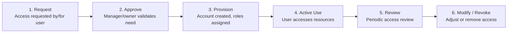
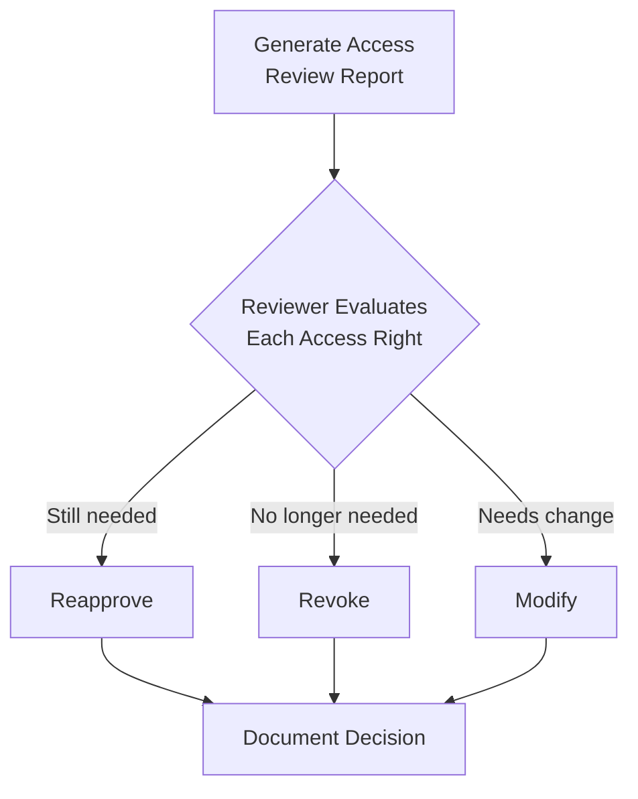

# 3.5 Define Data Access Provisioning

## Learning Objectives

- Describe user provisioning methods and their security implications
- Explain the role of service accounts and their unique risks
- Identify reapproval requirements for access privileges
- Apply the principle of least privilege to access provisioning

---

## User Provisioning

User provisioning is the process of **creating, managing, and revoking user accounts and access rights**. It is a critical security function because improper provisioning leads to excessive access (privilege creep), orphaned accounts, and unauthorized data exposure.

### Provisioning Lifecycle

### Provisioning Methods

| Method | Description | Security Consideration |
|--------|-------------|----------------------|
| **Self-service** | Users request access through a portal; approved by managers/owners | Risk of rubber-stamping; requires strong approval workflows |
| **Automated / Rule-based** | Access granted automatically based on role, department, or attribute | Fast but may over-provision if rules are too broad |
| **Delegated** | Designated administrators provision access for their teams | Risks if delegates lack security awareness |
| **Centralized IAM** | Single identity management system provisions across all applications | Best control and visibility; higher implementation cost |

### Provisioning Principles

| Principle | Description |
|-----------|-------------|
| **Least Privilege** | Grant only the minimum access required for the user's job function |
| **Need-to-Know** | Access limited to information necessary for the current task |
| **Separation of Duties** | No single user should control all aspects of a critical transaction |
| **Dual Control** | Two or more users required to complete a sensitive action |

---

## Service Accounts

Service accounts are **non-interactive accounts** used by applications, services, and automated processes to authenticate and access resources. They present unique security challenges.

### Types of Service Accounts

| Type | Description | Example |
|------|-------------|---------|
| **Application service account** | Used by applications to connect to databases, APIs, or other services | Web app → Database connection |
| **System service account** | Used by operating system services and daemons | Windows Service, Linux daemon |
| **Automated process account** | Used by batch jobs, scripts, and CI/CD pipelines | Deployment pipeline, backup scripts |

### Service Account Security Risks

| Risk | Description |
|------|-------------|
| **Over-privileged** | Service accounts often granted excessive permissions "just in case" |
| **Shared credentials** | Multiple services sharing the same account credentials |
| **Stale accounts** | Service accounts persisting after the application is decommissioned |
| **Static credentials** | Passwords that are never rotated |
| **No MFA** | Service accounts typically cannot use multi-factor authentication |
| **Poor auditing** | Activities may not be attributed to specific processes |

### Service Account Best Practices

| Practice | Description |
|----------|-------------|
| **Unique per service** | Each application or service gets its own account — no sharing |
| **Least privilege** | Grant only the specific permissions the service needs |
| **Password rotation** | Automate regular credential rotation (secrets management tools) |
| **Secrets management** | Store credentials in vaults (HashiCorp Vault, AWS Secrets Manager), not in code |
| **Monitoring** | Alert on anomalous service account activity |
| **Documentation** | Record the purpose, owner, and dependencies for each service account |
| **Lifecycle management** | Decommission service accounts when the associated application is retired |

---

## Reapproval (Access Recertification)

Access recertification is the **periodic review and re-approval** of user access rights to ensure they remain appropriate.

### Why Reapproval Is Necessary

| Issue | Description |
|-------|-------------|
| **Privilege creep** | Users accumulate access as they change roles without losing prior access |
| **Orphaned accounts** | Accounts that remain active after employees leave the organization |
| **Compliance** | Many regulations require periodic access reviews (SOX, HIPAA, PCI DSS) |
| **Insider threat** | Excessive access increases the potential damage from malicious insiders |

### Recertification Process

### Recertification Best Practices

| Practice | Description |
|----------|-------------|
| **Regular cadence** | Quarterly for privileged access; annually for standard access |
| **Manager review** | Direct manager reviews and approves/revokes access for their reports |
| **Owner review** | Resource owners review who has access to their resources |
| **Risk-based frequency** | Higher-risk access reviewed more frequently |
| **Automated tooling** | Use IAM tools to generate review lists and track approvals |
| **Consequences for non-compliance** | Define what happens when reviews are not completed on time |

---

## Exam Focus Points

1. **Least privilege**: Minimum access required for job function
2. **Service account risks**: Over-privileged, shared, stale, static credentials
3. **Secrets management**: Credentials stored in vaults, not code
4. **Privilege creep**: Users accumulate access as roles change
5. **Recertification frequency**: Privileged access quarterly; standard access annually
6. **Separation of duties**: Critical for financial and compliance-sensitive operations
7. **Provisioning lifecycle**: Request → Approve → Provision → Active Use → Review → Modify/Revoke

---

## Key Terms Glossary

| Term | Definition |
|------|-----------|
| **User Provisioning** | Process of creating, managing, and revoking user accounts and access rights |
| **Service Account** | Non-interactive account used by applications and automated processes |
| **Least Privilege** | Granting only the minimum permissions necessary for a task |
| **Need-to-Know** | Access limited to information necessary for the current task |
| **Separation of Duties** | Dividing critical functions so no single person has full control |
| **Dual Control** | Requiring two or more people to complete a sensitive action |
| **Privilege Creep** | Gradual accumulation of unnecessary access rights over time |
| **Access Recertification** | Periodic review and re-approval of access rights |
| **Secrets Management** | Secure storage and rotation of credentials, keys, and tokens |
| **Orphaned Account** | Active account with no current legitimate owner or user |
| **IAM** | Identity and Access Management |
