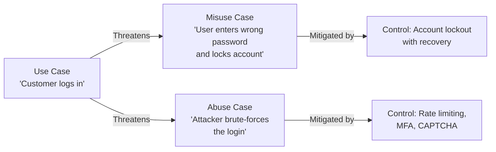

# 3.6 Develop Misuse and Abuse Cases

## Learning Objectives

- Define misuse cases and abuse cases and their role in security requirements
- Explain how misuse cases complement traditional use cases
- Develop misuse and abuse cases for common attack scenarios
- Identify mitigating controls for each misuse/abuse case

---

## Misuse and Abuse Cases

While use cases describe **intended behavior** (what the system should do), misuse and abuse cases describe **unintended and malicious behavior** — what the system should **prevent**.

### Definitions

| Concept | Perspective | Description |
|---------|-------------|-------------|
| **Use Case** | Legitimate user | Describes expected system behavior for valid users |
| **Misuse Case** | Inadvertent actor | Describes **unintentional** negative actions by legitimate users (mistakes, errors) |
| **Abuse Case** | Malicious actor | Describes **intentional** attack actions by threat actors |

### Relationship Between Use Cases and Misuse/Abuse Cases

> **Exam Tip**: Every use case should have at least one corresponding **misuse/abuse case** that identifies what could go wrong, and a **mitigating control** that addresses it.

---

## Developing Misuse and Abuse Cases

### Process

1. **Identify the use case**: Start with a functional requirement / use case
2. **Identify the threat actor**: Who would misuse or abuse this functionality?
3. **Describe the negative scenario**: What unintended or malicious action could occur?
4. **Assess the impact**: What is the consequence of the misuse/abuse?
5. **Define mitigating controls**: What security controls prevent or detect the scenario?

### Misuse Case Template

| Element | Description |
|---------|-------------|
| **Name** | Brief descriptive title |
| **Actor** | The entity performing the misuse (inadvertent user or malicious attacker) |
| **Preconditions** | Conditions that must exist for the misuse to occur |
| **Description** | Step-by-step narrative of the misuse scenario |
| **Impact** | Consequence of the misuse if unmitigated |
| **Mitigating Controls** | Security controls that prevent, detect, or respond to the misuse |

---

## Common Misuse and Abuse Case Examples

### Authentication

| Scenario | Type | Mitigating Controls |
|----------|------|-------------------|
| Brute-force password attack | Abuse | Account lockout, rate limiting, MFA, CAPTCHA |
| Credential stuffing (reuse of leaked credentials) | Abuse | Password breach database checks, MFA |
| User shares password with colleague | Misuse | Awareness training, MFA, behavioral analytics |
| Session hijacking via stolen cookie | Abuse | Secure cookie flags (HttpOnly, Secure, SameSite), session binding |

### Authorization

| Scenario | Type | Mitigating Controls |
|----------|------|-------------------|
| Privilege escalation (accessing admin functions) | Abuse | RBAC enforcement, least privilege, server-side authorization checks |
| Insecure Direct Object Reference (IDOR) | Abuse | Indirect references, authorization checks on every access |
| User accesses data outside their role | Misuse | Access controls, monitoring, periodic access reviews |

### Data Handling

| Scenario | Type | Mitigating Controls |
|----------|------|-------------------|
| SQL injection to extract database | Abuse | Input validation, parameterized queries, WAF |
| User accidentally uploads PII to public folder | Misuse | Data loss prevention (DLP), folder permissions, user training |
| Cross-site scripting (XSS) to steal user data | Abuse | Output encoding, Content Security Policy (CSP) |
| User emails sensitive data to wrong recipient | Misuse | Email encryption, DLP, send-delay features |

### Business Logic

| Scenario | Type | Mitigating Controls |
|----------|------|-------------------|
| Bypassing payment workflow | Abuse | Server-side validation of transaction flow, integrity checks |
| Manipulating price parameters in requests | Abuse | Server-side price validation, integrity checks |
| Mass registration by bots | Abuse | CAPTCHA, rate limiting, email verification |

---

## Evil User Stories (Agile Context)

In Agile environments, misuse/abuse cases are often written as **evil user stories** — user stories from the attacker's perspective:

| Format | Example |
|--------|---------|
| **Standard format** | "As a [threat actor], I want to [attack action] so that [malicious goal]" |
| **Example 1** | "As a hacker, I want to perform SQL injection on the login form so that I can bypass authentication" |
| **Example 2** | "As a disgruntled employee, I want to exfiltrate customer data so that I can sell it to competitors" |
| **Example 3** | "As a bot operator, I want to create thousands of fake accounts so that I can spam users" |

Each evil user story should have a **corresponding security story** that defines the mitigating control:

> "As a developer, I want to implement parameterized queries so that SQL injection attacks are prevented."

---

## Exam Focus Points

1. **Misuse vs. Abuse**: Misuse = unintentional; Abuse = intentional/malicious
2. **Misuse cases complement use cases**: Every use case should have a corresponding negative scenario
3. **Mitigating controls**: Each misuse/abuse case must include specific countermeasures
4. **Evil user stories**: Agile technique for capturing misuse/abuse cases in sprint planning
5. **Process**: Use case → Threat actor → Negative scenario → Impact → Mitigating controls

---

## Key Terms Glossary

| Term | Definition |
|------|-----------|
| **Use Case** | Description of expected system behavior for legitimate users |
| **Misuse Case** | Description of unintentional negative actions by legitimate users |
| **Abuse Case** | Description of intentional malicious actions by threat actors |
| **Evil User Story** | Agile user story written from an attacker's perspective |
| **Mitigating Control** | Security measure that prevents, detects, or responds to a misuse/abuse scenario |
| **IDOR** | Insecure Direct Object Reference — accessing objects without proper authorization |
| **Credential Stuffing** | Using leaked credentials from one service to attempt login on another |
| **DLP** | Data Loss Prevention — technology to prevent unauthorized data exfiltration |
