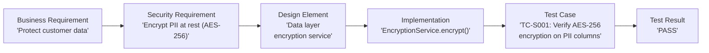

# 3.7 Develop Security Requirement Traceability Matrix (SRTM)

## Learning Objectives

- Explain the purpose and structure of a Security Requirements Traceability Matrix
- Describe how the SRTM links business requirements to security requirements, design, implementation, and testing
- Demonstrate how the SRTM supports verification and validation
- Identify the benefits and challenges of maintaining traceability

---

## What is a Security Requirements Traceability Matrix?

A Security Requirements Traceability Matrix (SRTM) is a **structured document** that maps each security requirement from its origin (business need, regulation, or policy) through its implementation and testing. It provides **bidirectional traceability** — from requirements forward to tests, and from tests backward to requirements.

### Why Traceability Matters

| Benefit | Description |
|---------|-------------|
| **Completeness assurance** | Verify that every security requirement has been implemented and tested |
| **Change impact analysis** | Determine which tests and implementations are affected when a requirement changes |
| **Gap identification** | Identify requirements without implementations or tests |
| **Audit readiness** | Demonstrate to auditors that security requirements are systematically addressed |
| **V&V support** | Provides evidence for verification (built correctly) and validation (correct product) |

---

## SRTM Structure

### Core Columns

| Column | Description |
|--------|-------------|
| **Req ID** | Unique identifier for each security requirement |
| **Business Requirement** | The originating business need, regulation, or policy |
| **Security Requirement** | The specific security requirement derived from the business requirement |
| **Design Element** | The architectural or design component that addresses the requirement |
| **Implementation** | The code module, function, or configuration that implements the requirement |
| **Test Case ID** | The specific test case(s) that verify the requirement is met |
| **Test Result** | Pass/Fail/Pending status of the associated test case(s) |
| **Status** | Current status (Defined, In Progress, Implemented, Verified, Closed) |

### Example SRTM

| Req ID | Business Req | Security Req | Design | Implementation | Test Case | Result | Status |
|--------|-------------|-------------|--------|---------------|-----------|--------|--------|
| SR-001 | Protect customer PII | Encrypt PII at rest using AES-256 | Data layer encryption service | `EncryptionService.encrypt()` | TC-S001 | Pass | Verified |
| SR-002 | GDPR compliance | Implement right to erasure | User data management module | `UserService.deleteAllData()` | TC-S002 | Pass | Verified |
| SR-003 | Prevent unauthorized access | Enforce MFA for admin accounts | Authentication module | `AuthService.enforceMFA()` | TC-S003 | Pending | In Progress |
| SR-004 | PCI DSS compliance | Log all access to cardholder data | Audit logging service | `AuditLogger.logAccess()` | TC-S004 | Pass | Verified |

### Traceability Flow

---

## Types of Traceability

| Type | Direction | Purpose |
|------|-----------|---------|
| **Forward traceability** | Requirements → Test | Ensure every requirement has a test |
| **Backward traceability** | Test → Requirements | Ensure every test maps to a requirement (no unnecessary tests) |
| **Bidirectional traceability** | Both directions | Complete coverage in both directions (recommended) |

### Forward Traceability Questions

- Has every security requirement been assigned to a design element?
- Has every design element been implemented?
- Has every implementation been tested?
- Are there any gaps in coverage?

### Backward Traceability Questions

- Does every test case trace back to a security requirement?
- Does every implementation trace back to a design element?
- Are there implementations or tests with no originating requirement? (potential gold plating)

---

## Maintaining the SRTM

| Practice | Description |
|----------|-------------|
| **Living document** | Update the SRTM as requirements change throughout the SDLC |
| **Tooling** | Use requirements management tools (Jira, Azure DevOps, IBM DOORS) for automated tracking |
| **Version control** | Maintain revision history of the SRTM |
| **Regular reviews** | Review the SRTM at each phase gate / security gate |
| **Gap analysis** | Periodically scan for requirements without tests or implementations |

---

## Exam Focus Points

1. **SRTM purpose**: Maps security requirements from business need through implementation to test
2. **Bidirectional traceability**: Forward (requirement → test) and backward (test → requirement)
3. **Completeness**: Every requirement must have a corresponding implementation and test
4. **Gap identification**: SRTM reveals requirements without implementations or test coverage
5. **Living document**: Updated continuously through the SDLC, not created once and forgotten
6. **Audit support**: Demonstrates systematic security requirement coverage to auditors

---

## Key Terms Glossary

| Term | Definition |
|------|-----------|
| **SRTM** | Security Requirements Traceability Matrix |
| **Forward Traceability** | Mapping from requirements to tests |
| **Backward Traceability** | Mapping from tests to requirements |
| **Bidirectional Traceability** | Mapping in both directions for complete coverage |
| **Gap Analysis** | Identifying requirements without corresponding implementations or tests |
| **Gold Plating** | Adding unrequested features or tests that do not map to any requirement |
