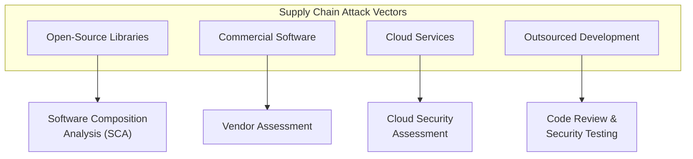

# 3.8 Define Third-Party Vendor Security Requirements

## Learning Objectives

- Identify security requirements for third-party software and services
- Explain supply chain risk management for software
- Describe the role of SBOMs in managing third-party risk
- Define contractual security requirements for vendor relationships

---

## Supply Chain Security

Modern software relies heavily on **third-party components** — open-source libraries, commercial software, cloud services, and outsourced development. Each link in the supply chain introduces potential security risks that must be managed.

### Software Supply Chain Risks

| Risk | Description |
|------|-------------|
| **Vulnerable components** | Third-party libraries with known CVEs |
| **Malicious components** | Intentionally compromised libraries (dependency confusion, typosquatting) |
| **Abandoned projects** | Open-source libraries no longer maintained or patched |
| **License violations** | Using components with incompatible licenses |
| **Insider threats** | Compromised developers injecting malicious code into upstream projects |
| **Build process compromise** | Attackers targeting CI/CD pipelines of upstream suppliers (e.g., SolarWinds) |

---

## Software Bill of Materials (SBOM)

An SBOM is a **comprehensive inventory** of all components, libraries, and modules that make up a software application — analogous to an ingredient list on food packaging.

### SBOM Contents

| Element | Description |
|---------|-------------|
| **Component name** | Name of each dependency |
| **Version** | Specific version in use |
| **Supplier** | Who publishes or maintains the component |
| **License** | License type (MIT, Apache, GPL, etc.) |
| **Dependencies** | Transitive dependencies (dependencies of dependencies) |
| **Hashes** | Cryptographic hashes for integrity verification |

### SBOM Formats

| Format | Description |
|--------|-------------|
| **SPDX** (Software Package Data Exchange) | Linux Foundation standard; ISO/IEC 5962:2021 |
| **CycloneDX** | OWASP standard focused on security use cases |
| **SWID** (Software Identification Tags) | ISO/IEC 19770-2 — software identification |

### SBOM Benefits

| Benefit | Description |
|---------|-------------|
| **Vulnerability management** | Quickly identify if a known CVE (e.g., Log4Shell) affects your software |
| **License compliance** | Ensure all components have compatible licenses |
| **Incident response** | Rapidly determine blast radius when a dependency is compromised |
| **Regulatory compliance** | US Executive Order 14028 requires SBOMs for federal software |

---

## Vendor Security Assessment

Before integrating third-party software or services, organizations must assess the vendor's security posture.

### Assessment Methods

| Method | Description |
|--------|-------------|
| **Security questionnaires** | Standardized questions about vendor security practices (e.g., SIG, CAIQ) |
| **SOC 2 reports** | Independent audit of vendor security controls (Type I = design; Type II = effectiveness over time) |
| **ISO 27001 certification** | Vendor maintains a certified ISMS |
| **Penetration test results** | Evidence of security testing on vendor products |
| **Right to audit** | Contractual right to perform independent security audits of the vendor |
| **SCA scan results** | Results from scanning vendor-provided software for known vulnerabilities |

### SOC Reports

| Report | Scope | Audience |
|--------|-------|----------|
| **SOC 1** | Financial reporting controls | Auditors, management |
| **SOC 2 Type I** | Security control design at a point in time | Customers, regulators |
| **SOC 2 Type II** | Security control effectiveness over a period (typically 6–12 months) | Customers, regulators |
| **SOC 3** | General-use summary (public-facing) | Public |

> **Exam Tip**: **SOC 2 Type II** is the most valuable for security assessment because it demonstrates that controls were **operating effectively over time**, not just designed correctly at a single point.

---

## Contractual Security Requirements

Security requirements must be **embedded in contracts** with third-party vendors to create legal obligations.

### Key Contractual Elements

| Element | Description |
|---------|-------------|
| **Security requirements** | Specific controls the vendor must implement (encryption standards, access controls) |
| **Patch management** | Vendor obligations for timely security patch delivery |
| **Breach notification** | Requirements for notifying the customer of security incidents |
| **Data handling** | How the vendor will protect, retain, and dispose of customer data |
| **Right to audit** | Customer's right to assess vendor security controls |
| **Liability and indemnification** | Financial responsibility for security breaches |
| **SLAs** | Performance and availability commitments with penalties |
| **Termination** | Data return/destruction procedures upon contract end |
| **Subcontractor requirements** | Security requirements that flow down to the vendor's subcontractors |
| **Code escrow** | Source code held by a third party for contingency access (vendor failure) |

### Service Level Agreements (SLAs)

| Element | Example |
|---------|---------|
| **Availability** | 99.9% uptime |
| **Incident response** | Critical incidents responded to within 1 hour |
| **Patch delivery** | Critical patches delivered within 24 hours of vulnerability disclosure |
| **Backup and recovery** | Daily backups, RTO of 4 hours, RPO of 1 hour |
| **Penalties** | Service credits or financial penalties for SLA violations |

---

## Software Composition Analysis (SCA)

SCA tools automatically **identify and inventory third-party components** and their known vulnerabilities:

| Capability | Description |
|-----------|-------------|
| **Dependency identification** | Discover all direct and transitive dependencies |
| **CVE matching** | Match components against vulnerability databases (NVD, vendor advisories) |
| **License detection** | Identify component licenses and flag compatibility issues |
| **Policy enforcement** | Block builds that include banned or vulnerable components |
| **SBOM generation** | Automatically produce SBOMs in standard formats |

---

## Exam Focus Points

1. **SBOM**: Inventory of all software components — analogous to food ingredient list
2. **SCA**: Automated tool for identifying vulnerable third-party components
3. **SOC 2 Type II**: Demonstrates control effectiveness over time (most valuable for security assessment)
4. **Supply chain attacks**: SolarWinds, Log4Shell — know the attack patterns
5. **Right to audit**: Contractual right to independently assess vendor security
6. **Code escrow**: Source code held by third party for contingency
7. **Transitive dependencies**: Dependencies of your dependencies — often the source of hidden risk
8. **License compliance**: Not just a legal issue — incompatible licenses can force code removal

---

## Key Terms Glossary

| Term | Definition |
|------|-----------|
| **SBOM** | Software Bill of Materials — inventory of all software components |
| **SCA** | Software Composition Analysis — tool for identifying third-party vulnerabilities |
| **SOC 2** | Service Organization Control Type 2 — independent audit of security control effectiveness |
| **CVE** | Common Vulnerabilities and Exposures — standardized vulnerability identifiers |
| **NVD** | National Vulnerability Database |
| **SPDX** | Software Package Data Exchange — SBOM format standard |
| **CycloneDX** | OWASP SBOM standard focused on security |
| **SWID** | Software Identification Tags — ISO standard for software identification |
| **SLA** | Service Level Agreement |
| **Code Escrow** | Source code held by a third party for contingency access |
| **Right to Audit** | Contractual right to independently assess vendor security |
| **Transitive Dependency** | A dependency of a dependency (indirect dependency) |
| **Typosquatting** | Registering package names similar to popular packages to distribute malware |
| **Dependency Confusion** | Attack exploiting package manager resolution to inject malicious packages |
