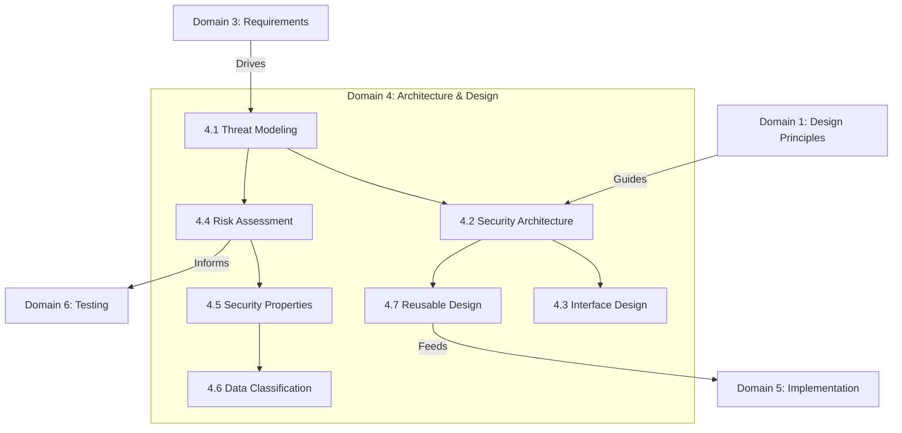

# Domain 4: Secure Software Architecture & Design (14%)

## Domain Overview

Domain 4 covers **how to design and architect secure software**. It is the highest-weighted domain at 14% and bridges the gap between security requirements (Domain 3) and secure implementation (Domain 5). Topics range from attack surface evaluation and threat modeling to secure design patterns, technologies, and architecture documentation.

This domain carries **14% of the exam weight** and contains **7 major sections**:

| Section | Title | Focus |
|---------|-------|-------|
| 4.1 | Perform Threat Modeling | STRIDE, DREAD, attack trees, data flow diagrams |
| 4.2 | Define the Security Architecture | Security controls, secure defaults, isolation, trust boundaries |
| 4.3 | Performing Secure Interface Design | API security, input validation, contract design |
| 4.4 | Performing Architectural Risk Assessment | Attack surface evaluation, risk ranking |
| 4.5 | Model (Non-Functional) Security Properties and Constraints | Confidentiality, integrity, availability, authentication, authorization properties at architecture level |
| 4.6 | Model and Classify Data | Data modeling, classification in design |
| 4.7 | Evaluate and Select Reusable Secure Design | Frameworks, platforms, secure design patterns |

## Learning Objectives

After completing this domain, you should be able to:

- Perform threat modeling using STRIDE, DREAD, and attack trees
- Design security architectures with appropriate security controls
- Design secure interfaces and APIs
- Evaluate and reduce attack surfaces
- Model security properties and data classification at the architecture level
- Select secure design patterns and reusable frameworks

## Key Relationships

## Study Tips

> **Exam Focus**: At **14%**, this is the **highest-weighted domain**. Threat modeling (STRIDE/DREAD), attack surface analysis, and secure design patterns are heavily tested. Expect scenario-based questions asking you to identify the correct threat category or design pattern.

- **STRIDE** maps to CIA+AuthN+AuthZ+Nonrepudiation — memorize the mappings
- **DREAD** is a risk rating model — know each component
- Understand DFDs for threat modeling: processes, data stores, data flows, trust boundaries
- Know the difference between **trust boundaries** and **security domains**
- **Secure design patterns** (e.g., input validation, exception management) are frequently tested

## Files in This Section

| File | Content |
|------|---------|
| [4.1_threat_modeling.md](4.1_threat_modeling.md) | STRIDE, DREAD, attack trees, DFDs, threat modeling process |
| [4.2_security_architecture.md](4.2_security_architecture.md) | Security controls, secure defaults, trust boundaries, isolation |
| [4.3_secure_interface_design.md](4.3_secure_interface_design.md) | API security, input validation, secure contracts |
| [4.4_architectural_risk_assessment.md](4.4_architectural_risk_assessment.md) | Attack surface evaluation, risk ranking |
| [4.5_security_properties_constraints.md](4.5_security_properties_constraints.md) | Non-functional security properties at architecture level |
| [4.6_data_modeling_classification.md](4.6_data_modeling_classification.md) | Data modeling and classification in design |
| [4.7_reusable_secure_design.md](4.7_reusable_secure_design.md) | Design patterns, frameworks, platform selection |
