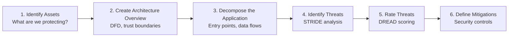
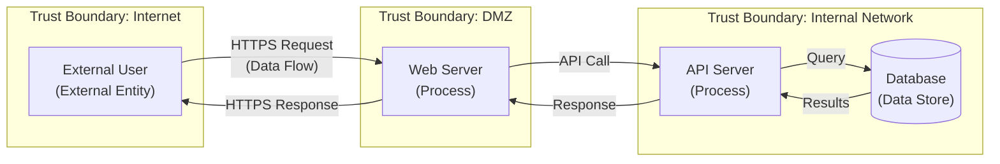
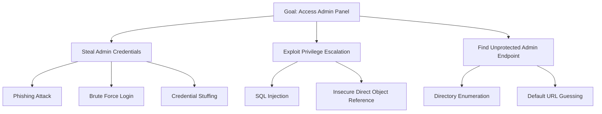

# 4.1 Perform Threat Modeling

## Learning Objectives

- Explain the purpose and process of threat modeling
- Apply STRIDE to classify threats
- Use DREAD to rate threat severity
- Construct attack trees and data flow diagrams for threat analysis
- Describe threat modeling methodologies (PASTA, VAST)

---

## What is Threat Modeling?

Threat modeling is a **structured process** for identifying, classifying, and prioritizing potential threats to a software system. It is performed during the **design phase** of the SDLC and should be updated throughout the lifecycle.

### When to Perform Threat Modeling

| Timing | Activity |
|--------|----------|
| **Design phase** | Initial comprehensive threat model |
| **Architecture changes** | Update when significant design changes occur |
| **New feature addition** | Threat model the new feature and its interactions |
| **Incident response** | Review and update the threat model after a security incident |
| **Periodic review** | Regular reviews (at least annually) to address evolving threats |

### Threat Modeling Process

---

## STRIDE Threat Classification

**STRIDE** is a **mnemonic threat classification model** developed by Microsoft. Each letter represents a category of threat, and each maps to a specific security property:

| Threat | Security Property Violated | Description | Example |
|--------|---------------------------|-------------|---------|
| **S**poofing | Authentication | Pretending to be something or someone else | Forging authentication tokens |
| **T**ampering | Integrity | Modifying data or code without authorization | Altering database records, modifying config files |
| **R**epudiation | Nonrepudiation | Denying having performed an action | Claiming not to have made a purchase |
| **I**nformation Disclosure | Confidentiality | Exposing information to unauthorized parties | Error messages revealing stack traces |
| **D**enial of Service | Availability | Making a system unavailable or degraded | Flooding a server with requests |
| **E**levation of Privilege | Authorization | Gaining capabilities without proper authorization | Exploiting a vulnerability to gain admin access |

### STRIDE-per-Element

When applying STRIDE to a DFD, certain threats apply to certain element types:

| DFD Element | S | T | R | I | D | E |
|-------------|:-:|:-:|:-:|:-:|:-:|:-:|
| **External Entity** | ✓ | | ✓ | | | |
| **Process** | ✓ | ✓ | ✓ | ✓ | ✓ | ✓ |
| **Data Store** | | ✓ | ✓ | ✓ | ✓ | |
| **Data Flow** | | ✓ | | ✓ | ✓ | |

> **Exam Tip**: Only **processes** are susceptible to all six STRIDE categories. Data stores and data flows are **not** susceptible to spoofing or elevation of privilege.

---

## DREAD Risk Rating

**DREAD** is a risk rating model used to **prioritize identified threats**. Each factor is scored (typically 1–3 or 1–10) and the scores are averaged:

| Factor | Question |
|--------|----------|
| **D**amage Potential | How bad would it be if the attack succeeded? |
| **R**eproducibility | How easy is it to reproduce the attack? |
| **E**xploitability | How much effort/expertise is required to exploit? |
| **A**ffected Users | How many users would be impacted? |
| **D**iscoverability | How easy is it for an attacker to discover the vulnerability? |

### DREAD Scoring Example

| Threat | Damage | Reproducibility | Exploitability | Affected Users | Discoverability | **Average** |
|--------|:------:|:---------------:|:--------------:|:--------------:|:---------------:|:----------:|
| SQL Injection on login | 3 | 3 | 2 | 3 | 3 | **2.8** |
| XSS on comment field | 2 | 3 | 2 | 2 | 2 | **2.2** |
| DDoS on API endpoint | 2 | 1 | 1 | 3 | 2 | **1.8** |

Higher average = higher priority for mitigation.

---

## Data Flow Diagrams (DFDs)

DFDs are the **foundational artifact** for threat modeling. They visualize how data moves through the system and identify trust boundaries.

### DFD Elements

| Element | Symbol | Description |
|---------|--------|-------------|
| **External Entity** | Rectangle | User, external system, or service outside the system boundary |
| **Process** | Circle/Rounded rectangle | Code or service that transforms or processes data |
| **Data Store** | Parallel lines | Database, file, queue, or other data repository |
| **Data Flow** | Arrow | Movement of data between elements |
| **Trust Boundary** | Dashed line | Boundary between different trust levels (e.g., internet vs. internal network) |

### DFD Levels

| Level | Detail |
|-------|--------|
| **Level 0** (Context Diagram) | Shows the system as a single process with external entities |
| **Level 1** | Decomposes the system into major subsystems/components |
| **Level 2** | Further decomposes individual subsystems into detailed processes |

---

## Attack Trees

Attack trees provide a **structured, hierarchical representation** of potential attacks against a system. The root node represents the attacker's goal, and leaf nodes represent individual steps or conditions needed to achieve that goal.

**Key concepts:**
- **AND nodes**: All child conditions must be true for the parent to be achieved
- **OR nodes**: Any child condition being true achieves the parent (default)
- Attack trees help identify the **cheapest or easiest** attack paths

---

## Other Threat Modeling Methodologies

### PASTA (Process for Attack Simulation and Threat Analysis)

A **seven-stage, risk-centric** threat modeling methodology:

| Stage | Activity |
|-------|----------|
| 1. Define Objectives | Business impact analysis, security requirements |
| 2. Define Technical Scope | Architecture analysis, technology profiling |
| 3. Application Decomposition | DFDs, trust boundaries, entry points |
| 4. Threat Analysis | Threat intelligence, attack library |
| 5. Vulnerability Analysis | Vulnerability correlation to threat scenarios |
| 6. Attack Modeling | Attack tree development, simulation |
| 7. Risk and Impact Analysis | Residual risk analysis, countermeasure identification |

### VAST (Visual, Agile, and Simple Threat)

Designed for **Agile environments** and scales across the enterprise:
- **Application threat models**: Use process-flow diagrams for developers
- **Operational threat models**: Use DFDs for infrastructure teams
- Integrates into Agile sprints and CI/CD pipelines

---

## Exam Focus Points

1. **STRIDE components**: Spoofing, Tampering, Repudiation, Info Disclosure, DoS, Elevation of Privilege
2. **STRIDE-to-security-property mapping**: S→AuthN, T→Integrity, R→Nonrepudiation, I→Confidentiality, D→Availability, E→AuthZ
3. **STRIDE-per-element**: Only processes are vulnerable to all six categories
4. **DREAD**: Damage, Reproducibility, Exploitability, Affected Users, Discoverability
5. **DFD elements**: External entities, processes, data stores, data flows, trust boundaries
6. **Attack trees**: Root = goal, leaves = attack steps, AND/OR relationships
7. **Threat modeling timing**: Design phase, updated with changes

---

## Key Terms Glossary

| Term | Definition |
|------|-----------|
| **Threat Modeling** | Structured process for identifying and prioritizing threats to a system |
| **STRIDE** | Threat classification model: Spoofing, Tampering, Repudiation, Information Disclosure, DoS, Elevation of Privilege |
| **DREAD** | Risk rating model: Damage, Reproducibility, Exploitability, Affected Users, Discoverability |
| **DFD** | Data Flow Diagram — visual representation of data movement through a system |
| **Trust Boundary** | Line separating different trust levels in a system architecture |
| **Attack Tree** | Hierarchical diagram showing paths to achieving an attack goal |
| **PASTA** | Process for Attack Simulation and Threat Analysis — seven-stage risk-centric methodology |
| **VAST** | Visual, Agile, Simple Threat — Agile-compatible threat modeling methodology |
