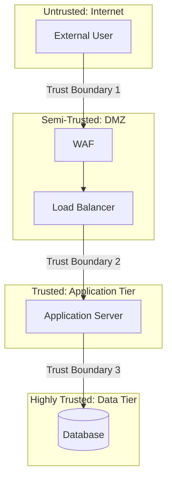

# 4.2 Define the Security Architecture

## Learning Objectives

- Describe security architecture principles and their application
- Explain security controls and their role in the architecture
- Define trust boundaries and security domains
- Apply secure defaults, fail-secure, and isolation principles
- Understand the Trusted Computing Base (TCB) and reference monitor

---

## Security Architecture Fundamentals

Security architecture defines **how security controls are structured, positioned, and integrated** within the overall system architecture. It translates security requirements into architectural decisions.

### Security Architecture Components

| Component | Description |
|-----------|-------------|
| **Security domains** | Logical groupings of resources with the same security requirements |
| **Trust boundaries** | Lines separating different security domains or trust levels |
| **Security controls** | Mechanisms that enforce security policies |
| **Security services** | Shared services providing security capabilities (AuthN, AuthZ, logging) |
| **Security zones** | Network segments with defined security policies |

---

## Core Architecture Principles

### Secure Defaults

Systems should be **secure in their default configuration**. Users who accept all defaults should end up with a secure system.

| Principle | Application |
|-----------|------------|
| **Deny by default** | Deny all access unless explicitly granted |
| **Minimum features enabled** | Enable only essential features; disable everything else |
| **Strong default settings** | Use strong encryption, long session timeouts, MFA enabled |
| **No default credentials** | Force credential change on first use |

### Fail-Secure (Fail-Closed)

When a system encounters an error or failure, it should **default to a secure state** rather than an open one.

| Failure Mode | Description | Example |
|-------------|-------------|---------|
| **Fail-secure (Fail-closed)** | System denies access on failure | Firewall drops all traffic if it crashes |
| **Fail-open** | System allows access on failure | Door unlocks during power outage (fire safety) |

> **Exam Tip**: Fail-secure is the **default for security systems**. Fail-open is used only when safety (life safety) takes precedence over security.

### Complete Mediation

**Every access request** must be checked against access controls — no bypass, no caching of authorization decisions without proper validation.

### Economy of Mechanism

Security mechanisms should be **as simple as possible**. Complex mechanisms are more likely to contain errors and are harder to verify.

### Least Common Mechanism

Minimize shared mechanisms between users. Shared resources create potential channels for information leakage or interference.

### Separation of Privilege

Require **multiple conditions** to be met before granting access. This is the principle behind MFA and separation of duties.

### Least Privilege

Grant only the **minimum permissions** necessary for a task. This limits the blast radius of any compromise.

---

## Trust Boundaries and Security Domains

### Trust Boundaries

A trust boundary exists where the **level of trust changes** between components or networks:

### Key Rules at Trust Boundaries

| Rule | Description |
|------|-------------|
| **Validate all input** | Data crossing a trust boundary must be validated, sanitized, and canonicalized |
| **Authenticate requests** | Verify identity at each trust boundary crossing |
| **Encrypt in transit** | Protect data as it crosses trust boundaries |
| **Log boundary crossings** | Record and monitor trust boundary traversals |
| **Minimize boundary crossings** | Reduce the number of trust boundary transitions |

---

## Isolation and Compartmentalization

| Concept | Description |
|---------|-------------|
| **Process isolation** | Each process runs in its own memory space; one process cannot access another's memory |
| **Sandboxing** | Executing code in a restricted environment with limited access to system resources |
| **Containerization** | Packaging applications with their dependencies; isolated from the host and other containers |
| **Virtualization** | Multiple VMs on a single physical host, each isolated by the hypervisor |
| **Microservices** | Decomposing applications into small, independently deployable services |
| **Network segmentation** | Dividing networks into segments with controlled access between them |

---

## Trusted Computing Base (TCB) and Reference Monitor

### Trusted Computing Base (TCB)

The TCB is the **totality of security mechanisms** within a computing system that enforce the security policy:
- Hardware, firmware, and software that are trusted to enforce security
- If any part of the TCB is compromised, the entire security policy is compromised
- The TCB should be as **small as possible** (economy of mechanism)

### Reference Monitor

The reference monitor is an **abstract concept** that mediates all access from subjects to objects:

| Property | Description |
|----------|-------------|
| **Always invoked** | Cannot be bypassed — every access goes through it (complete mediation) |
| **Tamper-proof** | Cannot be altered by unauthorized entities |
| **Small enough to verify** | Simple enough to be formally verified for correctness |

The **security kernel** is the hardware, firmware, and software implementation of the reference monitor concept.

---

## Security Models

| Model | Focus | Rule |
|-------|-------|------|
| **Bell-LaPadula (BLP)** | Confidentiality | No read up (simple security), No write down (star property) |
| **Biba** | Integrity | No read down (simple integrity), No write up (star integrity) |
| **Clark-Wilson** | Integrity (commercial) | Well-formed transactions through access triple: User → Program (TP) → Data (CDI) |
| **Brewer-Nash (Chinese Wall)** | Conflict of interest | Prevents access to resources that create a conflict of interest |

> **Exam Tip**: BLP = **Confidentiality** (no read up, no write down). Biba = **Integrity** (no read down, no write up). They are **inversions** of each other.

---

## Exam Focus Points

1. **Secure defaults**: Deny by default, minimum features, no default credentials
2. **Fail-secure vs. fail-open**: Fail-secure = deny on failure (default for security systems)
3. **Complete mediation**: Every access checked — no bypass
4. **Trust boundaries**: Input validation, authentication, encryption at every crossing
5. **TCB**: Total security mechanisms; must be small and verified
6. **Reference monitor**: Always invoked, tamper-proof, verifiable
7. **BLP vs. Biba**: BLP = confidentiality (no read up); Biba = integrity (no read down)
8. **Clark-Wilson**: Well-formed transactions, access triple (User → TP → CDI)

---

## Key Terms Glossary

| Term | Definition |
|------|-----------|
| **Security Architecture** | Structure and integration of security controls within a system |
| **Trust Boundary** | Boundary between different trust levels in a system |
| **Security Domain** | Logical grouping of resources with the same security requirements |
| **Fail-Secure** | Defaulting to a secure state upon failure |
| **Complete Mediation** | Checking every access request against access controls |
| **TCB** | Trusted Computing Base — all mechanisms enforcing security policy |
| **Reference Monitor** | Abstract concept mediating all subject-to-object access |
| **Security Kernel** | Implementation of the reference monitor |
| **BLP** | Bell-LaPadula model — enforces confidentiality |
| **Biba** | Biba model — enforces integrity |
| **Clark-Wilson** | Commercial integrity model using well-formed transactions |
| **Sandboxing** | Executing code in a restricted environment |
