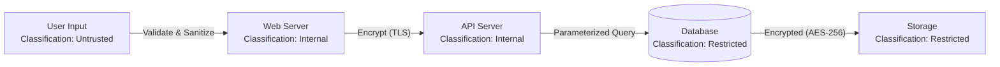

# 4.6 Model and Classify Data

## Learning Objectives

- Apply data classification to architectural design decisions
- Explain data modeling techniques for security
- Describe data flow analysis and its role in identifying security requirements
- Define data protection controls based on classification

---

## Data Modeling for Security

Data modeling in the security context identifies **what data exists, where it flows, how it is stored, and what protections it requires** based on its classification.

### Data Inventory

| Element | Description |
|---------|-------------|
| **Data element** | Specific data item (e.g., customer_name, SSN, credit_card_number) |
| **Classification** | Sensitivity level (public, internal, confidential, restricted) |
| **Owner** | Business stakeholder responsible for the data |
| **Location** | Where the data is stored (database, file system, cloud) |
| **Protection** | Required security controls based on classification |
| **Retention** | How long the data must be kept |

### Entity-Relationship (ER) Modeling for Security

ER models describe the **relationships between data entities**. From a security perspective:
- Identify which entities contain **sensitive data**
- Map relationships to understand **data exposure** through associated entities
- Determine which relationships require **access controls**
- Identify **cascading risks** — compromise of one entity exposing related entities

---

## Data Flow Analysis

Data flow analysis maps **how data moves through the system** to identify points where security controls are needed:

### Security Controls Along Data Flows

| Data Flow Point | Security Control |
|----------------|-----------------|
| **Data entry** | Input validation, canonicalization, content type enforcement |
| **Processing** | Access controls, integrity checks, error handling |
| **Storage** | Encryption at rest, access controls, backup encryption |
| **Transmission** | Encryption in transit (TLS), mutual authentication |
| **Display** | Output encoding, data masking, access-based filtering |
| **Disposal** | Secure deletion, media sanitization |

---

## Classification-Based Protection Controls

| Classification | Access Control | Encryption | Logging | Disposal |
|---------------|---------------|-----------|---------|----------|
| **Public** | None | Optional | Basic | Standard |
| **Internal** | Role-based | Recommended | Standard | Clearing |
| **Confidential** | Need-to-know | Required (transit + rest) | Detailed | Purging |
| **Restricted** | MFA + need-to-know | Required (transit + rest + backup) | Full audit trail | Destroying |

---

## Data Residency and Sovereignty

Architectural decisions must account for **where data is stored** relative to jurisdictional requirements:

| Consideration | Description |
|--------------|-------------|
| **Data residency** | Requirements that data be stored within specific geography |
| **Data sovereignty** | Data is subject to the laws of the country where it is stored |
| **Cloud region selection** | Choose cloud regions that satisfy regulatory requirements |
| **Multi-region replication** | Replicating data across regions may violate residency requirements |

---

## Exam Focus Points

1. **Data classification drives controls**: Protection level must match classification level
2. **Data flow analysis**: Identify where security controls are needed along data paths
3. **Classification-based controls**: Know what access control, encryption, logging, and disposal each level requires
4. **Data residency**: Architectural decisions must account for jurisdictional requirements
5. **Data inventory**: Catalog all data elements with classification, owner, location, and protection

---

## Key Terms Glossary

| Term | Definition |
|------|-----------|
| **Data Modeling** | Process of identifying and documenting data elements and their relationships |
| **Data Flow Analysis** | Mapping how data moves through a system to identify security requirements |
| **Data Classification** | Categorizing data by sensitivity level to determine protection requirements |
| **Data Residency** | Requirement to store data within a specific geographic location |
| **Data Sovereignty** | Data is subject to the laws of the country where it is located |
| **ER Model** | Entity-Relationship Model — visual representation of data entities and relationships |
