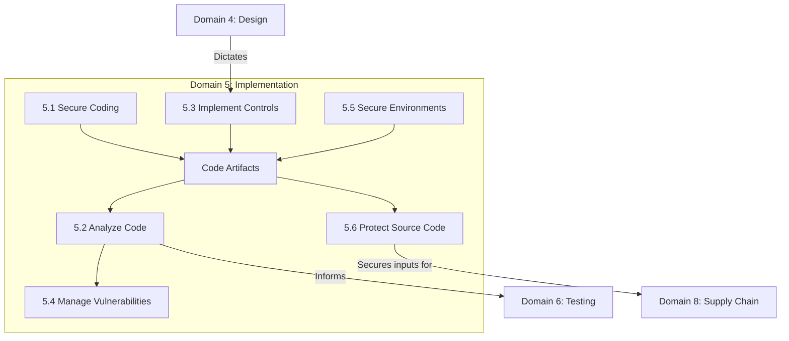

# Domain 5: Secure Software Implementation (14%)

## Domain Overview

Domain 5 transitions from architecture to building the product securely. This domain covers **secure coding practices, code analysis, implementing security controls, and protecting the code itself**. It addresses how to avoid common vulnerabilities during development, how to analyze code for flaws, and how to manage the development environment securely.

This domain carries **14% of the exam weight** (tied with Domain 4 as the highest-weighted domain) and contains **6 major sections**:

| Section | Title | Focus |
|---------|-------|-------|
| 5.1 | Apply Secure Coding Practices | OWASP Top 10, CWE, state management, injection prevention |
| 5.2 | Analyze Code for Security Vulnerabilities | Code review, SAST, DAST, SCA, fuzzing |
| 5.3 | Implement Security Controls | Cryptography implementation, authentication, token management |
| 5.4 | Manage Security Vulnerabilities | Vulnerability tracking, triage, remediation, bug bounties |
| 5.5 | Apply Secure Environments | Environment isolation, secret management, CI/CD security |
| 5.6 | Protect Source Code | Version control security, code signing, repository access |

## Learning Objectives

After completing this domain, you should be able to:

- Apply secure coding practices to prevent common vulnerabilities (e.g., OWASP Top 10)
- Compare and select appropriate code analysis techniques (SAST, DAST, IAST)
- Implement application security controls effectively
- Manage identified vulnerabilities through triage and remediation
- Secure the development and build environments
- Protect source code from unauthorized access and tampering

## Key Relationships

## Study Tips

> **Exam Focus**: At **14%**, Domain 5 is heavily tested. Expect detailed questions on **OWASP Top 10 vulnerabilities and their mitigations**. You must understand the differences between **SAST and DAST**, and when to use each. Secure environment concepts (CI/CD pipelines, secret management) are also increasingly emphasized.

- Know the **OWASP Top 10** intimately: what the vulnerability is, how it works, and how to prevent it
- **SAST** (white-box) finds bugs in code; **DAST** (black-box) finds bugs in running apps
- Never store secrets in source code; use **secrets management** vaults
- **Code signing** ensures integrity and non-repudiation of the final binary
- **State management** (e.g., sessions, cookies) is a critical area for secure coding

## Files in This Section

| File | Content |
|------|---------|
| [5.1_secure_coding_practices.md](5.1_secure_coding_practices.md) | OWASP, CWE, injection prevention, session management |
| [5.2_analyze_source_code.md](5.2_analyze_source_code.md) | Peer review, SAST, DAST, IAST, SCA |
| [5.3_security_controls.md](5.3_security_controls.md) | Auth/AuthZ implementation, crypto, data protection |
| [5.4_manage_vulnerabilities.md](5.4_manage_vulnerabilities.md) | Triage, remediation, tracking, bug bounty |
| [5.5_secure_environments.md](5.5_secure_environments.md) | Environment isolation, secrets management, CI/CD |
| [5.6_protect_source_code.md](5.6_protect_source_code.md) | VCS security, branching strategies, code signing |
