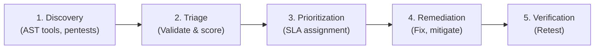

# 5.4 Manage Security Vulnerabilities

## Learning Objectives

- Explain the vulnerability management lifecycle
- Describe vulnerability tracking and triage processes
- Prioritize vulnerabilities for remediation based on risk
- Explain the role of bug bounty programs and responsible disclosure

---

## Vulnerability Management Lifecycle

Finding vulnerabilities is only the first step. Organizations must have a systematic process for tracking, evaluating, and fixing them.

### 1. Discovery (Identification)
Vulnerabilities are identified through various means: SAST/DAST/SCA scanners, manual code review, penetration testing, external security researchers, or vendor notifications.

### 2. Triage
Triage is the process of reviewing raw findings to:
- **Validate**: Confirm the vulnerability is real (filtering out false positives).
- **Consolidate**: Group duplicate findings (e.g., SAST and DAST found the same issue).
- **Assign Risk**: Determine the severity and exploitability of the flaw.

### 3. Prioritization and SLAs
Not all vulnerabilities can or should be fixed immediately. Fixes must be prioritized based on risk backlogs.

Organizations establish **Service Level Agreements (SLAs)** for remediation based on severity:
| Severity | Typical SLA for Remediation | Example Action |
|----------|-----------------------------|----------------|
| **Critical** | < 24–48 hours | Emergency patch, out-of-band release, or immediate mitigation (WAF rule). |
| **High** | < 30 days | Fix in the next scheduled sprint/release. |
| **Medium** | < 90 days | Add to the product backlog for near-term scheduling. |
| **Low** | > 90 days / Best Effort | Fix when convenient or accept the risk. |

### 4. Remediation

There are four general ways to handle an identified vulnerability (Risk Treatment strategies):
1. **Remediate (Avoidance/Reduction)**: Fix the code. The vulnerability is removed. This is the preferred outcome.
2. **Mitigate (Reduction)**: If the code cannot be fixed immediately, implement a compensating control to reduce the likelihood of exploitation. (e.g., adding a WAF rule to block SQL injection attempts until the specific database query can be rewritten).
3. **Transfer (Sharing)**: Shift the financial impact to a third party (e.g., buying cyber insurance). You still own the risk; you just transferred the financial burden.
4. **Accept**: Acknowledge the vulnerability exists but decide not to fix it because the cost of fixing outweighs the potential impact, or the likelihood of exploitation is near zero. **This must be a formal, documented management decision.**

### 5. Verification (Retesting)
Once the development team pushes a fix, the security team (or automated pipeline) must retest the specific vulnerability to confirm it has been successfully remediated and no new issues were introduced.

---

## Tracking Vulnerabilities

Vulnerabilities must be tracked centrally, typically in the same issue tracker developers use for functional bugs (e.g., Jira, Azure DevOps) to ensure they are visible and scheduled alongside feature work.

- **Security Champions**: Developers embedded in Agile teams who take ownership of ensuring security flaws in the backlog are prioritized and addressed during sprint planning.
- **Metrics**: Track Time to Remediate (TTR), Open vs. Closed Critical issues, and SLA compliance rates.

---

## Vulnerability Scoring Systems

### CVSS (Common Vulnerability Scoring System)

CVSS is the industry-standard method for rating the severity of IT vulnerabilities (Scores 0.0 - 10.0).

| Metric Group | Description |
|--------------|-------------|
| **Base Score** | Intrinsic qualities of a vulnerability that are constant over time and across user environments (e.g., Attack Vector, Attack Complexity, Privileges Required, User Interaction, impact on CIA). |
| **Temporal Score** | Characteristics that change over time (e.g., Is there a known exploit available? Is there an official patch?). |
| **Environmental Score** | Characteristics unique to a specific user's environment (e.g., Is this server on the public internet or buried deep inside the corporate network? Is the data highly sensitive?). |

> **Analogy**: CVSS is a measure of **severity**, not necessarily risk. A CVSS 10.0 vulnerability on a test server behind a firewall may pose less *business risk* than a CVSS 7.0 vulnerability on a public-facing customer database.

---

## External Vulnerability Reporting

### Responsible / Coordinated Disclosure
A policy outlining how external researchers can report vulnerabilities to your organization, and the timeline your organization requires to fix the issue before the researcher publishes the details publicly (typically 60-90 days).

### Bug Bounty Programs
Programs that financially reward external security researchers (white-hat hackers) for finding and confidentially reporting vulnerabilities.
- **Benefits**: Continuous, diverse testing by thousands of researchers; finding complex logic flaws scanners miss.
- **Drawbacks**: High signal-to-noise ratio (many invalid reports); requires dedicated triage resources to manage effectively.
- **Platforms**: HackerOne, Bugcrowd, Synack.

---

## Exam Focus Points

1. **Remediation vs. Mitigation**: Remediation fixes the root cause (patching code); Mitigation applies a compensating control (adding a WAF rule) without fixing the root cause.
2. **Risk Acceptance**: Only management (the asset owner) can formally accept a risk; developers and security analysts cannot.
3. **CVSS Base Score**: Represents the intrinsic qualities of the vulnerability. Environmental scores customize it to your specific network.
4. **SLAs**: Critical vulnerabilities require immediate/emergency action; Low vulnerabilities may simply be accepted.
5. **Bug Bounties**: Excellent for finding logic flaws, but require significant triage effort and mature existing security processes before implementation.

---

## Key Terms Glossary

| Term | Definition |
|------|-----------|
| **Triage** | The process of validating, scoring, and prioritizing raw vulnerability findings |
| **SLA** | Service Level Agreement defining the maximum time allowed to fix a flaw based on severity |
| **Remediation** | Eliminating a vulnerability (e.g., rewriting code, applying a patch) |
| **Mitigation** | Reducing the impact or likelihood of a vulnerability via compensating controls (e.g., WAF) |
| **CVSS** | Common Vulnerability Scoring System (0.0 - 10.0 standard severity metric) |
| **Bug Bounty** | A program offering financial rewards for reporting security exploits |
| **Responsible Disclosure** | A policy for reporting and patching flaws before making them public |
