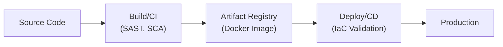

# 5.5 Apply Secure Environments

## Learning Objectives

- Define secure environment segregation (Development, Test, Production)
- Explain continuous integration and deployment (CI/CD) security
- Describe secure secrets management for application environments
- Implement container and orchestration security

---

## Environment Segregation

Different stages of the SDLC require distinct, isolated environments to prevent cross-contamination, protect sensitive data, and ensure production stability.

### Standard Environments

| Environment | Purpose | Security Controls & Data Types |
|-------------|---------|--------------------------------|
| **Development (Dev)** | Where developers write and build code locally or on shared dev servers. | Loose controls for agility. **No real production data**; use synthetic/mock data. High risk. |
| **Testing / QA** | Where code is deployed for functional, integration, and security testing (DAST). | Tighter controls. Mirrors production architecture. Should use **anonymized/masked** data if production data is required for edge cases. |
| **Staging / Pre-Prod** | Final dress rehearsal before release. Used for user acceptance testing (UAT) and load testing. | Identical to production in configuration and access controls. |
| **Production (Prod)** | Live environment serving real users. | Strictest controls. Real customer data (PII/PHI). Developers should **never** have direct, standing access to production. |

### Principles of Env Segregation

- **Least Privilege**: Only authorized personnel can deploy to or access production. Use "break-glass" procedures for emergency debugging.
- **Physical/Logical Separation**: Environments must be on different network segments, isolated by firewalls, VPCs, or separate cloud accounts. A compromise in Dev must not grant lateral movement to Prod.
- **Data Sanitization**: Production data must be stripped of PII/PHI (masked, anonymized, tokenized) before being cloned down to lower environments for testing.

---

## CI/CD Pipeline Security

The CI/CD (Continuous Integration / Continuous Deployment) pipeline is the automated assembly line for modern software. Because the pipeline has the authority to deploy code to production, it is a prime target for attackers (supply chain attacks).

### Securing the Pipeline

| Pipeline Stage | Security Control |
|----------------|------------------|
| **Source/Commit** | Require peer review pull requests; branch protection rules; signed commits. |
| **Build (CI)** | Run SAST and SCA tools; fail the build if critical flaws are found; ensure build servers are ephemeral and hardened. |
| **Artifact Storage** | Store compiled binaries/images in a secure registry; scan images for OS vulnerabilities; digitally sign artifacts to ensure integrity. |
| **Deployment (CD)** | Implement deployment gates (manual/automated approvals); use dynamic secrets injection; scan Infrastructure as Code (IaC) before provisioning. |

### Pipeline Access Control
- Treat the CI/CD server (e.g., Jenkins, GitLab CI, GitHub Actions) as a **Tier 0 (critical) asset**.
- The CI/CD tool should have its own dedicated service accounts to deploy to AWS/Azure, rather than using a developer's personal credentials.

---

## Secure Secrets Management

Applications need secrets (database passwords, API keys, TLS certificates) to function. Managing them securely across environments is critical.

### The Anti-Pattern
Storing secrets in:
- Source code (GitHub)
- Plaintext configuration files (`web.config`, `.env` files checked into source control)
- Hardcoded variables in the CI/CD pipeline configuration

### The Secure Solution
Use a centralized **Secrets Vault** (e.g., HashiCorp Vault, AWS Secrets Manager, Azure Key Vault, CyberArk).

**How it works:**
1. The application starts up in the production environment.
2. The application authenticates to the Secrets Vault using a short-lived IAM role or identity certificate.
3. The Vault verifies the application's identity and injects the necessary database credentials directly into the application's memory at runtime.
4. The application connects to the database. The secret never touches the disk or source code.

**Benefits**:
- Single source of truth for secrets.
- Automated secret rotation (e.g., changing DB passwords every 30 days automatically).
- Detailed audit logging of exactly which service accessed which secret and when.

---

## Container and Orchestration Security

Modern environments heavily rely on containers (Docker) and orchestration (Kubernetes).

### Container Security
- **Use Minimal Base Images**: Start from scratch or use Alpine Linux to reduce the attack surface (fewer unneeded OS binaries).
- **Run as Non-Root**: Containers should not run tightly coupled processes as the root user. Use the `USER` directive in the Dockerfile.
- **Immutability**: Containers should be immutable. Do not patch or update a running container via SSH. Build a new image with the patch and redeploy.
- **Image Scanning**: Scan container images for OS packages with known CVEs before pushing them to the registry.

### Orchestration Security (Kubernetes)
- **Namespaces**: Use namespaces to logically isolate different applications or environments within the same cluster.
- **Network Policies**: Implement default-deny network policies so that microservices can only communicate with required services, reducing lateral movement.
- **Role-Based Access Control (RBAC)**: Enforce strict RBAC for developers and service accounts interacting with the cluster API.

---

## Exam Focus Points

1. **Environment Separation**: Prod and Dev must be strictly isolated. Prod data must be masked before entering Dev/QA.
2. **Access Control**: Developers should not have standing administrative access to the Production environment.
3. **Secrets Vaults**: The only correct answer for storing API keys and passwords is a centralized secrets management vault, injected at runtime.
4. **Immutability**: In containerized environments, never patch running servers—replace them via the CI/CD pipeline.
5. **CI/CD Security**: The pipeline itself is a critical trust boundary and must be secured to prevent unauthorized code from reaching production.

---

## Key Terms Glossary

| Term | Definition |
|------|-----------|
| **CI/CD** | Continuous Integration and Continuous Deployment |
| **Data Masking** | Obfuscating sensitive data (PII/PHI) when cloning production databases for lower environments |
| **Secrets Vault** | A secure, centralized system for storing and injecting credentials at runtime |
| **Immutability** | Infrastructure that is replaced rather than modified or updated in place |
| **Container** | A lightweight, standalone, executable package of software that includes code, runtime, and system tools |
| **Orchestration** | Automated configuration, coordination, and management of computer systems and software (e.g., Kubernetes) |
