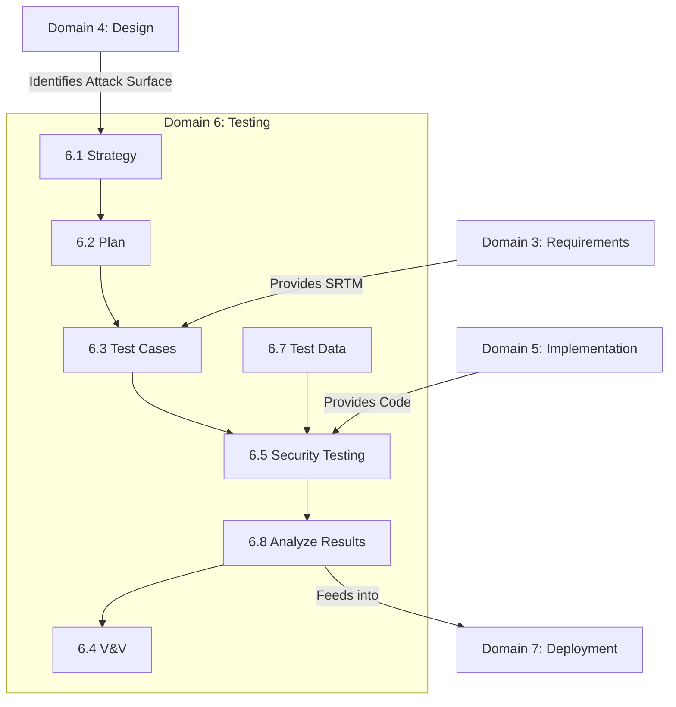

# Domain 6: Secure Software Testing (14%)

## Domain Overview

Domain 6 focuses on **verifying and validating** that the software meets its security requirements and is free of vulnerabilities before release. This domain covers testing strategies, test plans, test cases, automated vs. manual testing, handling test data, and analyzing test results.

This domain carries **14% of the exam weight** (tied with Domains 4 and 5) and contains **9 major sections**:

| Section | Title | Focus |
|---------|-------|-------|
| 6.1 | Develop Security Testing Strategy | Alignment with business goals, risk-based testing |
| 6.2 | Develop Security Testing Plan | Scope, schedule, resources, environment |
| 6.3 | Develop Security Test Cases | Positive/negative testing, boundary conditions |
| 6.4 | Perform Verification and Validation | Verification (built right) vs. Validation (right product) |
| 6.5 | Perform Security Testing | SAST, DAST, IAST, Fuzzing, Penetration Testing |
| 6.6 | Perform Vulnerability Assessment | Infrastructure scanning, configuration checks |
| 6.7 | Manage Secure Test Data | Synthetic data, data masking, sanitization |
| 6.8 | Analyze and Report Test Results | Defect management, residual risk, impact analysis |
| 6.9 | Integrate Security Testing | CI/CD integration, DevSecOps | *(Note: Merged into other sections in this guide)* |

## Learning Objectives

After completing this domain, you should be able to:

- Create a comprehensive security testing strategy and plan
- Distinguish between Verification and Validation (V&V)
- Design effective positive, negative, and boundary condition test cases
- Select and apply appropriate testing tools (AST, Fuzzing, Pentesting)
- Manage and protect test data (avoiding production data in test environments)
- Analyze test results and track defects to resolution

## Key Relationships

## Study Tips

> **Exam Focus**: At **14%**, Testing is a major domain. Know the difference between **Verification** ("Did we build it right?", matching requirements) and **Validation** ("Did we build the right thing?", matching customer needs). Understand when to use **Positive** vs. **Negative** testing. Expect heavy emphasis on **Test Data Management** (do not use live production data in test environments).

- **Testing Strategy** is high-level (the "what" and "why"); **Testing Plan** is specific (the "how", "who", "when").
- **Positive testing**: Determines if the application works as expected with valid input.
- **Negative testing**: Determines if the application handles invalid input gracefully (fail-secure).
- **Test Data**: Must be sanitized, anonymized, or synthetically generated.
- Understand the role of **Penetration Testing** as a final validation step, not a replacement for AST tools.

## Files in This Section

| File | Content |
|------|---------|
| [6.1_security_testing_strategy.md](6.1_security_testing_strategy.md) | Testing strategy concepts, standards, and environments |
| [6.2_security_testing_plan.md](6.2_security_testing_plan.md) | Developing the test plan, scope, resources |
| [6.3_security_test_cases.md](6.3_security_test_cases.md) | Positive/negative testing, boundary values, equivalence |
| [6.4_verification_and_validation.md](6.4_verification_and_validation.md) | V&V processes, difference between verification and validation |
| [6.5_security_testing_tools.md](6.5_security_testing_tools.md) | Pentesting, AST, fuzzing, code coverage |
| [6.6_vulnerability_assessment.md](6.6_vulnerability_assessment.md) | Vulnerability scanning, infrastructure testing |
| [6.7_manage_test_data.md](6.7_manage_test_data.md) | Data tokenization, masking, synthetic data |
| [6.8_analyze_test_results.md](6.8_analyze_test_results.md) | Defect tracking, reporting, residual risk |
