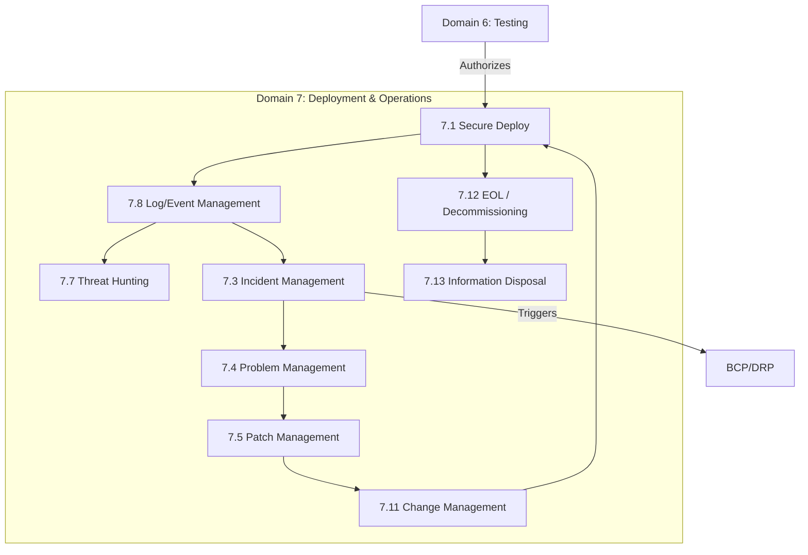

# Domain 7: Secure Software Deployment, Operations, and Maintenance (14%)

## Domain Overview

Domain 7 covers the longest phase of the software lifecycle: the time after the software has been deployed to production. This domain addresses **secure deployment practices, continuous monitoring, incident response, patch management, business continuity, and eventually, secure disposal.**

This domain carries **14% of the exam weight** (tied for the highest) and contains **13 major sections**:

| Section | Title | Focus |
|---------|-------|-------|
| 7.1 | Perform Secure Deployment | Secure release, boot process, infrastructure as code |
| 7.2 | Security Data Management | ISCM (Information Security Continuous Monitoring), SIEM |
| 7.3 | Incident Management | Preparation, detection, eradication, recovery, lessons learned |
| 7.4 | Problem Management | Root cause analysis, preventing recurring incidents |
| 7.5 | Patch & Vulnerability Management | Emergency patching, virtual patching, vulnerability scanning |
| 7.6 | Security Control Testing | Post-deployment validation, compliance checking |
| 7.7 | Threat Hunting | Proactive detection, hypothesis-driven hunting |
| 7.8 | Log and Event Management | Immutable logging, auditing, aggregation |
| 7.9 | Backup and Recovery | Data protection, retention, RTO/RPO |
| 7.10 | BCP and DRP | Business Continuity, Disaster Recovery, failover testing |
| 7.11 | Change & Release Management | CAB approval, versioning, rollback plans |
| 7.12 | End of Life / Decommissioning | EOL planning, data migration, service termination |
| 7.13 | Information Disposal | Media sanitization, crypto-shredding, archiving |

## Learning Objectives

After completing this domain, you should be able to:

- Execute a secure deployment process including approvals and rollback plans
- Implement Continuous Monitoring (ISCM) and log management
- Execute the Incident Response lifecycle securely
- Distinguish between Incident Management and Problem Management
- Implement effective backup, BCP, and DRP strategies
- Safely decommission software and permanently dispose of data

## Key Relationships

## Study Tips

> **Exam Focus**: At **14%**, operations questions are heavy. Pay close attention to the **Incident Response Lifecycle** stages. Understand the difference between an **Incident** (fixing the immediate fire) and a **Problem** (finding the root cause so the fire doesn't happen again). **Disaster Recovery** metrics (RTO vs. RPO) are guaranteed exam topics.

- **RTO (Recovery Time Objective)**: How fast must the system be back online?
- **RPO (Recovery Point Objective)**: How much data loss can we tolerate? (Dictates backup frequency).
- **Virtual Patching**: Using a WAF or IPS to block an exploit before the actual code patch is applied.
- **Root Cause Analysis (RCA)**: The core of Problem Management.
- **Crypto-shredding**: The best way to securely "dispose" of data in the cloud — delete the encryption keys.

## Files in This Section

| File | Content |
|------|---------|
| [7.1_secure_software_deployment.md](7.1_secure_software_deployment.md) | Deployment strategies, approvals, boot security |
| [7.2_security_data_management.md](7.2_security_data_management.md) | Continuous monitoring, telemetry |
| [7.3_incident_management.md](7.3_incident_management.md) | PICERL lifecycle, containment, eradication |
| [7.4_problem_management.md](7.4_problem_management.md) | Root cause analysis, 5 Whys, Fishbone |
| [7.5_patch_vulnerability_management.md](7.5_patch_vulnerability_management.md) | SCCM, virtual patching, zero-days |
| [7.6_security_control_testing.md](7.6_security_control_testing.md) | Post-deploy tuning, compliance audits |
| [7.7_threat_hunting.md](7.7_threat_hunting.md) | Proactive defense, IoCs, cyber kill chain |
| [7.8_log_event_management.md](7.8_log_event_management.md) | SIEM, WORM storage, log aggregation |
| [7.9_backup_and_recovery.md](7.9_backup_and_recovery.md) | Full/Differential/Incremental backups |
| [7.10_bcp_and_drp.md](7.10_bcp_and_drp.md) | BIA, RTO, RPO, Hot/Warm/Cold sites |
| [7.11_change_release_management.md](7.11_change_release_management.md) | CAB, rollback plans, versioning |
| [7.12_eol_decommissioning.md](7.12_eol_decommissioning.md) | Sunset policies, vendor support ending |
| [7.13_information_disposal.md](7.13_information_disposal.md) | Purging, degaussing, crypto-shredding |
