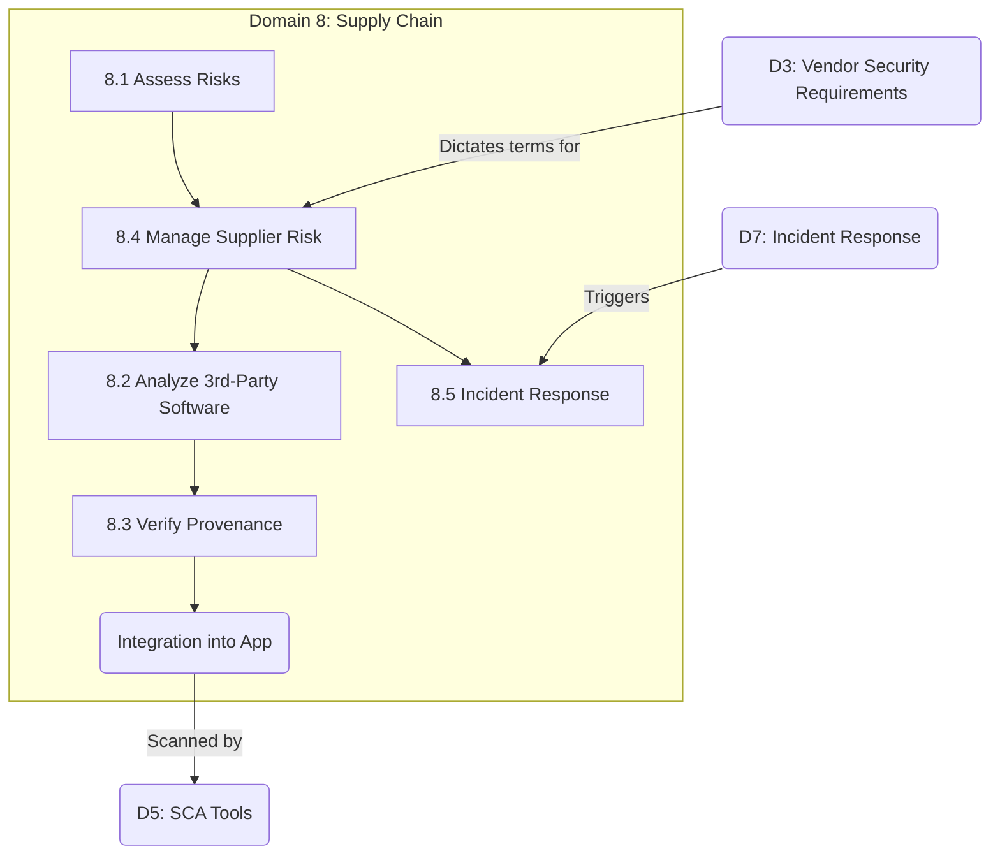

# Domain 8: Secure Software Supply Chain (10%)

## Domain Overview

Domain 8 focuses on the massive risks inherent in modern software development: the reliance on third-party code, open-source libraries, external APIs, and outsourced development teams. A catastrophic breach does not always require exploiting your code; increasingly, attackers exploit the code written by your vendors.

This domain carries **10% of the exam weight** and contains **5 major sections**:

| Section | Title | Focus |
|---------|-------|-------|
| 8.1 | Software Supply Chain Risks | Identification of supply chain attack vectors |
| 8.2 | Analyze Third-Party Software | OSS licensing, SCA, and vulnerability discovery |
| 8.3 | Verify Provenance and Integrity | Digital signatures, hashes, SBOMs |
| 8.4 | Manage Supplier Risk | Vendor assessments, SLAs, contract clauses |
| 8.5 | Supply Chain Incident Response | Integrating vendor breaches into your incident response plan |

## Learning Objectives

After completing this domain, you should be able to:

- Understand the modern threats to the software supply chain (e.g., SolarWinds, Log4j)
- Analyze third-party code for security flaws and licensing conflicts
- Establish the provenance and integrity of downloaded artifacts
- Manage the systemic risk introduced by outsourced suppliers and vendors
- Respond effectively when a critical vendor experiences a breach

## Key Relationships

## Study Tips

> **Exam Focus**: Supply Chain security is the most rapidly evolving topic in cybersecurity. You must understand the **Software Bill of Materials (SBOM)**—it is virtually guaranteed to be tested. Understand the difference between **Provenance** (where did it come from?) and **Integrity** (has it been altered?). Finally, remember that **you can outsource the work, but you cannot outsource the risk**. If your vendor is breached and loses your customers' data, *you* are still legally responsible.

- **SBOM**: A comprehensive list of all third-party components contained within your software. Essential for incident response.
- **SCA (Software Composition Analysis)**: The automated tool used to generate the SBOM and check it against known CVEs.
- **Dependency Confusion**: An attack vector where a public malicious package is named similarly to a private internal package in order to trick the package manager into downloading the malware.
- **Right to Audit**: A critical contract clause forcing suppliers to allow you to inspect their security posture.

## Files in This Section

| File | Content |
|------|---------|
| [8.1_supply_chain_risks.md](8.1_supply_chain_risks.md) | Third-party libraries, outsourced development, attack vectors |
| [8.2_analyze_third_party_software.md](8.2_analyze_third_party_software.md) | OSS risks, licensing (GPL vs. MIT), SCA tools |
| [8.3_verify_provenance_integrity.md](8.3_verify_provenance_integrity.md) | Hashes, GPG signatures, SBOM (CycloneDX/SPDX) |
| [8.4_manage_supplier_risk.md](8.4_manage_supplier_risk.md) | Vendor risk assessments, SLAs, Right to Audit |
| [8.5_supply_chain_incident_response.md](8.5_supply_chain_incident_response.md) | Joint-response plans, escrows, incident communication |
