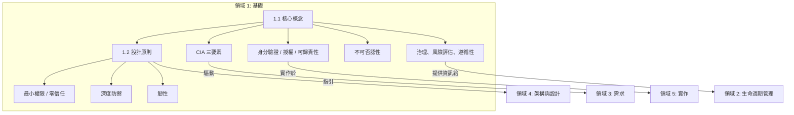

# 領域 1：安全軟體概念 (Secure Software Concepts) (12%)

## 領域概述

領域 1 奠定了所有 CSSLP 考生必須掌握的**基礎安全原則**。其涵蓋了核心安全目標（機密性、完整性、可用性 CIA 三要素及其他延伸）以及指引所有平台與程式語言架構決策的設計原則。

此領域佔**考試比重 12%**，包含 **2 個主要章節**：

| 章節 | 標題 | 重點 |
|---------|-------|-------|
| 1.1 | 了解核心概念 (Understand Core Concepts) | CIA、身分驗證 (AuthN)、授權 (AuthZ)、可歸責性 (Accountability)、不可否認性 (Nonrepudiation)、GRC |
| 1.2 | 了解安全設計原則 (Understand Security Design Principles) | 從最小權限 (Least Privilege) 到元件重複使用 (Component Reuse) 等 10 項基礎原則 |

## 學習目標

完成本領域後，您應能夠：

- 定義軟體開發的核心安全目標
- 描述 CIA 三要素，並解釋機密性、完整性與可用性的相關機制
- 說明資訊安全與資料隱私之間的關聯
- 識別影響軟體安全的法規考量因素
- 解釋安全方法如何透過存取控制來降低漏洞風險
- 描述多層防護 (Multiple layers of protection) 的目的與功能
- 描述安全文化與實務做法如何影響資料隱私與安全

## 軟體的 3 個 R

安全軟體目標的簡單框架 — 軟體必須滿足三個 R：

| 屬性 | 說明 |
|----------|-------------|
| **可靠 (Reliable)** | 軟體如預期般運作 |
| **具韌性 (Resilient)** | 軟體能承受誤用與攻擊 |
| **可復原 (Recoverable)** | 能在最低限度的中斷下，將正常業務營運恢復 |

## 主要關聯性

## 學習提示

> **考試重點**：領域 1 的概念會**貫穿整個考試的各個環節**。理解 CIA、設計原則與 GRC 對於所有其他領域都至關重要。請準備好應對情境題，這類題目會要求您指出適用的原則為何。

- 考試常測驗 CIA 的**反面**：洩漏–竄改–破壞 (Disclosure–Alteration–Destruction, DAD)
- 了解**安全**（保護資料）與**隱私**（控制誰能存取個人資料以及如何使用）之間的差異
- 設計原則通常**與技術無關 (technology-agnostic)** — 無論平台或程式語言為何，它們皆適用
- 準備應付測驗您**區分相似原則**能力的題目（例如：最小權限 vs 最小公共機制）

## 本章節檔案

| 檔案 | 內容 |
|------|---------|
| [1.1_core_concepts.md](1.1_core_concepts.md) | CIA 三要素、身分驗證 (AuthN)、授權 (AuthZ)、可歸責性 (Accountability)、不可否認性 (Nonrepudiation)、GRC |
| [1.2_security_design_principles.md](1.2_security_design_principles.md) | 全數 10 項設計原則以及範例和考試重點 |
