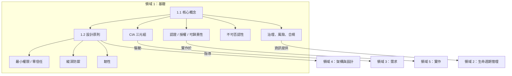

# 領域 1：安全軟體概念 (12%)

## 領域概述

領域 1 建立了每位 CSSLP 考生必須掌握的**基礎安全原則**。涵蓋核心安全目標（CIA 三元組及其延伸）以及跨所有平台和程式語言的設計原則。

本領域佔考試比重 **12%**，包含 **2 個主要章節**：

| 章節 | 標題 | 重點 |
|------|------|------|
| 1.1 | 理解核心概念 | CIA、認證、授權、可歸責性、不可否認性、GRC |
| 1.2 | 理解安全設計原則 | 從最小權限到元件重用的 10 大基礎原則 |

## 學習目標

完成本領域後，您應能夠：

- 定義軟體開發的核心安全目標
- 描述 CIA 三元組並解釋機密性、完整性和可用性機制
- 說明資訊安全與資料隱私的關係
- 識別影響軟體安全的法規考量
- 解釋安全方法如何透過存取控制降低漏洞風險
- 描述多層保護在軟體安全中的目的和功能
- 描述安全文化和實務如何影響資料隱私與安全

## 軟體的三個 R

安全軟體目標的簡單框架——軟體必須滿足三個 R：

| 特性 | 描述 |
|------|------|
| **可靠 (Reliable)** | 軟體按預期運作 |
| **韌性 (Resilient)** | 軟體能承受誤用和攻擊 |
| **可復原 (Recoverable)** | 能以最小中斷恢復正常業務運營 |

## 關鍵關係

## 學習提示

> **考試重點**：領域 1 的概念會在**整個考試中被交叉引用**。理解 CIA、設計原則和 GRC 對其他每個領域都至關重要。預期會遇到要求您識別適用原則的情境題。

- 考試經常測試 CIA 的**反面**：洩露–篡改–破壞 (DAD)
- 了解**安全**（保護資料）和**隱私**（控制誰能存取個人資料及如何使用）的區別
- 設計原則是**技術中立**的——無論平台或語言都適用
- 預期會遇到要求您**區分相似原則**的題目（例如最小權限 vs. 最小共用機制）

## 本節檔案

| 檔案 | 內容 |
|------|------|
| [1.1_核心概念.md](1.1_核心概念.md) | CIA 三元組、認證、授權、可歸責性、不可否認性、GRC |
| [1.2_安全設計原則.md](1.2_安全設計原則.md) | 所有 10 個設計原則及範例和考試重點 |
