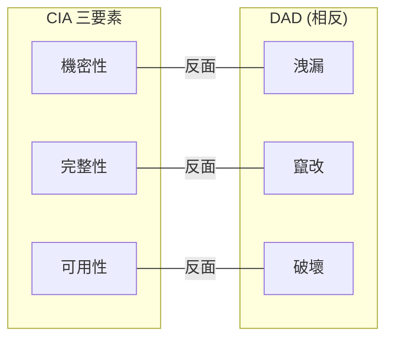

# 1.1 了解核心概念 (Understand Core Concepts)

## 學習目標

- 定義 CIA 三要素及其相反模型 (DAD)
- 解釋機密性機制：加密、存取控制、隱寫術
- 描述完整性控制：雜湊、數位簽章、程式碼簽章
- 識別可用性策略：備援、複寫、叢集、容錯移轉
- 區分身分驗證因素與方法（MFA、SSO、聯合身分、生物辨識）
- 解釋授權模型與存取控制類型
- 透過稽核與日誌記錄定義可歸責性
- 描述如何透過數位簽章與區塊鏈達成不可否認性
- 了解 GRC 標準與法規遵循

---

## CIA 三要素

**機密性、完整性與可用性 (Confidentiality, Integrity, and Availability, CIA)** 三要素，是貫穿整個軟體開發生命週期 (SDLC) 中所有軟體安全活動的基礎框架。

CIA 的**相反**是 **DAD**（洩漏、竄改、破壞 / Disclosure–Alteration–Destruction）：

| CIA 目標 | 反面 (DAD) | 重點 |
|--------------|-----------------|-------|
| **機密性 (Confidentiality)** | 洩漏 (Disclosure) | 防止未經授權的資訊存取 |
| **完整性 (Integrity)** | 竄改 (Alteration) | 防止未經授權的資料修改 |
| **可用性 (Availability)** | 破壞 (Destruction) | 確保對資源的及時與可靠存取 |

> **考試提示**：當題目描述某種威脅或攻擊時，請將其對應到它所針對的 CIA 元素。洩漏 → 機密性問題；竄改 → 完整性問題；破壞 → 可用性問題。

---

## 機密性 (Confidentiality)

**定義 (NIST FIPS 199)**：「維護資訊存取與洩漏的授權限制，包含保護個人隱私與專有資訊的方法。」

### 機密性的目標

必須在**所有時間點**保護敏感資料 — 無論是：
- 透過網路**傳輸中 (In transit)**（例如：TLS 1.3）
- 在儲存媒體上**靜止中 (At rest)**（例如：透過透明資料加密進行 AES-256 加密）
- 在應用程式中**使用中 (In use)**（例如：存取控制、記憶體保護）

### 機密性機制

| 機制 | 類型 | 說明 |
|-----------|------|-------------|
| **加密 (Encryption)** | 顯性 (Overt) | 將資料轉換為密文；傳輸中與靜止中資料的主要保護方法 |
| **存取控制 (Access Controls)** | 顯性 (Overt) | 根據身分、角色或已知需求 (need-to-know) 限制存取 |
| **隱寫術 (Steganography)** | 隱性 (Covert) | 隱藏資訊的存在（例如：將資料隱藏在圖片像素中） |
| **數位浮水印 (Digital Watermarking)** | 隱性 (Covert) | 將識別資訊嵌入媒體內容中 |
| **匿名化 (Anonymization)** | 顯性 (Overt) | 從資料集中移除識別資訊 |
| **標記化 (Tokenization)** | 顯性 (Overt) | 使用非敏感的代碼 (token) 替換敏感資料 |
| **遮罩 (Masking)** | 顯性 (Overt) | 使用修改後的值替換資料（例如：`****1234`） |

> **關鍵區分**：顯性機制（如加密）是可直接觀察到的安全措施。隱性機制（如隱寫術）依賴於掩飾資料本身的存在 — **「隱晦式安全 (Security through obscurity)」本身永遠是不夠的**。

### 危害機密性的攻擊

| 攻擊媒介 | 說明 |
|--------------|-------------|
| 網路嗅探 (Network sniffing) | 攔截/解碼網路封包以竊取憑證或資料（被動攻擊） |
| 側錄 (Shoulder surfing) | 從某人背後偷看按鍵操作或螢幕資料 |
| 社交工程 (Social engineering) | 欺騙授權使用者以揭露機密資訊 |
| 系統入侵 (Hacking) | 利用安全弱點繞過存取控制 |
| 偽裝 (Masquerading) | 使用竊取來的憑證冒充授權使用者 |
| 未受保護的下載 | 將檔案從安全環境移至未受保護的系統 |
| 木馬程式 (Trojans) | 偽裝成合法檔案的惡意軟體 |
| 未加密（明文）資料 | 未經加密即儲存或傳輸 PII / PHI 資料 |

### 保護機密性

機密性保護涉及**多層防禦** — 而非僅有技術控制：
- 針對可存取敏感資訊之人員的安全意識培訓
- 將敏感資訊的保留減至最低（縮小攻擊面）
- 限制對基礎設施的實體存取（資料中心控制）
- 針對伺服器與媒體建立安全的處置政策

---

## 完整性 (Integrity)

**定義 (NIST)**：「資料自建立、傳輸或儲存以來，未遭未經授權之方式竄改的屬性。」

### 資料完整性的三項原則

1. **未經授權的主體**必定**無法**對資料進行修改
2. **授權的主體**必定**無法**對資料進行**未經授權的修改**（例如：權限越界）
3. 資料在內部與外部皆為一貫且**一致**的

### 完整性的技術控制

#### 雜湊 (Hashing)

密碼編譯雜湊函數會從不固定長度的輸入中，建立出一個**固定大小的摘要 (digest)**。

**良好的雜湊函數屬性：**
- **確定性 (Deterministic)**：相同的輸入必定產生相同的摘要
- **雪崩效應 (Avalanche effect)**：對輸入的任何更改（即使是 1 位元）都會產生截然不同的摘要
- **單向性 (One-way)**：無法將摘要反向推導回原始輸入
- **抗碰撞性 (Collision-resistant)**：要找到產生相同摘要的兩種不同輸入，在計算上是不可行的

| 訊息 | SHA-256 摘要 |
|---------|---------------|
| `Hello World` | `a591a6d40bf420...9ad9f146e` |
| `Hello World` | `a591a6d40bf420...9ad9f146e` *(相同)* |
| `Hello World!` | `7f83b1657ff1fc...00126d9069` *(完全不同)* |

> **考試提示**：當兩種不同的輸入產生相同的雜湊值時，這被稱為**雜湊碰撞 (Hash collision)**。優良的雜湊函數會將碰撞發生的機率降到最低。

#### 數位簽章 (Digital Signatures)

將**簽章與身分綁定**以提供完整性與真實性保證。

**建立數位簽章的過程：**
1. 使用密碼編譯雜湊函數從輸入中建立**摘要**
2. 使用簽署人的**私鑰（非對稱演算法）加密**該摘要

**驗證：**
1. 使用簽署人的**公鑰**解密摘要
2. 獨立地對接收到的訊息進行雜湊計算
3. 比較這兩個摘要 — 如果相符，則確認了完整性與真實性

#### 程式碼簽章 (Code Signing)

將數位簽章應用於程式碼，常見於**散佈與維護**階段：
- **完整性保證**：程式碼未被竄改
- **真實性保證**：識別在簽署時控制程式碼的實體
- 在**軟體供應鏈**中是關鍵的考量因素

### 生命週期中的完整性

必須在整個資料生命週期中維護完整性，包含以下做法：
- **版本控制**（CVS、Subversion、Git）— 追蹤變更、時間戳記與負責的主體
- **需知情 (Need-to-know)** 存取 — 僅授予主體存取其工作所需資料的權限
- **職責分離 (Separation of duties)** — 沒有單一主體能主導交易的始末
- **職務輪調 (Rotation of duties)** — 定期輪調工作以發現異常或欺詐活動

### 完整性與可信賴運算基底 (Trusted Computing Base, TCB)

**可信賴運算基底 (TCB)** 代表了對安全至關重要的硬體、軟體、韌體、行程與資源的集合。一旦 TCB 完整性受損（例如，被惡意軟體破壞），**將無法再強制執行安全政策**。

- **可信賴平台模組 (TPM)**：一個專用的微控制器，使用密碼學金鑰來證明開機過程的完整性
- **範例**：Microsoft BitLocker 利用了 TPM 晶片

---

## 可用性 (Availability)

**定義**：確保對資料與運算資源的**可靠與及時存取**。

### 可用性的目標

必須在正確的時間內，為正確的主體提供資源存取，並基於組織定義的業務需求為依據。

### 可用性的安全控制

| 控制項 | 說明 |
|---------|-------------|
| **備援 (Redundancy)** | 即使一個元件故障，仍能繼續運作 |
| **容錯移轉 (Failover)** | 發生故障時，自動切換至備用系統 |
| **容錯 (Fault Tolerance)** | 系統在元件故障時仍能繼續運作 |
| **RAID** | 獨立磁碟備援陣列 — 資料備援與/或效能提升 |
| **高可用性叢集 (High-Availability Clusters)** | 提供持續服務且停機時間最短的電腦群組 |
| **複寫 (Replication)** | 將資料儲存在多個站點或節點中 |
| **叢集 (Clustering)** | 將多個伺服器分組以充當單個系統 |
| **可擴充性 (Scalability)** | 增加容量以滿足需求的能力 |

### 關鍵可用性指標

| 指標 | 全名 | 說明 |
|--------|-----------|-------------|
| **MTD** | Maximum Tolerable Downtime (最大可容忍停機時間) | 在產生不可接受的業務影響之前，軟體可無法使用的最長時間 |
| **RTO** | Recovery Time Objective (復原時間目標) | 將系統恢復到預期狀態的目標時間 (**RTO 必須 < MTD**) |
| **RPO** | Recovery Point Objective (復原點目標) | 以時間衡量之最大可接受資料遺失量 |

> **關鍵規則：RTO < MTD** — 復原行動必須在達到最大可容忍停機時間之前進行。

### 危害可用性

| 威脅 | 說明 |
|--------|-------------|
| **DoS / DDoS** | 阻斷服務 / 分散式阻斷服務 — 阻止被授權的存取 |
| **自然災害** | 颶風、龍捲風、洪水、地震 |
| **硬體故障** | 磁碟崩潰、電源供應器故障 |
| **軟體錯誤** | 記憶體洩漏 (Memory leaks)、無限迴圈、資源耗盡 |

### 災難復原 (Disaster Recovery)

組織應定義：
- **RTO 與 RPO** — 驅動災難復原策略
- 備用處理站點的**熱/溫/冷站 (Hot/warm/cold sites)**
- **雲端 DR** — 雲端服務供應商 (CSP) 提供可用性區域與區域 (regions) 以達到地理備援
- **應變計畫 (Contingency planning)** — 業務恢復、備用站點處理

---

## 身分驗證 (Authentication)

**定義**：以足夠確定性建立**實體身分**的過程。

### 身分驗證因素 (Authentication Factors)

| 因素分類 | 類別 | 範例 |
|--------|----------|----------|
| **你知道的 (Something you know)** | 知識 | 密碼、PIN 碼、安全提問 |
| **你擁有的 (Something you have)** | 所有權 | 憑證 (Token)、智慧卡、手機、硬體金鑰 |
| **你本身的 (Something you are)** | 特徵 | 指紋、臉部辨識、虹膜掃描 |
| **你做的 (Something you do)** | 行為 | 打字模式、步態、手勢 |
| **你所在的位置 (Where you are)** | 位置 | GPS、基於 IP 的地理位置 |

### 多重要素驗證 (MFA)

結合了**兩個或更多**不同類型因素的身分驗證。**FFIEC** (聯邦金融機構檢查委員會) 的指引強調，單一要素驗證對於網路銀行**並不夠充足** — 具有包含 MFA 在內的補償性控制是必要的。

> **考試提示**：MFA 需要來自**不同類別**的因素。使用兩個密碼（兩個都是「你知道的」）**不**算是 MFA。

### 身分與存取管理 (IAM)

IAM 包含了用於管理企業資源存取的人員、流程與系統，做法為：
1. **識別 (Identification)** → 宣稱身分（例如：使用者名稱、電子郵件）
2. **驗證 (Authentication)** → 驗證宣稱的身分
3. **授權 (Authorization)** → 根據已驗證的身分授予存取權限
4. **可歸責性 (Accountability)** → 透過稽核追蹤來追蹤各項動作

### 單一登入 (SSO)

允許使用者**驗證一次**即可存取多個系統/應用程式，而無需重新驗證。減少了密碼疲勞 (password fatigue)，但也造成了**單一妥協點 (single point of compromise)** 的風險。

### 聯合身分 (Federated Identity)

將信任延伸跨越組織邊界：
- **身分提供者 (IdP)** — 擁有身分並產生權杖 (tokens)
- **信賴憑證者 (Relying Party, RP)** — 消耗權杖的服務提供者
- 與 Active Directory 內的 Kerberos 類似，但能在**跨網域 (across domains)** 下運作

**關鍵聯合標準：**

| 標準 | 目的 |
|----------|---------|
| **SAML 2.0** | 基於 XML 的框架，用於在組織之間交換安全斷言 (security assertions) |
| **OAuth 2.0** | 授權框架，可讓第三方對 HTTP 服務取得有限的存取權 |
| **OpenID Connect** | 建立在 OAuth 2.0 之上的身分驗證協定，使用 JSON/REST |

> **關鍵區分**：SAML = 身分驗證 + 授權。OAuth = 僅限授權。OpenID Connect = OAuth 之上的身分驗證層。

### 生物辨識 (Biometrics)

利用獨特的物理或行為特徵來進行識別/驗證：
- Touch ID、Face ID、虹膜掃描、語音辨識
- 捕捉基準特徵並經過加密雜湊，然後儲存於智慧卡或安全憑證 (security token) 上
- 在行動裝置環境中越來越被接受

### 摘要驗證 (Digest Authentication)

避免以明文傳送憑證 — 改為傳送結合了夾帶**加鹽值 (salt value)** 的**訊息摘要（雜湊值）**。

---

## 授權 (Authorization)

**定義**：確認已通過身分驗證的實體是否具有存取與對請求資源執行動作的所需權利與權限。

### 核心概念
- **主體 (Subject)** — 要求存取的實體（使用者、行程、服務）
- **物件 (Object)** — 被存取的資源（檔案、資料庫、API）
- **動作 (Action)** — 主體想要從事的行為（讀取、寫入、執行、刪除）

### 存取控制模型

| 模型 | 說明 | 關鍵特徵 |
|-------|-------------|-------------------|
| **DAC** (自主性存取控制) | 擁有者透過 ACL 或權限表 (capability tables) 控制存取 | 彈性高，但安全性是可選擇的 |
| **MAC** (強制性存取控制) | 系統根據敏感度標籤強制執行存取 | 嚴格，起源於軍事設備 |
| **RBAC** (基於角色的存取控制) | 基於指派的角色來存取 | 可以實作 DAC、MAC 或 NDAC |
| **ABAC** (基於屬性的存取控制) | 基於主體、物件與環境的屬性來存取 | 細粒度控制 (Fine-grained)，使用 XACML |
| **Rule-Based** (基於規則) | 存取受預先定義的規則（例如：時段）控制 | 較不常見，使用帶有規則的 ACL |
| **Resource-Based** (基於資源) | 基於資源授予存取權限，適用於 SOA | 支援模擬/委派 (impersonation/delegation) |

### ACL vs. 權限表 (Capability Tables)

| 視角 | 模型 | 說明 |
|-------------|-------|-------------|
| **物件視角** | ACL (存取控制串列) | 「哪些主體能存取這個物件？」 |
| **主體視角** | Capability Table (權限表) | 「這個主體可以存取哪些物件？」 |

### 委派模型 (Delegation Models)

| 模型 | 說明 |
|-------|-------------|
| **模擬 / 委派 (Impersonation / Delegation)** | 次要實體代表主要實體行動（例如：Kerberos 票證） |
| **可信子系統 (Trusted Subsystem)** | 存取決策基於受信任資源的身分，而非使用者身分 |

---

## 可歸責性 (Accountability)

**定義**：能夠確認主體在系統內的行為和動作，並識別出特定主體的能力。

### 稽核 (Auditing)

解答：**「誰 (主體) 在 何時 (時間戳記) 對 哪裡 (物件) 做了 什麼 (動作)？」**

- 可以是一次性、定期或持續/連續進行
- 稽核追蹤提供處理過程的書面證據
- 兼具**偵測性 (detective)**與**嚇阻性 (deterrent)**控制的功能
- 必須記錄並追蹤所有**特權與關鍵業務交易**

### 日誌記錄 (Logging)

- 提供關於**事件順序 (sequence of events)**的書面證據
- 支援管理員、開發人員、技術支援人員、安全/隱私/法規遵循人員
- **關鍵區分**：應用程式追蹤日誌（用於除錯） vs. 安全/合規性日誌
- 日誌**可能包含敏感資訊** — 無論是有意還是無意的

> **考試提示**：日誌記錄需求應由所有利害關係人在 **SDLC 生態系的早期**階段就被確認。這件事經常被忽視。

### SIEM (安全資訊與事件管理)

從各種來源集中收集日誌、標準化特徵並關聯事件：
- 安全性監控
- 事件調查與回應
- 進階威脅偵測
- 監管與合規性監控

---

## 不可否認性 (Nonrepudiation)

**定義 (NIST)**：「防範個人虛假否認曾執行特定操作的情況。」

不可否認性是妥善建置以下程序的**結果**：
- **身分識別 (Identification)**（藉由身分驗證執行）
- **稽核追蹤 (Audit trails)**（藉由可歸責性/日誌記錄執行）

當身分驗證、授權與稽核均配置正確時，就能確保不可否認性。

### 數位簽章 (用於不可否認性)

**建立數位簽章：**
1. 使用單向密碼編譯雜湊函數建立**摘要 (digest)**
2. 使用簽署人的**私鑰**加密摘要（非對稱加密）

**驗證數位簽章：**
1. 使用簽署人的**公鑰**解密
2. 與獨立計算的訊息雜湊值進行比較

### 區塊鏈 (Blockchain)

結合帶有時間戳記之**不可變記錄**（區塊）序列，作為節點（鏈）連接存儲於公共資料庫的技術。

**安全屬性：**
- **防竄改性 (Tamper-resistance)**：新區塊只能新增到末端；一旦添加，就無法移除
- **備援性 (Redundancy)**：獨立、自治的節點存儲備援副本
- **透明度 (Transparency)**：向公眾公開以供查看並進行安全的稽核追蹤
- **無單點故障 (No single point of failure)**：分佈在許多節點上

---

## 治理、風險與合規性 (GRC)

**GRC** 是一種嚴謹的方法，有助於協調業務目標與 IT 基礎設施，同時控制風險並遵循法規。

| 組成部分 | 目的 |
|-----------|---------|
| **治理 (Governance)** | 建立實現業務目標的政策與程序 |
| **風險管理 (Risk Management)** | 識別風險並將其降低到可接受的水平 |
| **遵循/合規性 (Compliance)** | 確保符合適用的法律與法規 |

### 關鍵的監管考量

#### 美國法規

| 法規 | 重點 |
|-----------|-------|
| **HIPAA** (1996) | 保護個人健康資訊 (PHI) |
| **HITECH** (2009) | 強化電子 PHI 紀錄的隱私條款 |
| **SOX** (2002) | 上市公司財務報告的完整性；第 302 節（企業責任）和第 404 節（內部控制評估） |
| **GLBA** | 消費者個人財務資訊 (PFI) 的保護 |
| **PCI DSS** | 支付卡資料安全；具有合約效力並帶有嚴厲的財務處罰 |
| **FISMA** (2002) | 針對聯邦機構的跨機構資安計畫要求 |
| **COPPA** (1998) | 兒童網路隱私保護 |
| **CCPA** (2018) | 加州消費者隱私保護法 |
| **CALEA** (1994) | 協助執法機關的通訊法案 |
| **IoT Cybersecurity Improvement Act** (2020) | 物聯網裝置的安全標準 |

#### 美國境外的法規

| 法規 | 重點 |
|-----------|-------|
| **GDPR** (2018) | 歐盟資料保護與隱私 |
| **EU Cybersecurity Act** (2019) | 歐盟網路安全框架 |
| **EU Cyber Resilience Act** (提議中 2022) | 歐盟產品網路韌性 |
| **India IT Act** (2000) | 印度資訊科技監管 |

### 標準框架

| 標準 | 說明 |
|----------|-------------|
| **ISO 27001** | 資訊安全管理系統 (ISMS) |
| **ISO/IEC 15408 (通用準則 Common Criteria)** | IT 產品的安全評估（包含 TOE, ST, PP, EAL1–EAL7） |
| **ISO/IEC 9126** | 軟體產品品質 (功能性、可靠性、可用性、效率、可維護性、可移植性) |
| **ISO/IEC 12207** | 軟體生命週期流程 |
| **NIST SP 800 系列** | 資訊系統安全指引 |
| **FIPS** | 美國聯邦機構強制執行的要求 |
| **FedRAMP** | 針對雲端產品/服務的標準化安全評估 |
| **NIST RMF** | 風險管理框架 (分類 → 選擇 → 實作 → 評估 → 授權 → 監控) |
| **OWASP Top 10** | 網站應用程式十大最高安全風險 |
| **SAFECode** | 業界支持的軟體保證 |

> **通用準則 (Common Criteria) 的考試提示**：請熟記評估用語：
> - **TOE** = Target of Evaluation，評估標的 (正在被評估的產品)
> - **ST** = Security Target，安全標的 (TOE 的安全屬性)
> - **PP** = Protection Profile，保護特徵描述 (針對一類產品的安全要求)
> - **EAL1–EAL7** = Evaluation Assurance Levels，評估保證等級 (1 = 最低，7 = 最高)

### 管轄權考量

聯網應用程式必須考慮：
- 針對**使用者**的法律（國家、地區、州）
- 針對**交易資料**的法律
- 針對**儲存或託管環境**的法律
- 各**管轄權區之間**的潛在衝突

### 透過軟體促進合規性

組織可利用軟體工具將 GRC 流程自動化與集中化。商業化的 GRC 產品可將文件記錄自動化，並大幅簡化合規性工作流程。

---

## 考試重點

1. **CIA 三要素**：熟悉機密性、完整性與可用性的定義、它們的相反 (DAD)，以及許多現實世界中的範例。
2. **隱性 vs. 顯性**：隱寫術 = 隱性；加密 = 顯性。
3. **雜湊函數屬性**：確定性、雪崩效應、單向性、抗碰撞性。
4. **數位簽章**：雜湊演算 → 透過私鑰加密 → 透過公鑰驗證。
5. **MFA 因素**：必須來自**不同類別**才符合 MFA 的條件。
6. **SAML vs OAuth vs OpenID Connect**：SAML (AuthN+AuthZ)、OAuth (僅限 AuthZ)、OIDC (架構在 OAuth 基礎上的 AuthN)。
7. **DAC vs MAC vs RBAC**：DAC (擁有者決定)、MAC (系統強制標籤)、RBAC (基於角色)。
8. **ACL vs 權限表**：ACL = 物件視角；權限表 (Capability) = 主體視角。
9. **不可否認性**：是身分驗證 + 可歸責性的一種結果；能透過數位簽章與區塊鏈技術來達成。
10. **RTO < MTD**：復原時間必須小於最大可容忍停機時間。
11. **TCB/TPM**：TCB = 所有攸關安全的元件總和；TPM = 硬體開機完整性證明。
12. **法規對應**：SOX = 財務、HIPAA = 健康資料、PCI DSS = 支付卡、GLBA = 財務隱私、GDPR = 歐盟資料保護。

---

## 關鍵術語表

| 術語 | 定義 |
|------|-----------|
| **CIA Triad** | 機密性 (Confidentiality)、完整性 (Integrity)、可用性 (Availability) — 核心安全目標 |
| **DAD** | 洩漏 (Disclosure)、竄改 (Alteration)、破壞 (Destruction) — CIA 的反義 |
| **Encryption (加密)** | 將資料轉換為密文，以防止未經授權的存取 |
| **Hashing (雜湊)** | 產生固定大小摘要的單向密碼學函數 |
| **Digital Signature (數位簽章)** | 用於證明完整性與真實性的加密雜湊摘要 |
| **Code Signing (程式碼簽章)** | 對軟體程式碼應用數位簽章 |
| **MFA** | Multi-Factor Authentication，多重要素身分驗證（使用兩種或更多種因素類型） |
| **IAM** | Identity and Access Management，身分與存取管理 |
| **SSO** | Single Sign-On，單一登入 — 驗證身分一次，便可存取多個系統 |
| **SAML** | Security Assertion Markup Language，安全斷言標記語言 |
| **OAuth** | Open Authorization framework，開放授權框架 |
| **OIDC** | OpenID Connect — 架構於 OAuth 2.0 上的身分驗證 |
| **DAC** | Discretionary Access Control，自主性存取控制 |
| **MAC** | Mandatory Access Control，強制性存取控制 |
| **RBAC** | Role-Based Access Control，基於角色的存取控制 |
| **ABAC** | Attribute-Based Access Control，基於屬性的存取控制 |
| **ACL** | Access Control List，存取控制串列 |
| **XACML** | Extensible Access Control Markup Language，可延伸存取控制標記語言 |
| **TCB** | Trusted Computing Base，可信賴運算基底 |
| **TPM** | Trusted Platform Module，可信賴平台模組 |
| **SIEM** | Security Information and Event Management，安全資訊與事件管理系統 |
| **GRC** | Governance, Risk, and Compliance，治理、風險與合規性 |
| **MTD** | Maximum Tolerable Downtime，最大可容忍停機時間 |
| **RTO** | Recovery Time Objective，復原時間目標 |
| **RPO** | Recovery Point Objective，復原點目標 |
| **RAID** | Redundant Array of Independent Disks，獨立磁碟備援陣列 |
| **Steganography (隱寫術)** | 在其他媒介中隱藏資訊 |
| **Nonrepudiation (不可否認性)** | 保證某些行為無法被否認的確信度 |
| **Blockchain (區塊鏈)** | 用於交易紀錄、無法竄改的分布式帳本 |
| **CAPTCHA** | 用於區分人類與電腦程式的自動化測試 |
