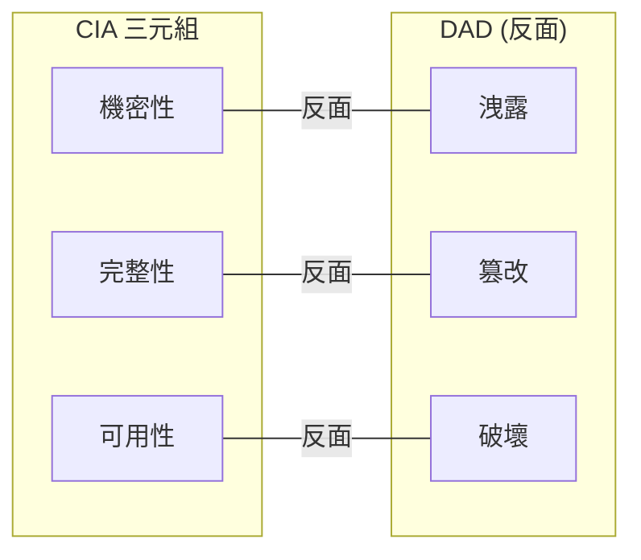

# 1.1 理解核心概念

## 學習目標

- 定義 CIA 三元組及其對立模型 (DAD)
- 解釋機密性機制：加密、存取控制、隱寫術
- 描述完整性控制：雜湊、數位簽章、程式碼簽署
- 識別可用性策略：冗餘、複製、叢集、容錯移轉
- 區分認證因素和方法（MFA、SSO、聯合身分、生物識別）
- 解釋授權模型和存取控制類型
- 定義透過稽核和記錄實現的可歸責性
- 描述透過數位簽章和區塊鏈實現的不可否認性
- 理解 GRC 標準和法規合規

---

## CIA 三元組

**機密性、完整性、可用性（CIA）**三元組是貫穿整個軟體開發生命週期 (SDLC) 的所有軟體安全活動的基礎框架。

CIA 的**反面**是 **DAD**（洩露–篡改–破壞）：

| CIA 目標 | 反面 (DAD) | 重點 |
|----------|-----------|------|
| **機密性 (Confidentiality)** | 洩露 (Disclosure) | 防止未授權存取資訊 |
| **完整性 (Integrity)** | 篡改 (Alteration) | 防止未授權修改資料 |
| **可用性 (Availability)** | 破壞 (Destruction) | 確保及時、可靠地存取資源 |

> **考試提示**：當題目描述威脅或攻擊時，請對應到 CIA 的哪個元素。洩露 → 機密性問題；篡改 → 完整性問題；破壞 → 可用性問題。

---

## 機密性 (Confidentiality)

**定義 (NIST FIPS 199)**：*「保留資訊存取和揭露的授權限制，包括保護個人隱私和專有資訊的方法。」*

### 機密性目標

敏感資料必須在**任何時候**受到保護——無論是：
- **傳輸中**通過網路（例如 TLS 1.3）
- **靜態**在儲存媒體上（例如 AES-256，透明資料加密 TDE）
- **使用中**由應用程式處理（例如存取控制、記憶體保護）

### 機密性機制

| 機制 | 類型 | 描述 |
|------|------|------|
| **加密 (Encryption)** | 顯性 | 將資料轉換為密文；資料傳輸和靜態時的主要方法 |
| **存取控制 (Access Controls)** | 顯性 | 基於身分、角色或需知原則限制存取 |
| **隱寫術 (Steganography)** | 隱性 | 隱藏資訊的存在（例如在影像像素中隱藏資料） |
| **數位浮水印** | 隱性 | 在媒體內容中嵌入識別資訊 |
| **匿名化 (Anonymization)** | 顯性 | 從資料集中移除識別資訊 |
| **權杖化 (Tokenization)** | 顯性 | 用非敏感權杖替代敏感資料 |
| **遮罩 (Masking)** | 顯性 | 用替代值取代資料（例如 `****1234`） |

> **重要區別**：顯性機制（如加密）是直接可觀察的安全措施。隱性機制（如隱寫術）依靠隱藏資料的存在本身——**單獨依靠模糊性的安全永遠不夠**。

### 威脅機密性的攻擊手段

| 攻擊方式 | 描述 |
|----------|------|
| 網路嗅探 | 截取/解碼網路封包以竊取憑證或資料（被動攻擊） |
| 肩窺 (Shoulder surfing) | 在旁邊偷看鍵盤輸入或螢幕資料 |
| 社交工程 | 誘騙授權使用者揭露機密資訊 |
| 駭客入侵 | 利用安全弱點繞過存取控制 |
| 偽裝 (Masquerading) | 使用竊取的憑證冒充授權使用者 |
| 未保護的下載 | 將檔案從安全環境移至未保護的系統 |
| 木馬程式 | 偽裝成合法檔案的惡意軟體 |
| 未加密（明文）資料 | 以明文儲存或傳輸 PII/PHI |

### 保護機密性

機密性保護涉及**多層防禦**——不僅是技術控制：
- 對接觸敏感資訊的人員進行安全意識培訓
- 最小化敏感資訊的保留（減少攻擊面）
- 限制對基礎設施的實體存取（資料中心控制）
- 建立伺服器和媒體的安全處置政策

---

## 完整性 (Integrity)

**定義 (NIST)**：*「一種特性，即資料自建立、傳輸或儲存以來未以未授權方式被更改。」*

### 資料完整性三原則

1. **未授權**主體不能修改資料
2. **授權主體**不能進行未授權的修改
3. 資料在內部和外部保持**一致性**

### 完整性技術控制

#### 雜湊 (Hashing)

密碼學雜湊函數從可變長度輸入建立**固定大小的摘要**。

**良好雜湊函數的特性：**
- **確定性**：相同輸入始終產生相同摘要
- **雪崩效應**：輸入的任何變化（即使 1 位元）都會產生顯著不同的摘要
- **單向性**：無法將摘要反推回原始輸入
- **抗碰撞性**：找到兩個不同輸入具有相同摘要是不可行的

| 訊息 | SHA-256 摘要 |
|------|-------------|
| `Hello World` | `a591a6d40bf420...9ad9f146e` |
| `Hello World` | `a591a6d40bf420...9ad9f146e`（相同） |
| `Hello World!` | `7f83b1657ff1fc...00126d9069`（完全不同） |

> **考試提示**：當兩個不同的輸入產生相同的雜湊時，稱為**雜湊碰撞 (hash collision)**。良好的雜湊函數最小化碰撞的機率。

#### 數位簽章 (Digital Signatures)

將**簽章綁定到身分**以提供完整性和真實性保證。

**建立數位簽章的過程：**
1. 使用密碼學雜湊函數從輸入建立**摘要**
2. 使用簽署者的**私鑰**（非對稱演算法）**加密**摘要

**驗證：**
1. 使用簽署者的**公鑰**解密摘要
2. 獨立雜湊接收的訊息
3. 比較兩個摘要——如果匹配，則確認完整性和真實性

#### 程式碼簽署 (Code Signing)

將數位簽章應用於程式碼，通常用於**分發和維護**階段：
- **完整性保證**：程式碼未被篡改
- **真實性保證**：識別簽署時控制程式碼的實體
- 在**軟體供應鏈**中是關鍵考量

### 生命週期中的完整性

完整性必須在整個資料生命週期中維護：
- **版本控制**（CVS、Subversion、Git）——追蹤變更、時間戳和負責主體
- **需知原則**存取——主體僅獲授存取其工作所需的資料
- **職責分離**——沒有單一主體控制從開始到結束的交易
- **職務輪調**——定期輪換工作以偵測詐欺活動

### 完整性與可信運算基礎 (TCB)

**可信運算基礎 (TCB)** 代表對安全至關重要的所有硬體、軟體、韌體、流程和資源的集合。如果 TCB 完整性遭到破壞（例如惡意軟體），安全政策**將無法再被執行**。

- **可信平台模組 (TPM)**：使用密碼學金鑰來證明開機過程完整性的專用微控制器
- **範例**：Microsoft BitLocker 利用 TPM 晶片

---

## 可用性 (Availability)

**定義**：確保對資料和運算資源的**可靠且及時的存取**。

### 可用性安全控制

| 控制 | 描述 |
|------|------|
| **冗餘 (Redundancy)** | 即使某一元件故障仍能繼續運營 |
| **容錯移轉 (Failover)** | 故障時自動切換到備援系統 |
| **容錯 (Fault Tolerance)** | 元件故障時系統仍繼續運作 |
| **RAID** | 獨立磁碟冗餘陣列——資料冗餘和/或效能提升 |
| **高可用性叢集** | 電腦群組提供具最小停機時間的持續服務 |
| **複製 (Replication)** | 將資料儲存在多個站點或節點 |
| **叢集 (Clustering)** | 將多個伺服器分組作為單一系統運作 |
| **可擴展性 (Scalability)** | 增加容量以滿足需求的能力 |

### 關鍵可用性指標

| 指標 | 全名 | 描述 |
|------|------|------|
| **MTD** | 最大可容忍停機時間 | 軟體在不可接受的業務影響之前可以不可用的最大時間 |
| **RTO** | 恢復時間目標 | 將系統恢復到預期狀態的目標時間（**RTO < MTD**） |
| **RPO** | 恢復點目標 | 以時間衡量的最大可接受資料損失 |

> **關鍵規則：RTO < MTD** - 恢復必須在最大可容忍停機時間到達之前完成。

---

## 認證 (Authentication)

**定義**：以足夠的確定性建立實體**身分**的過程。

### 認證因素

| 因素 | 類別 | 範例 |
|------|------|------|
| **你知道的** | 知識 | 密碼、PIN、安全問題 |
| **你擁有的** | 所有權 | 權杖、智慧卡、手機、硬體金鑰 |
| **你是的** | 特徵 | 指紋、臉部識別、虹膜掃描 |
| **你做的** | 行為 | 打字模式、步態、手勢 |
| **你在的** | 位置 | GPS、IP 地理定位 |

### 多因素認證 (MFA)

結合**兩個或以上**不同因素類型。**FFIEC**（聯邦金融機構審查委員會）指南強調，單因素認證對於網路銀行是**不足夠的**——需要包括 MFA 在內的補償控制。

> **考試提示**：MFA 要求來自**不同類別**的因素。使用兩個密碼（都是「你知道的」）**不是** MFA。

### 身分與存取管理 (IAM)

IAM 包括用於管理企業資源存取的人員、流程和系統：
1. **識別** → 聲稱一個身分（例如使用者名稱、電子郵件）
2. **認證** → 驗證所聲稱的身分
3. **授權** → 基於已驗證的身分授予存取權限
4. **可歸責性** → 透過稽核軌跡追蹤行為

### 單一登入 (SSO)

允許使用者**認證一次**即可存取多個系統/應用程式而無需重新認證。降低密碼疲勞但產生**單一妥協點**。

### 聯合身分 (Federated Identity)

跨組織邊界延伸信任：
- **身分提供者 (IdP)** — 持有身分並產生權杖
- **依賴方 (RP)** — 消費權杖的服務提供者
- 類似於 Active Directory 中的 Kerberos，但**跨網域**運作

**關鍵聯合標準：**

| 標準 | 用途 |
|------|------|
| **SAML 2.0** | 組織間交換安全斷言的 XML 框架 |
| **OAuth 2.0** | 授權框架，使第三方限制存取 HTTP 服務 |
| **OpenID Connect** | 建構在 OAuth 2.0 上的認證協定，使用 JSON/REST |

> **關鍵區分**：SAML = 認證 + 授權。OAuth = 僅授權。OpenID Connect = OAuth 之上的認證層。

### 生物識別 (Biometrics)

使用唯一的生理或行為特徵進行識別/認證：
- Touch ID、Face ID、虹膜掃描、語音識別
- 基準測量被捕獲、密碼學雜湊後儲存在智慧卡或安全權杖上
- 在行動環境中日益被接受

### 摘要認證 (Digest Authentication)

避免以明文傳送憑證——而是傳送帶有**鹽值**的**訊息摘要（雜湊）**。

---

## 授權 (Authorization)

**定義**：確認已認證的實體擁有存取和執行所請求資源操作所需的權限和特權。

### 核心概念
- **主體 (Subject)** — 請求存取的實體（使用者、行程、服務）
- **物件 (Object)** — 被存取的資源（檔案、資料庫、API）
- **動作 (Action)** — 主體想要做什麼（讀取、寫入、執行、刪除）

### 存取控制模型

| 模型 | 描述 | 關鍵特徵 |
|------|------|----------|
| **DAC**（自主性） | 擁有者透過 ACL 或能力表控制存取 | 彈性但安全性為選用 |
| **MAC**（強制性） | 系統基於敏感度標籤強制存取 | 嚴格，源於軍事 |
| **RBAC**（角色基礎） | 基於指定角色的存取 | 可實作 DAC、MAC 或 NDAC |
| **ABAC**（屬性基礎） | 基於主體、物件、環境屬性的存取 | 細粒度，使用 XACML |
| **規則基礎** | 由預定義規則控制存取（例如每日時段） | 較不常見 |
| **資源基礎** | 基於資源授予存取，適用於 SOA | 支援模擬/委派 |

### ACL 與能力表

| 視角 | 模型 | 描述 |
|------|------|------|
| **物件視角** | ACL | 「哪些主體可以存取此物件？」 |
| **主體視角** | 能力表 | 「此主體可以存取哪些物件？」 |

### 委派模型

| 模型 | 描述 |
|------|------|
| **模擬/委派** | 次要實體代表主要實體行事（例如 Kerberos 票證） |
| **可信子系統** | 基於受信任資源的身分而非使用者身分做出存取決策 |

---

## 可歸責性 (Accountability)

**定義**：確定系統中主體的行為和行動以及識別該特定主體的能力。

### 稽核 (Auditing)

回答：**「誰（主體）做了什麼（動作）何時（時間戳）在哪裡（物件）？」**

- 可以是一次性、定期或持續進行
- 稽核軌跡提供處理過程的書面證據
- 同時具有**偵測**和**嚇阻**控制功能
- 所有**特權和關鍵業務交易**必須被記錄和追蹤

### 記錄 (Logging)

- 提供關於**事件順序**的書面證據
- 支援管理員、開發人員、支援人員、安全/隱私/合規人員
- **關鍵區別**：應用程式追蹤日誌（用於除錯）vs. 安全/合規日誌
- 日誌**可能包含敏感資訊**——無論是有意或無意的

> **考試提示**：記錄需求應在 SDLC **早期**由所有利害關係人識別。這經常被忽視。

### SIEM（安全資訊和事件管理）

集中來自不同來源的日誌收集、正規化和關聯：
- 安全監控
- 事件調查和回應
- 進階威脅偵測
- 法規和合規監控

---

## 不可否認性 (Nonrepudiation)

**定義 (NIST)**：*「防止個人錯誤地否認曾執行特定行為。」*

不可否認性是正確實施以下的**結果**：
- **識別**（由認證執行）
- **稽核軌跡**（由可歸責性/記錄執行）

當認證、授權和稽核正確配置時，不可否認性即得到保證。

### 用於不可否認性的數位簽章

**建立數位簽章：**
1. 使用單向密碼學雜湊函數建立**摘要**
2. 使用簽署者的**私鑰**加密摘要（非對稱加密）

**驗證數位簽章：**
1. 使用簽署者的**公鑰**解密
2. 與獨立計算的訊息雜湊比較

### 區塊鏈 (Blockchain)

儲存在以對等方式連接的公共資料庫中的、帶時間戳的**不可變記錄**（區塊）序列（鏈）。

**安全特性：**
- **防篡改**：新區塊只能加到鏈的末端；一旦加入就無法移除
- **冗餘**：獨立、自主的節點儲存冗餘副本
- **透明**：可公開查看及安全稽核軌跡
- **無單點故障**：分散在眾多節點

---

## 治理、風險和合規 (GRC)

**GRC** 是一種有紀律的方法，用於協調業務目標和 IT 基礎設施，同時控制風險並處理法規。

| 組成部分 | 目的 |
|----------|------|
| **治理 (Governance)** | 建立實現業務目標的政策和程序 |
| **風險管理 (Risk Management)** | 識別並將風險降低到可接受的水準 |
| **合規 (Compliance)** | 確保適用的法律和法規得到滿足 |

### 關鍵法規考量

#### 美國法規

| 法規 | 重點 |
|------|------|
| **HIPAA** (1996) | 個人健康資訊 (PHI) 保護 |
| **HITECH** (2009) | 電子 PHI 記錄的增強隱私條款 |
| **SOX** (2002) | 上市公司財務報告完整性；第 302 條（公司責任）和第 404 條（內部控制評估） |
| **GLBA** | 保護消費者個人財務資訊 (PFI) |
| **PCI DSS** | 支付卡資料安全；合約性質，違反會有嚴重財務處罰 |
| **FISMA** (2002) | 聯邦機構全機構資訊安全計劃 |
| **COPPA** (1998) | 兒童線上隱私保護 |
| **CCPA** (2018) | 加州消費者隱私 |

#### 非美國法規

| 法規 | 重點 |
|------|------|
| **GDPR** (2018) | 歐盟資料保護和隱私 |
| **歐盟網路安全法** (2019) | 歐盟網路安全框架 |
| **歐盟網路韌性法案** (提案 2022) | 歐盟產品網路韌性 |

### 標準框架

| 標準 | 描述 |
|------|------|
| **ISO 27001** | 資訊安全管理系統 |
| **ISO/IEC 15408 (Common Criteria)** | IT 產品安全評估（TOE, ST, PP, EAL1–EAL7） |
| **NIST SP 800 系列** | 資訊系統安全指南 |
| **NIST RMF** | 風險管理框架（分類→選擇→實施→評估→授權→監控） |
| **FedRAMP** | 雲端產品/服務的標準化安全評估 |
| **OWASP Top 10** | 十大 Web 應用程式安全風險 |

> **Common Criteria 考試提示**：
> - **TOE** = 評估目標（被評估的產品）
> - **ST** = 安全目標（TOE 的安全特性）
> - **PP** = 保護概要（一類產品的安全需求）
> - **EAL1–EAL7** = 評估保證等級（1 = 最低，7 = 最高）

### 管轄權考量

網路應用程式必須考量：
- **使用者**的法律（國家、地區、州）
- **交易資料**的法律
- **託管環境**的法律
- 管轄權之間可能的**衝突**

---

## 考試重點

1. **CIA 三元組**：了解每個元素、其反面 (DAD) 和多個實際範例
2. **隱性 vs. 顯性**：隱寫術 = 隱性；加密 = 顯性
3. **雜湊特性**：確定性、雪崩效應、單向性、抗碰撞性
4. **數位簽章**：雜湊 → 用私鑰加密 → 用公鑰驗證
5. **MFA 因素**：必須來自**不同類別**才算是 MFA
6. **SAML vs OAuth vs OpenID Connect**：SAML（認證+授權）、OAuth（僅授權）、OIDC（OAuth 上的認證）
7. **DAC vs MAC vs RBAC**：DAC（擁有者決定）、MAC（系統強制標籤）、RBAC（角色基礎）
8. **ACL vs 能力表**：ACL = 物件視角，能力表 = 主體視角
9. **不可否認性**：認證 + 可歸責性的結果；透過數位簽章 + 區塊鏈實現
10. **RTO < MTD**：恢復時間必須小於最大可容忍停機時間
11. **TCB/TPM**：TCB = 所有安全關鍵元件；TPM = 開機完整性的硬體證明
12. **法規對應**：SOX = 財務、HIPAA = 醫療、PCI DSS = 支付卡、GLBA = 金融隱私、GDPR = 歐盟資料保護

---

## 關鍵術語表

| 術語 | 定義 |
|------|------|
| **CIA 三元組** | 機密性、完整性、可用性——核心安全目標 |
| **DAD** | 洩露、篡改、破壞——CIA 的反面 |
| **加密 (Encryption)** | 將資料轉換為密文以防止未授權存取 |
| **雜湊 (Hashing)** | 產生固定大小摘要的單向密碼學函數 |
| **數位簽章** | 加密的雜湊摘要，證明完整性和真實性 |
| **程式碼簽署** | 將數位簽章應用於軟體程式碼 |
| **MFA** | 多因素認證，使用兩種或以上不同因素類型 |
| **IAM** | 身分與存取管理 |
| **SSO** | 單一登入——認證一次，存取多個系統 |
| **SAML** | 安全性判斷提示標記語言 |
| **OAuth** | 開放授權框架 |
| **OIDC** | OpenID Connect——OAuth 2.0 上的認證 |
| **DAC** | 自主性存取控制 |
| **MAC** | 強制性存取控制 |
| **RBAC** | 角色基礎存取控制 |
| **ABAC** | 屬性基礎存取控制 |
| **TCB** | 可信運算基礎 |
| **TPM** | 可信平台模組 |
| **SIEM** | 安全資訊和事件管理 |
| **GRC** | 治理、風險和合規 |
| **MTD** | 最大可容忍停機時間 |
| **RTO** | 恢復時間目標 |
| **RPO** | 恢復點目標 |
| **不可否認性** | 確保行為不能被否認 |
| **區塊鏈** | 分散式不可變帳本，用於交易記錄 |
