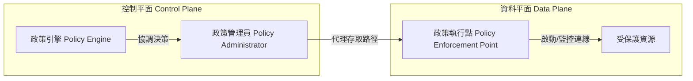
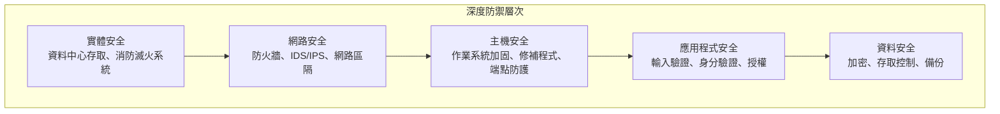

# 1.2 了解安全設計原則 (Understand Security Design Principles)

## 學習目標

- 解釋每個 10+ 項安全設計原則及其在軟體上的應用
- 將設計原則應用於現實世界中的軟體架構情境
- 識別在考試情境中違反或應用了哪些原則
- 了解設計原則與安全軟體成果之間的關係

---

## 概述

安全設計原則是**與技術無關的抽象概念 (technology-agnostic abstractions)**，可在架構層級指導決策，無論平台或程式語言為何。它們奠定了建置與維護安全軟體的基礎。

根據 NIST 所述，安全的系統通常表現出以下特徵：
1. 儘管面臨各種逆境，仍能**交付系統能力**
2. 根據系統所需的能力，將功能**限制**在預期的行為內
3. 透過預先定義的規則集，對**僅限被授權的互動**實施約束

> **考試關鍵點**：安全性的存在是為了**支援業務任務**。企業的存在**不是**為了支援安全。安全設計應達到「足夠的安全 (adequate security)」 — 為了達到支援業務功能的狀態而做出的刻意權衡。

---

## 原則 1：足夠的安全 (Good Enough Security)

**概念**：不要為了保護一張 20 元的鈔票而花費 10,000 元。

- 在安全性與其他層面（可用性、成本、效能）之間始終存在著權衡
- 目標是達到**足夠的安全** — 為資產的價值提供恰如其分的保護等級
- 過度設計 (Over-engineering) 安全性與安全設計不足一樣容易產生問題

| 考量因素 | 問題 |
|--------------|----------|
| 資產價值 | 我們要保護的資產價值多少？ |
| 威脅可能性 | 該威脅發生的可能性有多大？ |
| 影響 | 如果威脅成真，對業務的影響是什麼？ |
| 控制成本 | 該控制措施的成本是否超過了潛在的損失？ |

---

## 原則 2：最小權限 (Least Privilege)

**概念**：主體應**僅擁執行其當前任務所需**的權利與權限 — 僅此而已。

- 如果需要提升權限，應限制在其**所需的最短時間內**
- 將故障、損壞或誤用造成的安全影響降至最低
- 簡化元件的安全性分析
- 這是體現在安全系統設計所有層面的**普遍原則**

### 現實世界範例

| 情境 | 應用 |
|----------|-------------|
| 中介軟體伺服器 | 應只有網路存取權、特定資料庫資料表的讀取權限，以及寫入日誌的權限 — **絕不**應有管理員權限 |
| 行動應用程式 | 需要取得位置資料與聯絡人的手電筒 App = 違反最小權限 |
| SQL 注入 | 當輸入驗證失敗且資料庫帳號具有最高權限時，損害將被放大 |
| 容器執行階段 | 容器應以具有最少功能 (capabilities) 的非 root 使用者身分執行 |

### 零信任 (Zero Trust)

**定義 (NIST SP 800-207)**：這是一套概念的集合，旨在**將不確定性降至最低**，對被視為潛在已被入侵的系統，強制執行準確且基於最小權限的每次請求 (per-request) 存取決策。

**主要教條：**
1. 所有資料來源與運算服務皆視為**資源**
2. 無論網路位置為何，所有的通訊在此網路位置上皆受到**保護**
3. 資源的存取是**以每個工作階段 (per-session) 為單位**授予的
4. 存取權由**動態政策**決定（包含行為屬性）
5. **持續監控**資產的完整性與安全態勢
6. 身分驗證與授權必須是**動態並嚴格執行的**
7. 收集足夠的資料以**改善安全態勢**

**三個 ZT 基礎元件：**



> **考試提示**：零信任會針對「所有」主體執行**相同嚴謹等級**的要求，無論其位置為何（在網路內部或外部）。沒有任何隱含的信任 (implicit trust)。

---

## 原則 3：職責分離 (Separation of Duties, SoD)

**概念**：不應賦予單一主體足夠的權限，使其能夠獨自濫用系統。關鍵功能必須在**多個主體之間劃分**。

### 隔離層級

| 層級 | 說明 | 範例 |
|-------|-------------|---------|
| 基本 | 兩個具有相似功能的不同參與者 | 來自同一個團隊的兩名開發人員 |
| 增強 | 具有不同功能的不同參與者 | 來自不同部門的開發人員與維運人員 |

### 應用

- **程式碼部署**：開發人員**不**應該在沒有獨立審查的情況下，能夠簽入 (check in) 程式碼「並且」將其部署到正式環境
- **密碼學**：將加密流程與金鑰管理流程分離
- **財務**：將建立採購單的人員與核准付款的人員分開

### 相關概念

#### 知識分割 (Split Knowledge)
將一把密碼學金鑰分割成 **n 個部分 (components)**，每個部分單獨都**不提供任何**關於原始金鑰的知識，但可以重新組合以重建原始金鑰。

#### 秘密分享 (Secret Sharing)
將秘密（例如，加密金鑰）分割並將其**分散儲存**在許多參與者間的演算法，使攻擊者無法透過破壞單一節點來還原秘密。

#### 多方控制 (Multi-Party Control)
需要兩個或更多主體一起執行單一的關鍵功能。

> **考試區分重點**：職責分離 = 劃分任務。知識分割 = 劃分秘密。多方控制 = 需要多個人來執行一項動作。

---

## 原則 4：深度防禦 (Defense in Depth)

**概念**：應用**多層次**的防護，當某一層被突破時，後續的防護層能補償防禦。

- 源自於**軍事策略** — 設立障礙以阻礙入侵者前進，同時進行監控與回應
- 運用在網路安全：採用偵測性與保護性措施阻礙網路入侵者，同時發動偵測與事件回應
- 沒有任何單一控制措施被認為是足夠的 — 應採用多種控制措施以不同的方式應對風險

### 分層控制



### 關鍵子概念

#### 安全區域 (Security Zones)
- 系統可以擁有**任意數量**的安全區域
- 每個區域可以擁有**任意數量**的控制措施
- 區域和控制措施的數量取決於資產類型和所需的保護等級

#### 防禦多樣性 (Diversity of Defense)
- 位於各層次的控制措施應在**能力上具有多樣性**
- 每項控制在整體防禦中扮演特定的角色
- 多樣性降低了單一共同缺陷導致所有控制措施皆被突破的可能性

#### 地理多樣性 (Geographical Diversity)
- 在地理上分隔的位置建立備用系統
- 隔離因自然災害而中斷營運的風險

#### 技術多樣性 (Technical Diversity)
- 針對關鍵系統使用多家供應商或多種技術
- 降低因單一供應商漏洞而帶來的風險

#### 輸入驗證 (Input Validation)
- 保護網站應用程式免於漏洞攻擊的最**重要策略之一**
- 防止受到外部影響的惡意輸入進入系統
- 構成整體深度防禦的關鍵部分

---

## 原則 5：韌性 (Resiliency)

**概念**：軟體必須在**安全/具防護的狀態下發生失敗 (fail-safe/fail-secure)** 並迅速恢復。

### 故障安全 / 故障保護 (Fail Safe / Fail Secure)

當系統發生故障時，它應**預設為安全狀態**，在此狀態下：
- 系統與其資料的安全性**不會受到妥協**
- 可能進行快速復原

**關鍵模式**：**明確拒絕 (Explicit deny)** — 任何未被明確授權的行為，預設皆會被拒絕。

| 故障模式 | 行為 | 安全性影響 |
|-------------|----------|-----------------|
| **故障安全/保護** | 預設為被拒絕/鎖定狀態 | ✅ 安全 — 失敗時不會發生未授權存取 |
| **故障開啟 (Fail-open)** | 預設為允許/解鎖狀態 | ❌ 不安全 — 可能發生未授權存取 |

### 無單點故障 (No Single Point of Failure, SPOF)

- 對於任何有可用性目標的系統來說，單點故障是**不被期望的**
- 透過**備援**與**補償性控制**來消除
- 許多 SPOF 都是由架構與設計決策所引入
- 消除 SPOF 可能需要付出巨大努力

### 軟體環境中的韌性

- 軟體**未違反任何安全政策**，且**能夠承受**威脅代理人的攻擊行為
- 適用於蓄意攻擊/漏洞濫用以及意外的使用者錯誤

> **考試提示**：當考題說軟體「承受誤用與攻擊」時，答案是**韌性 (resilient)**。當它說「如預期般運作」時，答案是**可靠 (reliable)**。當它說「恢復正常運作」時，答案是**可復原 (recoverable)**。

---

## 原則 6：機制經濟性 (Economy of Mechanism)

**概念**：保持安全性**簡單明瞭**。設計越複雜，漏洞未被發現的可能性就越高。

### 重點

- 相較於簡單的做法，複雜的方法**不一定**能提升安全性
- 複雜性增加了根本原因分析 (Root Cause Analysis, RCA) 的難度
- **經驗法則**：消除所有非必要的服務與通訊協定
- 簡單的系統較容易進行除錯、使用與管理

### OWASP 範例
> 「雖然在獨立中介軟體伺服器上執行一大堆實體 Bean (Entity Beans) 看似很流行，但使用全域變數搭配適當的互斥鎖 (mutex) 機制來防止競態條件 (race conditions)，實際上會更安全且更快速。」

### 密碼庫 (Password Vaults)

加密儲存庫為秘密（金鑰、密碼）提供安全的儲存空間：
- 產生獨特、夠長、複雜、容易更改的密碼
- 安全的加密儲存（本機端或雲端）
- 簡化存取管理（用單一機制取代許多機制）

### 資源效率

軟體必須有效管理底層的硬體資源：
- 適當地**配置**資源（儲存空間、CPU、RAM）
- 執行完成時**釋放 (deallocate)** 資源
- 糟糕的資源管理會剝奪其他軟體運作所需的資源
- 弱點範例：CWE-787 (越界寫入)、CWE-125 (越界讀取)、CWE-190 (整數溢位)、CWE-476 (空指標提取)

---

## 原則 7：完全仲裁 (Complete Mediation)

**概念**：主體要求存取物件的每一次請求，都必須**透過有效的授權程序進行審查** — 無論是哪一次，都不應僅在第一次請求時檢查。

### 重點

- **絕不**依賴「只檢查一次並快取起來」的權限
- 快取權限確實可以提升效能，但**存在允許未獲授權存取的風險**
- 應該要在**每次**要求存取時驗證授權

### 經典範例（UNIX 檔案描述符）
1. 行程要求讀取檔案 → 作業系統檢查權限 → 指派檔案描述符 (file descriptor)
2. 檔案擁有者隨後**撤銷**了該行程的權限
3. 該行程**仍然擁有**檔案描述符，並且可以讀取檔案
4. **發生違規**：沒有對第二次存取進行檢查；導致系統使用了快取值

### 應用程式軟體範例

| 領域 | 完全仲裁實務 |
|------|---------------------------|
| **Cookie 管理** | 在每次發出請求時重新驗證 Session Cookie |
| **作業階段管理 (Session)** | 持續驗證 Session 狀態與權限 |
| **憑證快取** | 避免具有較長生命週期的快取憑證 |
| **API 呼叫** | 對每一次 API 呼叫請求進行驗證與授權 |

---

## 原則 8：演算法/設計公開 (Open Design)

**概念**：系統的安全性**不應依賴於其設計、實作或元件的隱密性 (secrecy)**。

### 柯克霍夫原則 (Kerckhoffs's Principle)

> *一個密碼系統的安全性應當保持完好，即使系統的一切細節皆為公開知識 — 只要金鑰的隱密性得到維護即可。*

### 公開設計 vs. 隱晦式安全 (Security by Obscurity)

| 方法 | 說明 | 安全性 |
|----------|-------------|----------|
| **演算法公開 (Open Design)** | 公開已發表的演算法、同儕審查、群眾外包測試 | ✅ 強 — 透過嚴格審查證明 |
| **隱晦式安全** | 安全性仰賴於隱藏設計本身 | ❌ 弱 — 被發現 = 被攻破 |

**隱晦式安全的範例（錯誤實務）：**
- 將敏感資訊寫死防存在原始碼中 (Hard-coding)
- 在網站應用程式中使用隱藏的表單欄位
- 自定義 / 專有的密碼學演算法

**演算法公開的範例（良好實務）：**
- **AES** — 自 2001 年起開源，受到廣泛仔細審查，至今仍是最安全的加密方法之一

### MOSA (模組化開放系統方法 Modular Open Systems Approach)

一種用來設計適應性極強系統的商業與技術策略：
- 主要介面點必須具備**模組化**
- 採用且**獲得廣泛支援的標準**
- 支援**互通性 (interoperability)、可擴充性與可移植性**

### 開源軟體 (OSS)

- 開源軟體因為原始碼公開，本身**並不必然**更加安全或更不安全
- 安全性取決於社群的嚴謹度、提供更新維護的量能以及測試流程
- 關鍵問題：有多少貢獻者參與？提交流程為何？測試的等級？

### 協作設計 / 同儕審查 (Peer Review)

- 在協作開發環境中，同儕審查**至關重要**
- 匯集全球多元貢獻者的能力，能夠提供不同的技能、經驗與視角
- 透過群眾外包產生的資安評論是極具價值的

---

## 原則 9：最小公共機制 (Least Common Mechanism)

**概念**：將共享於多個主體之間的保護機制數量降至**最低**，以減少未經授權資訊交換的路徑。

### 重點

- 共享的存取路徑可能成為未經授權傳遞交換資訊的來源
- 對每個主體/類別使用不同的機制（或其實例化），能夠提供彈性並防止安全違規

### 區域化 / 隔離 (Compartmentalization / Isolation)

- 限制使用者角色，使**不同功能係依據使用者角色來執行**
- 這與所有角色皆通用單一功能的作法形成對比
- 減少耦合性 (coupling) 並防止資訊洩漏

### 允許清單 (Allow/Accept Lists)

- **明確允許**存取特定資源，同時預設**拒絕其他所有請求**
- 試圖以非標準方式存取會被拒絕
- 筆僅阻擋已知不良項目之黑名單 (deny lists) 作法來得更安全

### SOA 獨立性

在服務導向架構 (SOA) 中，單一服務**不應與其他服務共享通用機制**，以保持獨立性並降低耦合性。

> **考試區分重點**：
> - **最小權限** = 限制主體**能做什麼**
> - **最小公共機制** = 限制多個主體能**共用什麼**（機制/路徑）

---

## 原則 10：心理可接受度 (Psychological Acceptability)

**概念**：安全功能應**易於使用**且對使用者來說必須是**透明的**。如果安全措施成為障礙，使用者就會試圖繞過它。

### 重點

- 系統安全是一個不應對使用者施加**任何負擔**的關鍵功能要素
- 如果機制妨礙了存取性或降低了可用性，主體就會將其關閉或試圖繞過它
- **CWE-655**：不充分的心理可接受度 (Insufficient Psychological Acceptability) — 當保護機制太難操作或太不方便時

### 應用

| 範圍 | 良好實務 | 錯誤實務 |
|------|--------------|-------------|
| **密碼複雜度** | 提出合理的要求，並能支援密碼管理員工具 | 密碼政策太過複雜，導致使用者將密碼寫在紙上 |
| **無密碼驗證** | 生物辨識、硬體金鑰、一次性驗證碼 | N/A |
| **CAPTCHA** | 對機器人來說適當困難，但對人類來說很簡單 | 使用扭曲得令人類無法辨識的圖像 |
| **畫面佈局** | 將直觀的安全控制項整合進工作流程中 | 中斷使用者正常工作流程的安全性提示 |

### 密碼熵 (Password Entropy)

用以衡量密碼複雜度的數學計算：

```
可能組合的總數 (Number of Possible Combinations) = S^L
熵 (Entropy) = log₂(可能組合的總數)
預期猜測次數 (Expected Guesses) = 2^(熵 - 1)

L = 密碼長度
S = 不重複可用字元的字元集大小 (Pool size)
```

| 字元集 | 集大小 (S) |
|---------------|--------------|
| 僅數字 (0–9) | 10 |
| 小寫字母 (a–z) | 26 |
| 大小寫字母 (a–z, A–Z) | 52 |
| ASCII 可列印字元 (字母、數字、符號) | 95 |

> **考試範例**：一組必須完全是 8 位數、僅含數字的銀行登入 PIN 碼，共有 = 10^8 = 100,000,000 種可能的組合。

### 無密碼身分驗證 (Passwordless Authentication)

不使用密碼進行驗證的現代方法：
- 基於電子郵件存取
- 基於裝置存取（手機推播通知）
- 一次性密碼 (One-time passcodes)
- 生物辨識（Touch ID、Face ID）
- 無密碼 MFA：「你擁有的」 + 「你本身的」

### CAPTCHA 的弱點漏洞

能夠攻破 CAPTCHA 被披露公開的弱點：
- 對原始影像的扭曲程度不足
- 採用具備可識別格式的數學題目
- 問題僅有數量有限的可能答案可以猜測
- 能透過資料庫查詢得到答案的常識問題
- CAPTCHA 影像中隱藏了暗示答案的元資料 (metadata)

---

## 原則 11：元件重複使用 (Component Reuse)

**概念**：推廣**重複使用現有、經過測試元件**，以避免引入新的漏洞並增加攻擊面的面積。

### 好處

- 越少新的元件 = 越少新的漏洞
- 縮小攻擊表面積 (Attack surface area)
- 經過測試和驗證的函式庫可提供已知的安全特性
- 開發更有效率

### 注意事項

- 將功能集中化等同於把「雞蛋放在同一個籃子裡」
- 必須透過深度防禦與分層安全性進行緩解
- **單一化風險 (Monoculture risk)**：如果被重複使用的元件存在漏洞，其造成的影響將極為廣泛

### 常見的反模式 (Anti-Pattern)

> 開發團隊往往常偏好編寫自己的密碼學演算法，而不是使用經標準驗證的 AES 等演算法。自行實作的加解密技術通常幾乎會被當作是**最弱的一環**，並導致敏感資訊被意外洩漏。

### 函式庫與通用控制項

- **永遠**應重複且妥善使用值得信賴、經過驗證的函式庫與控制項
- 使用經業界證實可行的工具，遠勝於為每套系統從頭實作全新的工具
- 將常見的安全性功能（身分驗證、日誌記錄、輸入驗證）集中化管理

---

## 原則總結

| # | 原則 | 核心理念 | 關鍵考試術語 |
|---|-----------|-----------|--------------|
| 1 | 足夠的安全 (Good Enough Security) | 在保護成本與資產價值之間取得平衡 | 權衡 (Trade-offs) |
| 2 | 最小權限 (Least Privilege) | 給予所需的最少限度權限，並限制在最短時間內 | 零信任、需知情 |
| 3 | 職責分離 (Separation of Duties) | 無單一主體能控制端到端的全部流程 | 知識分割、多方控制 |
| 4 | 深度防禦 (Defense in Depth) | 多層次、多樣化的控制保護 | 安全區域、輸入驗證 |
| 5 | 韌性 (Resiliency) | 失敗時退回安全狀態、無單點故障 | 故障安全、預設拒絕 |
| 6 | 機制經濟性 (Economy of Mechanism) | 保持設計極簡化 | 消除非必需項 |
| 7 | 完全仲裁 (Complete Mediation) | 在每次的存取前都要求驗證授權 | 絕不快取權限 |
| 8 | 開放設計 (Open Design) | 不得依賴設計本身的隱蔽性來保護安全 | 柯克霍夫原則 |
| 9 | 最小公共機制 (Least Common Mechanism) | 將共享的機制降到最低限度 | 區域化 / 隔離 |
| 10 | 心理可接受度 (Psychological Acceptability) | 安全措施必須是方便易用的 | CWE-655、無密碼登入 |
| 11 | 元件重複使用 (Component Reuse) | 優先重複使用經歷過實證的元件 | 共同控制項、函式庫 |

---

## 考試重點

1. **足夠的安全** ≠ 最少的資源安全防護；它意味著與資產價值相對應的**適度**安全性
2. **最小權限 vs. 最小公共機制**：最小權限限制**權力與授權許可**；最小公共機制限制的是**共享路徑**
3. **故障安全 (Fail-safe) = 故障防護 (fail-secure)**：系統故障時，會預設回到被拒絕/鎖定的安全狀態
4. **完全仲裁**：必須在**每次存取**時都驗證授權，而非僅限首次
5. **開放設計**：柯克霍夫原則 — 密碼學的安全性取決於金鑰是否保密，而非演算法是否保密
6. **心理可接受度**：CWE-655 明確指出了防護機制如果太過不便時的弱點
7. **元件重複使用**：自行撰寫加密演算法 = 反面模式；請優先使用 AES 和其他實體驗證過的標準
8. **零信任**：不論所在網路區域為何，皆不再有單純隱含的授權信任；需要被持續進行驗證
9. **知識分割 vs. 秘密分享**：知識分割 = 將一把金鑰分成多個部分；秘密分享 = 透過演算法進行分散儲存
10. **程式碼部署的職責分離**：負責撰寫程式碼的開發人員，「絕不」容許他們同時能把程式部署至正式環境 (Production)

---

## 關鍵術語表

| 術語 | 定義 |
|------|-----------|
| **Least Privilege (最小權限)** | 僅提供執行特定任務所需的最少限度權利 |
| **Zero Trust (零信任)** | 假定所有網路皆已遭受系統入侵的安全模型；需要對每次請求執行持續驗證 |
| **SoD (職責分離)** | Separation of Duties — 將關鍵功能分配給多個不同主體處理 |
| **Split Knowledge (知識分割)** | 將密碼金鑰分割成各自獨立無法透露全貌的多個區塊 |
| **Secret Sharing (秘密分享)** | 透過演算法的方式跨多個參與者儲存秘密資料 |
| **Defense in Depth (深度防禦)** | 由多層且多樣化控制措施結合而成的防護體系 |
| **Security Zones (安全區域)** | 具備特定安全控制項保護而群組在一起的邏輯劃分區域 |
| **Fail-Safe / Fail-Secure (故障安全)** | 失敗時會自動退回到安全狀態下 |
| **Explicit Deny (明確拒絕)** | 如果沒有被明確明文被授權存取，預設一律拒絕存取 |
| **SPOF (單點故障)** | 單點故障 (Single Point of Failure) |
| **Economy of Mechanism (機制經濟性)** | 將安全設計維持極簡與核心配置，排除過度複雜設計 |
| **Complete Mediation (完全仲裁)** | 每個存取存取請求都應驗證授權 |
| **Kerckhoffs's Principle (柯克霍夫原則)** | 密碼安全性乃基於金鑰的被保密狀態，而非密碼演算法機制的秘密隱匿狀態 |
| **MOSA (模組化開放系統設計)** | 模組化開放系統方法 (Modular Open Systems Approach) |
| **OSS** | 開源軟體 (Open-Source Software) |
| **Compartmentalization (區域隔離)** | 基於使用者角色獨立分隔所執行的不同功能 |
| **Allow/Accept List (允許清單)** | 明確明文許可指定的可用存取途徑，並預設同時阻擋其他任何外部的存取操作 |
| **Psychological Acceptability (心理可接受度)** | 系統安全防護機制應該兼具容易操作及對終端使用者之透明化體驗 |
| **CWE-655** | 不充分的心理可接受度弱點 |
| **Password Entropy (密碼熵)** | 高難度複雜密碼組合總變化性的數學演算法衡量指標 |
| **CAPTCHA** | 協助區分真人還是電腦自動化執行程式的鑑別式自動測驗 |
| **Component Reuse (元件重複使用)** | 有效益地重複運用現成的、曾通過考驗模組化功能取代一切重頭的作法 |
| **Monoculture (單一化風險)** | 因大量普及地依賴並使用同一項技術而衍生出來的深遠風險 |
