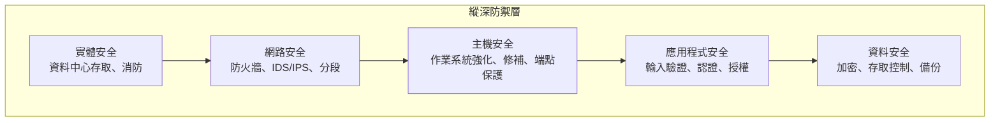

# 1.2 理解安全設計原則

## 學習目標

- 解釋每個安全設計原則及其在軟體中的應用
- 將設計原則應用於真實軟體架構情境
- 在考試情境中識別正在被違反或應用的原則
- 理解設計原則與安全軟體成果之間的關係

---

## 概述

安全設計原則是**技術中立的抽象概念**，在架構層面指導決策，不受平台或程式語言影響。它們為建構和維護安全軟體奠定基礎。

根據 NIST，安全系統通常展現以下特性：
1. 儘管面對各種逆境，仍能**交付系統功能**
2. 根據系統需求，將功能**約束**到期望的行為
3. 透過預定義規則集**強制執行約束**，僅允許授權的互動和操作

> **關鍵考點**：安全的存在是為了**支持業務使命**。業務**不是**為了支持安全而存在。安全設計應達成「適當安全」——為支持業務功能而進行的有意權衡。

---

## 原則 1：適度安全 (Good Enough Security)

**概念**：不要花 10,000 美元去保護 20 美元的鈔票。

- 安全與其他方面（可用性、成本、效能）之間始終存在權衡
- 目標是**適當的安全**——對資產價值提供適當的保護水準
- 過度設計安全和不足設計一樣有問題

| 考量 | 問題 |
|------|------|
| 資產價值 | 我們保護的東西價值多少？ |
| 威脅可能性 | 威脅實現的可能性有多高？ |
| 影響 | 如果威脅實現，業務影響是什麼？ |
| 控制成本 | 控制的成本是否超過潛在損失？ |

---

## 原則 2：最小權限 (Least Privilege)

**概念**：主體應該**僅具有執行當前任務所需的權限**——不能更多。

- 如果需要提升權限，應限制在**完成操作所需的最短時間**
- 最小化故障、損壞或濫用的安全影響
- 簡化元件的安全分析
- 反映在安全系統設計所有方面的**普遍原則**

### 實際範例

| 情境 | 應用 |
|------|------|
| 中介軟體伺服器 | 應僅具有網路存取、DB 表讀取和日誌寫入權限——**永不**給予管理員特權 |
| 行動應用 | 手電筒 App 要求位置資料和通訊錄 = 違反最小權限 |
| SQL 注入 | 當輸入驗證失敗且資料庫帳戶有提升權限時，損害會被放大 |
| 容器執行 | 容器應以非 root 使用者運行，僅具最小能力 |

### 零信任 (Zero Trust)

**定義 (NIST SP 800-207)**：一組旨在**最小化不確定性**的概念，用於在被視為可能已遭破壞的系統中強制執行準確的、最小權限的逐次請求存取決策。

**關鍵原則：**
1. 所有資料來源和運算服務都是**資源**
2. 所有通訊都受到**保護**，不論網路位置
3. 對資源的存取**逐會話**授予
4. 存取由**動態策略**決定（包括行為屬性）
5. **持續監控**資產的完整性和安全態勢
6. 認證和授權是**動態且嚴格執行的**
7. 收集足夠的資料來**改善安全態勢**

**三個零信任組件：**


> **考試提示**：零信任對**所有**主體強制執行**相同等級的嚴格驗證**，無論在網路內部或外部。沒有隱含的信任。

---

## 原則 3：職責分離 (Separation of Duties / SoD)

**概念**：不應給予任何單一主體足夠的權限來獨自濫用系統。關鍵功能必須**在主體之間劃分**。

### 分離層級

| 層級 | 描述 | 範例 |
|------|------|------|
| 基本 | 具有相似功能的兩個不同行為者 | 同一團隊的兩位開發人員 |
| 增強 | 具有不同功能的不同行為者 | 來自不同部門的開發和營運人員 |

### 應用

- **程式碼部署**：開發人員不應既能提交程式碼又能將其部署到生產環境，而不經獨立審查
- **密碼學**：將加密過程與金鑰管理過程分離
- **財務**：將建立採購訂單的人與批准付款的人分開

### 相關概念

#### 分割知識 (Split Knowledge)
密碼學金鑰被分割成 **n 個組件**，每個個別組件不提供原始金鑰的任何知識，但可重新組合以重建原始金鑰。

#### 秘密共享 (Secret Sharing)
將秘密（如加密金鑰）分段並以**分散方式**儲存在多個參與者之間，使攻擊者不可能透過破壞單一節點來恢復秘密。

#### 多方控制 (Multi-Party Control)
要求兩個或以上的主體共同執行單一關鍵功能。

> **考試區分**：職責分離 = 劃分任務。分割知識 = 劃分秘密。多方控制 = 要求多人共同完成一個動作。

---

## 原則 4：縱深防禦 (Defense in Depth)

**概念**：應用**多層保護**，後續的層在前一層被突破時提供補償。

- 源於**軍事戰略**——設置障礙阻礙入侵者進展，同時監控和回應
- 在網路安全中：偵測和保護措施阻礙網路入侵者，同時實現偵測和回應
- 沒有單一控制被認為足夠——多個從不同面向處理風險的控制

### 分層控制



### 重要子概念

| 子概念 | 描述 |
|--------|------|
| **安全區域** | 系統可有任意數量的安全區域，每個區域有特定的控制 |
| **防禦多樣性** | 各層的控制應在能力上多樣化，減少共同缺陷的可能性 |
| **地理多樣性** | 應急系統在地理上分離的位置，以隔離自然災害 |
| **技術多樣性** | 使用來自多個供應商或技術的關鍵系統 |
| **輸入驗證** | 防止 Web 應用程式漏洞的**最重要策略之一** |

---

## 原則 5：韌性 (Resiliency)

**概念**：軟體必須以**安全的方式失敗**並快速恢復。

### 故障安全 / 故障保護 (Fail-Safe / Fail-Secure)

當系統發生故障時，應**預設回到安全狀態**：
- 系統及其資料的安全**不受危害**
- 可快速恢復

**關鍵模式**：**明確拒絕 (Explicit deny)** — 未經特定授權的一切均被拒絕。

| 故障模式 | 行為 | 安全影響 |
|----------|------|----------|
| **故障安全 (Fail-safe)** | 預設為拒絕/鎖定狀態 | ✅ 安全——故障時無未授權存取 |
| **故障開放 (Fail-open)** | 預設為允許/解鎖狀態 | ❌ 不安全——可能出現未授權存取 |

### 無單點故障 (No SPOF)

- 在任何有可用性目標的系統中，單點故障都是**不可取的**
- 透過**冗餘**和**補償控制**消除
- 許多 SPOF 是由架構和設計決策引入的

> **考試提示**：當題目說軟體「承受誤用和攻擊」，答案是**韌性 (resilient)**。當說「按預期運作」，答案是**可靠 (reliable)**。當說「恢復到正常運營」，答案是**可復原 (recoverable)**。

---

## 原則 6：機制經濟性 (Economy of Mechanism)

**概念**：保持安全**簡單**。設計越複雜，漏洞未被發現的可能性越高。

### 重要觀點

- 複雜的方法**不一定**比簡單方法更能增強安全
- 複雜性增加根本原因分析的難度
- **經驗法則**：消除所有非必要的服務和協定
- 簡單系統更容易排錯、使用和管理

### 密碼保管庫 (Password Vaults)

加密保管庫提供秘密（金鑰、密碼）的安全儲存：
- 產生唯一、長、複雜、易於更改的密碼
- 安全加密儲存（本機或雲端）
- 簡化存取管理（一個機制而非多個）

### 資源效率

軟體必須有效管理底層硬體資源：
- 適當**配置**資源（儲存、CPU、RAM）
- 執行完成後**釋放**資源
- 不良資源管理會剝奪其他軟體的必要資源
- 弱點範例：CWE-787（越界寫入）、CWE-125（越界讀取）、CWE-190（整數溢位）、CWE-476（NULL 指標解引用）

---

## 原則 7：完全調解 (Complete Mediation)

**概念**：主體對物件的每一次存取請求都必須經過**有效的授權程序驗證**——每一次，而非僅第一次。

### 重要觀點

- **永遠不要**依靠檢查一次後快取的權限
- 快取權限改善效能但**有允許未授權存取的風險**
- 每次請求存取時都應驗證授權

### 經典範例（UNIX 檔案描述符）
1. 行程請求檔案讀取 → 作業系統檢查權限 → 授予檔案描述符
2. 檔案擁有者稍後**撤銷**權限
3. 行程**仍然持有**檔案描述符並可讀取檔案
4. **違反**：第二次存取未被檢查；使用了快取值

### 軟體應用

| 領域 | 完全調解實踐 |
|------|-------------|
| **Cookie 管理** | 每次請求重新驗證會話 Cookie |
| **會話管理** | 持續驗證會話狀態和權限 |
| **憑證快取** | 避免長期快取的憑證 |
| **API 呼叫** | 對每個 API 請求進行認證和授權 |

---

## 原則 8：開放設計 (Open Design)

**概念**：系統的安全不應**依賴於**其設計、實作或元件的保密性。

### 柯克霍夫原則 (Kerckhoffs's Principle)

> *加密系統的安全性應得到維護，即使系統的一切都是公開知識——只要金鑰的保密性得到維護。*

### 開放設計 vs. 模糊安全 (Security by Obscurity)

| 方法 | 描述 | 安全性 |
|------|------|--------|
| **開放設計** | 公開演算法、同行審查、群眾測試 | ✅ 強——透過審查得到驗證 |
| **模糊安全** | 安全依賴於隱藏設計本身 | ❌ 弱——發現 = 妥協 |

**模糊安全的範例（不良實踐）：**
- 在原始碼中硬編碼敏感資訊
- 使用 Web 應用程式中的隱藏表單欄位
- 自訂/專有密碼學演算法

**開放設計的範例（良好實踐）：**
- **AES** — 自 2001 年以來開源，廣泛審查，仍是最安全的加密方法之一

### 開源軟體 (OSS)

- OSS **不是天生地**因為原始碼可用而更安全或更不安全
- 安全性取決於社群的嚴格度、更新頻寬和測試流程
- 關鍵問題：有多少貢獻者？提交流程是什麼？測試水準如何？

---

## 原則 9：最小共用機制 (Least Common Mechanism)

**概念**：最小化多個主體之間**共享**的保護機制數量，以減少未授權資訊交換路徑。

### 分區化 / 隔離 (Compartmentalization / Isolation)

- 限制使用者角色，使**不同功能基於使用者角色執行**
- 與所有角色使用單一功能相反
- 減少耦合並防止資訊洩漏

### 允許/接受清單 (Allow/Accept Lists)

- **明確允許**存取特定資源，同時**預設拒絕其他一切**
- 嘗試以非標準方式存取會被拒絕
- 比拒絕清單（封鎖清單）更安全

> **考試區分**：
> - **最小權限** = 限制主體**能做什麼**
> - **最小共用機制** = 限制主體**共享什麼**（機制/路徑）

---

## 原則 10：心理可接受性 (Psychological Acceptability)

**概念**：安全功能應該**易於使用**且對使用者**透明**。如果安全成為障礙，使用者會繞過它。

### 重要觀點

- 安全是關鍵功能元素，但不應對使用者造成**任何負擔**
- 如果機制妨礙存取或降低可用性，主體會關閉或繞過它們
- **CWE-655**：心理可接受性不足——當保護機制太難使用或太不方便時

### 應用

| 領域 | 良好實踐 | 不良實踐 |
|------|----------|----------|
| **密碼複雜度** | 合理要求，搭配密碼管理器 | 政策太複雜以至於使用者需要寫下密碼 |
| **無密碼認證** | 生物識別、硬體金鑰、一次性代碼 | 不適用 |
| **CAPTCHA** | 對機器人適當困難，對人類容易 | 人類也無法辨讀的扭曲影像 |
| **畫面配置** | 整合在工作流程中的直覺安全控制 | 中斷使用者流程的安全提示 |

### 密碼熵 (Password Entropy)

密碼複雜度的數學衡量：

```
可能組合數 = S^L
熵 = log₂(可能組合數)
預期猜測次數 = 2^(熵 - 1)

L = 密碼長度
S = 唯一可能字元池大小
```

| 字元池 | 池大小 (S) |
|--------|-----------|
| 僅數字 (0–9) | 10 |
| 小寫字母 (a–z) | 26 |
| 大小寫 (a–z, A–Z) | 52 |
| ASCII 可列印字元 | 95 |

> **考試範例**：恰好 8 位數的銀行 PIN，僅限數字 = 10^8 = 100,000,000 種可能的 PIN。

### 無密碼認證 (Passwordless Authentication)

不使用密碼的現代認證方法：
- 電子郵件存取、裝置推送通知、一次性密碼
- 生物識別（Touch ID、Face ID）
- 無密碼 MFA：「你擁有的」+「你是的」

---

## 原則 11：元件重用 (Component Reuse)

**概念**：推廣**重用現有且經過測試的元件**，避免引入新的漏洞和增加攻擊面。

### 好處

- 較少新元件 = 較少新漏洞
- 減少攻擊面
- 經測試和驗證的函式庫提供已知的安全特性

### 注意

- 集中功能 = 「把所有雞蛋放在一個籃子裡」
- 透過縱深防禦和分層安全緩解
- **單一文化風險**：如果重用元件有漏洞，影響範圍廣泛

### 常見反模式

> 開發團隊自行編寫密碼學演算法，而不使用經驗證的標準如 AES。自訂加密實作幾乎總是被發現是**最薄弱的環節**，導致敏感資訊洩露。

---

## 原則總結

| # | 原則 | 核心理念 | 關鍵考試術語 |
|---|------|----------|-------------|
| 1 | 適度安全 | 在保護成本和資產價值之間取得平衡 | 權衡 |
| 2 | 最小權限 | 最少的必要權限，最短的所需時間 | 零信任、需知原則 |
| 3 | 職責分離 | 無單一主體端到端控制 | 分割知識、多方控制 |
| 4 | 縱深防禦 | 多層、多樣化控制 | 安全區域、輸入驗證 |
| 5 | 韌性 | 故障回到安全狀態，無 SPOF | 故障安全、明確拒絕 |
| 6 | 機制經濟性 | 保持簡單 | 消除非必要項目 |
| 7 | 完全調解 | 每次都檢查授權 | 不要快取權限 |
| 8 | 開放設計 | 不依賴設計的保密性 | 柯克霍夫原則 |
| 9 | 最小共用機制 | 最小化共享機制 | 分區化 |
| 10 | 心理可接受性 | 安全必須可用 | CWE-655、無密碼 |
| 11 | 元件重用 | 重用經過測試的元件 | 共用控制、函式庫 |

---

## 考試重點

1. **適度安全** ≠ 最低限度安全；意思是對資產價值**適當的**安全
2. **最小權限 vs. 最小共用機制**：最小權限限制**權限**；最小共用機制限制**共享路徑**
3. **故障安全 = 故障保護**：系統在故障時預設為拒絕/鎖定狀態
4. **完全調解**：授權必須在**每次存取**時驗證，而非僅第一次
5. **開放設計**：柯克霍夫原則——加密安全取決於金鑰保密，而非演算法保密
6. **心理可接受性**：CWE-655 專門處理保護太不方便的情況
7. **元件重用**：自訂加密 = 反模式；使用 AES 和其他經驗證的標準
8. **零信任**：無論網路位置，無隱含信任；持續驗證
9. **分割知識 vs. 秘密共享**：分割知識 = 將一個金鑰分成部分；秘密共享 = 透過演算法分散儲存
10. **職責分離 + 程式碼部署**：撰寫程式碼的開發人員不應同時部署到生產環境

---

## 關鍵術語表

| 術語 | 定義 |
|------|------|
| **最小權限** | 僅提供完成特定任務所需的最少權限 |
| **零信任** | 假設所有網路都已被攻破的安全模型；需要持續驗證 |
| **SoD（職責分離）** | 將關鍵功能劃分給多個主體 |
| **分割知識** | 將密碼學金鑰分割成各自不揭示資訊的部分 |
| **秘密共享** | 透過演算法將秘密分散儲存在多個參與者之間 |
| **縱深防禦** | 多層、多樣化的安全控制 |
| **安全區域** | 具有特定安全控制的邏輯分組 |
| **故障安全/故障保護** | 故障時預設為安全狀態 |
| **明確拒絕** | 除非特別授權，否則預設拒絕存取 |
| **SPOF** | 單點故障 |
| **機制經濟性** | 保持安全設計簡單且最小化 |
| **完全調解** | 在每次存取請求時驗證授權 |
| **柯克霍夫原則** | 加密安全取決於金鑰保密，而非演算法保密 |
| **分區化** | 基於使用者角色隔離功能 |
| **允許/接受清單** | 明確允許特定存取，同時拒絕其他一切 |
| **心理可接受性** | 安全必須易於使用且透明 |
| **CWE-655** | 心理可接受性不足弱點 |
| **密碼熵** | 密碼複雜度的數學衡量 |
| **元件重用** | 利用現有經測試的元件而非建構新的 |
| **單一文化** | 廣泛使用單一技術的風險 |
