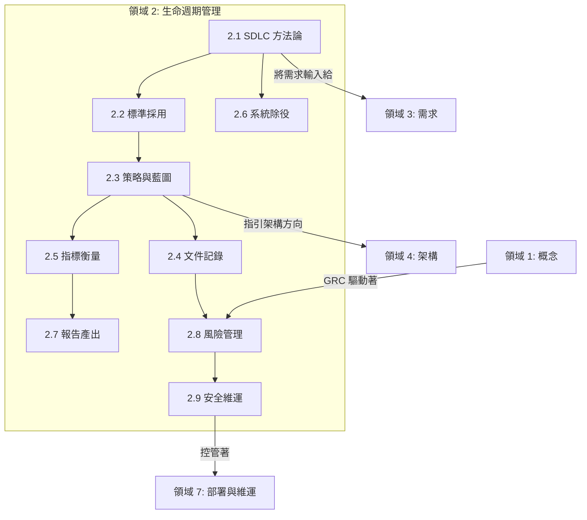

# 領域 2：安全軟體生命週期管理 (Secure Software Lifecycle Management) (11%)

## 領域概述

領域 2 的核心在於解決**如何將安全性整合到軟體開發生命週期 (SDLC) 的每個階段中** — 從開發方法的選擇與標準的採用開始，一路涵蓋到指標衡量 (metrics)、報表產出 (reporting)、系統除役 (decommissioning)，以及安全的維運管理。本領域的基礎在於**治理 (governance)**：確保安全性不是事後才勉強加上去的附屬品，而是深植於整個 SDLC 的流程、檢查點與文化之中。

此領域佔**考試比重 11%**，包含 **9 個主要章節**：

| 章節 | 標題 | 重點 |
|---------|-------|-------|
| 2.1 | 在軟體開發方法論中管理安全 (Manage Security within a Software Development Methodology) | 敏捷 (Agile)、瀑布式 (Waterfall)、DevOps 中的安全閘門 (Security gates) |
| 2.2 | 識別與採用安全標準 (Identify and Adopt Security Standards) | 框架 (ISO, NIST, OWASP, BSIMM, SAMM, SAFECode)、資安意識 |
| 2.3 | 制定策略與藍圖 (Outline Strategy and Roadmap) | 安全里程碑、檢查點、控制關卡 (control gates)、中斷/建置準則 (break/build criteria) |
| 2.4 | 定義並制定安全文件 (Define and Develop Security Documentation) | 安全政策、標準、指導原則、程序 |
| 2.5 | 定義安全指標 (Define Security Metrics) | 關鍵績效指標 (KPIs)、目標與關鍵結果 (OKRs)、嚴重性、修復時間、複雜度 |
| 2.6 | 應用程式除役 (Decommission Applications) | 產品生命週期終止 (EOL) 政策、資料處置、保留、銷毀 |
| 2.7 | 建立安全報告機制 (Create Security Reporting Mechanisms) | 報告、儀表板、回饋迴圈 (feedback loops) |
| 2.8 | 整合風險管理 (Incorporate Integrated Risk Management) | 法規、標準、法律考量、風險評估、技術風險 vs. 業務風險 |
| 2.9 | 實施安全維運實務 (Implement Secure Operation Practices) | 變更管理、事件回應、驗證與確認 (V&V)、授權與認可 (A&A) |

## 學習目標

完成本領域後，您應能夠：

- 將安全活動整合到任何 SDLC 方法論中（敏捷、瀑布式、DevOps、螺旋式）
- 選擇並應用適當的安全標準與框架
- 定義安全里程碑、控制關卡，以及中斷/建置準則 (break/build criteria)
- 在整個生命週期中制定與維護安全文件
- 設計具意義的安全指標與 KPI
- 規劃安全的應用程式除役與資料處置流程
- 建立能產出具體行動回饋的報告機制
- 應用整合風險管理，包含技術層面與業務層面的風險
- 實施包含變更管理與事件回應機制在內的安全維運實務

## 主要關聯性

## 學習提示

> **考試重點**：領域 2 是非常**流程導向**的。請準備好應對情境題，這類題目會要求您為給定的情況找出正確的生命週期活動、指標，或控制關卡。這個領域與領域 7（維運）和領域 3（需求）有著顯著的重疊。

- 了解**不同方法論之間的差異** — 敏捷開發處理安全性的方式與瀑布式不同
- 熟悉主要的**安全成熟度模型**（BSIMM、SAMM），以及它們與規範性框架 (prescriptive frameworks) 的差異
- **中斷/建置準則 (Break/build criteria)** 是常見的考題 — 必須知道哪些情況構成停止發布的理由
- 牢記 **EOL/除役** 的檢查清單 — 憑證移除、組態清理、資料處置
- 清楚區分**技術風險**與**業務風險** — 考試會測驗您區別及關聯這兩者的能力

## 本章節檔案

| 檔案 | 內容 |
|------|---------|
| [2.1_security_in_sdlc_methodology.md](2.1_security_in_sdlc_methodology.md) | 敏捷、瀑布式、DevOps 中的安全整合；安全控制閘門 |
| [2.2_security_standards_adoption.md](2.2_security_standards_adoption.md) | ISO、NIST、OWASP、BSIMM、SAMM、SAFECode；安全意識 |
| [2.3_strategy_and_roadmap.md](2.3_strategy_and_roadmap.md) | 安全里程碑、檢查點、控制關卡、中斷/建置準則 |
| [2.4_security_documentation.md](2.4_security_documentation.md) | 安全文件的定義與制定 |
| [2.5_security_metrics.md](2.5_security_metrics.md) | 嚴重性、修復時間、複雜度、KPI、OKR |
| [2.6_decommission_applications.md](2.6_decommission_applications.md) | EOL 政策、資料處置、保留、銷毀 |
| [2.7_security_reporting.md](2.7_security_reporting.md) | 報告、儀表板、回饋迴圈 |
| [2.8_integrated_risk_management.md](2.8_integrated_risk_management.md) | 法規、標準、法律考量、風險評估、技術風險 vs 業務風險 |
| [2.9_secure_operation_practices.md](2.9_secure_operation_practices.md) | 變更管理、事件回應、V&V、A&A |
