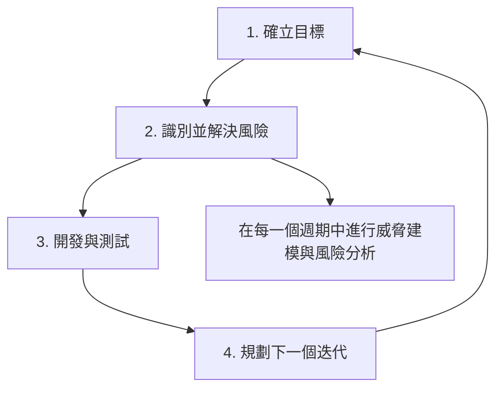
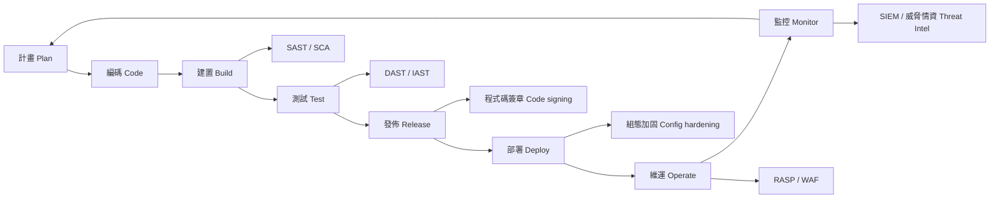
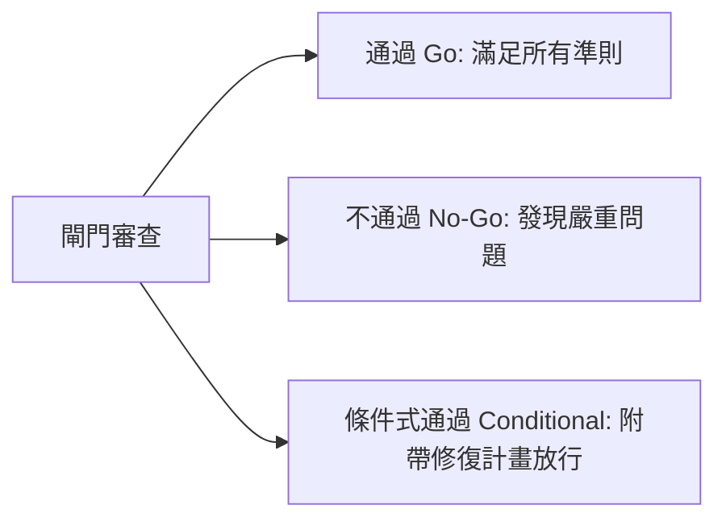

# 2.1 在軟體開發方法論中管理安全 (Manage Security within a Software Development Methodology)

## 學習目標

- 比較安全性在敏捷 (Agile)、瀑布式 (Waterfall)、螺旋式 (Spiral) 以及 DevOps/DevSecOps 中不同的整合方式
- 辨別每個 SDLC（軟體開發生命週期）階段的適當安全活動
- 解釋安全閘門 (Security gates) 的概念與目的
- 描述如何在其安全嚴謹度與開發速度之間取得平衡

---

## 軟體開發方法論與安全性

每種 SDLC 方法論都可以容納安全性，但在**時機、正式程度與機制上卻有著顯著的差異**。CSSLP 專業人員必須了解如何針對組織所採用的任何方法論來調整安全活動。

### 瀑布式模型 (Waterfall Model)

瀑布式模型是一種**循序漸進、以階段為導向**的方法，每個階段必須在進入下一個階段之前完成。安全性會被整合在**各階段之間所定義好的檢查點**。

| 階段 | 安全活動 |
|-------|-------------------|
| **需求 (Requirements)** | 定義安全需求、識別法規遵循需求、建立誤用/濫用案例 |
| **設計 (Design)** | 威脅建模 (Threat modeling)、安全架構審查、安全設計模式的選擇 |
| **實作 (Implementation)** | 安全編碼實務、靜態應用程式安全測試 (SAST)、程式碼審查 (Code reviews) |
| **測試 (Testing)** | 安全測試（DAST、滲透測試、模糊測試）、驗證與確認 (V&V) |
| **部署 (Deployment)** | 安全組態配置、環境加固 (Hardening)、取得營運安全核准 |
| **維護 (Maintenance)** | 修補程式管理 (Patch management)、漏洞管理、事件回應 |

**對安全性的優勢**：有明確的階段閘門、詳盡的文件記錄、正式的審查點。

**對安全性的劣勢**：在後期才發現的安全問題修復成本高昂；迭代修改的能力受限。

> **考試提示**：瀑布式模型對安全性的主要優勢在於**結構化的審查點**。其主要劣勢在於**後期才發現安全缺陷所帶來的高昂成本**。

### 敏捷模型 (Agile Model)

敏捷強調**迭代式開發 (iterative development)**、短週期衝刺 (sprints) 與持續交付。安全性必須嵌入到衝刺的節奏中，而不是被推遲到一個單獨的階段。

| 敏捷實務 | 安全性整合 |
|---------------|---------------------|
| **衝刺規劃 (Sprint Planning)** | 納入安全相關的故事 (stories) 與驗收標準 |
| **使用者故事 (User Stories)** | 撰寫聚焦於安全性的故事（例如：「身為一名使用者，我希望我的工作階段在閒置後會自動逾時登出」） |
| **完成的定義 (Definition of Done)** | 納入安全標準：已完成程式碼審查、SAST 檢測通過、無嚴重漏洞 |
| **每日站立會議 (Daily Stand-ups)** | 提出阻礙安全進度的問題、追蹤安全技術債 (security debt) |
| **衝刺審查 (Sprint Review)** | 展示安全功能、審查安全測試結果 |
| **回顧會議 (Retrospective)** | 討論安全經驗教訓、流程改善方案 |

**敏捷中特定的安全實務：**

- **邪惡使用者故事 / 濫用者故事 (Evil User Stories / Abuser Stories)**：從威脅代理人（攻擊者）的角度描述攻擊情境 — 「身為一名攻擊者，我想要執行 SQL 注入來竊取資料庫憑證」
- **安全衝刺 / 加固衝刺 (Security Sprint / Hardening Sprint)**：專注且專門用來解決安全技術債的衝刺週期
- **安全擁護者 (Security Champions)**：接受過額外安全訓練的團隊成員，在開發團隊內部擔任安全倡導者的角色

> **考試提示**：敏捷並沒有消除對安全活動的需求 — 它只是將這些活動分散到各個迭代中。在敏捷團隊裡，安全性是**每個人的責任**。

### 螺旋模型 (Spiral Model)

螺旋模型結合了瀑布式與迭代開發的元素，每個週期由四個象限組成。**風險分析 (Risk analysis) 是每個迭代的核心**。

- 風險分析在**每一次迭代**都會進行，這使其在本質上非常適合落實安全性
- 每個週期都會產生越來越精良的原型 (prototypes)，並具備越來越強的安全性
- 特別適用於**大型、複雜且高風險的專案**

### DevOps / DevSecOps

DevOps 透過**自動化、持續整合 (CI) 與持續交付 (CD)** 將開發與維運結合在一起。DevSecOps 則進一步將安全性嵌入到此自動化管線中來擴展這個概念。

**DevSecOps 的核心原則：**

| 原則 | 說明 |
|-----------|-------------|
| **向左移 (Shift Left)** | 將安全活動移至管線中更早期的階段（從右側/正式環境 移到 左側/開發環境） |
| **自動化 (Automation)** | 在 CI/CD 管線中自動化安全測試 (SAST, DAST, SCA) |
| **持續監控 (Continuous Monitoring)** | 在正式環境中進行即時的安全監控 |
| **基礎架構即程式碼 (IaC)** | 將基礎架構組態予以程式碼化，以確保一致性與可稽核性 |
| **安全即程式碼 (Security as Code)** | 將安全政策、合規性檢查與控制項定義為程式碼 |

> **關鍵區分**：DevOps = 開發 + 維運；DevSecOps = 開發 + **安全** + 維運。「Sec (安全)」不是一個外掛的獨立階段 — 它是貫穿且整合在整個流程中的。

---

## 安全閘門與審查點 (Security Gates and Review Points)

安全閘門是 SDLC 中**正式的決策點**，必須在滿足特定的安全標準後，才能進入下一個階段。它們扮演著品質管控檢查點的角色。

### 安全閘門的組成要件

| 要件 | 目的 |
|-----------|---------|
| **進入準則 (Entry criteria)** | 在開始進行閘門審查前必須具備的條件 |
| **閘門活動 (Gate activities)** | 在閘門審查時被審閱或評估的項目 |
| **退出準則 (Exit criteria)** | 為了通過閘門繼續前進所必須滿足的條件 |
| **決策 (Decision)** | 通過 (Go)、不通過 (No-Go)，或是條件式通過 (Conditional Go，在附帶修復條件下放行) |

### 典型的安全閘門決策

### 依 SDLC 階段劃分的安全活動

| 階段 | 安全閘門活動 |
|-------|------------------------|
| **需求** | 完成安全需求定義、識別出合規要求、建立誤用案例 |
| **架構/設計** | 威脅建模已完成、安全架構審核完畢、執行過風險評估 |
| **實作** | 遵循安全編碼標準、SAST 檢測完畢、完成同儕程式碼審查 (peer code review) |
| **測試** | 執行安全測試案例、DAST/滲透測試完成、所有嚴重的發現項目皆已解決 |
| **發行/部署** | 建置成品 (artifacts) 通過驗證（簽章/雜湊）、取得安全核准 |
| **維運** | 啟用監控機制、事件回應計畫已就緒、設定完成存取控制 |

---

## 微軟安全開發生命週期 (Microsoft SDL)

微軟的 SDL 是被最廣泛參考的安全 SDLC 框架之一。它定義了橫跨七個階段的具體安全實務：

| 階段 | 關鍵 SDL 活動 |
|-------|-------------------|
| **培訓 (Training)** | 針對所有團隊成員的核心安全培訓 |
| **需求 (Requirements)** | 設定安全與隱私需求、建立品質閘門/基準線 (bug bars)、執行安全風險評估 |
| **設計 (Design)** | 建立設計需求、執行攻擊面分析/縮減、使用威脅建模 |
| **實作 (Implementation)** | 使用核准的工具、棄用不安全的函數、執行靜態分析 |
| **驗證 (Verification)** | 執行動態分析、模糊測試 (fuzz testing)、攻擊面審查 |
| **發行 (Release)** | 建立事件回應計畫、執行最終安全審查、認證發行版/進行封存歸檔 |
| **回應 (Response)** | 執行事件回應計畫 |

---

## NIST 安全軟體開發框架 (SSDF)

NIST SSDF (SP 800-218) 將安全開發實務分為四個群組：

| 實務群組 | 縮寫 | 重點 |
|---------------|-------------|-------|
| **為組織做好準備 (Prepare the Organization)** | **PO** | 確保能落實安全開發的人員、流程和技術 |
| **保護軟體 (Protect the Software)** | **PS** | 保護軟體元件免於被竄改和未經授權的存取 |
| **產出高度安全的軟體 (Produce Well-Secured Software)** | **PW** | 將發布軟體中的漏洞減至最低 |
| **回應漏洞 (Respond to Vulnerabilities)** | **RV** | 識別殘留漏洞並做出適當的回應 |

---

## 考試重點

1. **方法論比較**：了解安全活動在瀑布式（階段閘門）、敏捷（融入衝刺中）、螺旋式（風險導向）與 DevSecOps（自動化管線）中的不同做法。
2. **向左移 (Shift Left)**：將安全性移至 SDLC 中較早期的階段，不僅能降低成本，還能提升效能。
3. **安全閘門 (Security gates)**：理解進入準則、閘門活動、退出準則，以及 通過/不通過 的決策機制。
4. **DevSecOps 自動化**：建置期的 SAST、測試期的 DAST、針對相依套件的 SCA、發行期的程式碼簽章。
5. **邪惡使用者故事 (Evil user stories)**：以攻擊者視角來捕捉安全需求的一種敏捷技術。
6. **微軟 SDL**：包含各階段具體安全活動的七階段模型。
7. **NIST SSDF**：四個實務群組（PO, PS, PW, RV）。

---

## 關鍵術語表

| 術語 | 定義 |
|------|-----------|
| **SDLC** | Software Development Life Cycle，軟體開發生命週期 |
| **Waterfall (瀑布式)** | 循序漸進的階段式開發模型 |
| **Agile (敏捷)** | 具備短週期衝刺與持續交付特性的迭代式開發 |
| **Spiral (螺旋式)** | 結合瀑布式與原型設計，以風險為導向的迭代模型 |
| **DevOps** | 統合開發與維運的文化與實務做法 |
| **DevSecOps** | 將安全性整合到整個管線中的 DevOps |
| **Shift Left (向左移)** | 將安全活動移往開發流程的較早期階段 |
| **Security Gate (安全閘門)** | 必須滿足特定的安全標準才能通過的正式決策點 |
| **SAST** | Static Application Security Testing，靜態應用程式安全測試 |
| **DAST** | Dynamic Application Security Testing，動態應用程式安全測試 |
| **SCA** | Software Composition Analysis，軟體組成分析 |
| **SSDF** | Secure Software Development Framework，安全軟體開發框架 (NIST SP 800-218) |
| **SDL** | Security Development Lifecycle，微軟的安全開發生命週期 |
| **Evil User Story (邪惡使用者故事)** | 從攻擊者角度撰寫的敏捷使用者故事 |
| **Security Champion (安全擁護者)** | 接受過額外安全訓練，在開發團隊內部擔任倡導者的團隊成員 |
| **CI/CD** | Continuous Integration / Continuous Delivery，持續整合 / 持續交付 |
| **IaC** | Infrastructure as Code，基礎架構即程式碼 |
