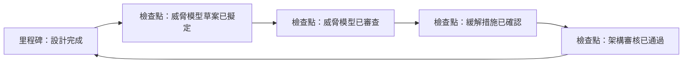
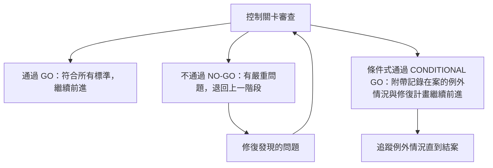

# 2.3 制定策略與藍圖 (Outline Strategy and Roadmap)

## 學習目標

- 定義軟體專案內的安全里程碑與檢查點
- 解釋控制關卡的用途以及它們如何強制執行安全決策
- 描述中斷/建置準則 (break/build criteria) 以及會終止發行版本的情況
- 制定與業務目標一致的安全策略與藍圖

---

## 安全策略 (Security Strategy)

安全策略定義了**組織將如何跨越整個 SDLC 來整合安全性**。它在制定高階指導性質的安全政策與日常的開發活動之間，搭起了一座溝通的橋樑。

### 策略的組成要件

| 要件 | 說明 |
|-----------|-------------|
| **願景 (Vision)** | 與業務目標一致的長期安全目標 |
| **現況評估 (Current state assessment)** | 對現有安全成熟度的基準線評估（例如，透過 BSIMM 或 SAMM） |
| **目標狀態 (Target state)** | 期望達成的安全態勢與可衡量的目標 |
| **差距分析 (Gap analysis)** | 現況與目標狀態之間的差異 |
| **藍圖 (Roadmap)** | 包含里程碑、時程表與資源需求的分階段計畫 |
| **治理 (Governance)** | 角色定義、職責歸屬與決策權限 |

### 策略性 vs. 戰術性安全 (Strategic vs. Tactical Security)

| 層面 | 策略性 (Strategic) | 戰術性 (Tactical) |
|--------|-----------|----------|
| **時間跨度** | 長期（1–3 年以上） | 短期（衝刺/發行週期） |
| **重點關注** | 全組織的安全態勢 | 特定專案或功能的安全 |
| **範例** | 採用 SAMM 成熟度模型、建立安全團隊 | 在當前衝刺執行 SAST、修復特定漏洞 |
| **負責人** | CISO（資安長）、安全領導階層 | 開發團隊、安全擁護者 |

---

## 安全里程碑與檢查點 (Security Milestones and Checkpoints)

安全里程碑是**可衡量的進度標記**，用以證明在 SDLC 的特定時間點已完成各項安全活動。

### 依階段劃分的里程碑範例

| 階段 | 里程碑 | 證據/產出物 |
|-------|-----------|----------|
| **需求** | 安全需求已簽核通過 | 核准的安全需求文件 |
| **設計** | 威脅建模已完成 | 包含緩解措施的威脅模型文件 |
| **實作** | 完成 SAST 掃描且無重大發現 | 顯示零嚴重缺陷的 SAST 報告 |
| **測試** | 滲透測試已完成 | 所有嚴重/高風險問題皆已修復的滲透測試報告 |
| **發行** | 取得安全放行簽核 (sign-off) | 已簽署的營運核准文件 (approval-to-operate) |

### 檢查點 (Checkpoints)

檢查點是里程碑內部的**中繼驗證點**，用於追蹤進度：

---

## 控制關卡 (Control Gates)

控制關卡是一個**正式的決策點**，利害關係人會在此處評估專案是否符合定義的安全標準，然後才決定是否推進到下一個階段。

### 控制關卡結構

| 元素 | 說明 |
|---------|-------------|
| **關卡負責人 (Gate owner)** | 負責決定是否放行 (go/no-go) 的負責人或委員會 |
| **進入準則 (Entry criteria)** | 在進行閘門審查前必須具備的前提條件 |
| **審查活動 (Review activities)** | 在關卡處進行的評估（文件審查、掃描報告、風險評估） |
| **退出準則 (Exit criteria)** | 必須滿足才能通過關卡的條件 |
| **決策 (Decision)** | 通過 (Go)、不通過 (No-Go)，或條件式通過 (Conditional Go) |
| **升級路徑 (Escalation path)** | 用於解決意見分歧或處理例外情況的流程 |

### 控制關卡決策

### 常見的關卡準則

| 關卡 | 典型的準則 |
|------|-----------------|
| **設計關卡** | 威脅建模完成、架構審核通過、沒有未經緩解的高風險威脅 |
| **程式碼關卡** | SAST 完成、無嚴重漏洞、同儕審查完成、有遵循編碼標準 |
| **測試關卡** | 安全測試完成、所有嚴重/高風險問題皆已解決、迴歸測試 (regression tests) 通過 |
| **發行關卡** | 滿足所有先前關卡的準則、取得安全簽核、事件回應計畫已就緒 |

---

## 中斷/建置準則 (Break/Build Criteria)

中斷/建置準則定義了**在什麼情況下建置會被視為「中斷/失敗 (broken)」**（且絕不可發布），或者建置必須滿足哪些條件才被視為「可被接受 (acceptable)」。

### 中斷準則（停止條件 / Break Criteria）

如果發生以下情況，建置即被視為**中斷**，並且不可繼續進行：

| 類別 | 範例 |
|----------|---------|
| **嚴重漏洞** | 尚未解決且 CVSS 評分為嚴重/高的發現項目，已知可被利用的漏洞 |
| **安全測試失敗** | SAST/DAST 工具回報嚴重發現，滲透測試揭露了可被利用的缺陷 |
| **違法合規要求** | 建置版本中包含了違反法規要求的元件（例如：未經核准的密碼學演算法） |
| **違反政策** | 程式碼未符合組織的安全標準（例如：將憑證寫死在程式碼中 / hardcoded credentials） |
| **缺少產出物** | 未完成必要的安全文件（例如：沒有威脅模型、沒有安全測試報告） |

### 建置準則（放行條件 / Build Criteria）

當滿足以下條件時，建置才被認為是**可被接受 (acceptable)** 以發布的：

| 類別 | 範例 |
|----------|---------|
| **符合漏洞容忍度** | 沒有嚴重/高風險的發現；中/低風險在可接受的風險容忍門檻內 |
| **安全測試完成** | 所有要求的安全測試皆已執行完畢（SAST、DAST、滲透測試、模糊測試） |
| **文件記錄完成** | 威脅模型、安全測試報告與風險評估皆已定稿 |
| **取得簽核放行** | 指定的安全主管機關或負責人已經核准了該次發布 |
| **相依性套件已驗證** | 已對第三方元件進行掃描 (SCA)，且沒有已知的重大 CVE (通用漏洞披露) |

### 品質管理基準線 / 漏洞門檻 (Bug Bars)

**Bug bar** 是一種品質閘門，它定義了針對安全缺陷的**最低可接受門檻**。它界定了哪些類型的漏洞是「在發布前強制必須修復的」，而哪些可以「作為已知風險被接受」。

| 嚴重性 | 基準線政策 (Bug Bar Policy) 範例 |
|----------|----------------------|
| **嚴重 (Critical)** | 必須在發布前修復 — 沒有例外 |
| **高 (High)** | 必須在發布前修復；若有例外情況需經 CISO（資安長）核准 |
| **中 (Medium)** | 應在發布前修復；若附有白紙黑字記錄的風險接受聲明，得予推遲 |
| **低 (Low)** | 在可行的情況下修復；進行記錄與追蹤 |

> **考試提示**：中斷/建置準則是**預先定義好 (pre-defined)** 的，必須在開發開始之前就確立 — 而非在發布當下才臨時起意決定。它們是專案安全計畫的一部分。

---

## 考試重點

1. **控制關卡 (Control gates)**：具有 通過/不通過/條件式通過 決策結果的正式決策點
2. **中斷/建置準則 (Break/build criteria)**：用以阻擋或放行發布版本的預先定義條件
3. **基準線/漏洞門檻 (Bug bars)**：定義發布前必須修復哪些嚴重程度漏洞的最低品質門檻
4. **里程碑 vs. 檢查點**：里程碑是階段性的閘門；檢查點是中繼性的進度標記
5. **策略性 vs. 戰術性**：策略性 = 長期組織態勢；戰術性 = 特定專案的安全
6. **差距分析 (Gap analysis)**：當前安全狀態與目標狀態之間的差異
7. **條件式通過 (Conditional go)**：在備有書面說明的風險接受與修復計畫情況下允許繼續前進

---

## 關鍵術語表

| 術語 | 定義 |
|------|-----------|
| **Security Roadmap (安全藍圖)** | 包含里程碑與時程表，旨在改善安全態勢的分階段計畫 |
| **Control Gate (控制關卡)** | 在進入下一階段前，評估專案是否符合安全標準的正式決策點 |
| **Break Criteria (中斷準則)** | 使建置版本達不到發布標準的條件 |
| **Build Criteria (建置準則)** | 發布版本得以繼續進行所必須滿足的最低條件 |
| **Bug Bar (品質管理基準線)** | 定義發布前必須解決哪些等級弱點的安全品質門檻 |
| **Milestone (里程碑)** | 證明安全活動已完成的可衡量進度標記 |
| **Checkpoint (檢查點)** | 位於里程碑內部用來驗證階段目標的中繼點 |
| **Gap Analysis (差距分析)** | 評估當前現狀與期望安全狀態之間差異的手段 |
| **Risk Acceptance (風險接受)** | 正式承認並以書面記錄已接受的殘餘風險 |
| **CVSS** | Common Vulnerability Scoring System — 標準化的漏洞嚴重程度評分系統 |
