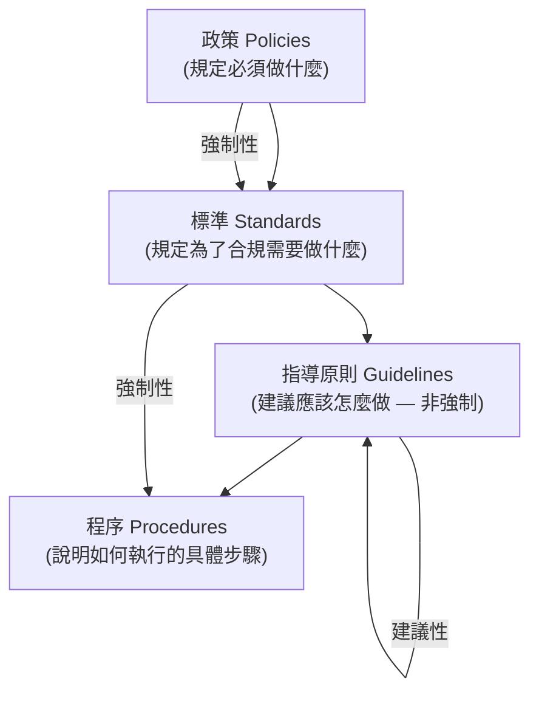
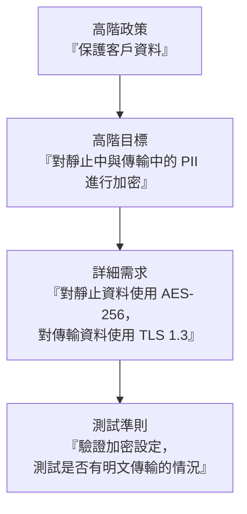

# 2.4 定義並制定安全文件 (Define and Develop Security Documentation)

## 學習目標

- 識別在整個 SDLC (軟體開發生命週期) 中所需的各種類型安全文件
- 解釋各項關鍵安全文件的目的與內容
- 描述文件層級架構：政策 (policies) → 標準 (standards) → 指導原則 (guidelines) → 程序 (procedures)
- 了解文件記錄在展示應有之注意義務 (due diligence) 與合規性方面所扮演的角色

---

## 文件層級架構 (Documentation Hierarchy)

安全文件遵循著階層式的架構，每一個層級都會提供越來越具體的細節：

| 層級 | 性質 | 說明 | 範例 |
|-------|--------|-------------|---------|
| **政策 (Policy)** | 強制性 (Mandatory) | 高階管理層對意圖與方向的聲明 | 「所有軟體在部署前必須經過安全測試」 |
| **標準 (Standard)** | 強制性 (Mandatory) | 源自於政策，具體且可衡量的要求 | 「所有網站應用程式必須通過 OWASP ASVS 第 2 級驗證」 |
| **指導原則 (Guideline)** | 建議性 (Recommended) | 為滿足標準所提供的建議做法（非強制） | 「考慮在所有資料庫互動中使用參數化查詢」 |
| **程序 (Procedure)** | 強制性 (Mandatory) | 落實標準的逐步執行指示 | 「在每次提交程式碼前，使用設定值 Y 執行 SAST 工具 X」 |

> **考試提示**：政策與標準是**強制性的 (mandatory)**。指導原則是**建議性的 (recommended)**，並非強制執行。程序則提供了實施標準的**具體步驟 (specific steps)**。

---

## 貫穿 SDLC 的安全文件

### 需求階段 (Requirements Phase)

| 文件 | 目的 |
|----------|---------|
| **安全需求規格書 (Security Requirements Specification)** | 定義功能性與非功能性的安全需求 |
| **合規需求文件 (Compliance Requirements Document)** | 列出適用的法規、法律與業界標準 |
| **資料分類指南 (Data Classification Guide)** | 定義資料的機密等級與其對應的處理要求 |
| **隱私影響評估 (Privacy Impact Assessment, PIA)** | 評估資料收集與處理過程中的隱私風險 |
| **安全需求追溯矩陣 (SRTM)** | 將安全需求對應至實作與測試階段 (Security Requirements Traceability Matrix) |

### 設計階段 (Design Phase)

| 文件 | 目的 |
|----------|---------|
| **威脅模型 (Threat Model)** | 記錄已識別的威脅、攻擊媒介 (attack vectors) 以及緩解措施 |
| **安全架構文件 (Security Architecture Document)** | 描述系統架構中的安全控制項 |
| **安全設計審查報告 (Security Design Review Report)** | 記錄架構/設計階段安全審查的發現事項 |
| **風險評估報告 (Risk Assessment Report)** | 記錄已識別的風險、其嚴重程度，以及處置決策 |

### 實作階段 (Implementation Phase)

| 文件 | 目的 |
|----------|---------|
| **安全編碼標準 (Secure Coding Standards)** | 為開發團隊定義編碼的規則與實務做法 |
| **程式碼審查檢查表 (Code Review Checklists)** | 用於同儕安全程式碼審查的標準化準則 |
| **SAST/SCA 報告** | 靜態分析與軟體組成分析的檢測結果 |

### 測試階段 (Testing Phase)

| 文件 | 目的 |
|----------|---------|
| **安全測試計畫 (Security Test Plan)** | 關於安全測試的策略、範圍以及方法 |
| **安全測試案例 (Security Test Cases)** | 包含預期結果的具體測試情境 |
| **滲透測試報告 (Penetration Test Report)** | 包含嚴重程度評分的滲透測試發現事項 |
| **軟體驗證與確認計畫 (SVVP)** | 定義各項 V&V (Validation and Verification) 活動、準則與職責 |

### 部署與維運階段 (Deployment and Operations Phase)

| 文件 | 目的 |
|----------|---------|
| **部署安全檢查表 (Deployment Security Checklist)** | 確保安全部署的驗證步驟 |
| **安全組態指南 (Security Configuration Guide)** | 正式環境的基準安全設定 (baseline configuration) |
| **事件回應計畫 (Incident Response Plan)** | 偵測、回應並從資安事件中復原的標準程序 |
| **安全維運程序 (Security Operations Procedures)** | 日常的安全活動規章（監控、修補程式管理、權限審查） |

### 除役階段 (Decommissioning Phase)

| 文件 | 目的 |
|----------|---------|
| **除役計畫 (Decommissioning Plan)** | 安全地將應用程式下架終止服務的步驟 |
| **資料處置紀錄 (Data Disposition Record)** | 證明資料有被妥善保留或銷毀的書面證據 |

---

## 政策分解 (Policy Decomposition)

組織的安全政策是高階的管理命令，必須被**分解 (decomposed)** 成針對軟體專案詳細、且可執行的具體安全需求。

政策分解是需求收集階段中**至關重要的一步**。每一項高階的政策聲明都必須被細分為：
1. **高階安全目標** — 必須達成什麼
2. **具體安全需求** — 可衡量評估的準則
3. **實作指引** — 如何滿足這些需求
4. **驗證準則** — 將如何測試其合規性

---

## 文件記錄的最佳實務 (Documentation Best Practices)

| 實務做法 | 說明 |
|----------|-------------|
| **版本控制 (Version control)** | 維護所有安全文件的修訂歷史紀錄 |
| **定期審查 (Regular review)** | 安排定期的審閱與更新（至少每年一次） |
| **利害關係人對齊 (Stakeholder alignment)** | 確保文件由適當的授權人員審查與核准 |
| **可及性 (Accessibility)** | 將文件儲存在所有相關利害關係人都能取得的地方 |
| **動態文件 (Living documents)** | 隨著專案的演進持續更新 — 而不是只在階段關卡才做 |
| **範本標準化 (Template standardization)** | 在各專案間使用一致的範本以提高可預測性 |

---

## 考試重點

1. **架構層級**：政策 → 標準 → 指導原則 → 程序（強制性 vs. 建議性）。
2. **政策分解**：將高階政策轉換分解為可執行的具體安全需求。
3. **SRTM (安全需求追溯矩陣)**：將業務需求、安全需求與測試案例連結起來的追溯矩陣。
4. **SVVP (軟體驗證與確認計畫)**：定義跨越整個 SDLC 的驗證 (validation) 與確認 (verification) 活動。
5. **威脅模型**：必須在設計階段產出，並作為一份動態文件持續維護。
6. **文件記錄是展現「應有之注意義務 (due diligence)」的證據**：這對於法規遵循與法律保護至關重要。

---

## 關鍵術語表

| 術語 | 定義 |
|------|-----------|
| **Security Policy (安全政策)** | 高階的、強制性的管理階層方向與意圖聲明 |
| **Security Standard (安全標準)** | 具體、強制性的實施政策要求 |
| **Security Guideline (安全指導原則)** | 用以達到標準的建議性（非強制）實務做法 |
| **Security Procedure (安全程序)** | 為落實標準所制定的強制性、逐步執行的操作說明 |
| **Policy Decomposition (政策分解)** | 將高階政策拆解為詳細、可執行的安全需求 |
| **SRTM** | Security Requirements Traceability Matrix — 安全需求追溯矩陣 |
| **PIA** | Privacy Impact Assessment — 隱私影響評估 |
| **SVVP** | Software Validation and Verification Plan — 軟體驗證與確認計畫 |
| **Threat Model (威脅模型)** | 識別系統面臨的威脅、攻擊媒介與緩解措施的文件 |
| **Due Diligence (應有之注意義務)** | 盡合理努力確保符合法律與最佳實務（事前知悉/評估） |
| **Due Care (應有之作為)** | 持續致力於維持安全態勢的作為（事後行動/維持） |
