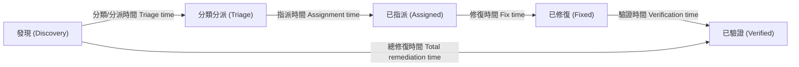

# 2.5 定義安全指標 (Define Security Metrics)

## 學習目標

- 為軟體開發識別出具備意義的安全指標
- 區分關鍵績效指標 (KPIs) 與目標與關鍵結果 (OKRs)
- 解釋臨界/嚴重性等級 (criticality levels)、修復時間與複雜度指標
- 設計能推動安全態勢持續改善的指標衡量計畫

---

## 為什麼安全指標很重要

安全指標能將主觀的評估轉化為**客觀的、可量化的數據**。如果沒有指標，組織就無法回答以下基本問題：我們變得更安全了嗎？我們在安全上的投資獲得回報了嗎？我們接下來應該把重點放在哪裡？

有效的安全指標必須具備以下特性：

| 屬性 | 說明 |
|----------|-------------|
| **可衡量性 (Measurable)** | 能夠透過自動化或手動的資料收集將其量化 |
| **可執行性 (Actionable)** | 能夠驅動決策與行為的改變 |
| **相關性 (Relevant)** | 與業務目標及安全目標保持一致 |
| **及時性 (Timely)** | 在需要做決策時能及時提供資訊 |
| **可重複性 (Repeatable)** | 一致的方法論能在不同時間點產生具可比性的結果 |

---

## 安全指標的分類

### 流程指標 (Process Metrics)

衡量安全流程的執行效能與成熟度：

| 指標 | 說明 | 範例 |
|--------|-------------|---------|
| **建立威脅模型的專案比例** | 應用威脅建模的一致性程度 | 85% 的專案已完成威脅模型 |
| **安全培訓完成率** | 開發人員完成安全培訓的比例 | 本季完成率達 92% |
| **安全閘門通過率** | 專案在第一次嘗試時通過安全閘門的頻率 | 設計關卡的首次通過率為 70% |
| **平均修復時間 (MTTR)** | 從發現漏洞到完成修復的平均時間 | 嚴重漏洞 MTTR：3 天；高風險：14 天 |

### 產品指標 (Product Metrics)

衡量軟體本身的安全態勢：

| 指標 | 說明 | 範例 |
|--------|-------------|---------|
| **漏洞密度 (Vulnerability density)** | 每千行程式碼 (KLOC) 中包含的漏洞數量 | 2.3 個漏洞 / KLOC |
| **按嚴重程度劃分的未解決漏洞數** | 目前尚未解決的漏洞待辦清單 (backlog) | 0 個嚴重，3 個高風險，12 個中風險 |
| **缺陷移除效率 (DRE)** | 在正式上線 (production) 前被發現的缺陷比例 | 95% DRE（在開發/測試階段發現，未流入正式環境） |
| **程式碼涵蓋率 (Code coverage)** | 被安全測試涵蓋到的程式碼比例 | 78% 的安全測試涵蓋率 |
| **第三方元件風險** | 具有已知 CVE 的相依套件數量 | 4 個具有已知高風險 CVE 的相依套件 |

### 維運指標 (Operational Metrics)

衡量正式環境中安全防護的有效性：

| 指標 | 說明 | 範例 |
|--------|-------------|---------|
| **每次發布的資安事件數** | 歸咎於某次發布版本所引發的安全事件數量 | 每次發布平均 0.5 起事件 |
| **平均偵測時間 (MTTD)** | 發現一起安全事件所需的平均時間 | MTTD 為 4 小時 |
| **修補程式部署時間** | 從修補程式釋出到部署完成所需的時間 | 95% 的關鍵修補程式在 48 小時內部署完成 |

---

## 關鍵指標定義

### 嚴重性等級 (Criticality Level)

嚴重性等級對漏洞或缺陷的**嚴重程度與業務影響**進行分類。常見的分類系統包括：

| 等級 | CVSS 分數範圍 | 說明 | 回應期望 |
|-------|-----------|-------------|---------------------|
| **嚴重 (Critical)** | 9.0–10.0 | 可被遠端利用、無需身分驗證、導致系統被完全攻破 | 立即修復（數小時內） |
| **高 (High)** | 7.0–8.9 | 造成重大影響、極有可能被利用 | 數天內修復 |
| **中 (Medium)** | 4.0–6.9 | 影響中等、在特定條件下可被利用 | 在當前衝刺/發布週期內修復 |
| **低 (Low)** | 0.1–3.9 | 影響輕微、難以利用 | 在可行時進行修復 |

### 平均修復時間 (Average Remediation Time)

平均修復時間衡量組織解決安全發現事項的速度：

**應依據嚴重性設定基準目標 (Benchmarks)**：

| 嚴重性 | 目標修復時間 | 衡量方式 |
|----------|-------------------|-------------|
| 嚴重 (Critical) | < 24 小時 | 從發現問題到驗證修復完畢的時間 |
| 高 (High) | < 7 天 | 從發現問題到驗證修復完畢的時間 |
| 中 (Medium) | < 30 天 | 從發現問題到驗證修復完畢的時間 |
| 低 (Low) | < 90 天 | 從發現問題到驗證修復完畢的時間 |

### 複雜度指標 (Complexity Metrics)

複雜度與安全風險息息相關 — 越複雜的程式碼往往潛藏越多的漏洞：

| 指標 | 說明 |
|--------|-------------|
| **循環複雜度 (Cyclomatic complexity)** | 程式碼中線性獨立路徑的數量；數值越高 = 需要測試的路徑越多，潛在錯誤也越多 |
| **耦合度 (Coupling)** | 模組之間相互依賴的程度；高耦合度會擴大漏洞的爆炸半徑 (blast radius) |
| **程式碼變動率 (Code churn)** | 程式碼變更的頻率；安全攸關區域的高變動率需要額外的審查 |
| **攻擊面大小 (Attack surface size)** | 進入點、介面與暴露服務的數量 |

---

## KPI 與 OKR

### 關鍵績效指標 (KPIs)

KPI 是追蹤特定安全目標進度的**量化測量指標**：

| KPI | 目標 | 頻率 |
|-----|--------|-----------|
| 漏洞密度 | < 1.0 (每千行程式碼) | 每次發布 |
| 嚴重漏洞修復時間 | < 24 小時 | 持續追蹤 |
| 安全閘門首次通過率 | > 80% | 每次關卡審查時 |
| 安全培訓完成率 | 100% | 每季 |
| 具備已知 CVE 的第三方元件數 | 0 嚴重 (Critical) | 每次發布 |

### 目標與關鍵結果 (OKRs)

OKR 提供了一個**目標設定框架**，將高階目標與可衡量的結果連結起來：

**OKR 範例：**

| 元素 | 內容 |
|---------|---------|
| **目標 (Objective)** | 降低我們應用程式產品組合的安全風險 |
| **關鍵結果 1 (KR 1)** | 將嚴重漏洞的平均 MTTR 從 5 天縮短至 1 天 |
| **關鍵結果 2 (KR 2)** | 在所有儲存庫的 CI/CD 管線中達成 100% 的 SAST 涵蓋率 |
| **關鍵結果 3 (KR 3)** | 將漏洞密度從 3.0 降低至 1.0 / KLOC |

### KPI vs. OKR 的比較

| 層面 | KPIs | OKRs |
|--------|------|------|
| **性質** | 持續性的績效衡量 | 具時效性的目標設定 |
| **重點** | 維持標準 | 推動改善 |
| **期間** | 持續/常態性 | 每季或每年 |
| **範圍** | 特定的維運指標 | 帶有可衡量結果的策略性目標 |

---

## 建立指標計畫 (Building a Metrics Program)

### 成熟度進展

| 層級 | 說明 | 範例指標 |
|-------|-------------|-----------------|
| **層級 1：臨時特設 (Ad hoc)** | 沒有一致的指標收集機制 | 無 — 依賴直覺做決策 |
| **層級 2：基礎 (Basic)** | 收集基本的漏洞數量 | 依嚴重性長條圖分類的未解決漏洞總數 |
| **層級 3：管理 (Managed)** | 追蹤指標隨時間的變化趨勢 | MTTR 趨勢、漏洞密度趨勢 |
| **層級 4：最佳化 (Optimized)** | 透過指標驅動決策與資源分配 | 安全投資的 ROI、風險調整後的指標 |

### 常見陷阱

| 陷阱 | 影響 | 緩解措施 |
|---------|--------|-----------|
| **虛榮指標 (Vanity metrics)** | 追蹤看似漂亮卻無法驅動任何行動的數字 | 專心關注那些能觸發決策的指標 |
| **玩弄數據 (Gaming)** | 團隊為了追求指標數據而最佳化，而非為了安全性 | 利用包含多個指標的平衡計分卡 |
| **指標過多** | 資訊超載、分析癱瘓 (analysis paralysis) | 從 5–7 個核心指標開始著手 |
| **沒有基準線 (No baseline)** | 沒有起始點就無法衡量改進幅度 | 在設定目標前先建立基準線 |

---

## 考試重點

1. **依嚴重性劃分的 MTTR**：了解典型的修復目標值（嚴重 < 24小時，高風險 < 7天）。
2. **漏洞密度**：每千行程式碼 (KLOC) 的漏洞數 — 這是關鍵的產品品質指標。
3. **KPIs vs. OKRs**：KPIs = 持續監控；OKRs = 具時效性的改善目標。
4. **嚴重性等級 (Criticality levels)**：基於 CVSS 的分類（嚴重 9.0+，高風險 7.0+，中風險 4.0+，低風險 0.1+）。
5. **循環複雜度 (Cyclomatic complexity)**：複雜度越高 = 安全風險越高。
6. **缺陷移除效率 (Defect Removal Efficiency, DRE)**：在正式上線前所發現的缺陷比例。
7. **指標必須具備可執行性 (Actionable)**：指標必須能驅動決策，不能只是報表上的數字而已。

---

## 關鍵術語表

| 術語 | 定義 |
|------|-----------|
| **KPI** | 關鍵績效指標 (Key Performance Indicator) — 衡量安全績效的量化指標 |
| **OKR** | 目標與關鍵結果 (Objectives and Key Results) — 將目標連結至可測量結果的目標設定框架 |
| **MTTR** | 平均修復時間 (Mean Time to Remediate) — 從發現漏洞到完成驗證修復的平均時間 |
| **MTTD** | 平均偵測時間 (Mean Time to Detect) — 識別出資安事件的平均時間 |
| **Vulnerability Density (漏洞密度)** | 每千行程式碼中的漏洞數量 |
| **DRE** | 缺陷移除效率 (Defect Removal Efficiency) — 在正式發布前所發現的缺陷比例 |
| **Cyclomatic Complexity (循環複雜度)** | 衡量程式碼中獨立路徑數量的指標 |
| **CVSS** | 通用漏洞評分系統 (Common Vulnerability Scoring System) |
| **Code Churn (程式碼變動率)** | 隨時間推移，程式碼變更的頻率與數量 |
| **Attack Surface (攻擊面)** | 暴露給潛在攻擊者的進入點與介面總數 |
| **Bug Bar (漏洞門檻 / 基準線)** | 定義安全缺陷之最低可接受品質的門檻 |
