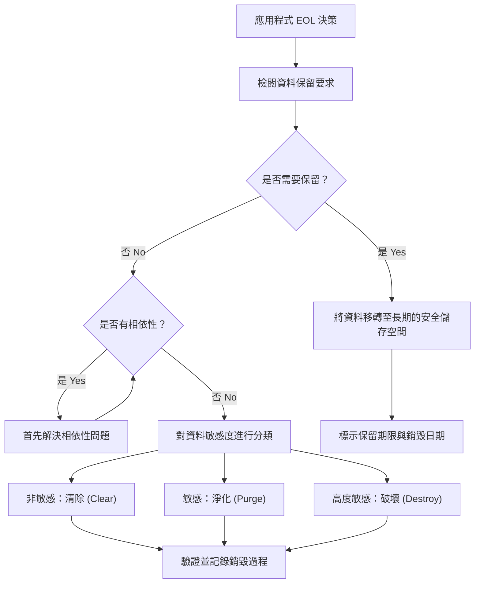

# 2.6 應用程式除役 (Decommission Applications)

## 學習目標

- 解釋安全地將應用程式除役的必要性
- 描述生命週期終止 (End-of-Life, EOL) 政策及其組成要素
- 確定資料處置 (data disposition) 的要求，包含保留與銷毀
- 了解在除役過程中的相依性管理 (dependency management)

---

## 為什麼除役很重要

應用程式除役是一項經常被忽視的**資安關鍵活動**。那些不再被積極維護但卻仍在運作中的應用程式，代表著一塊巨大的攻擊面 — 它們不再接收修補程式、其組態設定可能會偏移 (drift)，且負責管理它們的組織內部知識也會隨著時間消退。妥善的除役能確保：

- **敏感資料** 根據政策被適當地保留或銷毀
- 與該應用程式相關聯的**憑證與機密資訊**被撤銷
- 滿足資料保留的**合規要求**
- 藉由移除不必要的服務來**減少攻擊面**
- 收回並重新分配**資源**（授權、基礎設施、人員）

---

## 生命週期終止 (EOL) 政策

EOL 政策定義了將應用程式從活躍使用狀態中退役的**結構化流程**。一份全面的 EOL 政策必須處理以下事項：

### 憑證與機密資訊的移除 (Credential and Secret Removal)

| 項目 | 行動 |
|------|--------|
| **服務帳戶 (Service accounts)** | 停用並刪除該應用程式所使用的所有服務帳戶 |
| **API 金鑰與權杖 (Tokens)** | 撤銷所有 API 金鑰、OAuth 權杖以及存取權杖 |
| **憑證 (Certificates)** | 撤銷並刪除 TLS/SSL 憑證以及程式碼簽章憑證 |
| **密碼 (Passwords)** | 移除或輪替 (rotate) 所有共用的密碼；刪除密碼金庫中的相關條目 |
| **SSH 金鑰** | 移除用於部署或維護的 SSH 金鑰對 |
| **加密金鑰 (Encryption keys)** | 根據資料保留要求，封存或銷毀加密金鑰 |

> **考試提示**：如果加密資料必須被保留，則負責解密的**加密金鑰也必須被保留**並安全地存放相同的時間長度。若保留了加密資料卻銷毀了金鑰，將導致資料無法復原。

### 組態設定的移除 (Configuration Removal)

| 項目 | 行動 |
|------|--------|
| **防火牆規則** | 移除允許流量進出已除役應用程式的防火牆規則 |
| **DNS 紀錄** | 移除或重新導向 DNS 紀錄 |
| **負載平衡器設定** | 移除後端集區 (backend pools) 與健康狀態檢查 (health checks) |
| **網路存取控制清單 (ACLs)** | 移除網路存取控制項目 |
| **整合端點 (Integration points)** | 斷開或重新設定上游/下游系統的整合 |
| **排定的工作** | 移除 cron jobs（排程工作）、預定任務與批次作業 |

### 授權取消 (License Cancellation)

| 項目 | 行動 |
|------|--------|
| **商業軟體授權** | 取消或重新指派授權（資料庫、中介軟體、監控工具等） |
| **雲端資源** | 終止並取消註冊雲端執行個體 (instances)、儲存空間與服務 |
| **SaaS 訂閱** | 取消 SaaS (軟體即服務) 的訂閱 |
| **支援合約** | 終止與供應商的支援協議 |

### 封存歸檔 (Archiving)

| 項目 | 考量事項 |
|------|--------------|
| **原始碼** | 封存在具備適當存取限制的版本控制系統中 |
| **文件記錄** | 封存設計文件、維運程序、架構圖 |
| **建置成品 (Build artifacts)** | 若因應稽核目的有其必要，則保留已簽章的建置成品 |
| **稽核日誌 (Audit logs)** | 根據合規性與資料保留政策進行保存 |
| **組態配置紀錄** | 進行歸檔，以供未來可能有數位鑑識 (forensic) 需求時參考 |

### 服務等級協定 (SLA) 考量事項

- 通知所有使用者與利害關係人關於計畫中的除役行動
- 根據現存 SLA 中的定義，提供充分的**事前通知期 (notice periods)**
- 在適用的情況下，提供**移轉路徑 (migration paths)** 或替代方案
- 更新 SLA 以反映該系統已除役的狀態
- 記錄下除役的時程表，並與受影響的各方進行溝通

---

## 資料處置 (Data Disposition)

資料處置探討的是如何處理與除役應用程式相關聯的資料。主要有兩條路徑：

### 資料保留 (Data Retention)

由於以下原因，資料可能需要在應用程式生命週期結束後繼續被保留：

| 需求 | 範例 |
|-------------|---------|
| **法規遵循 (Regulatory compliance)** | 財務紀錄（SOX：7年）、醫療紀錄（HIPAA：6年）、稅務紀錄 |
| **法定保存 (Legal hold)** | 與即將發生或正在進行中的訴訟相關之資料 |
| **業務需求** | 歷史分析、參考資料、稽核軌跡 |
| **合約義務** | 要求資料必須可用的客戶協議 |

**被保留的資料必須：**
- 移轉到安全且可存取的儲存系統中
- 受到適當的存取控制與加密保護
- 標示其保留期限與銷毀日期
- 指派一名負責持續確保其安全的資料保管人 (data custodian)

### 資料銷毀 (Data Destruction)

當資料不再被需要，且沒有任何保留要求時，就必須將其安全地銷毀：

| 方法 | 說明 | 適用情境 |
|--------|-------------|----------|
| **清除 (Clearing)** | 使用非敏感資料覆寫邏輯儲存空間 | 位於**可重複使用**媒體上的非機密資料 |
| **淨化 (Purging)** | 使資料無法被復原（消磁，或對 ATA 硬碟使用 Secure Erase） | 機密資料；媒體**可被重複使用** |
| **破壞/物理銷毀 (Destroying)** | 對儲存媒體進行物理性破壞 | 高度敏感資料；媒體**無法再次被使用** |

**物理銷毀方法：**

| 技術 | 說明 |
|-----------|-------------|
| **解體 (Disintegration)** | 將儲存媒體拆解成零組件 |
| **粉碎 (Pulverization)** | 將儲存媒體研磨成粉末或粉塵 |
| **碎化 (Shredding)** | 將儲存媒體切割或撕扯成小碎屑 |
| **焚化 (Incineration)** | 將儲存媒體燒成灰燼 |
| **消磁 (Degaussing)** | 施加反向磁場使磁通量降至零（**僅適用於磁性媒體**） |

> **考試提示**：**丟棄 (Disposal)**（只是單純地把媒體扔掉）在技術上**不算是**一種資料清理 (sanitization) 的形式。請務必了解丟棄 (disposal)、清除 (clearing)、淨化 (purging) 與破壞 (destroying) 之間的差異。

### 相依性 (Dependencies)

在銷毀資料之前，必須先評估其相依性：

| 相依項目 | 風險 |
|-----------|------|
| **下游系統 (Downstream systems)** | 其他應用程式可能依賴來自除役應用程式的資料 |
| **報表系統 (Reporting systems)** | 商業智慧 (BI) 與資料分析可能需要參照歷史資料 |
| **稽核需求** | 法規稽核人員可能需要存取歷史紀錄 |
| **法律義務** | 資料可能受制於法定保存 (legal hold) 或證據開示請求 (discovery requests) |
| **共享資料儲存區** | 資料可能與來自其他應用程式的活躍資料存放在一起 |

---

## 考試重點

1. **EOL 檢查表清單**：撤銷憑證、移除組態設定、取消授權、封存歸檔、SLA 通知。
2. **資料處置 (Data disposition)**：兩條可能路徑 — 保留（移轉、保護、標示）或銷毀（清除、淨化、破壞）。
3. **銷毀層級 (Destruction hierarchy)**：丟棄 (Disposal) < 清除 (Clearing) < 淨化 (Purging) < 破壞 (Destroying)（安全保證程度遞增）。
4. **重要的保留原則**：如果要保留加密資料，則**必須一併保留加密金鑰**。
5. **相依性**：在銷毀資料之前，務必檢查下游系統、報表、稽核與法律義務。
6. **消磁 (Degaussing)**：透過磁場反轉破壞資料 — **僅對磁性媒體有效**（不適用於 SSD 固態硬碟）。

---

## 關鍵術語表

| 術語 | 定義 |
|------|-----------|
| **EOL** | 生命週期終止 (End of Life) — 計畫性地將應用程式從活躍服務中退役 |
| **Data Disposition (資料處置)** | 決定如何處理資料（保留還是銷毀）的流程 |
| **Clearing (清除)** | 用非敏感資料覆寫媒體；該媒體可被重複使用 |
| **Purging (淨化)** | 使資料變得不可復原；該媒體可能可被重複使用 |
| **Destroying (破壞)** | 物理銷毀媒體；媒體將無法再被使用 |
| **Degaussing (消磁)** | 施加反向磁場以消除磁性媒體上的資料 |
| **Sanitization (資料清理/消毒)** | 移除資訊使其不可能被復原的過程 |
| **Data Retention (資料保留)** | 依據法規或業務需求，在指定期限內保存資料 |
| **Legal Hold (法定保存)** | 必須保存與進行中或即將發生的訴訟相關聯資料的要求 |
| **Data Custodian (資料保管人)** | 代表資料擁有者，負責保護與管理資料的人員 |
| **Software Escrow (軟體託管)** | 將原始碼交由第三方保管，以便在緊急情況下得予存取的安排 |
