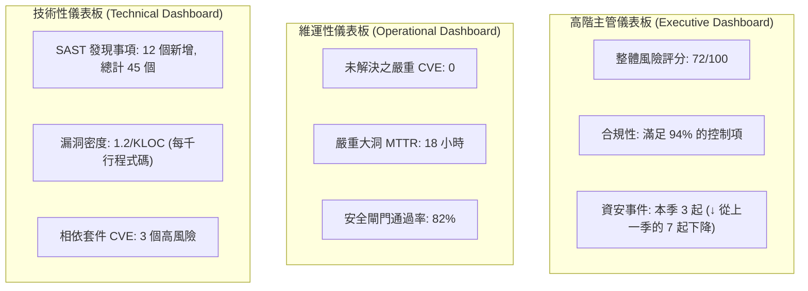
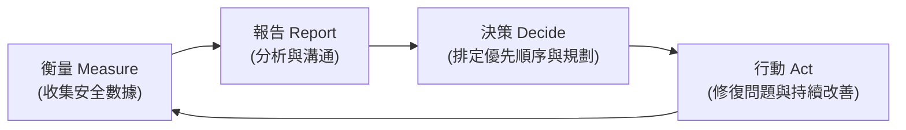

# 2.7 建立安全報告機制 (Create Security Reporting Mechanisms)

## 學習目標

- 描述在 SDLC（軟體開發生命週期）中進行安全報告的目的
- 區分不同類型的安全報告及其對應的目標受眾
- 解釋儀表板 (dashboards) 如何提供即時的安全可視性 (visibility)
- 設計能推動持續性安全改善的回饋循環 (feedback loops)

---

## 安全報告的目的

安全報告把**原始的資安數據轉化為決策者可以據以行動的情報 (actionable intelligence)**。報告在技術性的安全發現與商業決策之間搭起了一座橋樑。缺乏有效的報告機制，安全團隊的運作將會淪為孤島，領導層也無法做出明智的風險決策。

### 報告需達成的目標

| 目標 | 說明 |
|-----------|-------------|
| **可視性 (Visibility)** | 將安全態勢呈現給所有利害關係人 |
| **課責性/當責 (Accountability)** | 證明組織有確實在執行各項安全活動 |
| **決策支援 (Decision support)** | 為基於風險評估的商業決策提供數據支持 |
| **趨勢分析 (Trend analysis)** | 展現安全狀況隨時間的推移是改善還是惡化 |
| **合規性證據 (Compliance evidence)** | 證明符合法規與相關標準的要求 |
| **資源合理化 (Resource justification)** | 為安全工具、人員與流程的投資背書並提供依據 |

---

## 安全報告的類型

### 摘要性/策略性報告 (Executive / Strategic Reports)

目標受眾：CISO（資安長）、CTO（技術長）、CEO（執行長）、董事會。

| 內容 | 目的 |
|---------|---------|
| 風險態勢摘要 | 提供組織安全風險的高階全貌 |
| 合規性狀態 | 法規與各種標準合規進度的儀表板 |
| 安全投資 ROI (投資報酬率) | 展現安全支出的價值與回報 |
| 事件趨勢 | 一段時間內資安事件的數量與其嚴重程度 |
| 計畫成熟度 | 對照 BSIMM/SAMM 等成熟度目標所取得的進展 |

**特徵**：屬於高階視角，採用商業導向的語言，側重於趨勢變化，包含極少量的技術細節。

### 維運性/戰術性報告 (Operational / Tactical Reports)

目標受眾：安全團隊負責人、開發經理、專案經理。

| 內容 | 目的 |
|---------|---------|
| 未解決漏洞狀態 | 根據嚴重性與存在天數 (age) 劃分的當前待辦清單 (backlog) |
| 修復進度 | MTTR（平均修復時間）趨勢，漏洞修復的 SLA 合規情況 |
| 安全測試涵蓋率 | 已執行 SAST/DAST/滲透測試的專案比例 |
| 安全閘門結果 | 關卡審查的通過/失敗率以及常見的失敗原因 |
| 第三方風險摘要 | 供應商評估狀態與相依性套件的風險情況 |

**特徵**：具備可執行性，有明確的時間範圍，以團隊為中心，包含具體的改善行動。

### 技術性/細節報告 (Technical / Detailed Reports)

目標受眾：開發人員、安全工程師、品質保證 (QA) 人員。

| 內容 | 目的 |
|---------|---------|
| 漏洞掃描結果 | 包含重現步驟的詳細發現事項 |
| SAST/DAST 報告 | 具體的程式碼層級發現以及修復指引 |
| 滲透測試報告 | 詳細的發現過程、可被輕易利用的證據，以及修補步驟 |
| 程式碼審查發現 | 在同儕審查與安全程式碼審查中發現的問題 |
| 組態稽核結果 | 偏離安全基準配置 (security baselines) 的項目 |

**特徵**：高度技術性、包含詳細的問題重現步驟，並列出依優先順序排序的修補指引。

---

## 儀表板 (Dashboards)

儀表板提供了對安全狀態**即時或近乎即時的可視性 (visibility)**。它們具備視覺化、互動性的特點，其設計初衷就是為了讓人能一目了然。

### 儀表板設計原則

| 原則 | 說明 |
|-----------|-------------|
| **符合受眾需求** | 針對高階主管、管理層與工程師提供不同的儀表板視角 |
| **可帶來具體行動的指標** | 使用紅/黃/綠燈號等與明確定義門檻相連結的狀態指示器 |
| **趨勢視覺化** | 展示隨時間變化的數據，以突顯是正在進步還是倒退 |
| **鑽取 (Drill-down) 能力** | 允許使用者點進去查看匯總指標背後的詳細資料 |
| **自動化資料饋送** | 自動從各種安全工具（SAST, DAST, SIEM, 票務/工單系統）中抓取資料 |

### 範例儀表板指標

---

## 回饋循環 (Feedback Loops)

回饋循環確保了**報告能夠驅動行動**，並且這些行動的成果會被擷取並反映在後續的報告中。如果沒有回饋循環，報告就只會淪為沒有任何人會因此改變行為的純資訊產物。

### 安全回饋循環

### 回饋循環的類型

| 循環類型 | 說明 | 範例 |
|------|-------------|---------|
| **立即性 (Immediate)** | 會觸發立即處理動作的即時警報 | SAST 發現嚴重問題，立即阻擋 CI/CD 管線的建置作業 |
| **衝刺層級 (Sprint-level)** | 安全發現被排入下一個衝刺期的待辦清單中 | 在衝刺規劃會議中排入處理安全技術債的項目 |
| **發布層級 (Release-level)** | 將匯總的發現事項作為是否放行發布 (go/no-go) 決策的依據 | 在發布階段進行安全閘門審查 |
| **策略層級 (Strategic)** | 每季/每年的趨勢藉以驅動專案方向的改變 | 根據 BSIMM 的評估結果來制定下一年度的安全藍圖 |

### 有效回饋的特徵

| 特徵 | 說明 |
|---------------|-------------|
| **及時性 (Timely)** | 資訊能在仍有採取行動價值的時間內送達決策者手中 |
| **具體性 (Specific)** | 清楚指明什麼地方需要改變，以及由誰負責 |
| **可衡量 (Measurable)** | 包含可追蹤的數據，以便確認回饋有確實被採取行動 |
| **建設性 (Constructive)** | 重點放在如何改善，而不是互相指責 (blame) |

---

## 考試重點

1. **依受眾劃分的報告類型**：高階主管報告（關注商業風險）、維運報告（關注團隊進度）、技術報告（關注詳細的漏洞發現）。
2. **儀表板 (Dashboards)**：即時、視覺化、貼合受眾需求、具備自動化的資料介接。
3. **回饋循環**：衡量 → 報告 → 決策 → 行動 → （再回到）衡量 的持續循環流程。
4. **報告是為了驅動決策**：如果一份報告沒有附帶行動計畫，它便是低效無用的。
5. **合規性證據**：報告可作為向稽核人員與監管機構證明有盡到「應有之注意義務 (due diligence)」的證據。

---

## 關鍵術語表

| 術語 | 定義 |
|------|-----------|
| **Security Dashboard (安全儀表板)** | 即時呈現安全指標與狀態的視覺化面板 |
| **Feedback Loop (回饋循環)** | 透過衡量結果驅動行動，行動結果再回饋給衡量指標的週期性過程 |
| **MTTR** | 平均修復時間 (Mean Time to Remediate) |
| **SLA Compliance (SLA 合規)** | 遵循對特定安全活動所同意的服務層級協議水準 |
| **Risk Posture (風險態勢)** | 組織在某個特定時間點的整體安全防護與受威脅狀況 |
| **Trend Analysis (趨勢分析)** | 透過檢查數據隨時間的變化，找出進步或惡化的規律模式 |
| **Defect Removal Efficiency (缺陷移除效率)** | 衡量在正式發布進入生產環境之前，系統缺陷被找出來的百分比 |
