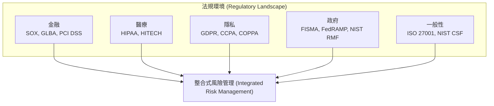
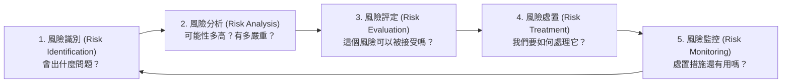
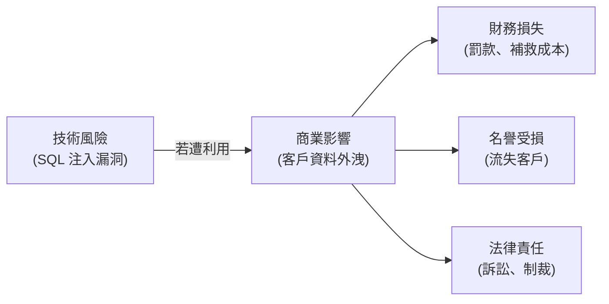

# 2.8 導入整合式風險管理 (Incorporate Integrated Risk Management)

## 學習目標

- 識別與安全軟體相關的關鍵法規、標準與指導原則
- 解釋法律考量事項，包含智慧財產權 (intellectual property) 與資料外洩通報 (breach notification)
- 描述風險管理流程：風險評估 (risk assessment) 與風險分析 (risk analysis)
- 區分技術風險 (technical risk) 與商業風險 (business risk)
- 將風險管理整合到軟體開發生命週期中

---

## 法規、標準與指導原則 (Regulations, Standards, and Guidelines)

整合式風險管理要求開發者必須了解適用於正在開發中軟體的法規、法律與標準環境。主要的框架包含：

### 安全框架與標準

| 框架 | 重點 | 關鍵應用領域 |
|-----------|-------|----------------|
| **ISO 27001/27002** | 資訊安全管理系統 (ISMS) 與控制項 | 企業級 ISMS |
| **ISO/IEC 15408 (Common Criteria, CC)** | IT 產品安全評估 (通用準則) | 產品安全認證 |
| **PCI DSS** | 支付卡產業資料安全 | 支付處理系統 |
| **NIST SP 800 系列** | 聯邦資訊系統安全 (美國政府) | 政府與國防合約 |
| **NIST CSF** | 網路安全風險管理框架 (Cybersecurity Framework) | 跨產業的風險管理 |
| **OWASP** | 網站應用程式安全 | 應用程式安全測試與最佳實務 |
| **SAFECode** | 軟體保證的業界實務 | 安全開發流程 |
| **SAMM** | 軟體保證成熟度衡量 (OWASP) | 改善安全計畫 |
| **BSIMM** | 軟體安全倡議的標竿比較基準 | 同業比較與基準設定 |

### 法規遵循對應關係 (Regulatory Compliance Mapping)

---

## 法律考量事項 (Legal Considerations)

### 智慧財產權 (Intellectual Property, IP)

軟體開發涉及多種形式的智慧財產權，都必須受到妥善管理：

| 智財權類型 | 保護內容 | 期限 | 對軟體的適用性 |
|---------|-----------|----------|--------------------------|
| **專利 (Patent)** | 對一項發明的專有權；必須具備新穎性、實用性與非顯而易見性 | 20年（通常） | 演算法、流程、商業方法 (algorithms, processes, business methods) |
| **著作權/版權 (Copyright)** | 對「思想表達形式」的保護（不保護思想本身） | 創作者終身 + 70年（企業為 95年） | 原始碼、文件記錄、使用者介面設計 |
| **營業秘密 (Trade Secret)** | 被保持機密的專有資訊 | 未定（只要能維持機密狀態就永遠有效） | 演算法、配方、商業流程 |
| **商標 (Trademark)** | 對品牌識別的認可保護 | 未定（需定期更新展延） | 產品名稱、標誌 (logos) |

> **考試提示**：**著作權 (Copyright)** 保護的是程式碼的「具體表達方式」，但它**並不能**阻止其他人獨立開發出具有相同功能的程式碼。只有**專利 (Patents)** 才能保護底層的運作流程或演算法本身。

### 外洩通報 (Breach Notification)

許多法規要求組織在發生資料外洩時，必須通知受影響的個人與監管機構：

| 法規 | 通報要求 |
|-----------|------------------------|
| **GDPR** | 72 小時內通報主管機關；若有高風險，必須「毫不延遲」地通知資料主體 (受當事人) |
| **HIPAA** | 60 天內通知受影響的個人；若超過 500 人，必須立即通知衛生部 (HHS) |
| **PCI DSS** | 立即通報支付品牌與收單銀行 |
| **美國州法** | 各州規定不同；大多數要求在 30–90 天內通報 |

### 合約與保固考量事項

| 元素 | 說明 |
|---------|-------------|
| **終端使用者授權協定 (EULA)** | 定義使用條款與責任限制 |
| **保固 (Warranty)** | 對軟體功能與安全性的保證 |
| **賠償 (Indemnification)** | 針對因使用產品而引發索賠時所提供的免責/賠償保護 |
| **程式碼託管 (Code escrow)** | 將原始碼交由第三方保管，以防供應商破產時之緊急存取 |
| **服務等級協定 (SLA)** | 定義效能與系統可用性承諾的合約 |

---

## 風險管理 (Risk Management)

### 風險評估 vs. 風險分析 (Risk Assessment vs. Risk Analysis)

| 概念 | 說明 |
|---------|-------------|
| **風險評估 (Risk Assessment)** | **識別、分析並評定**風險的整體大流程 |
| **風險分析 (Risk Analysis)** | 風險評估過程中的一個具體步驟，藉由評估可能性與影響來**判定風險的等級** |

### 風險評估流程 (Risk Assessment Process)

### 風險處置選項 (Risk Treatment Options)

| 選項 | 說明 | 範例 |
|--------|-------------|---------|
| **緩解/降低 (Mitigate/Reduce)** | 實施控制措施以降低可能性或影響 | 加入輸入驗證機制以防止 SQL 注入攻擊 |
| **轉移 (Transfer)** | 將風險轉移給第三方 | 購買網路保險；透過合約轉移責任 |
| **接受 (Accept)** | 承認風險的存在並繼續前進（不增加額外的控制） | 該風險落在組織的可接受風險範圍 (risk appetite) 內 |
| **避免 (Avoid)** | 藉由不執行該危險活動來消除風險 | 停用一項會引入不可接受風險的新功能 |

> **考試提示**：風險永遠無法被完全消除 — 只能被管理。在實施了安全控制措施之後仍然留下來的風險，稱為**殘餘風險 (Residual risk)**。

### 定量風險分析 vs. 定性風險分析 (Quantitative vs. Qualitative)

| 方法 | 說明 | 衡量指標 |
|----------|-------------|---------|
| **定量 (Quantitative)** | 將風險賦予具體的數值化/金錢貨幣價值 | ALE = ARO × SLE |
| **定性 (Qualitative)** | 使用描述性的類別（高/中/低） | 風險矩陣 (Risk matrices)、專家判斷 |

**定量風險術語：**

| 術語 | 定義 |
|------|-----------|
| **資產價值 (AV, Asset Value)** | 資產的金錢價值 |
| **暴露因子 (EF, Exposure Factor)** | 單一事件發生時所損失的資產價值百分比 |
| **單一預期損失 (SLE, Single Loss Expectancy)** | AV × EF — 單一事件的預期損失金額 |
| **年度發生率 (ARO, Annual Rate of Occurrence)** | 該威脅預計一年內會發生的頻率 (次數) |
| **年度預期損失 (ALE, Annual Loss Expectancy)** | SLE × ARO — 預期的年度金錢損失總額 |

---

## 技術風險 vs. 商業風險 (Technical Risk vs. Business Risk)

了解技術風險與商業風險之間的區別，對於排定安全投資的優先順序來說至關重要。

### 技術風險 (Technical Risk)

技術風險關乎**特定於科技本身的威脅與漏洞**：

| 類別 | 範例 |
|----------|---------|
| **程式碼漏洞** | SQL 注入 (SQL injection)、跨網站指令碼 (XSS)、緩衝區溢位 (buffer overflow) |
| **架構弱點** | 單點故障 (Single point of failure)、不安全的通訊協定 |
| **組態配置錯誤** | 預設密碼未改、啟用了不必要的服務 |
| **相依性風險** | 第三方函式庫有已知的 CVE 漏洞 |
| **基礎設施風險** | 過時的作業系統、未套用修補程式的伺服器 |

### 商業風險 (Business Risk)

商業風險關乎**對達成組織目標所造成的影響**：

| 類別 | 範例 |
|----------|---------|
| **財務損失 (Financial loss)** | 因停機造成的營收損失、監管罰款、資料外洩處理成本 |
| **名譽受損 (Reputational damage)** | 失去客戶信任、負面媒體報導 |
| **法律責任 (Legal liability)** | 訴訟、主管機關制裁、合約違約罰款 |
| **競爭劣勢 (Competitive disadvantage)** | 因安全事件而流失市占率 |
| **營運中斷 (Operational disruption)** | 無法交付產品或提供服務 |

### 將技術風險連結到商業風險

**CSSLP 的一項關鍵技能**：將技術發現轉換為商業語言。SQL 注入漏洞是一個 *技術風險*；它導致客戶資料外洩的潛在可能性，進而帶來監管罰款與名譽損失，才是真正的 *商業風險*。

> **考試提示**：考試會測驗你**將技術風險連結到商業影響**的能力。在評估安全投資時，驅動優先順序的應該是商業風險 — 而不僅僅是技術上的嚴重程度。

---

## 考試重點

1. **風險處置選項**：緩解 (Mitigate)、轉移 (Transfer)、接受 (Accept)、避免 (Avoid) — 了解並能舉出每一個選項的例子。
2. **ALE 公式**：ALE = ARO × SLE；SLE = AV × EF。
3. **技術風險 vs. 商業風險**：技術方面 = 漏洞層級；商業方面 = 組織影響。
4. **殘餘風險 (Residual risk)**：實施了控制措施之後還剩下的風險。
5. **智財權種類**：專利 (流程/演算法)、著作權 (具體表達/程式碼)、營業秘密 (維持機密)、商標 (品牌)。
6. **外洩通報時限**：GDPR（72 小時）、HIPAA（60 天）、PCI（立即通報）。
7. **風險評估流程**：識別 (Identify) → 分析 (Analyze) → 評定 (Evaluate) → 處置 (Treat) → 監控 (Monitor)。
8. **著作權 vs. 專利**：著作權不能防止他人獨立地重新實作（重寫）；專利才可以。

---

## 關鍵術語表

| 術語 | 定義 |
|------|-----------|
| **Risk Assessment (風險評估)** | 識別、分析並評定風險的整體大流程 |
| **Risk Analysis (風險分析)** | 透過評估可能性與影響來判定風險等級的特定步驟 |
| **Residual Risk (殘餘風險)** | 在套用了所有安全控制項之後，依舊存在的風險 |
| **Risk Appetite (風險胃納量)** | 組織願意接受的風險總量 |
| **ALE** | Annual Loss Expectancy (年度預期損失) — 一個風險在一年預估造成的金錢損失總額 |
| **SLE** | Single Loss Expectancy (單一預期損失) — 單次事件發生的預期損失金額 |
| **ARO** | Annual Rate of Occurrence (年度發生率) — 某威脅在一年內預期發生的頻率 |
| **Patent (專利)** | 由政府授予對一項發明的專有排除權 |
| **Copyright (著作權)** | 對思想「表達形式」的法律保護 |
| **Trade Secret (營業秘密)** | 透過保密來維持專有價值的資訊 |
| **Breach Notification (外洩通報)** | 在資料外洩事件發生後，通知受影響各方的法律要求 |
| **EULA** | End-User License Agreement (終端使用者授權協定) |
| **Code Escrow (程式碼託管)** | 將原始碼交由第三方保管，作為緊急存取備案的協議安排 |
| **Indemnification (賠償/免責保護)** | 針對因使用產品所引發的求償提出保護的合約條款 |
