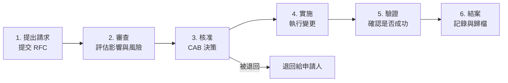
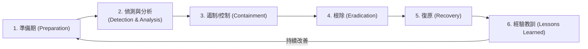
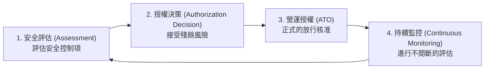

# 2.9 實施安全維運實務 (Implement Secure Operation Practices)

## 學習目標

- 描述變更管理流程 (change management) 及其安全影響
- 解釋事件回應計畫 (incident response plan) 的組成要素
- 區分軟體安全的驗證 (verification) 與確認 (validation) (V&V)
- 了解評估與授權 (A&A, Assessment and Authorization) 流程
- 在整個軟體生命週期中應用安全的維運實務

---

## 變更管理 (Change Management)

變更管理是一個用於控制對軟體、基礎架構與組態設定進行修改的**正式流程**。未受控的變更是引發安全事件的主要原因之一 — 它們可能引入新的漏洞、破壞現有的控制項，或導致配置基準偏移 (configuration drift)。

### 變更管理流程

### 變更的類型

| 類型 | 說明 | 處理流程 |
|------|-------------|---------|
| **標準變更 (Standard)** | 預先核准、低風險的例行性變更 | 遵循既定的文件化程序；不需 CAB 審理核准 |
| **正常變更 (Normal)** | 需要評估與核准程序的變更 | 進入完整的變更管理流程，需經 CAB 審查 |
| **緊急變更 (Emergency)** | 為解決嚴重事件的緊急變更 | 急件放行核准；事後必須進行追溯審查 (retrospective review) |

### 變更管理中的安全考量

| 考量事項 | 說明 |
|--------------|-------------|
| **影響評估 (Impact assessment)** | 評估此變更如何影響應用程式的安全態勢 |
| **迴歸風險 (Regression risk)** | 判定此變更是否會破壞現有的安全控制機制 |
| **回復計畫 (Rollback plan)** | 定義萬一變更引入了安全問題，該如何復原系統 |
| **測試要求 (Testing requirements)** | 指定在核准變更前必須通過哪些安全測試 |
| **職責分離 (Separation of duties)** | 提出變更請求的人，不應該是同一個負責批准變更的人 |
| **稽核軌跡 (Audit trail)** | 所有變更都必須被記錄下來（包含人事時地物/Why/What/Who/When） |

> **考試提示**：變更管理落實了**職責分離 (separation of duties)** — 在可行的情況下，申請人、審查人與實施人應該由不同的個人擔任。

### 變更諮詢委員會 (CAB, Change Advisory Board)

CAB 是一個**跨職能的團隊 (cross-functional group)**，負責評估並授權變更：

| 角色 | 職責 |
|------|---------------|
| **變更經理 (Change Manager)** | 主持 CAB 會議，管理變更流程 |
| **技術主管 (Technical Lead)** | 評估技術上的可行性與風險 |
| **安全代表 (Security Representative)** | 評估安全層面的影響 |
| **維運代表 (Operations Representative)** | 評估對於維運的影響以及準備就緒與否 |
| **業務權責利害關係人** | 評估對於業務的影響與優先順序 |

---

## 事件回應計畫 (Incident Response Plan)

事件回應計畫 (IRP) 定義了用來偵測、回應並從資安事件中復原的**結構化方法**。對於 CSSLP 來說，重點在於事件回應要如何與 SDLC 進行整合。

### 事件回應階段 (Incident Response Phases)

| 階段 | 活動 |
|-------|-----------|
| **準備 (Preparation)** | 建立 IR 團隊、定義政策、部署監控、進行演練與教育訓練 |
| **偵測與分析 (Detection & Analysis)** | 監控入侵指標 (IOC)、分類警報、判斷影響範圍與嚴重程度 |
| **遏制 (Containment)** | 隔離受影響的系統，防止進一步的破壞，保留數位證據 |
| **根除 (Eradication)** | 移除產生問題的根本原因（惡意軟體、漏洞、未經授權的存取） |
| **復原 (Recovery)** | 將系統恢復到正常運作狀態，驗證安全控制項是否正常 |
| **從經驗中學習 (Lessons Learned)** | 事件後檢討會議，記錄發現事項，更新流程與控制措施 |

### 事件分類分級 (Incident Triage)

Triage (分類/分級) 是**快速評估並排定事件優先順序**，以決定採取何種適當回應行動的過程：

| 分類考量因素 | 評估 |
|--------------|------------|
| **嚴重性 (Severity)** | 受影響系統的關鍵性為何？曝露了哪些資料？ |
| **範圍 (Scope)** | 有多少個系統、使用者或資料紀錄遭受波及？ |
| **緊急性 (Urgency)** | 攻擊正在進行中嗎？是否發生了資料外洩 (exfiltration)？ |
| **業務影響 (Business impact)** | 對營收、維運以及組織名譽的影響為何？ |

### 數位鑑識 (Forensics)

在軟體安全的脈絡下，數位鑑識涉及：

| 活動 | 說明 |
|----------|-------------|
| **證據保存 (Evidence preservation)** | 維持監管鏈 (chain of custody)；使用鑑識映像檔 (bit-for-bit 精確複製) |
| **日誌分析 (Log analysis)** | 檢查應用程式日誌、系統日誌與網路日誌，尋找入侵指標 (IOC) |
| **記憶體分析 (Memory analysis)** | 擷取並分析高揮發性記憶體 (volatile memory) 中的人工製品 (artifacts) |
| **根本原因分析 (Root cause analysis)** | 釐清事件是如何發生的，以及是哪個漏洞遭到利用 |
| **時間軸重建 (Timeline reconstruction)** | 重建從初次被入侵到被偵測發現之間的事件時間順序 |

### 針對漏洞的修復/補救 (Remediation)

修復/補救解決的是使該事件得以發生的**底層漏洞**：

| 行動 | 範例 |
|--------|---------|
| **修補 (Patching)** | 套用安全修補程式以修復被利用的漏洞 |
| **程式碼修改 (Code fix)** | 修改應用程式的原始碼以消除該漏洞 |
| **組態變更 (Configuration change)** | 修正被攻擊者利用的錯誤組態 |
| **架構變更 (Architecture change)** | 修改系統的設計架構以防止類似攻擊再次發生 |
| **控制項強化 (Control enhancement)** | 新增或強化安全控制項 (例如：WAF 規則、存取限制) |

### 根本原因分析 (RCA, Root Cause Analysis)

RCA 不僅僅是解決表面的、立即性的問題，其目的在於找出**系統性的病因 (systemic causes)**：

- **5個為什麼 (5 Whys)**：不斷反問「為什麼」，直到找出根本原因為止
- **魚骨圖 (Fishbone/Ishikawa diagram)**：將潛在原因予以分類（人員、流程、技術、環境）
- **故障樹分析 (Fault tree analysis)**：一種由上而下的基於演繹邏輯模型，從失效點往回追溯潛在促成原因

---

## 驗證與確認 (Verification and Validation, V&V)

V&V 是確保軟體符合其規格 (specification) 且能達到其預期用途的兩項互補性活動。

| 概念 | 試圖回答的問題 | 重點關注 |
|---------|----------|-------|
| **驗證 (Verification)** | *Are we building the product right?*  (我們有沒有把產品「做對」？) | 是否符合規格書的要求；軟體的建造過程是否正確 |
| **確認 (Validation)** | *Are we building the right product?*  (我們有沒有做出「對的產品」？) | 是否滿足了使用者的需求以及它的預期用途 |

### 軟體驗證與確認計畫 (SVVP)

SVVP (Software Validation and Verification Plan) 規範了 V&V 活動的管理要求：

| 元素 | 說明 |
|---------|-------------|
| **異常解決與報告** | 如何對軟體缺陷/異常情況進行記錄並加以解決 |
| **例外/偏離政策** | 當需要偏離 V&V 要求要求時的處理政策 |
| **基準線與組態控制** | 針對 V&V 產出文物 (artifacts) 的變更管理 |
| **標準、實務做法與慣例** | 被採用的 V&V 指導性標準 |
| **文件格式** | 各種計畫、程序、測試案例以及驗證結果報告的範本 |

### V&V 的類型

#### 管理階層 V&V (Management V&V)

- 檢視系統**計畫、時程、需求與方法論**之適切性
- 支援對該系統負有責任的**管理階層人員**
- 從中發掘出計畫或流程執行上發生偏離 (variations) 的地方
- 關鍵參與角色：決策者、審查負責人、審查記錄員、管理幕僚、技術幕僚、客戶代表

#### 技術面 V&V (Technical V&V)

- 對**產品、文件、程式碼與程序**進行一致性評估
- 判定產品是否符合系統規格、是否遵守法規以及是否被實作正確
- 關鍵參與角色：決策者、審查負責人、審查記錄員、技術幕僚/經理、客戶端技術長
- 此活動應**被安排於最初的專案規劃中**；臨時加開的臨時性 (ad hoc) 審查只能做為補充性質

### 獨立的 V&V (IV&V, Independent V&V)

- 由**無利害關係的第三方**執行，確保其客觀性
- 確保查核的結果免受服務提供方 (供應商) 或客戶端的不當影響
- 通常被稱為一種**稽核 (audit)**
- 由一位有權限的**首席稽核員 (single lead auditor)** 負責帶領
- 通常不會由軟體開發生產方主動發起

**IV&V 稽核報告內容包含：**
- 目的與稽核範圍
- 受稽核組織的名稱
- 受稽核的軟體標的
- 適用的法規及標準
- 稽核評估所使用的準則
- 對發現事項予以記錄，並將「異常項目清單」分類為 主要 (major) 或 次要 (minor)
- 決定後續跟催追蹤活動的時程

---

## 評估與授權 (A&A, Assessment and Authorization)

評估與授權（以前稱為 認證與認可 Certification and Accreditation — C&A）是**對系統之安全態勢進行評估**，並**正式授權其上線營運**的過程。

### A&A 流程

| 階段 | 說明 |
|-------|-------------|
| **安全評估 (Assessment)** | 對所有安全控制項進行對照各項要求的獨立評估審查 |
| **授權決策 (Authorization Decision)** | 授權官員 (Authorizing Official) 審閱評估結果，並決定是否接受殘餘風險 |
| **營運授權 (ATO, Authorization to Operate)** | 頒發正式的放行文件，允許該系統上線營運 |
| **持續監控 (Continuous Monitoring)** | 進行常態性的後續監測，以確保該系統能維持在當初獲准的安全態勢 |

### 關鍵 A&A 角色

| 角色 | 職責 |
|------|---------------|
| **授權官員 (AO, Authorizing Official)** | 接受殘餘風險並簽發 ATO (營運授權) 的高階主管 |
| **系統擁有者 (System Owner)** | 負責系統的整體維運與安全 |
| **安全控制評估員 (Security Control Assessor)** | 獨立從事各項安全控制評估的人員 |
| **ISSM/ISSO** | 資訊系統安全經理/官員 — 負責執行日常的資安維運活動 |

---

## 考試重點

1. **變更管理 (Change management)**：提出 RFC → 審查 → 核准 → 實施 → 驗證 → 結案。
2. **變更流程中的職責分離原則**：請求者 (Requestor) 無權核准 (Approver)，核准者不執行 (Implementer)。
3. **IR (事件回應) 階段**：準備 → 偵測分析 → 遏制隔離 → 根除 → 復原 → 檢討經驗教訓。
4. **驗證與確認 (Verification vs. Validation)**：驗證 (Verification) = 有沒有把事物建造正確 (符合規格)；確認 (Validation) = 產品本身是不是對的 (滿足用戶)。
5. **IV&V**：由獨立的第三方來進行 V&V — 確保客觀公正（這通常也被稱為一場稽核）。
6. **A&A (評估與授權)**：經過安全評估 (Assessment) 之後，由授權官員給予系統能上線的營運授權 (ATO)。
7. **根本原因分析 (Root cause analysis)**：理解 5 Whys (連問 5 次為什麼)、魚骨圖 (Fishbone diagrams)、故障樹分析 (Fault tree analysis)。
8. **SVVP**：定義軟體的 V&V 活動、異常的解決機制以及組態變更控制。

---

## 關鍵術語表

| 術語 | 定義 |
|------|-----------|
| **Change Management (變更管理)** | 針對軟體與系統架構各項修改進行控制的正式流程 |
| **CAB** | Change Advisory Board (變更諮詢委員會) — 負責評估並授權變更的跨部門職能小組 |
| **RFC** | Request for Change (變更請求) — 一項正式關於執行的變更提案 |
| **Incident Response Plan (事件回應計畫)** | 用於處置和管理資訊安全事件的系統化結構方法 |
| **Triage (事件分流/分級)** | 在資安事件處理初期，迅速對事件影響力進行優先排序的評估動作 |
| **Forensics (數位鑑識)** | 應用科學技術在安全事件中進行數位證據的收集與分析過程 |
| **Root Cause Analysis (根本原因分析)** | 找出一連串事件或問題的最深層誘發原因之分析流程 |
| **Remediation (修復與補救)** | 為修正讓這起事件得以發生的漏洞，所採取的各項安全治標與治本行動 |
| **Verification (驗證)** | 確認軟體的**建造過程與做法是正確的**（其產出符合設計規格） |
| **Validation (確認)** | 確認造出的軟體**是正確的產品**（其功能滿足使用者的真實需求） |
| **SVVP** | Software Validation and Verification Plan (軟體驗證與確認計畫) |
| **IV&V** | Independent Verification and Validation (獨立的驗證與確認任務) |
| **A&A** | Assessment and Authorization (評估與授權。以前舊的術語稱為 C&A - Certification and Accreditation) |
| **ATO** | Authorization to Operate (營運授權) — 允許系統在正式環境中運作的最終放行核准簽核 |
| **Authorizing Official (授權官員)** | 決定並承擔接受殘餘風險、核發營運授權 (ATO) 的高階主管層級人員 |
