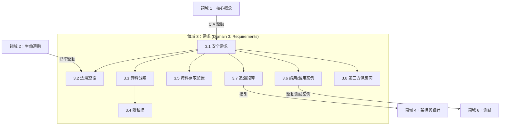

# 領域 3：安全軟體需求 (Domain 3: Secure Software Requirements) (13%)

## 領域概觀 (Domain Overview)

領域 3 的重點在於在寫下任何一行程式碼之前，**定義並擷取安全需求 (defining and capturing security requirements)** — 包含功能性與非功能性的需求。本領域探討的議題包括法規遵循、資料分類、隱私權、存取權限配置、誤用/濫用案例的開發、需求追溯性，以及第三方供應商的安全性。把「需求」做對，是所有安全活動中最具成本效益的一環：在需求階段發現的安全缺陷，其修復成本比在正式營運環境中發現的缺陷要低上好幾個數量級。

本領域在考試中佔有 **13% 的權重**，並包含 **8 個主要章節**：

| 章節 | 標題 | 重點 |
|---------|-------|-------|
| 3.1 | 定義軟體安全需求 (Define Software Security Requirements) | 功能性與非功能性需求 |
| 3.2 | 識別法規遵循需求 (Identify Compliance Requirements) | 監管法規、法律、業界標準、全公司政策 |
| 3.3 | 識別資料分類需求 (Identify Data Classification Requirements) | 擁有權、標籤化、資料類型、生命週期、處理方式 |
| 3.4 | 識別隱私權需求 (Identify Privacy Requirements) | 收集範圍、去識別化/匿名化、使用者權利、保留期限、跨境傳輸 |
| 3.5 | 定義資料存取配置 (Define Data Access Provisioning) | 使用者權限配置、服務帳戶、重新核准/覆核 |
| 3.6 | 開發誤用與濫用案例 (Develop Misuse and Abuse Cases) | 以攻擊為導向的需求分析、緩解控制措施 |
| 3.7 | 建立安全需求追溯矩陣 (Develop Security Requirement Traceability Matrix) | 透過設計、實作與測試階段來追蹤需求 |
| 3.8 | 定義第三方供應商安全需求 (Define Third-Party Vendor Security Requirements) | 軟體供應鏈安全需求 |

## 學習目標 (Learning Objectives)

完成本領域的學習後，您應該能夠：

- 定義功能性與非功能性的安全需求
- 識別適用的法規遵循與監管要求
- 制定資料分類機制與隱私權需求
- 設計包含一般使用者與服務帳戶的存取配置模型
- 建立誤用與濫用案例以識別負面應用情境
- 建立安全需求追溯矩陣 (SRTM)
- 為第三方供應商與供應商定義安全需求

## 關鍵關聯性 (Key Relationships)

## 備考提示 (Study Tips)

> **考試重點**：領域 3 是**權重最高的領域**，佔比達 13%。考題會大量涵蓋資料分類、隱私權需求以及 SRTM 等內容。考題通常會給定一個情境，然後詢問您應該適用哪種類型的需求。

- 必須清楚了解**功能性需求 (functional)**（系統要做什麼）與**非功能性需求 (non-functional)**（系統做得多好/多安全）之間的差異。
- **資料分類 (Data classification)** 是一項由業務力驅動 (business-driven) 的活動，而非技術活動。
- 了解**資料生命週期 (data lifecycle)**：產生/建立 → 儲存/保留 → 銷毀。
- 熟記資料清理方法 (sanitization methods) 的安全等級順序：丟棄 (disposal) < 清除 (clearing) < 淨化 (purging) < 物理破壞 (destroying)。
- **SRTM** 將業務需求一路追蹤對應到設計、實作與測試階段。
- **誤用案例 (Misuse cases)** 是從**攻擊者的視角**來審視系統。

## 本章節包含的檔案

| 檔案 | 內容 |
|------|---------|
| [3.1_software_security_requirements.md](3.1_software_security_requirements.md) | 功能性與非功能性需求、使用案例、主體-客體矩陣 |
| [3.2_compliance_requirements.md](3.2_compliance_requirements.md) | 監管要求、法律、業界標準、公司內部政策合規性 |
| [3.3_data_classification.md](3.3_data_classification.md) | 資料擁有權、資料標籤、資料類型、生命週期、處理程序 |
| [3.4_privacy_requirements.md](3.4_privacy_requirements.md) | 資料收集範圍、匿名化/去識別化、使用者權利、資料保留、跨境傳輸 |
| [3.5_data_access_provisioning.md](3.5_data_access_provisioning.md) | 使用者配置、服務帳戶、權限覆核 |
| [3.6_misuse_and_abuse_cases.md](3.6_misuse_and_abuse_cases.md) | 誤用/濫用案例的開發、緩解控制措施 |
| [3.7_security_requirement_traceability.md](3.7_security_requirement_traceability.md) | SRTM 的開發與管理 |
| [3.8_third_party_vendor_requirements.md](3.8_third_party_vendor_requirements.md) | 供應商的安全需求、SBOM、合約條款 |
