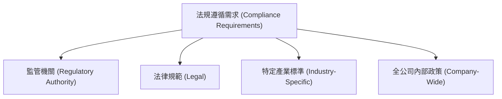
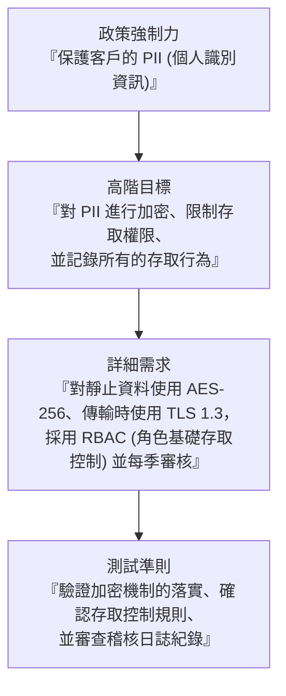

# 3.2 識別法規遵循需求 (Identify Compliance Requirements)

## 學習目標

- 識別來自監管機關、法律、業界以及全公司內部政策的法規遵循要求
- 了解關鍵的監管框架及其適用性
- 解釋與軟體相關的智慧財產權保護機制
- 描述如何將政策分解 (policy decomposition) 作為推導出詳細安全需求的一種方法

---

## 法規遵循要求的來源

法規遵循 (Compliance) 需求主要源自以下四大類別：

### 監管機關 (Regulatory Authority)

由政府強制規定，**若不遵守將面臨法律處罰**的要求：

| 法規規範 | 適用範圍 | 關鍵要求 |
|-----------|-------|-----------------|
| **FISMA** (2002) | 美國聯邦政府機構 | 機構層級的全面性資訊安全計畫 |
| **GDPR** (2018) | 歐盟資料保護 | 資料主體權利、知情同意、外洩通報 (72小時) |
| **CCPA** (2018) | 加州消費者隱私法 | 消費者擁有知情權、刪除權與拒絕販售權 (opt-out) |
| **COPPA** (1998) | 兒童線上隱私權 | 收集 13 歲以下兒童資料前，必須取得家長同意 |
| **FedRAMP** | 美國聯邦政府雲端服務 | 標準化的雲端安全評估與授權機制 |

### 法律規範 (Legal)

| 領域 | 說明 |
|------|-------------|
| **外洩通報 (Breach notification)** | 在資料遭到洩露後強制要求通報的相關法律 |
| **隱私權法規 (Privacy laws)** | 管轄個人資料保護層面的法規 |
| **合約義務 (Contractual obligations)** | 在供應商/客戶協議中所承諾的安全責任 |
| **法律責任 (Liability)** | 必須為安全機制失效所承擔的法律究責 |

### 特定產業標準 (Industry-Specific)

| 產業 | 標準/法規 | 重點 |
|----------|-------------------|-------|
| **國防 (Defense)** | NIST SP 800-171, CMMC | 受控非機密資訊 (CUI, Controlled Unclassified Information) 護 |
| **醫療照護 (Healthcare)** | HIPAA / HITECH | 受保護健康資訊 (PHI, Protected Health Information) |
| **金融 (Financial)** | SOX, GLBA | 確保財務報表健全與完整性，保護消費者金融資料隱私 |
| **支付卡 (Payment Card)** | PCI DSS | 支付卡產業資料安全標準；具備合約強制力且違規將面臨高額財務罰款 |

### 全公司內部政策 (Company-Wide)

| 類別 | 範例 |
|----------|---------|
| **開發工具** | 經核准的 IDE、函式庫與框架 |
| **標準** | 內部編碼標準、安全配置基準線 |
| **框架** | 組織採用的安全框架（如 ISO 27001, NIST CSF） |
| **通訊協定** | 經核准的通訊與加密協定 |

---

## 智慧財產權 (Intellectual Property, IP)

軟體牽涉到多種形式的 IP，並衍生出相應的合規義務：

| 智財權類型 | 保護內容 | 關鍵特徵 |
|---------|-----------------|-------------------|
| **專利 (Patent)** | 發明（具備新穎、實用、非顯而易見性） | 賦予排他性獨占權；申請過程需要耗費大量資源 |
| **著作權 (Copyright)** | 思想表達形式（程式碼、文件、UI 介面） | 禁止直接抄襲拷貝，但它**無法**阻止其他人各自獨立開發/重新實作相同功能 |
| **商標 (Trademark)** | 品牌識別（產品名稱、標誌 logos） | 與某項產品或公司產生關聯的可識別品質象徵 |
| **營業秘密 (Trade Secret)** | 保持機密的企業專有資訊 | 只建立在能維持機密狀態的前提下（如可口可樂配方、肯德基炸雞秘方） |
| **保固 (Warranty)** | 產品適合其用途 (fitness-for-purpose) 的擔保 | 定義供應商對產品品質與安全性的義務 |

> **考試提示**：營業秘密 (Trade secrets) **很難被應用在軟體領域**，因為程式碼可以被反編譯 (decompiled) 或逆向工程 (reverse-engineered) 破解，導致其機密性難以維持。

---

## 安全標準參考 (Security Standards Reference)

標準提供了明確定義、可被衡量的活動準則：

| 標準 | 說明 |
|----------|-------------|
| **ISO 27001** | ISMS (資訊安全管理系統) — 建立與維護安全管理的相關要求 |
| **ISO/IEC 15408** (Common Criteria 通用準則) | 產品安全性評估 (包含 TOE, ST, PP, 以及 EAL 1–7 等級) |
| **ISO/IEC 9126** | 軟體品質定義：功能性、可靠性、易用性、效率、可維護性、可移植性 |
| **ISO/IEC 12207** | 包含各種明確定義軟體活動與產出的生命週期流程 |
| **ISO/IEC 33001** | 流程能力評估 (級距從 0–5 級) |
| **NIST SP 800 系列** | 美國聯邦政府安全指導原則 |
| **SAFECode** | 由業界背書，適用於各種規模企業的軟體保證實務 |
| **OWASP Top 10** | 網站應用程式中最致命的十大安全風險 |
| **NIST FIPS** | 對美國聯邦行政機構與特定承包商的強制性要求 |
| **NIST RMF** | 風險管理框架 (分為六大步驟：分類 → 選擇 → 實作 → 評估 → 授權 → 監控) |

### FISMA 與 SCAP

- **FISMA** 要求每一個聯邦機構必須實施一套橫跨全機構的資訊安全計畫
- **SCAP** (安全內容自動化協定, Security Content Automation Protocol) 提供了一套用於衡量安全與進行自動化盤點的標準化方法

### FedRAMP

**聯邦風險與授權管理計畫 (FedRAMP)** 為聯邦機構所使用的**雲端產品及服務**，提供了一套標準化的安全評估、授權決策與持續監控做法。在推行 FedRAMP 之前，每個聯邦機構都各自獨立管理其評估方法。

---

## 政策分解 (Policy Decomposition)

組織高階的政策必須被**向下分解 (decomposed)** 成詳細、且具體可操作的安全需求：

這項分解過程是收集需求時的**關鍵步驟** — 若沒有經過分解，崇高的政策就只會淪為無法被實施的口號與期望。

---

## 考試重點

1. **四種法規遵循來源**：監管機關、法律規範、特定產業標準、全公司內部政策。
2. **HIPAA = PHI (受保護醫療資訊)，SOX = 財務完整性，PCI DSS = 支付卡片，GLBA = 金融隱私**。
3. **著作權 vs. 專利**：著作權保護表達形式；專利保護背後的運作流程/演算法。
4. **營業秘密**：因為反編譯 (decompilation) 風險的緣故，很難在軟體中落實保護。
5. **FISMA + SCAP**：聯邦安全計畫 + 標準化的安全自動化評估。
6. **FedRAMP**：針對聯邦政府使用之雲端服務的特定安全評估基準。
7. **政策分解 (Policy decomposition)**：政策 → 高階目標 → 詳細需求 → 測試準則。

---

## 關鍵術語表

| 術語 | 定義 |
|------|-----------|
| **Compliance (法規遵循/合規)** | 遵循適用的法律、法規、標準以及政策 |
| **FISMA** | Federal Information Security Management Act (美國聯邦資訊安全管理法案) |
| **FedRAMP** | Federal Risk and Authorization Management Program (聯邦風險與授權管理計畫) |
| **SCAP** | Security Content Automation Protocol (安全內容自動化協定) |
| **PCI DSS** | Payment Card Industry Data Security Standard (支付卡產業資料安全標準) |
| **SOX** | Sarbanes-Oxley Act (沙賓法案) — 要求財報編製的健全與完整性 |
| **GLBA** | Gramm-Leach-Bliley Act (金融服務現代化法案) — 要求保護消費者金融隱私 |
| **HIPAA** | Health Insurance Portability and Accountability Act (健康保險便利和責任法案) |
| **HITECH** | Health Information Technology for Economic and Clinical Health Act (經濟與臨床健康資訊科技法案) |
| **GDPR** | General Data Protection Regulation (一般資料保護規則 / 歐盟) |
| **CCPA** | California Consumer Privacy Act (加州消費者隱私法) |
| **COPPA** | Children's Online Privacy Protection Act (兒童線上隱私保護法) |
| **Patent (專利)** | 賦予以新穎、實用且非顯而易見的發明獨占權 |
| **Copyright (著作權)** | 對思想表達形式的保護 |
| **Trade Secret (營業秘密)** | 透過保密來達到保護目的的各種專有資訊 |
| **Policy Decomposition (政策分解)** | 將高階政策向下拆解為具體、可操作的安全需求 |
