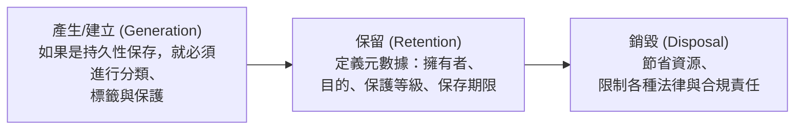

# 3.3 識別資料分類需求 (Identify Data Classification Requirements)

## 學習目標

- 解釋資料擁有權 (data ownership) 的各種角色與責任
- 描述依據敏感度與影響程度進行的資料標籤化 (data labeling) 作業
- 區分結構化資料與非結構化資料的差異
- 概述資料生命週期 (data lifecycle)：產生、保留、銷毀
- 識別針對 PII (個人識別資訊) 與公開資訊的資料處理要求

---

## 資料擁有權 (Data Ownership)

資料分類是一項**由業務力驅動 (business-driven)** 的活動，而非技術層面的活動。擁有權角色定義了誰對資料具有權限與責任。

### 擁有權角色 (Ownership Roles)

| 角色 | 責任 |
|------|-----------------|
| **資料擁有者 / 業務擁有者 (Data/Business Owner)** | 對資料進行分類；決定存取權限級別；驗證安全控制項；確保資料的備份與復原；可以將分類工作委派給他人執行 |
| **資料保管人 (Data Custodian)** | 支援資料的業務使用；確保安全的傳輸、處理與儲存；維護安全控制項、受授權的使用者與存取控制；執行備份、保留與銷毀作業 |
| **資料管理員 (Data Steward)** | 監督/治理角色；確保資料的**品質 (quality)** 以及是否符合其預定用途 (fitness for purpose) |
| **系統擁有者 (System Owner)** | 確保在該系統上處理的資料維持其安全性 |

### 資料字典 (Data Dictionary)

**資料字典**記錄了關於資料元素的後設資料 (metadata，元數據) — 包含名稱、類型、格式、允許的值、擁有權以及分類層級。它是用來了解存在哪些資料以及應該如何處理這些資料的權威性參考依據。

> **考試提示**：**資料擁有者 (data owner)**（這是一個業務端角色，而非 IT 角色）負責做出**分類決策 (classification decision)**。而**資料保管人 (data custodian)**（通常是 IT 維運單位）負責**實作 (implements)** 這些保護措施。

---

## 資料標籤化 (Data Labeling)

資料標籤為資料資產分配**敏感度等級 (sensitivity levels)** 與**影響評級 (impact ratings)**。

### 敏感度標籤 (Sensitivity Labeling)

敏感度定義了**誰有需要存取 (who needs access)** 這些資料（基於「須知/need-to-know」原則）：

| 政府/軍方分類 | 商業應用對等分類 | 說明 |
|--------------------------|----------------------|-------------|
| 最高機密 (Top Secret) | 極度機密 (Highly Confidential) | 未經授權的揭露將造成異常嚴重的損害 |
| 機密 (Secret) | 機密 (Confidential) | 未經授權的揭露將造成嚴重的損害 |
| 密件 (Confidential) | 內部使用 / 敏感 (Internal / Sensitive) | 未經授權的揭露將造成損害 |
| 非機密 (Unclassified) | 公開 (Public) | 揭露不會造成任何損害 |

### 影響力標籤 (Impact Labeling)

影響力評估的是**與資料外流/遺失相關的具體風險**：

| 影響等級 | 說明 | 範例 |
|-------------|-------------|---------|
| **高 (High)** | 對營運、資產或個人造成嚴重且災難性的負面影響 | 客戶財務紀錄、健康醫療紀錄 |
| **中 (Medium)** | 造成嚴重的負面影響 | 內部商業計畫、員工紀錄 |
| **低 (Low)** | 造成有限的負面影響 | 公開的行銷素材、對外公開發布的內容 |

---

## 資料類型 (Data Types)

| 類型 | 說明 | 範例 |
|------|-------------|---------|
| **結構化 (Structured)** | 具備組織性，資料元素之間有可識別的關聯性；通常透過這些結構化方式進行管理 | XML, JSON, 資料庫紀錄, 具備固定格式的日誌檔 |
| **非結構化 (Unstructured)** | 沒有可識別的結構；難以被解析或搜尋 | 電子郵件 (Emails), PDFs, Word 文件, 圖片, 影片 |

> **考試提示**：**企業內絕大多數的資料都是非結構化的 (majority of enterprise data is unstructured)**。即使是那些看似具有統一格式的資料（例如電子郵件），其內部通常也沒有一致性的結構。

---

## 資料生命週期 (Data Lifecycle)

資訊生命週期管理 (ILM, Information Lifecycle Management) 涵蓋了三個主要階段：

### 產生 (Generation)

- 如果資料是要被持久保存的 (persistent)，那麼在資料建立的當下，就必須對其進行**標籤化、分類與保護**
- 資料的分類決策，應在越靠近資料被建立的時間點進行越好

### 保留 (Retention)

被保留下來的資料必須定義其後設資料 (metadata)：
- **資料擁有者 (Data owner)** — 誰負責這份資料
- **儲存目的 (Purpose of storage)** — 為什麼要保存它
- **保護等級 (Level of protection)** — 適用哪些安全控制項
- **儲存長度 (Length of storage)** — 它將被保留多久
- **系統日誌 (System logs)** 從**法律/合規 (legal/compliance)** 的角度來看，被認為是相當重要的保留資料

### 銷毀 (Disposal)

- 透過移除不再需要的資料來**節省資源 (Conserve resources)**
- 透過不保留超過規定保存期限的資料來**限制/降低責任風險 (Limit liabilities)**
- 資料銷毀的決策是受到**業務目的 (business purpose)** 與**法規遵循要求 (compliance requirements)** 所驅動的

### 資料生命週期管理 (DLM) vs. 資訊生命週期管理 (ILM)

| 比較面向 | DLM (資料生命週期管理) | ILM (資訊生命週期管理) |
|--------|-----|-----|
| **重點 (Focus)** | 檔案屬性 (類型、建立時間等) | 儲存資料內的實質內容 (Content) |
| **複雜度** | 較簡單 | 可處理複雜情況 |
| **技術面** | HSM (階層式儲存管理) — 最佳化檢索時間與成本間的平衡 | 具備內容感知 (Content-aware) 能力的儲存管理 |

**階層式儲存管理 (HSM, Hierarchical Storage Management)**：同時使用不同類型的儲存媒體 — 將經常存取的熱資料放在高速儲存設備 (如 RAID) 上，將歸檔用的冷資料放在光碟/磁帶等備份媒體上。

---

## 資料處理 (Data Handling)

### PII (Personally Identifiable Information, 個人識別資訊)

任何可以用來**識別、聯絡或定位**某位特定個人的資訊：
- 全名、地址、電話號碼、電子郵件
- 社會安全碼 (SSN)、護照號碼
- 生物特徵資料、IP 位址 (在某些司法管轄區中被認定為 PII)
- 金融帳戶資訊

### publicly Available Information (公開可取得資訊)

可以被自由存取且**沒有任何敏感度分類限制**的資訊：
- 已公開發布的年度報告
- 公開網站企業網站內容
- 新聞公關稿

### 處理要求 (Handling Requirements)

| 資料類型 | 處理要求 |
|-----------|---------------------|
| **PII / PHI** | 在傳輸中與靜止狀態時皆需加密；嚴格的存取控制；稽核日誌記錄；遵守保留期限限制 |
| **金融資料** | 符合 SOX/PCI 規範；完整性控制機制；職責分離 (separation of duties) |
| **公開資料** | 完整性控制（防止資料遭篡改竄發）；無需機密性要求 |
| **內部資料** | 基於「須知 (need-to-know)」原則的存取控制；標準的保護措施 |

---

## 資訊廢棄與媒體清理 (Information Disposal and Media Sanitization)

| 處理方法 | 說明 | 保證等級 (Assurance Level) |
|--------|-------------|----------------|
| **丟棄 (Disposal)** | 在未進行任何清理的情況下直接丟棄媒體（這並非一種真正的清理方法） | 無 (None) |
| **清除 (Clearing)** | 使用非敏感的隨機資料覆寫邏輯儲存空間 | 低 (Low) — 無法保證資料被完全抹除 |
| **淨化 (Purging)** | 使資料變得無法復原（例如：消磁，或對 ATA 硬碟執行 Secure Erase指令） | 高 (High) |
| **破壞 (Destroying)** | 對儲存媒體進行物理性破壞 | 最高 (Highest) |

**物理破壞方法**：解體 (Disintegration)、粉碎 (Pulverization)、碎化 (Shredding)、焚化 (Incineration)。

**消磁 (Degaussing)**：藉由施加反向磁場使磁通量降至虛擬零，藉此消除資料。**僅對磁性媒體有效 (Only works on magnetic media)** — 對 SSD（固態硬碟）無效。

---

## 考試重點

1. **資料擁有者 vs. 資料保管人**：擁有者 (負責業務端) 進行分類；保管人 (負責 IT 端) 落實實作。
2. **資料管理員 (Data steward)**：確保資料品質與滿足其預期用途（這是一個治理角色）。
3. **結構化 vs. 非結構化**：企業內絕大多數的資料都是非結構化資料。
4. **ILM (資訊生命週期) 階段**：產生/建立 → 保留 → 銷毀。
5. **清理階層等級**：丟棄 (Disposal) < 清除 (Clearing) < 淨化 (Purging) < 物理破壞 (Destroying)。
6. **消磁 (Degaussing)**：僅適用於磁性媒體 — 對 SSD 固態硬碟無效。
7. **HSM (階層式儲存管理)**：透過使用不同的儲存層級 (storage tiers) 來最佳化檢索時間與成本效益。
8. **PII 處理要求**：加密、限制存取、記錄日誌、強制執行保存期限。

---

## 關鍵術語表

| 術語 | 定義 |
|------|-----------|
| **Data Owner (資料擁有者)** | 負責將資料分類並決定誰有權存取存取權限的業務角色 |
| **Data Custodian (資料保管人)** | 負責實施/落實各項資料保護控制措施的 IT 角色 |
| **Data Steward (資料管理員)** | 確保資料品質與適用性的治理角色 |
| **Data Dictionary (資料字典)** | 用於記錄資料元素後設資料 (metadata) 的權威性參考檔 |
| **PII** | Personally Identifiable Information (個人識別資訊) |
| **PHI** | Protected Health Information (受保護醫療資訊) |
| **ILM** | Information Lifecycle Management (資訊生命週期管理) |
| **DLM** | Data Lifecycle Management (資料生命週期管理) |
| **HSM** | Hierarchical Storage Management (階層式儲存管理) |
| **Sanitization (媒體清理/資料消毒)** | 從儲存媒體中移除資訊，使其無法被復原的過程 |
| **Degaussing (消磁)** | 藉由施加反向磁場來消除磁性媒體上資料的技術 |
| **Clearing (清除)** | 覆寫媒體資料；這**不能**完全保證資料徹底被抹除 |
| **Purging (淨化)** | 讓資料變得無法被復原的處理程序 |
