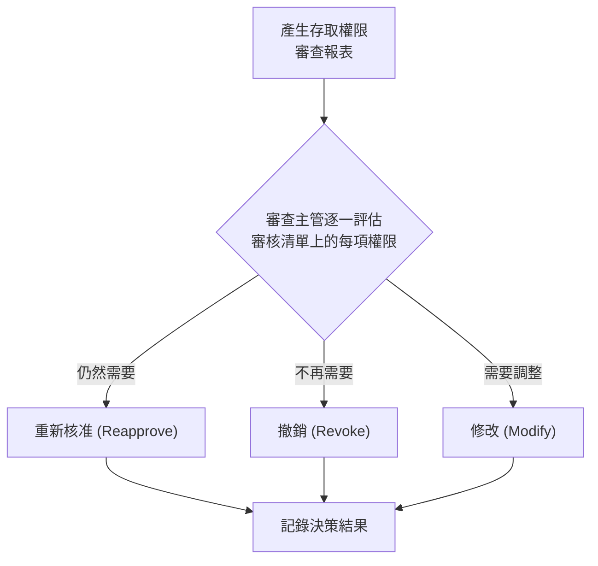

# 3.5 定義資料存取配置 (Define Data Access Provisioning)

## 學習目標

- 描述使用者配置方法 (user provisioning methods) 及其安全影響
- 解釋服務帳戶 (service accounts) 的角色與其獨特的風險
- 識別存取權限的重新核准/覆核要求 (reapproval requirements)
- 將最小平權原則 (principle of least privilege) 應用於存取配置中

---

## 使用者組態配置/授權配置 (User Provisioning)

使用者配置是**建立、管理以及撤銷/註銷使用者帳戶與存取權限**的過程。這是一項極為關鍵的安全功能，因為不當的權限配置會導致過度授權 (權限蠕變/privilege creep)、產生孤兒帳戶 (orphaned accounts)，並引發未經授權的資料外洩。

### 配置生命週期 (Provisioning Lifecycle)

### 配置方法 (Provisioning Methods)

| 方法 | 說明 | 安全考量 |
|--------|-------------|----------------------|
| **自助式 (Self-service)** | 使用者透過入口網站申請權限；需經主管/資料擁有者核准 | 存在橡皮圖章式 (rubber-stamping，盲目放行) 審批的風險；需要強大的核准工作流程 |
| **自動化/基於規則 (Automated / Rule-based)** | 根據角色、部門或屬性自動授予存取權限 | 速度快，但如果規則定義得過於寬鬆，可能會導致過度授權 |
| **委派式 (Delegated)** | 由被指定的管理員為其團隊成員配置存取權限 | 若受委派者缺乏資安意識，將會帶來風險 |
| **集中式 IAM (Centralized IAM)** | 由單一的身分識別管理系統 (IAM) 跨所有應用程式統一進行權限派送配置 | 給予最佳的掌控度與能見度；建置成本較高 |

### 配置原則 (Provisioning Principles)

| 原則 | 說明 |
|-----------|-------------|
| **最小權限 (Least Privilege)** | 僅授予使用者執行其工作職責所必需的最低限度權限 |
| **須知原則 (Need-to-Know)** | 僅有在為了執行當前任務所必需的情況下，才能存取相關資訊 |
| **職責分離 (Separation of Duties)** | 不應由單一使用者控制某項關鍵交易的所有環節 |
| **雙重控制 (Dual Control)** | 必須由兩位或更多使用者共同參與，才能完成一項敏感操作 |

---

## 服務帳戶 (Service Accounts)

服務帳戶是提供給應用程式、服務以及自動化處理程序用來進行身分驗證並存取資源的**非互動式帳戶 (non-interactive accounts)**。它們帶來了獨特的安全挑戰。

### 服務帳戶的類型

| 類型 | 說明 | 範例 |
|------|-------------|---------|
| **應用程式服務帳戶 (Application service account)** | 供應用程式用來連接資料庫、API 或其他服務 | Web 應用程式 → 資料庫連線 |
| **系統服務帳戶 (System service account)** | 作業系統服務與常駐程式 (daemons) 所使用的帳戶 | Windows 服務、Linux 常駐程式 |
| **自動化處理程序帳戶 (Automated process account)** | 供批次作業 (batch jobs)、指令碼 (scripts) 以及 CI/CD 管線使用 | 部署管線、備份指令碼 |

### 服務帳戶安全風險

| 風險 | 說明 |
|------|-------------|
| **權限過大 (Over-privileged)** | 服務帳戶經常因為「以防萬一」的心態被賦予過大的權限 |
| **共用憑證 (Shared credentials)** | 多個服務共用同一個帳戶的憑證密碼 |
| **陳舊帳戶 (Stale accounts)** | 在應用程式除役之後仍然存留著的服務帳戶 |
| **靜態憑證 (Static credentials)** | 從來未曾輪替/更換的密碼 |
| **無法使用 MFA (No MFA)** | 服務帳戶通常無法使用多因素認證 |
| **稽核困難 (Poor auditing)** | 活動行為可能無法輕易追蹤並歸因於特定的處理程序 |

### 服務帳戶最佳實務

| 實務做法 | 說明 |
|----------|-------------|
| **每個服務專屬唯一 (Unique per service)** | 每個應用程式或服務都應擁有自己的專屬帳戶 — 嚴禁共用 |
| **最小權限 (Least privilege)** | 僅賦予該服務運作所必須的特定權限 |
| **密碼輪替 (Password rotation)** | 自動化進行憑證的定期輪替更換 (使用機密管理工具) |
| **機密管理 (Secrets management)** | 將憑證儲存在金鑰儲存庫 (vaults，例如：HashiCorp Vault、AWS Secrets Manager) 中，絕對不要寫死在程式碼裡 |
| **監控機制 (Monitoring)** | 針對異常的服務帳戶活動設定並觸發警報 |
| **文件記錄 (Documentation)** | 對每一個服務帳戶記錄其設立目的、擁有者以及依賴它的系統/元件 |
| **生命週期管理 (Lifecycle management)** | 當相關聯的應用程式退役時，同步註銷該服務帳戶 |

---

## 重新核准/覆核 (Reapproval / Access Recertification)

存取權限重新認證 (Access recertification) 是**定期審查並重新核准**使用者存取權利的過程，以確保他們的權限仍然適當。

### 為什麼需要覆核

| 問題點 | 說明 |
|-------|-------------|
| **權限蠕變 (Privilege creep)** | 當使用者轉換角色時，逐漸累積新的存取權限，卻未被撤銷舊有職務不再需要的權限 |
| **孤兒帳戶 (Orphaned accounts)** | 員工離職後卻依然保持著啟用狀態的帳戶 |
| **法規遵循 (Compliance)** | 許多法規要求必須進行定期的存取權限審查 (列如：SOX、HIPAA、PCI DSS) |
| **內部威脅 (Insider threat)** | 過大的存取權限增加了遭惡意內部人士濫用時所可能造成的損害 |

### 重新核准/覆核流程

### 重新核准最佳實務

| 實務做法 | 說明 |
|----------|-------------|
| **定期執行 (Regular cadence)** | 針對特權存取 (privileged access) 每季執行；針對標準一般存取權限每年執行 |
| **主管負責審查 (Manager review)** | 由直屬主管負責檢閱，並核准/撤銷其下屬的存取權限 |
| **擁有者負責審查 (Owner review)** | 由資源擁有者負責審查評估究竟是誰擁有存取其資源的權限 |
| **以風險為基礎的頻率 (Risk-based frequency)** | 高風險的重要存取權限，應該接受更頻繁的審查 |
| **自動化工具 (Automated tooling)** | 使用 IAM 工具來產出審核名單，並追蹤核准狀態 |
| **未遵守時的罰則後果 (Consequences)** | 定義清楚當審查未能在期限內完成時的處置手段 |

---

## 考試重點

1. **最小權限 (Least privilege)**：執行工作職責所必需的最低程度權限。
2. **服務帳戶風險**：權限過大、共用、陳舊未使用、靜態/久未更換的卡死密碼。
3. **機密管理 (Secrets management)**：憑證儲存在安全的金庫 (vaults) 中，切勿寫死在程式碼中。
4. **權限蠕變 (Privilege creep)**：當人員變換工作角色時，逐漸累積不必要的存取權限。
5. **重新核准頻率 (Recertification frequency)**：特權存取 (privileged access) 每季一次；一般標準存取每年一次。
6. **職責分離 (Separation of duties)**：對於金融與涉及法規合規性的敏感作業來說是至關重要的控制項。
7. **配置生命週期**：申請 (Request) → 核准 (Approve) → 配置/建立帳戶 (Provision) → 使用 (Active Use) → 審查/覆核 (Review) → 修改/註銷 (Modify/Revoke)。

---

## 關鍵術語表

| 術語 | 定義 |
|------|-----------|
| **User Provisioning (使用者權限配置)** | 建立、管理以及撤銷/註銷使用者帳戶與存取權限的流程 |
| **Service Account (服務帳戶)** | 提供給應用程式或自動化流程等非人員身分用來互動操作系統的帳戶 |
| **Least Privilege (最小權限原則)** | 只授予用以完成指定任務/職責所需之最低限度的權利或權限 |
| **Need-to-Know (須知原則)** | 使用者僅被允許存取為了執行其當前任務時所必須知悉的資訊 |
| **Separation of Duties (職責分離)** | 將關鍵的業務流程分解劃分，讓任何一個單獨的人都無法單獨掌控整個流程的始末 |
| **Dual Control (雙重控制)** | 要求必須由兩位以上人員共同參與方能完成一項敏感操作的控制機制 |
| **Privilege Creep (特權增生/權限蠕變)** | 隨著時間的推移，個人或帳戶擁有了過於寬鬆的不必要存取權限之現象 |
| **Access Recertification (存取權限重新認證/覆核)** | 定期審查並重新核准/確認存取權限配置適當性的過程 |
| **Secrets Management (機密/密碼管理)** | 用來安全地儲存與輪替/交換憑證、加密金鑰與憑證權杖 (tokens) 的機制 |
| **Orphaned Account (孤兒帳戶/幽靈帳戶)** | 目前沒有合法對應的擁有者或使用者、但卻仍保持啟用狀態的存取帳戶 |
| **IAM** | Identity and Access Management (身分識別與存取管理) |
