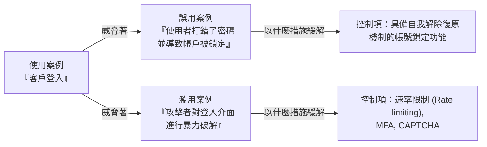

# 3.6 開發誤用與濫用案例 (Develop Misuse and Abuse Cases)

## 學習目標

- 定義誤用案例 (misuse cases) 與濫用案例 (abuse cases)，以及它們在安全需求中所扮演的角色
- 解釋誤用/濫用案例如何補足傳統使用案例 (use cases) 不足之處
- 針對常見的攻擊情境，開發出對應的誤用與濫用案例
- 識別出針對每一個誤用/濫用案例的緩解控制措施 (mitigating controls)

---

## 誤用與濫用案例 (Misuse and Abuse Cases)

當使用案例用來描述**預期的正當行為 (intended behavior)**（系統應該做什麼）時，誤用與濫用案例則用於描述**非預期的、惡意的行為 (unintended and malicious behavior)** — 也就是系統應該加以**防範阻止**的情境。

### 定義

| 概念 | 視角立場 | 說明 |
|---------|-------------|-------------|
| **使用案例 (Use Case)** | 合法使用者 | 描述系統對合法使用者應有的預期行為運作 |
| **誤用案例 (Misuse Case)** | 疏忽/無意的操作者 | 描述由合法使用者所做出的**非故意**負面行為（例如失誤、打錯字、操作錯誤等） |
| **濫用案例 (Abuse Case)** | 惡意攻擊者 | 描述由威脅發動者所進行的**蓄意**攻擊行為 |

### 介於使用案例與誤用/濫用案例之間的關係

> **考試提示**：每一個使用案例都應該要有至少一項相對應的**誤用/濫用案例**，以識別出什麼事情可能出錯，並且還要列出能對付該情境的一套**緩解控制措施 (mitigating control)**。

---

## 開發誤用與濫用案例

### 處理流程

1. **確立使用案例 (Identify the use case)**：從一個功能性需求 / 使用案例作為起點出發
2. **找出威脅發動者 (Identify the threat actor)**：誰會誤用或濫用這個功能？
3. **描述負面情境 (Describe the negative scenario)**：什麼非預期的行為或惡意攻擊動作可能會發生？
4. **評估衝擊影響 (Assess the impact)**：誤用/濫用的後果為何？
5. **定義緩解控制項 (Define mitigating controls)**：甚麼安全控制措施可以預防或偵測到這個情境？

### 誤用案例範本表

| 元素 | 說明 |
|---------|-------------|
| **名稱 (Name)** | 簡短且具描述性的標題 |
| **行為人 (Actor)** | 執行這起誤用事件的實體（非故意的粗心使用者 或 蓄意攻擊的駭客） |
| **前置條件 (Preconditions)** | 讓該起誤用事件得以發生的前置狀態 |
| **描述 (Description)** | 針對這項誤用情境的一步步敘述 |
| **衝擊/影響 (Impact)** | 若未加以緩解，該項誤用將造成的後果 |
| **緩解控制項 (Mitigating Controls)** | 用來預防、偵測或回應這起誤用事件的安全防護措施 |

---

## 常見的誤用與濫用案例範例

### 身分驗證 (Authentication)

| 情境 | 類型 | 緩解控制措施 |
|----------|------|-------------------|
| 暴力破解密碼攻擊 | 濫用 | 帳戶鎖定、速率限制、多因素認證 (MFA)、圖形驗證碼 (CAPTCHA) |
| 憑證填充攻擊 (Credential stuffing - 重複使用被外洩的密碼) | 濫用 | 檢查已外洩的密碼資料庫、MFA |
| 使用者把密碼分享給同事 | 誤用 | 資安意識培訓、MFA、使用者行為分析 (UBA) |
| 透過竊取 Cookie 來綁架工作階段 (Session hijacking) | 濫用 | 加上安全 Cookie 旗標 (HttpOnly, Secure, SameSite)、工作階段綁定 (session binding) |

### 授權控制 (Authorization)

| 情境 | 類型 | 緩解控制措施 |
|----------|------|-------------------|
| 權限提升 (存取原本沒有資格碰的管理員功能) | 濫用 | 強制執行 RBAC、落實最小權限原則、在伺服器端再做一次授權檢查 |
| 不安全的直接物件參考 (IDOR) | 濫用 | 改用間接參考 (indirect references)、在每次存取時都要實施授權驗證 |
| 使用者存取了超出其職務角色範圍的資料 | 誤用 | 權限存取控制、持續監控、定期的存取權限審查 |

### 資料處理方式 (Data Handling)

| 情境 | 類型 | 緩解控制措施 |
|----------|------|-------------------|
| 使用 SQL 資料隱碼攻擊 (SQL injection) 來撈出整個資料庫 | 濫用 | 輸入驗證、參數化查詢 (parameterized queries)、WAF (網站應用程式防火牆) |
| 使用者不小心將含有個資的檔案上傳到對外公開的資料夾中 | 誤用 | 資料外洩防護系統 (DLP)、資料夾權限管控、使用者教育訓練 |
| 跨網站腳本攻擊 (XSS) 藉以竊取使用者個資 | 濫用 | 輸出編碼、導入內容安全政策 (CSP) |
| 使用者把敏感資料寫成 Email 不小心寄給了錯的收件人 | 誤用 | 電子郵件加密、DLP、寄信延遲/防呆撤回功能 |

### 商業邏輯 (Business Logic)

| 情境 | 類型 | 緩解控制措施 |
|----------|------|-------------------|
| 繞過結帳付款流程 | 濫用 | 伺服器端驗證交易流程、完整性檢查 |
| 竄改送出請求當中的商品價格參數 | 濫用 | 價格必須要在伺服器端做驗證、完整性檢查 |
| 被機器人大量註冊假帳號 | 濫用 | CAPTCHA 驗證碼、速率限制、Email 確認信 |

---

## 邪惡的使用者故事 (Evil User Stories，在敏捷式開發脈絡下)

在敏捷式開發 (Agile environments) 中，誤用/濫用案例通常被寫成**邪惡的使用者故事 (evil user stories)** — 也就是從攻擊者視角出發撰寫的使用者故事：

| 格式 | 範例 |
|--------|---------|
| **標準格式** | "身為一名 [威脅發動/攻擊者]，我想要 [進行某種攻擊行為]，以便達成 [我的惡意目標]" |
| **範例 1** | "身為一名駭客，我想要在登入表單上執行 SQL injection 攻擊，以便繞過身分驗證機制。" |
| **範例 2** | "身為一名前充滿不滿的離職員工，我想要竊出客戶資料庫，以便把它賣給別的競爭對手。" |
| **範例 3** | "身為一個機器人網軍操盤者，我想要一次註冊成千上萬的假帳號，以便發送垃圾廣告信件騷擾別人。" |

而每一條「邪惡的使用者故事」，都應該搭配一條能定義出防範緩解控制作法的**安全使用者故事 (security story)**，例如：

> "身為一名開發人員，我想要實作『參數化查詢機制』，因為這樣就可以徹底預防剛剛提到的 SQL injection 攻擊。"

---

## 考試重點

1. **誤用 vs. 濫用 (Misuse vs. Abuse)**：誤用 = 不小心的/非故意的；濫用 = 蓄意的/惡意攻擊。
2. **誤用案例是使用案例的輔助補強**：每一個正向的使用案例，都應該配置一條負向的情境。
3. **緩解控制項 (Mitigating controls)**：每一個提報出來的誤用/濫用案例都必須要有專門的對策 (countermeasures) 相對應。
4. **邪惡的使用者故事 (Evil user stories)**：將誤用/濫用案例融入到衝刺會議規劃 (sprint planning) 的一種敏捷開發式技巧作法。
5. **產生流程 (Process)**：使用案例 → 威脅發動者 → 負面情境 → 造成的衝擊破壞 → 提出緩解控制措施。

---

## 關鍵術語表

| 術語 | 定義 |
|------|-----------|
| **Use Case (使用案例)** | 對於合法使用者預期中合理的系統運作行為與流程描述 |
| **Misuse Case (誤用案例)** | 對合法使用者**非故意之負面行為** (如：不小心出錯) 所進行的情境描述 |
| **Abuse Case (濫用案例)** | 對來自威脅發動/攻擊者發起**蓄意之惡意行為**所進行的情境描述 |
| **Evil User Story (邪惡的使用者故事)** | 站在攻擊者視角撰寫，用以輔助敏捷開發生態系的使用者故事 |
| **Mitigating Control (緩解控制/防護控制項)** | 用來預防、偵測或是回應誤用/濫用情境的安全防禦措施 |
| **IDOR** | Insecure Direct Object Reference (不安全的直接物件參考) — 無經過適當授權核准機制，就透過提供參數直接讀取未經授權的物件 |
| **Credential Stuffing (憑證填充攻擊)** | 拿到其他平台上洩漏的帳號密碼，整批拿去灌進另一個服務嘗試登入碰運氣的一種攻擊手法 |
| **DLP** | Data Loss Prevention (資料外洩防護系統) — 能防止未經授權、將機敏資料向外傳送之防外洩技術方案 |
