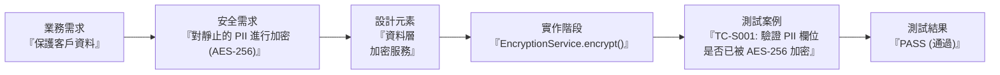

# 3.7 建立安全需求追溯矩陣 (Develop Security Requirement Traceability Matrix, SRTM)

## 學習目標

- 解釋安全需求追溯矩陣 (SRTM) 的目的與結構
- 描述 SRTM 如何將業務需求與安全需求、設計、實作以及測試連結起來
- 展現 SRTM 是如何支援驗證與確認 (V&V, Verification and Validation) 工作
- 識別維護需求追溯性所帶來的效益與挑戰

---

## 什麼是安全需求追溯矩陣 (SRTM)？

安全需求追溯矩陣 (SRTM) 是一份**結構化的文件**，它將每一項安全需求從源頭（業務需求、法規或政策）開始，一路對應追蹤其設計實作與測試驗證的狀況。它提供了**雙向追溯性 (bidirectional traceability)** — 既能從需求往前追蹤到測試，也能從測試往回追溯到需求。

### 為什麼追溯性很重要？

| 效益 | 說明 |
|---------|-------------|
| **確保完整性 (Completeness assurance)** | 驗證是否每一項安全需求都已經被實作且經過測試 |
| **變更影響分析 (Change impact analysis)** | 當某項需求發生變更時，能立刻判斷出有哪些測試與實作模組會受到波及影響 |
| **識別缺漏 (Gap identification)** | 找出那些尚未被實作或缺乏對應測試的孤兒需求 |
| **隨時準備好受稽 (Audit readiness)** | 向稽核人員證明組織有系統性地在落實各項安全需求 |
| **支援 V&V 工作 (V&V support)** | 為驗證 (verification, 系統有被正確地建造出來) 與確認 (validation, 做出來的是正確的產品) 提供實證 |

---

## SRTM 結構

### 核心欄位

| 欄位名稱 | 說明 |
|--------|-------------|
| **需求 ID (Req ID)** | 每一項安全需求的唯一識別碼 |
| **業務需求 (Business Requirement)** | 最初始的業務需要、法規或組織政策 |
| **安全需求 (Security Requirement)** | 從業務需求中推導出來的具體安全需求 |
| **設計元素 (Design Element)** | 用以滿足該需求的架構或設計元件 |
| **實作 (Implementation)** | 實際具現該需求的程式碼模組、函數或組態配置 |
| **測試案例 ID (Test Case ID)** | 用來驗證該需求是否被滿足的特定測試案例 |
| **測試結果 (Test Result)** | 關聯測試案例的執行結果狀態（通過/失敗/待測） |
| **狀態 (Status)** | 目前的進度狀態（已定義、進行中、已實作、已驗證、已結案） |

### SRTM 範例

| 需求 ID | 業務需求 | 安全需求 | 設計 | 實作 | 測試案例 | 結果 | 狀態 |
|--------|-------------|-------------|--------|---------------|-----------|--------|--------|
| SR-001 | 保護客戶的 PII (個人識別資訊) | 儲存 PII 時必須使用 AES-256 加密 | 資料層加密服務 | `EncryptionService.encrypt()` | TC-S001 | 通過 | 已驗證 |
| SR-002 | 符合 GDPR 法規 | 實作「刪除權 (被遺忘權)」 | 使用者資料管理模組 | `UserService.deleteAllData()` | TC-S002 | 通過 | 已驗證 |
| SR-003 | 防止未經授權的存取 | 強制管理員帳號必須使用 MFA (多因素認證) | 身分驗證模組 | `AuthService.enforceMFA()` | TC-S003 | 待測 | 進行中 |
| SR-004 | 符合 PCI DSS 規範 | 記錄所有對持卡人資料的存取行為 | 稽核日誌記錄服務 | `AuditLogger.logAccess()` | TC-S004 | 通過 | 已驗證 |

### 追溯流程 (Traceability Flow)

---

## 追溯性的類型

| 類型 | 方向 | 目的 |
|------|-----------|---------|
| **正向追溯 (Forward traceability)** | 需求 → 測試 | 確保**每一項需求都有對應的測試** |
| **反向追溯 (Backward traceability)** | 測試 → 需求 | 確保**每一項測試都能對應回某項需求**（避免無謂的/多餘的測試） |
| **雙向追溯 (Bidirectional traceability)** | 雙向兼具 | 在兩個方向上都達到完整的覆蓋率（最推薦的做法） |

### 正向追溯的檢驗問題

- 是否每一項安全需求都已被分配給某個設計元素？
- 是否每一個設計元素都已經被實作出來了？
- 是否每一段實作的程式碼都已經過測試？
- 覆蓋範圍中是否存在任何缺漏 (gaps)？

### 反向追溯的檢驗問題

- 是否每一個測試案例都能追溯回某項安全需求？
- 是否每一段實作的程式碼都能追溯回某個設計元素？
- 是否存在任何「沒有來源需求」的實作或測試？（這可能是所謂的防禦性過度設計/**鍍金現象 (gold plating)**）

---

## 維護 SRTM

| 實務做法 | 說明 |
|----------|-------------|
| **活的文件 (Living document)** | 在整個 SDLC 過程中，必須隨著需求的變更持續更新 SRTM |
| **工具運用 (Tooling)** | 使用需求管理工具（如：Jira, Azure DevOps, IBM DOORS）來進行自動化追蹤 |
| **版本控制 (Version control)** | 維護 SRTM 的修訂歷史與版本紀錄 |
| **定期審查 (Regular reviews)** | 在每個階段關卡 (phase gate) / 安全閘門 (security gate) 進行 SRTM 檢閱 |
| **缺漏分析 (Gap analysis)** | 定期掃描找出缺乏測試或尚未實作的需求 |

---

## 考試重點

1. **SRTM 的目的**：將安全需求從業務需要，一路對應追蹤到實作與測試階段。
2. **雙向追溯性 (Bidirectional traceability)**：包含正向（需求 → 測試）與反向（測試 → 需求）。
3. **完整性 (Completeness)**：每一項需求都必須要有相對應的實作與測試。
4. **發現缺漏 (Gap identification)**：SRTM 能揭露出那些沒有被實作或缺乏測試覆蓋率的需求。
5. **活的文件 (Living document)**：在整個 SDLC 期間持續更新，而不是寫完一次就束之高閣。
6. **支援稽核 (Audit support)**：向稽核人員展示組織針對安全需求有系統性的全面覆蓋。

---

## 關鍵術語表

| 術語 | 定義 |
|------|-----------|
| **SRTM** | Security Requirements Traceability Matrix (安全需求追溯矩陣) |
| **Forward Traceability (正向追溯)** | 將需求往後對應至測試案例的追蹤方式 |
| **Backward Traceability (反向追溯)** | 將測試案例往前追溯回源頭需求的追蹤方式 |
| **Bidirectional Traceability (雙向追溯)** | 兩個方向兼具的追溯方式，用以確保最完整的覆蓋率 |
| **Gap Analysis (差異/缺漏分析)** | 找出那些缺乏對應實作或測試案例的孤兒需求之過程 |
| **Gold Plating (鍍金現象/過度設計)** | 添加了未被要求的功能或測試，且這些產出無法對應回任何原始的業務需求 |
