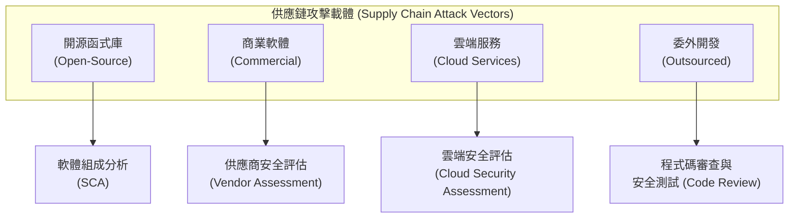

# 3.8 定義第三方供應商安全需求 (Define Third-Party Vendor Security Requirements)

## 學習目標

- 識別針對第三方軟體與服務的安全需求
- 解釋軟體供應鏈風險管理 (supply chain risk management)
- 描述 SBOM 在管理協力廠/第三方風險中所扮演的角色
- 定義用於規範供應商合作關係的合約安全要求

---

## 供應鏈安全 (Supply Chain Security)

現代軟體嚴重依賴**第三方元件** — 包括開源函式庫、商業軟體、雲端服務以及委外開發。供應鏈中的每一個環節都會引入潛在的安全風險，這些風險必須受到妥善管理。

### 軟體供應鏈風險

| 風險 | 說明 |
|------|-------------|
| **含有漏洞的元件 (Vulnerable components)** | 帶有已知 CVE 漏洞的第三方函式庫 |
| **惡意元件 (Malicious components)** | 遭到蓄意埋毒破壞的函式庫（例如：依賴混淆/dependency confusion、誤植域名/typosquatting） |
| **被遺棄的專案 (Abandoned projects)** | 不再被維護或發布修補程式的開源開源函式庫 |
| **授權違規 (License violations)** | 使用了授權條款互不相容的元件 |
| **內部威脅 (Insider threats)** | 遭到收買/挾持的開發人員在上游專案中植入惡意程式碼 |
| **建置流程遭入侵 (Build process compromise)** | 攻擊者鎖定上游供應商的 CI/CD 管線進行攻擊（例如：SolarWinds 事件） |

---

## 軟體物料清單 (Software Bill of Materials, SBOM)

SBOM 是一份**全面性的清單目錄**，列出了構成應用程式的所有元件、函式庫與模組 — 概念上就等同於食品包裝背後的「成分標示表」。

### SBOM 內容物

| 元素 | 說明 |
|---------|-------------|
| **元件名稱 (Component name)** | 每個相依性套件的名稱 |
| **版本 (Version)** | 所使用的具體版本號 |
| **供應者 (Supplier)** | 發布或維護該元件的個人/組織 |
| **授權 (License)** | 軟體授權類型 (如 MIT, Apache, GPL 等) |
| **相依性 (Dependencies)** | 傳遞性相依套件 (transitive dependencies，也就是「依賴項的依賴項」) |
| **雜湊值 (Hashes)** | 用於完驗證整性的密碼學雜湊值 |

### SBOM 格式標準

| 格式 | 說明 |
|--------|-------------|
| **SPDX** (Software Package Data Exchange) | Linux 基金會推動的標準；也是 ISO/IEC 5962:2021 國際標準 |
| **CycloneDX** | OWASP 推動的標準，主要聚焦於資安領域的應用案例 |
| **SWID** (Software Identification Tags) | ISO/IEC 19770-2 — 軟體識別標籤 |

### SBOM 帶來的效益

| 效益 | 說明 |
|---------|-------------|
| **漏洞管理 (Vulnerability management)** | 能快速識別出某個已知的 CVE 漏洞（例如 Log4Shell）是否有影響到你的軟體 |
| **授權合規性 (License compliance)** | 確保所有的軟體元件都具備相容的授權條款 |
| **事件回應 (Incident response)** | 當某個相依性套件被攻陷時，能迅速界定出「爆炸半徑/影響範圍 (blast radius)」 |
| **法規遵循 (Regulatory compliance)** | 例如美國第 14028 號行政命令 (EO 14028) 就強制要求聯邦政府採購的軟體必須提供 SBOM |

---

## 供應商安全評估 (Vendor Security Assessment)

在整合第三方軟體或服務之前，組織必須先對供應商的安全態勢 (security posture) 進行評估。

### 評估方法

| 方法 | 說明 |
|--------|-------------|
| **安全問卷 (Security questionnaires)** | 關於供應商安全實務做法的標準化問卷題組（例如：SIG, CAIQ） |
| **SOC 2 報告** | 針對供應商安全控制項的獨立第三方稽核報告（Type I = 設計面；Type II = 一段時間內的有效性） |
| **ISO 27001 認證** | 證明供應商維持著一套經過認證的 ISMS (資訊安全管理系統) |
| **滲透測試結果** | 供應商產品曾接受過安全測試的實證 |
| **查帳/稽核權 (Right to audit)** | 透過合約明訂客戶有權對供應商執行獨立的安全稽核 |
| **SCA 掃描結果 (SCA scan results)** | 針對供應商提供的軟體進行已知漏洞掃描所得到的結果 |

### SOC 報告 (SOC Reports)

| 報告類型 | 範圍 | 目標受眾 |
|--------|-------|----------|
| **SOC 1** | 財務報表控制項 | 稽核人員、管理階層 |
| **SOC 2 Type I (第一類)** | 某個「單一時間點 (point in time)」的安全控制設計 | 客戶、監管機構 |
| **SOC 2 Type II (第二類)** | 一段「持續期間內 (通常為 6–12 個月)」的安全控制有效性 | 客戶、監管機構 |
| **SOC 3** | 一般用途的摘要報告（可對外公開發布） | 社會大眾 |

> **考試提示**：就安全評估的目的而言，**SOC 2 Type II (第二類)** 是最有價值的報告，因為它能證明各項安全控制措施在**一段時間內皆被有效地運作著**，而不僅僅只是在某個單一時間點被設計出來而已。

---

## 合約的安全要求 (Contractual Security Requirements)

安全要求必須被**嵌入到與第三方供應商簽署的合約中**，藉以形成具法律約束力的義務。

### 關鍵的合約要素

| 要素 | 說明 |
|---------|-------------|
| **安全要求 (Security requirements)** | 供應商必須具體實施的控制項（如加密標準、存取控制） |
| **修補管理 (Patch management)** | 供應商必須及時提供安全修補程式的義務 |
| **外洩通報 (Breach notification)** | 在發生資安事件時必須通知客戶的要求規定 |
| **資料處理方式 (Data handling)** | 供應商將如何保護、保留以及銷毀客戶資料 |
| **查帳/稽核權 (Right to audit)** | 客戶可以評估供應商安全控制措施的權利 |
| **責任與賠償 (Liability and indemnification)** | 發生安全漏洞外洩時必須承擔的財務責任 |
| **服務等級協定 (SLAs)** | 對效能與可用性做出的承諾，並附帶違約罰則 |
| **合約終止 (Termination)** | 合約結束時歸還/銷毀資料的程序規範 |
| **分包商要求 (Subcontractor requirements)** | 要求安全規範必須「向下擴及 (flow down)」至供應商使用的下游分包商 |
| **程式碼託管 (Code escrow)** | 將原始碼交由第三方保管，作為供應商倒閉時能取得程式碼的緊急應變後手 |

### 服務等級協定 (SLAs, Service Level Agreements)

| 要素 | 範例 |
|---------|---------|
| **可用性 (Availability)** | 保證 99.9% 的系統上線時間 (uptime) |
| **事件回應 (Incident response)** | 嚴重事件發生時，必須在 1 小時內初步回應 |
| **修補交付 (Patch delivery)** | 嚴重漏洞公開揭露後，必須在 24 小時內提供對應的修補程式 |
| **備份與復原 (Backup and recovery)** | 每日執行備份，確保 RTO 放於 4 小時內、RPO 壓在 1 小時內 |
| **罰則 (Penalties)** | 違反 SLA 承諾時，必須提供服務點數補償或扣除服務費作為罰款 |

---

## 軟體組成分析 (SCA, Software Composition Analysis)

SCA 工具能自動**識別並盤點第三方元件**及其夾帶的已知漏洞：

| 功能 | 說明 |
|-----------|-------------|
| **相依性識別 (Dependency identification)** | 挖掘出所有直接與傳遞性的相依套件 |
| **CVE 比對 (CVE matching)** | 將元件清單與漏洞資料庫 (如 NVD、供應商安全通報) 進行交叉比對 |
| **授權偵測 (License detection)** | 回報各元件的授權條款，並標記出授權互不相容的潛在問題 |
| **政策強制執行 (Policy enforcement)** | 攔截並阻擋包含了被禁用/含漏洞元件的建置作業順利發布 |
| **產生 SBOM (SBOM generation)** | 自動產生符合業界標準格式的 SBOM 清單 |

---

## 考試重點

1. **SBOM**：所有軟體元件的清單目錄 — 簡單說就是軟體的「成分表」。
2. **SCA**：用於識別第三方軟體元件已知漏洞的自動化掃描工具。
3. **SOC 2 Type II**：證明控制項在一段時間內的有效性（對評估安全性來說最有用）。
4. **供應鏈攻擊 (Supply chain attacks)**：例如 SolarWinds、Log4Shell 事件 — 了解這類攻擊的模式。
5. **稽核權 (Right to audit)**：以合約明訂的權利，允許客戶自行對供應商進行獨立的安全查核。
6. **程式碼託管 (Code escrow)**：將原始碼存放在第三方處，作為預防廠商倒閉的緊急措施。
7. **傳遞性相依套件 (Transitive dependencies)**：也就是你依賴的套件所依賴的其他套件 — 往往是潛藏風險的來源。
8. **授權合規 (License compliance)**：這不只是法律問題 — 不相容的開源授權（例如被 Gnu GPL 感染）可能會迫使你必須將程式碼移除或也得開源。

---

## 關鍵術語表

| 術語 | 定義 |
|------|-----------|
| **SBOM** | Software Bill of Materials (軟體物料清單) — 所有內含軟體元件的總目錄 |
| **SCA** | Software Composition Analysis (軟體組成分析) — 用於識別第三方元件漏洞的工具及方法 |
| **SOC 2** | Service Organization Control Type 2 — 對服務機構安全性與控制有效性進行的獨立稽核報告 |
| **CVE** | Common Vulnerabilities and Exposures (常見漏洞與暴露) — 標準化的公開安全漏洞識別碼 |
| **NVD** | National Vulnerability Database (美國國家弱點資料庫) |
| **SPDX** | Software Package Data Exchange — 由 Linux 基金會維護的 SBOM 格式標準 |
| **CycloneDX** | 由 OWASP 推出，聚焦於安全分析場景的 SBOM 格式標準 |
| **SWID** | Software Identification Tags — 用於識別軟體身分的 ISO 標準標籤 |
| **SLA** | Service Level Agreement (服務等級協定) |
| **Code Escrow (程式碼託管/開源第三方信託)** | 將未編譯的原始碼交由居中的第三方保管之安全保障協定 |
| **Right to Audit (查帳/稽核權)** | 透過合約賦予客戶能夠自行獨立評估檢驗供應商安全性之權力 |
| **Transitive Dependency (傳遞性相依套件)** | 某個相依套件本身又依賴的另一個套件 (即「間接的」相依套件) |
| **Typosquatting (誤植域名/打字錯誤佔用)** | 註冊名稱與知名熱門套件極為相似的包名，企圖魚目混珠散播惡意程式的攻擊手法 |
| **Dependency Confusion (相依性混淆)** | 駭客利用套件管理員 (package manager) 的解析機制原則，誘騙其下載並安裝外部惡意套件的攻擊 |
